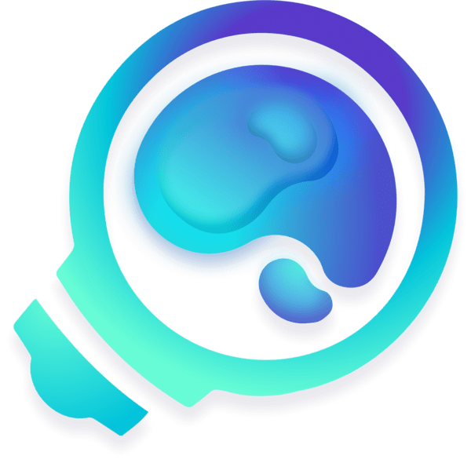

# Announcement_(en)

Halo, **Codeforces**! 🥰🥰🥰🥰

COMPFEST 14 is happy to invite you to participate in [Codeforces Round 831 (Div. 1 + Div. 2)](https://codeforces.com/contest/1740) on [Saturday, October 29, 2022 at 15:10UTC+6](https://codeforces.com/https://www.timeanddate.com/worldclock/fixedtime.html?day=29&month=10&year=2022&hour=12&min=10&sec=0&p1=166). **Note the unusual time of the round**. The round will be **rated for everyone**. You will be given **2 hours and 45 minutes** to solve **9 problems**.

The problems are written by [NeoZap](https://codeforces.com/profile/NeoZap "Эксперт NeoZap"), [Nyse](https://codeforces.com/profile/Nyse "Эксперт Nyse"), [Pyqe](https://codeforces.com/profile/Pyqe "Международный гроссмейстер Pyqe"), and [steven.novaryo](https://codeforces.com/profile/steven.novaryo "Мастер steven.novaryo").

Scoring distribution: **500 — 1000 — 1500 — 1750 — 2000 — 2500 — 2750 — 3000 — 3500**

We would like to thank:

 * [KAN](https://codeforces.com/profile/KAN "Легендарный гроссмейстер KAN") for helping to host the round;
* [errorgorn](https://codeforces.com/profile/errorgorn "Международный гроссмейстер errorgorn") for the based coordination and help with the problem preparation;
* [yz_](https://codeforces.com/profile/yz_ "Мастер yz_") for helping with the problem preparation;
* [MikeMirzayanov](https://codeforces.com/profile/MikeMirzayanov "Штаб, MikeMirzayanov"), [geranazavr555](https://codeforces.com/profile/geranazavr555 "Штаб, geranazavr555") and [KAN](https://codeforces.com/profile/KAN "Легендарный гроссмейстер KAN") for writing the Russian translations;
* [Aaeria](https://codeforces.com/profile/Aaeria "Мастер Aaeria"), [AMnu](https://codeforces.com/profile/AMnu "Эксперт AMnu"), [dorijanlendvaj](https://codeforces.com/profile/dorijanlendvaj "Международный гроссмейстер dorijanlendvaj"), [eggag32](https://codeforces.com/profile/eggag32 "Кандидат в мастера eggag32"), [feecIe6418](https://codeforces.com/profile/feecIe6418 "Международный гроссмейстер feecIe6418"), [fishy15](https://codeforces.com/profile/fishy15 "Мастер fishy15"), [flamestorm](https://codeforces.com/profile/flamestorm "Эксперт flamestorm"), [Gary2005](https://codeforces.com/profile/Gary2005 "Международный гроссмейстер Gary2005"), [gisp_zjz](https://codeforces.com/profile/gisp_zjz "Легендарный гроссмейстер gisp_zjz"), [gyh20](https://codeforces.com/profile/gyh20 "Международный гроссмейстер gyh20"), [MagentaCobra](https://codeforces.com/profile/MagentaCobra "Мастер MagentaCobra"), [mejiamejia](https://codeforces.com/profile/mejiamejia "Эксперт mejiamejia"), [oleh1421](https://codeforces.com/profile/oleh1421 "Международный гроссмейстер oleh1421"), [powergee101](https://codeforces.com/profile/powergee101 "Кандидат в мастера powergee101"), [ppavic](https://codeforces.com/profile/ppavic "Гроссмейстер ppavic"), [prabowo](https://codeforces.com/profile/prabowo "Гроссмейстер prabowo"), [Rewinding](https://codeforces.com/profile/Rewinding "Легендарный гроссмейстер Rewinding"), [tibinyte](https://codeforces.com/profile/tibinyte "Ученик tibinyte"), [tzc_wk](https://codeforces.com/profile/tzc_wk "Международный гроссмейстер tzc_wk"), [Wailydest](https://codeforces.com/profile/Wailydest "Международный гроссмейстер Wailydest") for testing the contest and providing us very useful feedback;
* Universitas Indonesia, all the local committees, administrators, and managers of the whole COMPFEST event;
* [rama_pang](https://codeforces.com/profile/rama_pang "Гроссмейстер rama_pang") for drinking milk;
* [MikeMirzayanov](https://codeforces.com/profile/MikeMirzayanov "Штаб, MikeMirzayanov") for the amazing Codeforces and Polygon platform!

COMPFEST itself is an annual event hosted by Universitas Indonesia. It is the largest student-run IT event in Indonesia and competitive programming contest is one of the competitions hosted.

We hope you will enjoy and have fun in the contest. Semoga beruntung dan selamat bersenang-senang!! 💪💪🔥🔥

**Edit:** round was delayed by 5 mins due to delays of onsite contest.

**UPD**: contest is over!

Congratulations to our winners!

 1. [jiangly](https://codeforces.com/profile/jiangly "Легендарный гроссмейстер jiangly")
2. [heno239](https://codeforces.com/profile/heno239 "Легендарный гроссмейстер heno239")
3. [maroonrk](https://codeforces.com/profile/maroonrk "Легендарный гроссмейстер maroonrk")
4. [never_giveup](https://codeforces.com/profile/never_giveup "Международный гроссмейстер never_giveup")
5. [Isonan](https://codeforces.com/profile/Isonan "Легендарный гроссмейстер Isonan")
6. [ksun48](https://codeforces.com/profile/ksun48 "Легендарный гроссмейстер ksun48")
7. [Um_nik](https://codeforces.com/profile/Um_nik "Легендарный гроссмейстер Um_nik")
8. [hank55663](https://codeforces.com/profile/hank55663 "Международный гроссмейстер hank55663")
9. [ugly2333](https://codeforces.com/profile/ugly2333 "Международный гроссмейстер ugly2333")
10. [Vercingetorix](https://codeforces.com/profile/Vercingetorix "Легендарный гроссмейстер Vercingetorix")

We will try to post the editorials as soon as possible. Please stay tuned!

**UPD 2** : [Editorial](Tutorial_(en).md)

We are very sorry for the late editorial. We did not anticipate the workload of maintaining an onsite contest, especially since this is the first onsite contest held by our university in three years. We will use this experience to learn and improve our preparation next time. 

Finally, we are delighted that the contest ran very well and that many of the contestants are enjoying the contest.

See you next year! 🥰🥰

