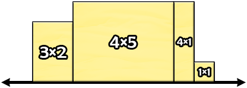
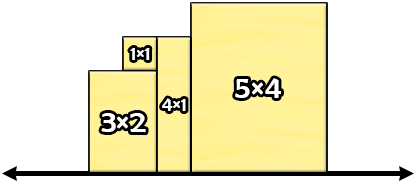
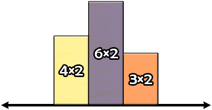

<h1 style='text-align: center;'> B. Jumbo Extra Cheese 2</h1>

<h5 style='text-align: center;'>time limit per test: 1 second</h5>
<h5 style='text-align: center;'>memory limit per test: 256 megabytes</h5>

Pak Chanek has $n$ two-dimensional slices of cheese. The $i$-th slice of cheese can be represented as a rectangle of dimensions $a_i \times b_i$. We want to arrange them on the two-dimensional plane such that:

* Each edge of each cheese is parallel to either the x-axis or the y-axis.
* The bottom edge of each cheese is a segment of the x-axis.
* No two slices of cheese overlap, but their sides can touch.
* They form one connected shape.

## Note

 that we can arrange them in any order (the leftmost slice of cheese is not necessarily the first slice of cheese). Also note that we can rotate each slice of cheese in any way as long as all conditions still hold.

Find the minimum possible perimeter of the constructed shape.

### Input

Each test contains multiple test cases. The first line contains an integer $t$ ($1 \leq t \leq 2 \cdot 10^4$) — the number of test cases. The following lines contain the description of each test case.

The first line of each test case contains an integer $n$ ($1 \leq n \leq 2 \cdot 10^5$) — the number of slices of cheese Pak Chanek has.

The $i$-th of the next $n$ lines of each test case contains two integers $a_i$ and $b_i$ ($1 \leq a_i,b_i \leq 10^9$) — the dimensions of the $i$-th slice of cheese.

It is guaranteed that the sum of $n$ over all test cases does not exceed $2 \cdot 10^5$.

### Output

For each test case, output a line containing an integer representing the minimum possible perimeter of the constructed shape.

## Example

### Input


```text
344 14 51 12 332 42 62 312 65
```
### Output

```text

26
24
134

```
## Note

In the first test case, a way of getting the minimum possible perimeter is to arrange the slices of cheese as follows.



We can calculate that the perimeter of the constructed shape is $2+5+1+1+1+1+3+1+5+1+2+3=26$. It can be shown that we cannot get a smaller perimeter.

Consider the following invalid arrangement.



Even though the perimeter of the shape above is $24$, it does not satisfy all conditions of the problem. The bottom edge of the $1 \times 1$ slice of cheese is not a segment of the x-axis.

In the second test case, a way of getting the minimum possible perimeter is to arrange the slices of cheese as follows.



We can calculate that the perimeter of the constructed shape is $2+2+2+3+2+3+2+2+2+4=24$. It can be shown that we cannot get a smaller perimeter.


#### Tags 

#800 #OK #geometry #greedy #sortings 

## Blogs
- [All Contest Problems](../Codeforces_Round_831_(Div._1_+_Div._2).md)
- [Announcement (en)](../blogs/Announcement_(en).md)
- [Tutorial (en)](../blogs/Tutorial_(en).md)
