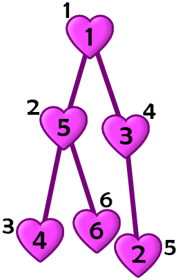

<h1 style='text-align: center;'> E. Hanging Hearts</h1>

<h5 style='text-align: center;'>time limit per test: 1 second</h5>
<h5 style='text-align: center;'>memory limit per test: 256 megabytes</h5>

Pak Chanek has $n$ blank heart-shaped cards. Card $1$ is attached directly to the wall while each of the other cards is hanging onto exactly one other card by a piece of string. Specifically, card $i$ ($i > 1$) is hanging onto card $p_i$ ($p_i < i$).

In the very beginning, Pak Chanek must write one integer number on each card. He does this by choosing any permutation $a$ of $[1, 2, \dots, n]$. Then, the number written on card $i$ is $a_i$.

After that, Pak Chanek must do the following operation $n$ times while maintaining a sequence $s$ (which is initially empty):

1. Choose a card $x$ such that no other cards are hanging onto it.
2. Append the number written on card $x$ to the end of $s$.
3. If $x \neq 1$ and the number on card $p_x$ is larger than the number on card $x$, replace the number on card $p_x$ with the number on card $x$.
4. Remove card $x$.

After that, Pak Chanek will have a sequence $s$ with $n$ elements. What is the maximum length of the longest non-decreasing subsequence$^\dagger$ of $s$ at the end if Pak Chanek does all the steps optimally?

$^\dagger$ A sequence $b$ is a subsequence of a sequence $c$ if $b$ can be obtained from $c$ by deletion of several (possibly, zero or all) elements. For example, $[3,1]$ is a subsequence of $[3,2,1]$, $[4,3,1]$ and $[3,1]$, but not $[1,3,3,7]$ and $[3,10,4]$.

#### Input

The first line contains a single integer $n$ ($2 \le n \le 10^5$) — the number of heart-shaped cards.

The second line contains $n - 1$ integers $p_2, p_3, \dots, p_n$ ($1 \le p_i < i$) describing which card that each card hangs onto.

#### Output

Print a single integer — the maximum length of the longest non-decreasing subsequence of $s$ at the end if Pak Chanek does all the steps optimally.

## Examples

#### Input


```text
6
1 2 1 4 2
```
#### Output


```text
4
```
#### Input


```text
2
1
```
#### Output


```text
2
```
## Note

The following is the structure of the cards in the first example.


Pak Chanek can choose the permutation $a = [1, 5, 4, 3, 2, 6]$.



Let $w_i$ be the number written on card $i$. Initially, $w_i = a_i$. Pak Chanek can do the following operations in order:

1. Select card $5$. Append $w_5 = 2$ to the end of $s$. As $w_4 > w_5$, the value of $w_4$ becomes $2$. Remove card $5$. After this operation, $s = [2]$.
2. Select card $6$. Append $w_6 = 6$ to the end of $s$. As $w_2 \leq w_6$, the value of $w_2$ is left unchanged. Remove card $6$. After this operation, $s = [2, 6]$.
3. Select card $4$. Append $w_4 = 2$ to the end of $s$. As $w_1 \leq w_4$, the value of $w_1$ is left unchanged. Remove card $4$. After this operation, $s = [2, 6, 2]$.
4. Select card $3$. Append $w_3 = 4$ to the end of $s$. As $w_2 > w_3$, the value of $w_2$ becomes $4$. Remove card $3$. After this operation, $s = [2, 6, 2, 4]$.
5. Select card $2$. Append $w_2 = 4$ to the end of $s$. As $w_1 \leq w_2$, the value of $w_1$ is left unchanged. Remove card $2$. After this operation, $s = [2, 6, 2, 4, 4]$.
6. Select card $1$. Append $w_1 = 1$ to the end of $s$. Remove card $1$. After this operation, $s = [2, 6, 2, 4, 4, 1]$.

One of the longest non-decreasing subsequences of $s = [2, 6, 2, 4, 4, 1]$ is $[2, 2, 4, 4]$. Thus, the length of the longest non-decreasing subsequence of $s$ is $4$. It can be proven that this is indeed the maximum possible length.


#### Tags 

#1800 #NOT OK #constructive_algorithms #data_structures #dfs_and_similar #dp #greedy #trees 

## Blogs
- [All Contest Problems](../Codeforces_Round_831_(Div._1_+_Div._2).md)
- [Announcement (en)](../blogs/Announcement_(en).md)
- [Tutorial (en)](../blogs/Tutorial_(en).md)
