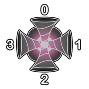
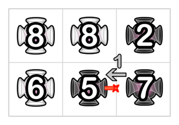

<h1 style='text-align: center;'> G. Dangerous Laser Power</h1>

<h5 style='text-align: center;'>time limit per test: 4 seconds</h5>
<h5 style='text-align: center;'>memory limit per test: 512 megabytes</h5>

Pak Chanek has an $n \times m$ grid of portals. The portal on the $i$-th row and $j$-th column is denoted as portal $(i,j)$. The portals $(1,1)$ and $(n,m)$ are on the north-west and south-east corner of the grid respectively.

The portal $(i,j)$ has two settings:

* Type $t_{i,j}$, which is either $0$ or $1$.
* Strength $s_{i,j}$, which is an integer between $1$ and $10^9$ inclusive.

 Each portal has $4$ faces labelled with integers $0,1,2,3$, which correspond to the north, east, south, and west direction respectively.  When a laser enters face $k$ of portal $(i, j)$ with speed $x_\text{in}$, it leaves the portal going out of face $(k+2+t_{i,j}) \bmod 4$ with speed $x_\text{out} = \max(x_\text{in},s_{i,j})$. The portal also has to consume $x_\text{out} - x_\text{in}$ units of energy. 

Pak Chanek is very bored today. He will shoot $4nm$ lasers with an initial speed of $1$, one into each face of each portal. Each laser will travel throughout this grid of portals until it moves outside the grid or it has passed through $10^{100}$ portals.

At the end, Pak Chanek thinks that a portal is good if and only if the total energy consumed by that portal modulo $2$ is equal to its type. Given the strength settings of all portals, find a way to assign the type settings of each portal such that the number of good portals is maximised.

#### Input

The first line contains two integers $n$ and $m$ ($1 \le n, m \le 1000$) — the number of rows and columns in the grid.

The $i$-th of the next $n$ lines contains $m$ integers, with the $j$-th integer being $s_{i,j}$ ($1 \leq s_{i,j} \leq 10^9$) — the strength of portal $(i, j)$.

#### Output

Print $n$ lines with each line containing a string of length $m$ consisting of characters $0$ or $1$ representing the type settings. The $j$-th character in the $i$-th string is the type setting of portal $(i, j)$.

If there are multiple solutions, you can output any of them. 

## Examples

#### Input


```text
2 3
8 8 2
6 5 7
```
#### Output


```text
110
100
```
#### Input


```text
1 2
420 69
```
#### Output


```text
10
```
## Note

In the first example, let's consider the laser Pak Chanek shoots into face $1$ of portal $(2, 2)$. The laser travels as follows: 

1. The laser enters face $1$ of portal $(2, 2)$ with speed $1$. It leaves the portal going out of face $3$ with speed $5$. Portal $(2, 2)$ consumes $4$ units of energy.
2. The laser enters face $1$ of portal $(2, 1)$ with speed $5$. It leaves the portal going out of face $0$ with speed $6$. Portal $(2, 1)$ consumes $1$ units of energy.
3. The laser enters face $2$ of portal $(1, 1)$ with speed $6$. It leaves the portal going out of face $1$ with speed $8$. Portal $(1, 1)$ consumes $2$ units of energy.
4. The laser enters face $3$ of portal $(1, 2)$ with speed $8$. It leaves the portal going out of face $2$ with speed $8$. Portal $(1, 2)$ consumes $0$ units of energy.
5. The laser enters face $0$ of portal $(2, 2)$ with speed $8$. It leaves the portal going out of face $2$ with speed $8$. Portal $(2, 2)$ consumes $0$ units of energy.

The illustration of the travel of the laser above is as follows.

  As an example, consider portal $(2, 3)$. We can calculate that the total energy consumed by that portal in the end will be $32$. Since $32 \bmod 2 = 0$ and $t_{2,3} = 0$, then it is a good portal.


#### Tags 

#3100 #NOT OK #constructive_algorithms #dsu #sortings 

## Blogs
- [All Contest Problems](../Codeforces_Round_831_(Div._1_+_Div._2).md)
- [Announcement (en)](../blogs/Announcement_(en).md)
- [Tutorial (en)](../blogs/Tutorial_(en).md)
