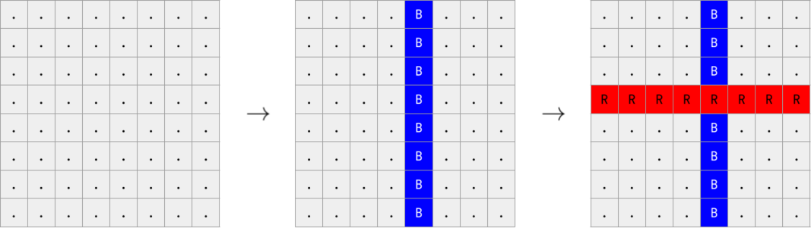

<h1 style='text-align: center;'> C. Stripes</h1>

<h5 style='text-align: center;'>time limit per test: 1 second</h5>
<h5 style='text-align: center;'>memory limit per test: 256 megabytes</h5>

On an $8 \times 8$ grid, some horizontal rows have been painted red, and some vertical columns have been painted blue, in some order. The stripes are drawn sequentially, one after the other. When the stripe is drawn, it repaints all the cells through which it passes.

Determine which color was used last.

  The red stripe was painted after the blue one, so the answer is R. 
### Input

The first line of the input contains a single integer $t$ ($1 \leq t \leq 4000$) — the number of test cases. The description of test cases follows. There is an empty line before each test case.

Each test case consists of $8$ lines, each containing $8$ characters. Each of these characters is either 'R', 'B', or '.', denoting a red square, a blue square, and an unpainted square, respectively.

It is guaranteed that the given field is obtained from a colorless one by drawing horizontal red rows and vertical blue columns.

At least one stripe is painted.

### Output

For each test case, output 'R' if a red stripe was painted last, and 'B' if a blue stripe was painted last (without quotes).

## Example

### Input


```text
4  
....B.......B.......B...RRRRRRRR....B.......B.......B.......B...  
RRRRRRRBB......BB......BB......BB......BB......BB......BRRRRRRRB  
RRRRRRBB.B.B..BBRRRRRRBB.B.B..BB.B.B..BBRRRRRRBB.B.B..BB.B.B..BB  
........................RRRRRRRR................................
```
### Output

```text

R
B
B
R

```
## Note

The first test case is pictured in the statement.

In the second test case, the first blue column is painted first, then the first and last red rows, and finally the last blue column. Since a blue stripe is painted last, the answer is B.


#### Tags 

#900 #OK #implementation 

## Blogs
- [All Contest Problems](../Codeforces_Round_827_(Div._4).md)
- [Announcement (en)](../blogs/Announcement_(en).md)
- [Tutorial (en)](../blogs/Tutorial_(en).md)
