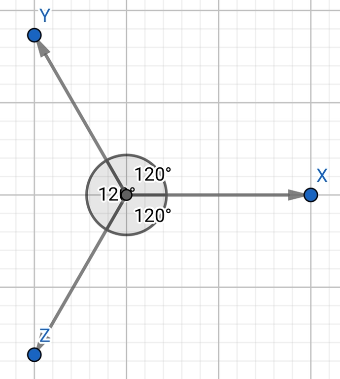
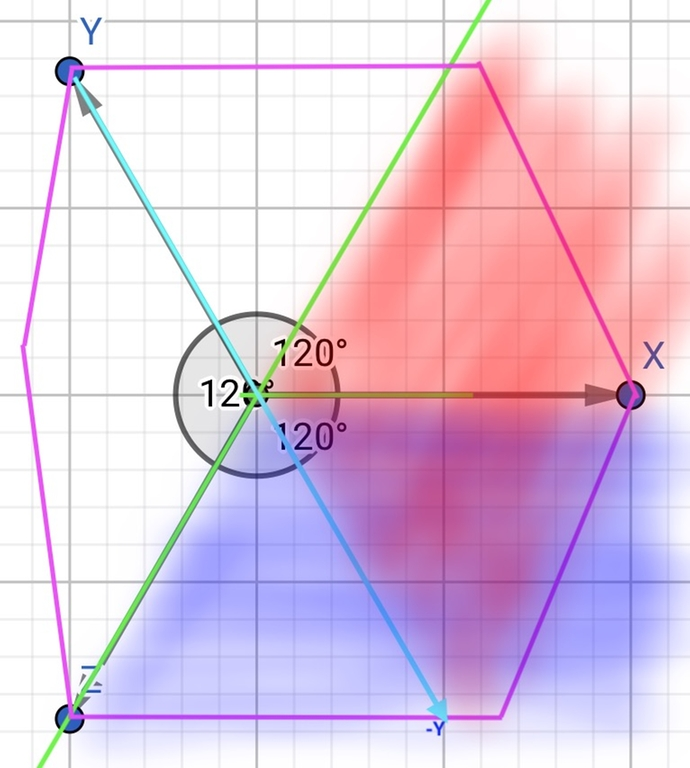

# Tutorial_(en)

Hi Codeforces,

I've tried my best to make a different editorial, I wish you enjoy it ...

[1746A - Maxmina](../problems/A._Maxmina.md "Codeforces Global Round 23")

problem author: [MohammadParsaElahimanesh](https://codeforces.com/profile/MohammadParsaElahimanesh "Candidate Master MohammadParsaElahimanesh"), [AmirrzwM](https://codeforces.com/profile/AmirrzwM "Master AmirrzwM")

 **step by step solution**step 1:

It's obvious that the answer is "NO" if ai=0 for all 1≤i≤n.

step 2:

Lets prove that the answer is "YES" if ai=1 for at least one 1≤i≤n.

step 3:

If size of a is equal to k, just use second type operation once and we are done.

step 4:

Otherwise (if |a|>k), there will be three cases: (assume that aj=1)

 * if j>2, you can use first type operation on first and second element and decrease size of a by 1.
* else if j<|a|−1, you can use first type operation on last and second to last element and decrease size of a by 1.
* else, it can be shown easily that |a|=3 and k=2 so you can use second type operation twice and turn a into a single 1.

In first and second case, you can continue decreasing size of a until |a|=k (or you reach 3-rd case) and you can use second type operation to reach your aim.

step 5:

So we proved that the answer is "YES" iff ai=1 for at least one 1≤i≤n or in other words, iff ∑ni=1ai>0.

 **solution**
```cpp
// In the name of God
#include <iostream>
 
using namespace std;
 
int main()
{
    int t;
    cin >> t;
    while(t--)
    {
        int n, k;
        cin >> n >> k;
        int sum = 0;
        for(int i = 0 ; i < n ; i++){
            int a;
            cin >> a;
            sum += a;
        }
        if(sum > 0) cout << "YES" << endl;
        else cout << "NO" << endl;
    }
    return 0;
}
// Thank God
```
[1746B - Rebellion](../problems/B._Rebellion.md "Codeforces Global Round 23")

problem author: [MohammadParsaElahimanesh](https://codeforces.com/profile/MohammadParsaElahimanesh "Candidate Master MohammadParsaElahimanesh")

 **step by step solution**step 1:

 **task**Assume that ai=0 for each 1≤i≤n, what should we do?

 **solution**Nothing! The array is already sorted and the answer is 0.

step 2:

 **task**After sorting the array, consider the first non-zero element of a, how many elements after that are equal to zero? In other words, consider smallest i such that ai>0, how many indices k exist such that i<k and ak=0?

 **solution**0, because we call an array a sorted (in non-decreasing order), if for all 1≤i<j≤n, ai≤aj holds. So all numbers after leftmost non-zero element must be non-zero too.

step 3:

 **task**assume that after sorting a, ai (1≤i≤n) is the leftmost non-zero element. Define G1 as the set of indices j such that 1≤j<i and aj>0 at the beginning, also define G2 as the set of indices j such that i≤j≤n and aj=0 at the beginning. What is the answer?

 **solution**max(|G1|,|G2|). It's obvious that in one operation at most one element will be deleted from each group. So we must perform at least max(|G1|,|G2|) operations. Now we want to show that it's sufficient too. There are three cases:

min(|G1|,|G2|)>1, at this point, we know that all elements of a are 0 or 1. So we can pick one element from G1 and add it to an element from G2, so the size of both groups will decrease by 1. It's obvious that all elements of a will remain less than or equal to 1 after this operation.

|G1|=0, it's easy to see that we can add a[k] (k∈G2) to a random element. So |G2| will decrease by 1.

|G2|=0, it's easy to see that we can add a[k] (k∈G1) to the last element of a. So |G1| will decrease by 1.

step 4:

 **task**Now how can we solve the problem using previous steps?

 **solution**If all elements are equal to 0, the answer is obviously zero. Otherwise we will calculate two arrays, number of ones in each prefix and number of zeros in each suffix. We will also fix the leftmost non-zero element and calculate the answer for it easily by using Step 3 algorithm in O(n).

 **solution**
```cpp
/// In the name of God
#include <iostream>
 
using namespace std;
 
int main()
{
	int t;
	cin >> t;
	while(t--)
	{
		int n;
		cin >> n;
		int A[n], cnt[2][n+1];
		cnt[0][0] = cnt[1][0] = 0;
		for(int i = 0; i < n; i++)
		{
			cin >> A[i];
			cnt[0][i+1] = cnt[0][i]+(A[i]==0?1:0);
			cnt[1][i+1] = cnt[1][i]+(A[i]==1?1:0);
		}
		int ans = n-1;
		for(int last_zero = 0; last_zero <= n; last_zero++)
			ans= min(ans, max(cnt[1][last_zero], cnt[0][n]-cnt[0][last_zero]));
		cout << ans << endl;
	}
}
 
/// Thank God . . .
```
[1746C - Permutation Operations](../problems/C._Permutation_Operations.md "Codeforces Global Round 23")

problem author: [napstablook](https://codeforces.com/profile/napstablook "Candidate Master napstablook")

 **step by step solution**step 1:

 **task**Try to prove that the answer is always zero. Or in other words, we can always make the array a non-decreasing.

 **solution**We will prove this fact in next steps.

step 2:

 **task**If some array a is non-decreasing, what can we say about array d=[a2−a1,a3−a2,...an−an−1]?

 **solution**It's obvious that all elements of array d should be non-negative.

step 3:

 **task**If we perform the i-th operation on the suffix starting at index j, what happens to array d?

 **solution**All elements of it will remain the same except dj−1=aj−aj−1 which will increase by i.

step 4:

 **task**Considering the fact that array a consists only of positive integers, what can we say about di=ai+1−ai?

 **solution**Since ai+1≥0, we can say that di≥−ai.

step 5:

 **task**Using step 3 and 4 and knowing that a is a permutation of numbers 1 to n, what can we do to make all elements of d non-negative?

 **solution**for i≤n−1, we can perform ai-th operation on the suffix starting from index i+1. So di will increase by ai and since we knew that di≥−ai, after performing this operation di≥0 will hold. So after this steps, elements of d will be non-negative and according to Step 2, that's exactly what we want. It's also easy to see that it doesn't matter how we perform an-th operation, so we can do anything we want.

 **solution**
```cpp
/// In the name of God
#include <bits/stdc++.h>

using namespace std;

inline void solve()
{
	int n;
	cin >> n;
	int permutation[n], location[n];
	for(int i = 0; i < n; i++)
	{
		cin >> permutation[i];
		permutation[i]--;
		location[permutation[i]] = i;
	}
	for(int i = 0; i < n; i++)
	{
		if(location[i] == n-1)
			cout << rand()%n+1 << (i == n-1?'n':' ');
		else
			cout << location[i]+2 << (i == n-1?'n':' ');
	}
}

int main()
{
	int t;
	cin >> t;
	while(t--)
		solve();
	return 0;
}
/// Thank God . . .
```
[1746D - Paths on the Tree](../problems/D._Paths_on_the_Tree.md "Codeforces Global Round 23")

problem author: [AquaMoon](https://codeforces.com/profile/AquaMoon "International Master AquaMoon"), [Cirno_9baka](https://codeforces.com/profile/Cirno_9baka "International Grandmaster Cirno_9baka"), [mejiamejia](https://codeforces.com/profile/mejiamejia "Expert mejiamejia"), [ChthollyNotaSeniorious](https://codeforces.com/profile/ChthollyNotaSeniorious "Master ChthollyNotaSeniorious"), [SSerxhs](https://codeforces.com/profile/SSerxhs "International Grandmaster SSerxhs"), [TomiokapEace](https://codeforces.com/profile/TomiokapEace "Expert TomiokapEace")

 **single step solution**Define f(u,cnt) represents the maximum score of cnt balls passing through the subtree of node u.

Define num as the number of the sons of node u. The transition is only related to ⌈cnt/num⌉ and ⌊cnt/num⌋ two states of the subtree.

For each node u, cnt can only be two adjacent integer (x,x+1).

It can be proved that the four numbers ⌊x/num⌋, ⌈x/num⌉, ⌈(x+1)/num⌉ and ⌊(x+1)/num⌋ can only have two kinds of numbers at most, and they are adjacent natural numbers.

So the number of states can be proved to be O(n).

 **solution**
```cpp
/// In the name of God
#include <bits/stdc++.h>
using namespace std;
typedef long long ll;

const int N = 200000;
ll V[N], dp[N];
int dad[N];
vector<int> child[N];
vector<pair<int, ll>> answers[N];

inline ll DP(int v, ll k)
{
	for(auto [kp, ans]: answers[v])
		if(k == kp)
			return ans;
	ll cnt_child = (ll)child[v].size();
	ll ans = k*V[v];
	if(cnt_child == 0)
		return ans;
	if(k%cnt_child == 0)
		for(auto u: child[v])
			ans += DP(u, k/cnt_child);
	else
	{
		ll dp1[cnt_child], dp2[cnt_child], diff[cnt_child];
		for(int i = 0; i < cnt_child; i++)
			dp1[i] = DP(child[v][i], k/cnt_child), dp2[i] = DP(child[v][i], k/cnt_child+1);
		for(int i = 0; i < cnt_child; i++)
			diff[i] = dp2[i] - dp1[i];
		sort(diff, diff+cnt_child, greater<int>());
		for(int i = 0; i < cnt_child; i++)
			ans += dp1[i];
		for(int i = 0; i < k%cnt_child; i++)
			ans += diff[i];
	}
	answers[v].push_back({k, ans});
	return ans;
}

inline ll solve()
{
	ll n, k;
	cin >> n >> k;
	for(int i = 0; i < n; i++)
		child[i].clear(), answers[i].clear();
	dad[0] = 0;
	for(int i = 0; i < n-1; i++)
	{
		cin >> dad[i+1];
		dad[i+1]--;
		child[dad[i+1]].push_back(i+1);
	}
	for(int i = 0; i < n; i++)
		cin >> V[i];
	return DP(0, k);
}

int main()
{
	int t;
	cin >> t;
	while(t--)
		cout << solve() << 'n';
	return 0;
}
/// Thank God . . .
```
[1746E1 - Joking (Easy Version)](../problems/E1._Joking_(Easy_Version).md "Codeforces Global Round 23")

problem author: [MohammadParsaElahimanesh](https://codeforces.com/profile/MohammadParsaElahimanesh "Candidate Master MohammadParsaElahimanesh")

 **step by step solution**step 1:

 **task**How can we make sure that some statement is not joking?

 **solution**If something is told for two times in a row, we can be sure that it's true. For example if we are told that x≠3 in two consecutive questions, we can be sure that it's true. Because at least one of those questions is answered correctly and that's enough.

step 2:

 **task**What can be found out if we ask about a set S? (assume that we will be answered correctly)

 **solution**If the answer is "YES", then x∈S and we can reduce our search domain to S. Otherwise, we can remove S from the search domain.

step 3:

 **task**Using previous steps, how can we really reduce our search domain? Step 2 can do it only if we have a correct statement about x and using Step 1, we can find something that is surely correct.

 **solution**Assume that V is our current search domain. Split it into 4 subsets V1,V2,V3 and V4. then ask about following sets:

 * V1∪V2
* V1∪V3

It's easy to show that no matter what the answers are, we can always remove at least one of the subsets from the search domain. For example if both answers are "YES", we can remove V4 and if both answers are "NO", then we can remove V1.

So after these questions, we can reduce size of search domain by at least min(|V1|,|V2|,|V3|,|V4|), and it's obvious to see that we can choose Vi's in such a way that this value is at least |V|4.

Finally, as long as size of the search domain is greater than 3, we can reduce it using this algorithm. It can be shown easily that we can reduce our search domain to only 3 numbers with at most 76 questions.

step 4:

 **task**Now assume that we have only 3 candidates for x, since we have only 2 chances to guess, we must remove one of them. How can we do it? Note that since we've used 76 questions in previous step, we only have 6 questions left.

 **solution**Assume that our three candidates are a,b and c. it can be shown that using following questions, we can always remove at least one of them from the search domain:

 * a
* b
* b
* a

After that, when we have only two candidates for x, we can guess them one by one and we are done.

 **solution**
```cpp
/// In the name of God
#pragma GCC optimize("Ofast","unroll-loops","O3")
#include <bits/stdc++.h>

using namespace std;

inline bool get_answer(){string s; cin >> s; return s == "YES";}

inline bool f(int i){return i&1;}
inline bool g(int i){return i&2;}

void solve(const vector<int> &Valid)
{
    if(Valid.size() < 3u)
	{
	    cout << "! " << Valid[0] << endl;
		string s;
		cin >> s;
		if(s == ":)")return;
		cout << "! " << Valid[1] << endl;
		return;
	}
	else if(Valid.size() == 3u)
	{
		bool is[4];
		cout << "? 1 " << Valid[0] << endl;is[0] = get_answer();
		cout << "? 1 " << Valid[1] << endl;is[1] = get_answer();
		cout << "? 1 " << Valid[1] << endl;is[2] = get_answer();
		cout << "? 1 " << Valid[0] << endl;is[3] = get_answer();
		if(is[1] and is[2])return solve({Valid[1]});
		else if(!is[1] and !is[2])return solve({Valid[0], Valid[2]});
		else if((is[0] and is[1]) or (is[2] and is[3]))return solve({Valid[0], Valid[1]});
		else if((is[0] and !is[1]) or (!is[2] and is[3]))return solve({Valid[0], Valid[2]});
		else return solve({Valid[1], Valid[2]});
	}
	else
	{
		vector<int> query[2];
		for(int i = 0; i < (int)Valid.size(); i++)
		{
			if(f(i))query[0].push_back(Valid[i]);
			if(g(i))query[1].push_back(Valid[i]);
		}
		bool is[2];
		for(int i = 0; i < 2; i++)
		{
			cout << "? " << query[i].size();
			for(auto u: query[i])cout << ' ' << u;
			cout << endl;
			is[i] = get_answer();
		}
		vector<int> NewValid;
		for(int i = 0; i < (int)Valid.size(); i++)
		{
			if((!f(i) ^ is[0]) or (!g(i) ^ is[1]))NewValid.push_back(Valid[i]);
		}
		return solve(NewValid);
	}
}
int main()
{
	int n = 0;
	cin >> n;
	vector<int> all(n);
	for(int i = 0; i < n; i++)all[i] = i+1;
	solve(all);
	return 0;
}
/// Thank God . . .
```
[1746E2 - Joking (Hard Version)](../problems/E2._Joking_(Hard_Version).md "Codeforces Global Round 23")

problem author: [MohammadParsaElahimanesh](https://codeforces.com/profile/MohammadParsaElahimanesh "Candidate Master MohammadParsaElahimanesh"), [AmirrzwM](https://codeforces.com/profile/AmirrzwM "Master AmirrzwM")

 **step by step solution**step 1:

First note that in any question we ask, a set will be introduced as the set that contains x. If the answer is "YES", then the set that we asked is introduced and otherwise, its complement.

 **task**Assume that our current search domain is some set V. In addition, assume that V=A∪B such that set A is the set that introduced to contain x in very last step and B is the set of other candidates for x (candidates that don't belong to A). Now assume that in next question, a set C is introduced to contain x such that C=a∪b,(a∈A,b∈B). what can we do? how can we reduce our search domain after this question?

 **solution**Considering the solution of E1, it's not so hard to see that we can remove B−b from our search domain. So our new search domain will be V′=A′∪B′ such that A′=C=a∪b is the set of candidates that introduced in last question and B′=A−a is the set of other candidates.

step 2:

 **task**Let's calculate minimum needed questions for a search domain of size n using the idea of previous step.

 **solution**We can do it using a simple dp, let dp[A][B] be the minimum number of questions needed to find x in a search domain of size A+B in which A numbers are introduced in last question and B numbers are not. In order to calculate our dp, if we ask about some set which consists of a numbers from first set and b numbers from second set, we should update dp[A][B] from dp[A−a][a+b]. So we can say that: 

 dp[A][B]=mina≤A,b≤Bdp[A−a][a+b]. Using this dp and keeping track of its updates, we can simply solve the task. But there is a problem, we don't have enough time to calculate the whole dp. So what can we do?

step 3:

 **task**Since calculating dp[A][B] for A<=n,B<=m is O(n2⋅m2), we can only calculate it for small n and m like n,m≤100. What can we do for the rest? Maybe some heuristic method?

 **solution**It's not so hard to see that for most A and B (especially for large values) it's best to update dp[A][B] from something around dp[A−A/2][A/2+B/2] (in other words, asking A/2 numbers from the first set and B/2 numbers from the second one). Using such method, we can calculate dp in a reasonable time and with a very good accuracy, and this accuracy is enough to find the answer in less than 53 questions.

 **solution**
```cpp
/// In the name of God
#pragma GCC optimize("Ofast","unroll-loops","O3")
#include <bits/stdc++.h>
 
using namespace std;
 
const int SUM = 50;
int dp[SUM][SUM];
pair<int,int> updater[SUM][SUM];
map<pair<int,int>, int> Dp;
map<pair<int,int>, pair<int,int>> Updater;
 
inline void preprocess()
{
	for(int i = 0; i < SUM; i++)
	{
		for(int j = 0; j < SUM; j++)
		{
			dp[i][j] = SUM;
			updater[i][j] = {i, j};
		}
	}
	dp[0][0] = dp[0][1] = dp[1][0] = dp[2][0] = dp[1][1] = dp[0][2] = 0;
	for(int sum = 0; sum < SUM; sum ++)for(int last = sum; last >= 0; last--)
	{
		int now = sum - last;
		for(int SelectLast = 0; SelectLast <= last; SelectLast++)for(int SelectNow = 0; SelectNow <= now; SelectNow++)
		{
			if(dp[last][now] > 1 + max(dp[now-SelectNow][SelectNow+SelectLast], dp[SelectNow][sum-SelectNow-SelectLast]))
			{
				dp[last][now] = 1 + max(dp[now-SelectNow][SelectNow+SelectLast], dp[SelectNow][now+last-SelectNow-SelectLast]);
				updater[last][now] = {SelectLast, SelectNow};
			}
		}
	}
}
 
inline int DP(const int last, const int now)
{
	if(last < 0 || now < 0)return SUM;
	if(last + now < SUM)return dp[last][now];
	if(Dp.find({last, now}) != Dp.end())return Dp[{last, now}];
	if((last&1) && (now&1))
	{
		Dp[{last, now}] = 1 + DP((now+1)/2, (last+ now)/2);
		Updater[{last, now}] = {(last+1)/2, now/2};
	}
	else
	{
		Dp[{last, now}] = 1 + DP((now+1)/2, (last+1)/2+(now+1)/2);
		Updater[{last, now}] = {(last+1)/2, (now+1)/2};
	}
	return Dp[{last, now}];
}
 
inline bool IsIn(const int x, const vector<int> &Sorted)
{
	auto u = lower_bound(Sorted.begin(), Sorted.end(), x);
	if(u == Sorted.end() or *u != x)return false;
	return true;
}
 
vector<int> solve(const vector<int> &LastAns, const vector<int> &Valid)
{
	if((int)Valid.size() < 3)
	{
		return Valid;
	}
	pair<int,int> Select;
	if((int)Valid.size() < SUM)
	{
		Select = updater[LastAns.size()][Valid.size()-LastAns.size()];
	}
	else
	{
		DP((int)LastAns.size(), (int)(Valid.size()-LastAns.size()));
		Select = Updater[{LastAns.size(), Valid.size()-LastAns.size()}];
	}
	vector<int> query;
	int p = 0;
	while(Select.first --)query.push_back(LastAns[p++]);
	p = 0;
	vector<int> LastAnsSorted = LastAns;
	sort(LastAnsSorted.begin(), LastAnsSorted.end());
	while(Select.second --)
	{
		while(IsIn(Valid[p], LastAnsSorted)) p++;
		query.push_back(Valid[p++]);
	}
	cout << "? " << query.size();
	for(auto u: query)cout << ' ' << u;
	cout << endl;
	
	string s;
	cin >> s;
	bool correct = (s == "YES");
	sort(query.begin(), query.end());
	vector<int> NewLast, NewValid;
	for(auto u: Valid)
	{
		if(!IsIn(u, LastAnsSorted) and (correct ^ IsIn(u, query)))
		{
			NewLast.push_back(u);
		}
		if(!IsIn(u, LastAnsSorted) or !(correct ^ IsIn(u, query)))
		{
			NewValid.push_back(u);
		}
	}
	vector<int> ans = solve(NewLast, NewValid);
	return ans;
}
 
int main()
{
	preprocess();
 
	int n;
	cin >> n;
	vector<int> all(n);
	for(int i = 0; i < n; i++)all[i] = i+1;
	vector<int> valid = solve({}, all);
	for(auto guess: valid)
	{
		cout << "! " << guess << endl;
		string s;
		cin >> s;
		if(s == ":)")return 0;
	}
	
	return 0;
}
/// Thank God . . .
```
[1746F - Kazaee](../problems/F._Kazaee.md "Codeforces Global Round 23")

problem author: [MohammadParsaElahimanesh](https://codeforces.com/profile/MohammadParsaElahimanesh "Candidate Master MohammadParsaElahimanesh")

 **step by step solution**step 1:

First of all, we can compress ai's and x's (in second type query). so we can assume that all numbers are less than n+q≤6⋅105.

step 2:

 **task**Lets first solve the problem for smaller constrains. 

 **solution**We can use data structures like fenwick tree or segment tree to count the number of occurrences of each number and check if it's divisible by k to answer second type query. And we can simply update our data structure after each query of the first type.

So if we use something like fenwick tree, we can handle everything in O((n+q)⋅n+(n+q)⋅q⋅log2(n)).

step 3:

 **task**Obviously we can not use previous step solution for original constrains. In other words, we don't have enough time to check all numbers one by one. How can we do better? Checking them together?!

 **solution**It's obviously not a good idea to check all numbers together (checking that sum of their occurrences is divisible by k). So what can we do? What if we check a random subset of numbers?

step 4:

 **task**Assume that S is a random subset of all numbers, it's obvious that if the answer of the query is "YES" (number of occurrences of every number is divisible by k), the condition holds for S too (sum of number of occurrences of numbers that belong to S is divisible by k). What about the opposite? What is the probability that the answer of the query is "NO" and yet sum of occurrences of numbers belonging to S is divisible by k?

 **solution**It's not so hard to prove that the probability is equal to 12 for k=2 and it's less than 12 for k≥2. So in general, the probability that a random subset S leads to a wrong answer is less than or equal to 12. So if we use something like 30 random subsets, the probability will be less than 1230 which is reasonable for problem constrains and we can use this random method to solve the task.

 **solution**
```cpp
#include <bits/stdc++.h>
 
using namespace std;
 
typedef long long int ll;
 
mt19937 rnd(time(0));
 
const int N = 300'000 + 5; 
const int Q = 300'000 + 5; 
const int T = 50;
bitset<N+Q> RandomSet[T];
unordered_map<int, int> id; int cnt_id = 0;
int n, q, A[N];
 
struct fenwick
{
	int PartialSum[N];
	fenwick()
	{
		for(int i = 0; i < N; i++)PartialSum[i] = 0;
	}
	inline void add(int index, bool increase)
	{
		while(index < N)
		{
			PartialSum[index] += (increase? 1 : -1);
			index += index&-index;
		}
	}
	inline int get(int index)
	{
		int sum = 0;
		while(index)
		{
			sum += PartialSum[index];
			index -= index&-index;
		}
		return sum;
	}
}Fen[T];
 
inline int GetId(const int x)
{
	auto id_iterator = id.find(x);
	if(id_iterator == id.end())
	{
		return id[x] = cnt_id++;
	}
	else return (*id_iterator).second;
}
 
inline void ChooseRandomSets()
{
	for(int i = 0; i < T; i++)
	{
		for(int j = 0; j < N+Q; j++)
		{
			if(rnd()&1)RandomSet[i].set(j);
		}
	}
}
 
inline void AddArrayToFenwick()
{
	for(int i = 0; i < n; i++)
	{
		int MyId = GetId(A[i]);
		for(int j = 0; j < T; j++)
		{
			if(RandomSet[j][MyId])Fen[j].add(i+1, true);
		}
	}
}
	
inline void Query()
{
	int index, l, r, k, x, type;
	for(int i = 0; i < q; i++)
	{
		cin >> type;
		if(type == 1)
		{
			cin >> index >> x;
			index --;
			int IdPre = GetId(A[index]);
			int IdNew = GetId(x);
			A[index] = x;
			for(int j = 0; j < T; j++)
			{
				if(RandomSet[j][IdPre])Fen[j].add(index+1, false);
				if(RandomSet[j][IdNew])Fen[j].add(index+1, true);
			}
		}
		if(type == 2)
		{
			cin >> l >> r >> k;
			l--;
			if(k == 1){cout << "YESn"; continue;}
			else if((r-l)%k != 0){cout << "NOn"; continue;}
			bool answer = true;
			for(int j = 0; j < T; j++)
			{
				if((Fen[j].get(r)-Fen[j].get(l))%k != 0){answer = false; break;}
			}
			cout << (answer?"YES":"NO") << 'n';
		}
	}
}
 
int main()
{
    ios::sync_with_stdio(false) , cin.tie(0);
    ChooseRandomSets();
    cin >> n >> q;
    for(int i = 0; i < n; i++) cin >> A[i];
    AddArrayToFenwick();
    Query();
    return 0;
}
```
[1746G - Olympiad Training](../problems/G._Olympiad_Training.md "Codeforces Global Round 23")

problem idea: [SirShokoladina](https://codeforces.com/profile/SirShokoladina "International Grandmaster SirShokoladina")

problem development: [SomethingNew](https://codeforces.com/profile/SomethingNew "Grandmaster SomethingNew"), [pakhomovee](https://codeforces.com/profile/pakhomovee "Master pakhomovee"), [SirShokoladina](https://codeforces.com/profile/SirShokoladina "International Grandmaster SirShokoladina")

 **single step solution**Consider all subsets of the original set in which tasks can be performed in some order to satisfy the constraints on their completion, and also that the size of each of them does not exceed a+b+c. It is easy to show that this set is a weighted matroid. This means that the optimal set of tasks can be found using a greedy algorithm.

So, we can find a set of tasks with maximum total usefulness, which:

 * satisfies all deadline constraints
* has no more than a+b+c elements

For the given parameters (x,y,z), we introduce the following transformation:

 * Increase the usefulness of all tasks of the first type by x, the second type~--- by y, and the third type~--- by z.

Let's assume that the optimal solution after the transformation is described by the triple [a′,b′,c′]~--- the number of problems of each type, respectively. We need to get a solution described by the triple [a,b,c]. For [a,b,c]≠[a′,b′,c′], a+b+c=a′+b′+c′ holds. Then (without limitation of generality, since there are at least two inequalities among a∨a′,b∨b′,c∨c′) we assume that a′>a,b′<b.

Consider the following coordinate system on a two-dimensional plane (modulo the addition of →(1;1;1)):



For the coordinates of the point, we take the value →x×x+→y×y+→z×z(→x+→y+→z=→0). It is easy to understand that the coordinates of the point (x;y) on the plane are uniquely set by the triple (x;y;z) up to the addition of →(1;1;1)×k,k∈Z

Let's assume that there are parameters (x,y,z) for which the optimal solution is unique and equal to [a,b,c] (see "But what if..?" to see what needs to be done to the input to make this hold).

Consider the solution [a′,b′,c′] for the "center" of the current polygon (initially it is a hexagon with infinitely distant coordinates). The "center" is the center of the triangle formed by the middle lines of our polygon.

On this plane, decreasing z or y does not increase b′+c′, therefore, it does not decrease a′. Thus, the red area in the picture below does not suit us.

Increasing x or z does not decrease a′+c′, therefore, it does not increase b′. Because of this, the blue area in the picture below does not suit us either.



So, we need to cut off one half-plane along the z axis. It can be shown that the area of the polygon under consideration decreases by a constant time for every 2-3 iterations.

But what if the number of tasks of the desired color jumps from a−1 to a+1 at once? This is possible if and only if with the addition of some x we get several pairs of elements of equal weight at the same time. To get rid of this, we can simply add a random number from 0 to 13 to each weight. The fact that such a change will fix the problem described above and will not change the optimal answer to the original problem remains to the reader as an exercise (the authors have proof).

After O(logC) iterations, our algorithm will converge to a point (a triple of real numbers). It remains only to check that the solution found is suitable for us.

O(nlognlogC)

 **solution**
```cpp
#include <bits/stdc++.h>
using namespace std;
 
#ifdef SG
	#include <debug.h>
#else
	template<typename T> struct outputer;
	struct outputable {};
	#define PRINT(...)
	#define OUTPUT(...)
	#define show(...)
	#define debug(...)
	#define deepen(...)
	#define timer(...)
	#define fbegin(...)
	#define fend
	#define pbegin(...)
	#define pend
#endif
 
#define ARG4(_1,_2,_3,_4,...) _4
 
#define forn3(i,l,r) for (int i = int(l); i < int(r); ++i)
#define forn2(i,n) forn3 (i, 0, n)
#define forn(...) ARG4(__VA_ARGS__, forn3, forn2) (__VA_ARGS__)
 
#define ford3(i,l,r) for (int i = int(r) - 1; i >= int(l); --i)
#define ford2(i,n) ford3 (i, 0, n)
#define ford(...) ARG4(__VA_ARGS__, ford3, ford2) (__VA_ARGS__)
 
#define ve vector
#define pa pair
#define tu tuple
#define mp make_pair
#define mt make_tuple
#define pb emplace_back
#define fs first
#define sc second
#define all(a) (a).begin(), (a).end()
#define sz(a) ((int)(a).size())
 
typedef long double ld;
typedef signed __int128 lll;
typedef unsigned __int128 ulll;
typedef int64_t ll;
typedef uint64_t ull;
typedef uint32_t ui;
typedef uint16_t us;
typedef uint8_t uc;
typedef pa<int, int> pii;
typedef pa<int, ll> pil;
typedef pa<ll, int> pli;
typedef pa<ll, ll> pll;
typedef ve<int> vi;
 
template<typename T> inline auto sqr (T x) -> decltype(x * x) {return x * x;}
template<typename T1, typename T2> inline bool umx (T1& a, T2 b) {if (a < b) {a = b; return 1;} return 0;}
template<typename T1, typename T2> inline bool umn (T1& a, T2 b) {if (b < a) {a = b; return 1;} return 0;}
 
const int N = 100000;
const int X = 1000000000;
const int T = 3;
 
struct Input {
	int n;
	std::array<int, T> k;
	int a[N], t[N], d[N];
	
	bool read() {
		if (!(cin >> n)) {
			return 0;
		}
		forn (i, T) {
			cin >> k[i];
		}
		forn (i, n) {
			cin >> a[i] >> t[i] >> d[i];
			--t[i];
			--d[i];
		}
		return 1;
	}
 
	void init(const Input& input) {
		*this = input;
	}
};
 
struct Data: Input {
	ll ans;
	
	void write() {
		cout << ans << endl;
	}
};
 
 
namespace Main {
	const lll P = 2 * N + 1;
	const lll Q = 2 * N + 2;
	const lll R = 2 * N + 3;
	const lll A[3] = {3 * P * Q, 3 * P * R, 3 * Q * R};
	const lll M = 3 * P * Q * R * N;
	const lll inf = (X + 1) * M;
 
	struct SNM {
		int rnd = 0;
		int n;
		int pr[N];
 
		void init(int cnt) {
			n = cnt;
			forn (i, n) {
				pr[i] = i;
			}
		}
 
		int get_p(int v) {
			if (v < 0 || pr[v] == v) {
				return v;
			}
			return pr[v] = get_p(pr[v]);
		}
 
		bool add(int v) {
			v = get_p(v);
			if (v == -1) {
				return 0;
			}
			pr[v] = v - 1;
			return 1;
		}
	};
	
	struct Solution: Data {
		SNM snm;
 
		int m;
		lll b[N], c[N];
		vi ord[T];
 
		array<int, T> check(const array<lll, T>& adds) {
			forn (i, n) {
				c[i] = b[i] + adds[t[i]];
			}
			auto cmp = [&](int lhs, int rhs) {
				return c[lhs] > c[rhs];
			};
			static vi q;
			q.clear();
			forn (i, T) {
				static vi w;
				w.resize(sz(q) + sz(ord[i]));
				merge(all(q), all(ord[i]), w.begin(), cmp);
				q.swap(w);
			}
 
			snm.init(n);
			array<int, T> cnt{};
			int tot = 0;
			ll val = 0;
			for (int i : q) {
				if (tot >= m) {
					break;
				}
				if (snm.add(d[i])) {
					cnt[t[i]]++;
					tot++;
					val += a[i];
				}
			}
			if (cnt == k) {
				ans = val;
			}
			return cnt;
		}
 
		// x[i] == adds[(i + 1) % T] - adds[i]
 
		array<lll, T> get_middle_point(const array<lll, T>& lb, const array<lll, T>& rb) {
			array<lll, T> x;
			forn (i, T) {
				x[i] = lb[i] + rb[i];
			}
			lll sum = accumulate(all(x), lll(0));
			forn (i, T) {
				x[i] = T * x[i] - sum;
				if (x[i] >= 0) {
					x[i] /= (2 * T);
				} else {
					x[i] = (x[i] - 2 * T + 1) / (2 * T);
				}
			}
			sum = accumulate(all(x), lll(0));
			forn (i, T) {
				if (sum < 0 && x[i] < rb[i]) {
					x[i]++;
					sum++;
				}
				assert(x[i] >= lb[i]);
				assert(x[i] <= rb[i]);
			}
			assert(sum == 0);
			return x;
		}
 
		bool search() {
			array<lll, T> lb, rb;
			forn (i, T) {
				lb[i] = -2 * inf;
				rb[i] = 2 * inf;
			}
 
			while (true) {
				{
					lll sum_l = accumulate(all(lb), lll(0));
					lll sum_r = accumulate(all(rb), lll(0));
					forn (i, T) {
						lll sol = sum_l - lb[i];
						lll sor = sum_r - rb[i];
						umx(lb[i], -sor);
						umn(rb[i], -sol);
						if (lb[i] > rb[i]) {
							return 0;
						}
					}
				}
				array<lll, T> x = get_middle_point(lb, rb);
				array<lll, T> adds{};
				forn (i, T - 1) {
					adds[i + 1] = adds[i] + x[i];
				}
				array<int, T> cnt = check(adds);
				assert(accumulate(all(cnt), 0) == m);
				if (cnt == k) {
					return 1;
				}
				forn (i, T) {
					lll d1 = cnt[i] - k[i];
					lll d2 = cnt[(i + 1) % T] - k[(i + 1) % T];
					if (d1 > 0 && d2 < 0) {
						lb[i] = x[i] + 1;
					}
					if (d1 < 0 && d2 > 0) {
						rb[i] = x[i] - 1;
					}
				}
			}
		}
		
		void solve() {
			forn (i, n) {
				b[i] = a[i] * M + i * A[t[i]];
			}
			forn (i, n) {
				ord[t[i]].pb(i);
			}
			forn (i, T) {
				sort(all(ord[i]), [&](int lhs, int rhs) {
					return b[lhs] > b[rhs];
				});
			}
			m = accumulate(all(k), 0);
 
			{
				array<int, T> r = check({});
				if (accumulate(all(r), 0) != m) {
					ans = -1;
					return;
				}
			}
			forn (i, T) {
				array<lll, T> adds{};
				adds[i] = inf;
				if (check(adds)[i] < k[i]) {
					ans = -1;
					return;
				}
				adds[i] = -inf;
				if (check(adds)[i] > k[i]) {
					ans = -1;
					return;
				}
			}
			assert(search());
		}
		
		void clear() {
			forn (i, T) {
				ord[i].clear();
			}
		}
	};
}
 
 
Main::Solution sol;
 
int main() {
	#ifdef SG
		freopen((problemname + ".in").c_str(), "r", stdin);
//		freopen((problemname + ".out").c_str(), "w", stdout);
	#endif
	
	int t;
	cin >> t;
	forn (i, t) {
		sol.read();
		sol.solve();
		sol.write();
		sol.clear();
	}
	
	return 0;
}
```
