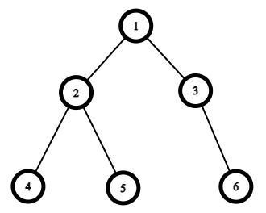

<h1 style='text-align: center;'> F. Distance to the Path</h1>

<h5 style='text-align: center;'>time limit per test: 4 seconds</h5>
<h5 style='text-align: center;'>memory limit per test: 512 megabytes</h5>

You are given a tree consisting of $n$ vertices. Initially, each vertex has a value $0$.

You need to perform $m$ queries of two types: 

1. You are given a vertex index $v$. Print the value of the vertex $v$.
2. You are given two vertex indices $u$ and $v$ and values $k$ and $d$ ($d \le 20$). You need to add $k$ to the value of each vertex such that the distance from that vertex to the path from $u$ to $v$ is less than or equal to $d$.

The distance between two vertices $x$ and $y$ is equal to the number of edges on the path from $x$ to $y$. For example, the distance from $x$ to $x$ itself is equal to $0$.

The distance from the vertex $v$ to some path from $x$ to $y$ is equal to the minimum among distances from $v$ to any vertex on the path from $x$ to $y$.

### Input

The first line contains a single integer $n$ ($2 \le n \le 2 \cdot 10^5$) — the number of vertices in the tree.

Next $n - 1$ lines contain the edges of the tree — one per line. Each line contains two integers $u$ and $v$ ($1 \le u, v \le n$; $u \neq v$) representing one edge of the tree. It's guaranteed that the given edges form a tree.

The next line contains a single integer $m$ ($1 \le m \le 2 \cdot 10^5$) — the number of queries.

Next $m$ lines contain the queries — one per line. Each query has one of the following two types: 

* $1$ $v$ ($1 \le v \le n$) — the query of the first type;
* $2$ $u$ $v$ $k$ $d$ ($1 \le u, v \le n$; $1 \le k \le 1000$; $0 \le d \le 20$) — the query of the second type.

Additional constraint on the input: there is at least one query of the first type.

### Output

For each query of the first type, print the value of the corresponding vertex.

## Example

### Input


```text
6
1 2
1 3
4 2
5 2
3 6
14
2 4 5 10 2
1 3
1 6
2 1 1 10 20
2 6 6 10 20
1 3
2 3 2 10 0
2 5 2 10 1
1 1
1 2
1 3
1 4
1 5
1 6
```
### Output


```text
10
0
30
50
50
40
40
40
20
```
## Note

The tree from the first example: 

   Some query explanations: * "$2$ $4$ $5$ $10$ $2$": affected vertices are $\{4, 2, 5, 1, 3\}$;
* "$2$ $1$ $1$ $10$ $20$" and "$2$ $6$ $6$ $10$ $20$": all vertices are affected, since distance to $1$ ($6$) is less that $20$ for any vertex;
* "$2$ $3$ $2$ $10$ $0$": affected vertices are $\{3, 1, 2\}$;
* "$2$ $5$ $2$ $10$ $1$": affected vertices are $\{5, 2, 4, 1\}$.


#### Tags 

#2800 #NOT OK #data_structures #dfs_and_similar #trees 

## Blogs
- [All Contest Problems](../Educational_Codeforces_Round_138_(Rated_for_Div._2).md)
- [Announcement](../blogs/Announcement.md)
- [Tutorial](../blogs/Tutorial.md)
