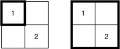

<h1 style='text-align: center;'> F. Minecraft Series</h1>

<h5 style='text-align: center;'>time limit per test: 6 seconds</h5>
<h5 style='text-align: center;'>memory limit per test: 512 megabytes</h5>

Little Misha goes to the programming club and solves nothing there. It may seem strange, but when you find out that Misha is filming a Minecraft series, everything will fall into place...

Misha is inspired by Manhattan, so he built a city in Minecraft that can be imagined as a table of size $n \times m$. $k$ students live in a city, the $i$-th student lives in the house, located at the intersection of the $x_i$-th row and the $y_i$-th column. Also, each student has a degree of his aggressiveness $w_i$. Since the city turned out to be very large, Misha decided to territorially limit the actions of his series to some square $s$, which sides are parallel to the coordinate axes. The length of the side of the square should be an integer from $1$ to $\min(n, m)$ cells.

According to the plot, the main hero will come to the city and accidentally fall into the square $s$. Possessing a unique degree of aggressiveness $0$, he will be able to show his leadership qualities and assemble a team of calm, moderate and aggressive students.

In order for the assembled team to be versatile and close-knit, degrees of aggressiveness of all students of the team must be pairwise distinct and must form a single segment of consecutive integers. Formally, if there exist students with degrees of aggressiveness $l, l+1, \ldots, -1, 1, \ldots, r-1, r$ inside the square $s$, where $l \le 0 \le r$, the main hero will be able to form a team of $r-l+1$ people (of course, he is included in this team).

Notice, that it is not required to take all students from square $s$ to the team.

Misha thinks that the team should consist of at least $t$ people. That is why he is interested, how many squares are there in the table in which the main hero will be able to form a team of at least $t$ people. Help him to calculate this.

##### Input

The first line contains four integers $n$, $m$, $k$ and $t$ ($1 \le n, m \le 40\,000$, $1 \le n \cdot m \le 40\,000$, $1 \le k \le 10^6$, $1 \le t \le k + 1$) — the number of rows and columns in the table, and the number of students living in the city, respectively.

Each of the following $k$ lines contains three integers $x_i$, $y_i$ and $w_i$ ($1 \le x_i \le n$, $1 \le y_i \le m$, $1 \le \lvert w_i \rvert \le 10^9$) — the number of row and column, where the $i$-th student is living, and the degree of his aggressiveness.

##### Output

Print one integer — the number of ways to choose the square $s$ in such way that the main hero will be able to form a team of at least $t$ people.

## Examples

##### Input


```text
2 2 1 2
1 1 2
```
##### Output


```text
0
```
##### Input


```text
2 2 2 2
1 1 1
2 2 2
```
##### Output


```text
2
```
##### Input


```text
2 2 4 2
1 1 1
1 1 -1
1 2 1
2 2 1
```
##### Output


```text
4
```
## Note

1. In the first example the main hero will not be able to form a team of more than one person in any square $s$.   Illustration for the first example.
2. In the second example there are two ways to select square $s$. Both of them are illustrated below. In one of them the main hero will be able to form a team of students with degrees of aggressiveness $[0, 1]$, and in the another — with degrees of aggressiveness $[0, 1, 2]$. Notice, that the main hero with degree of aggressiveness $0$ will be included to the team regardless of the chosen square.   Illustration for the second example.
3. In the third example there are four ways to select square $s$. All of them are illustrated below. The main hero will be able to form a team with degrees of aggressiveness: $[-1,0,1]$, $[0,1]$, $[0,1]$, $[-1, 0, 1]$, respectively.   Illustration for the third example.


#### Tags 

#3500 #NOT OK #brute_force #two_pointers 

## Blogs
- [All Contest Problems](../Codeforces_Round_829_(Div._1).md)
- [Announcement](../blogs/Announcement.md)
- [Tutorial (en)](../blogs/Tutorial_(en).md)
