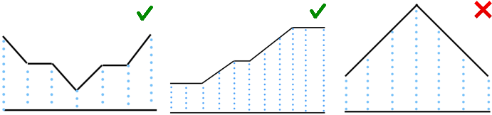

<h1 style='text-align: center;'> D. Challenging Valleys</h1>

<h5 style='text-align: center;'>time limit per test: 2 seconds</h5>
<h5 style='text-align: center;'>memory limit per test: 256 megabytes</h5>

You are given an array $a[0 \dots n-1]$ of $n$ integers. This array is called a "valley" if there exists exactly one subarray $a[l \dots r]$ such that:

* $0 \le l \le r \le n-1$,
* $a_l = a_{l+1} = a_{l+2} = \dots = a_r$,
* $l = 0$ or $a_{l-1} > a_{l}$,
* $r = n-1$ or $a_r < a_{r+1}$.

Here are three examples:

  The first image shows the array [$3, 2, 2, 1, 2, 2, 3$], it is a valley because only subarray with indices $l=r=3$ satisfies the condition.

The second image shows the array [$1, 1, 1, 2, 3, 3, 4, 5, 6, 6, 6$], it is a valley because only subarray with indices $l=0, r=2$ satisfies the codition.

The third image shows the array [$1, 2, 3, 4, 3, 2, 1$], it is not a valley because two subarrays $l=r=0$ and $l=r=6$ that satisfy the condition.

You are asked whether the given array is a valley or not.

## Note

 that we consider the array to be indexed from $0$.

### Input

The first line contains a single integer $t$ ($1 \leq t \leq 10^4$) — the number of test cases.

The first line of each test case contains a single integer $n$ ($1 \leq n \leq 2\cdot10^5$) — the length of the array.

The second line of each test case contains $n$ integers $a_i$ ($1 \leq a_i \leq 10^9$) — the elements of the array.

It is guaranteed that the sum of $n$ over all test cases is smaller than $2\cdot10^5$.

### Output

For each test case, output "YES" (without quotes) if the array is a valley, and "NO" (without quotes) otherwise.

You can output the answer in any case (for example, the strings "yEs", "yes", "Yes" and "YES" will be recognized as a positive answer).

## Example

### Input


```text
673 2 2 1 2 2 3111 1 1 2 3 3 4 5 6 6 671 2 3 4 3 2 179 7 4 6 9 9 101100000000089 4 4 5 9 4 9 10
```
### Output

```text

YES
YES
NO
YES
YES
NO

```
## Note

The first three test cases are explained in the statement.


#### Tags 

#1000 #NOT OK #implementation #two_pointers 

## Blogs
- [All Contest Problems](../Codeforces_Round_835_(Div._4).md)
- [Announcement (en)](../blogs/Announcement_(en).md)
- [Tutorial (en)](../blogs/Tutorial_(en).md)
