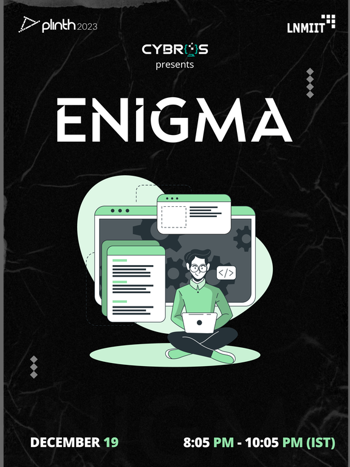

# Announcement_(en)

Hello, Codeforces!

Cybros, the competitive programming club of LNMIIT Jaipur, is happy to invite you to participate in [Codeforces Round 840 (Div. 2) and Enigma 2022 - Cybros LNMIIT](https://codeforces.com/contest/1763 "Codeforces Round 840 (Div. 2) and Enigma 2022 - Cybros LNMIIT") which will be held on [Monday, December 19, 2022 at 20:35UTC+6](https://codeforces.com/https://www.timeanddate.com/worldclock/fixedtime.html?day=19&month=12&year=2022&hour=17&min=35&sec=0&p1=166).

You will be given **6 problems** and **2 hours** to solve them. The round will be rated for participants with rating **strictly less than 2100**. Division 1 participants can also participate unofficially in the round.

The problems were prepared by me, [DreadArceus](https://codeforces.com/profile/DreadArceus "Специалист DreadArceus"), [...nvm](https://codeforces.com/profile/...nvm "Ученик ...nvm"), [warks](https://codeforces.com/profile/warks "Эксперт warks"), [.utk.](https://codeforces.com/profile/.utk. "Специалист .utk."), and [og_](https://codeforces.com/profile/og_ "Ученик og_"). We would like to thank:

 * [Aleks5d](https://codeforces.com/profile/Aleks5d "Мастер Aleks5d") for coordinating the round and translating the statements into Russian,
* [svince](https://codeforces.com/profile/svince "Кандидат в мастера svince"), [tankman890](https://codeforces.com/profile/tankman890 "Эксперт tankman890"), [SoCloseButStillSoFar](https://codeforces.com/profile/SoCloseButStillSoFar "Эксперт SoCloseButStillSoFar"), [shiviDON](https://codeforces.com/profile/shiviDON "Не в рейтинге, shiviDON"), [abhigyan10](https://codeforces.com/profile/abhigyan10 "Эксперт abhigyan10"), and [pulkit_jain](https://codeforces.com/profile/pulkit_jain "Специалист pulkit_jain") for discussing problems and coming up with problem ideas that didn't make it to the final problem set,
* [KAN](https://codeforces.com/profile/KAN "Легендарный гроссмейстер KAN"), [satyam343](https://codeforces.com/profile/satyam343 "Мастер satyam343"), [GoatTamer](https://codeforces.com/profile/GoatTamer "Эксперт GoatTamer"), [physics0523](https://codeforces.com/profile/physics0523 "Гроссмейстер physics0523"), [MasterRayuga](https://codeforces.com/profile/MasterRayuga "Кандидат в мастера MasterRayuga"), [blitztage](https://codeforces.com/profile/blitztage "Мастер blitztage"), [weakestOsuPlayer_244](https://codeforces.com/profile/weakestOsuPlayer_244 "Специалист weakestOsuPlayer_244"), [Gaurav3478](https://codeforces.com/profile/Gaurav3478 "Эксперт Gaurav3478"), [18o3](https://codeforces.com/profile/18o3 "Эксперт 18o3"), [jainmilind](https://codeforces.com/profile/jainmilind "Эксперт jainmilind"), [Milind_Sharma](https://codeforces.com/profile/Milind_Sharma "Эксперт Milind_Sharma"), [DragoPhoenix](https://codeforces.com/profile/DragoPhoenix "Эксперт DragoPhoenix"), [Nitin1605](https://codeforces.com/profile/Nitin1605 "Специалист Nitin1605"), [AloneMusk](https://codeforces.com/profile/AloneMusk "Специалист AloneMusk"), [master._.mind](https://codeforces.com/profile/master._.mind "Эксперт master._.mind"), [TarunAga](https://codeforces.com/profile/TarunAga "Новичок TarunAga"), [gaurav1910](https://codeforces.com/profile/gaurav1910 "Эксперт gaurav1910"), [mePrakhar](https://codeforces.com/profile/mePrakhar "Эксперт mePrakhar"), [4qqqq](https://codeforces.com/profile/4qqqq "Кандидат в мастера 4qqqq"), [LoLZeS666](https://codeforces.com/profile/LoLZeS666 "Новичок LoLZeS666"), [PHOENIX_RISER](https://codeforces.com/profile/PHOENIX_RISER "Специалист PHOENIX_RISER"), [WORTH](https://codeforces.com/profile/WORTH "Специалист WORTH"), [Athern](https://codeforces.com/profile/Athern "Ученик Athern"), [sleepinGiant](https://codeforces.com/profile/sleepinGiant "Новичок sleepinGiant"), and [C-3PO](https://codeforces.com/profile/C-3PO "Специалист C-3PO") for testing the problems and providing invaluable feedback, and
* [MikeMirzayanov](https://codeforces.com/profile/MikeMirzayanov "Штаб, MikeMirzayanov") for the great platforms Codeforces and Polygon.

Good luck and have fun!

**UPD1**: Score distribution is **500 — 1000 — 1500 — 2000 — 2000 — 3000**

**UPD2**: Congratulations to the winners!  
 Overall:  
 1. [tourist](https://codeforces.com/profile/tourist "Легендарный гроссмейстер tourist")  
 2. [Um_nik](https://codeforces.com/profile/Um_nik "Легендарный гроссмейстер Um_nik")  
 3. [gyh20](https://codeforces.com/profile/gyh20 "Легендарный гроссмейстер gyh20")  
 4. [neal](https://codeforces.com/profile/neal "Легендарный гроссмейстер neal")  
 5. [noimi](https://codeforces.com/profile/noimi "Легендарный гроссмейстер noimi")

Div. 2:  
 1. [apei](https://codeforces.com/profile/apei "Кандидат в мастера apei")  
 2. [yyyz04](https://codeforces.com/profile/yyyz04 "Кандидат в мастера yyyz04")  
 3. [bobbilyking](https://codeforces.com/profile/bobbilyking "Кандидат в мастера bobbilyking")  
 4. [rainboy](https://codeforces.com/profile/rainboy "Эксперт rainboy")  
 5. [RNS_JK](https://codeforces.com/profile/RNS_JK "Эксперт RNS_JK")  

**UPD3**: The [editorial](Tutorial_(en).md) has been published.

About Enigma
============

Enigma is a part of Plinth 2023, LNMIIT Jaipur's tech fest. If you are an Indian school/college student, we will also hold an onsite round of Enigma from 27 to 29 January, 2023. You can register for the onsite round by filling the google form on our [Instagram](https://codeforces.com/https://www.instagram.com/cybros_lnmiit/) page.

As a part of Plinth, we will also conduct IUPC (Inter University Programming Contest), which is an ICPC-like contest for teams of three people. This contest is good practice for the real ICPC rounds. Both Enigma onsite and IUPC will have cash prizes and goodies.

