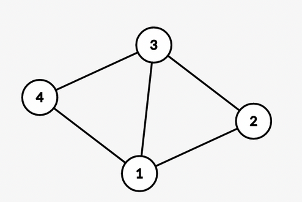
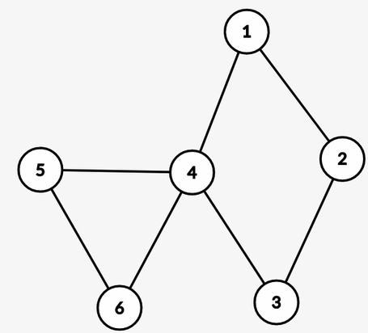
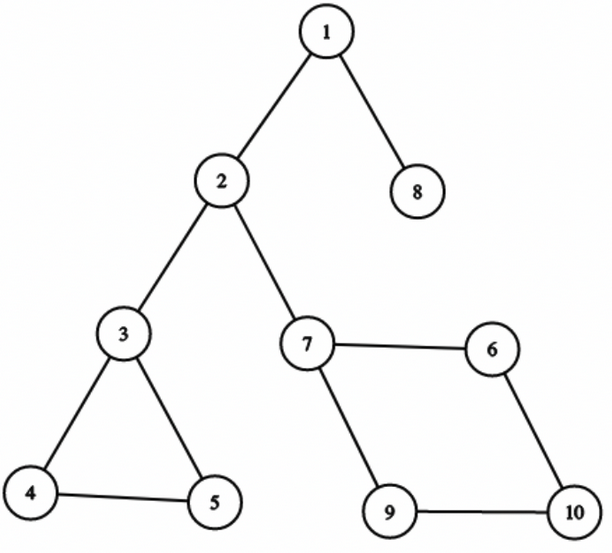
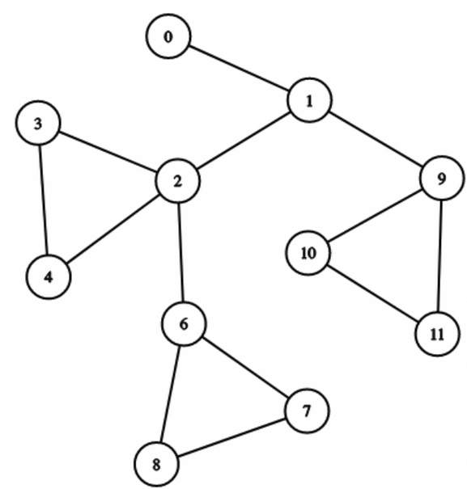
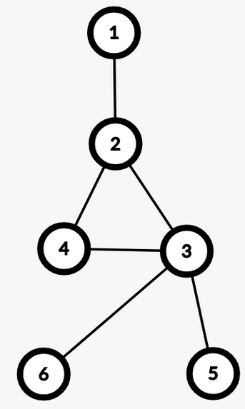
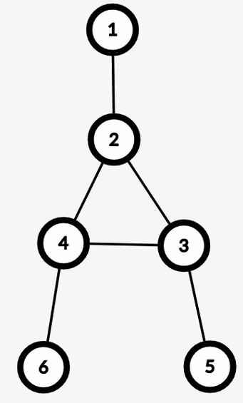
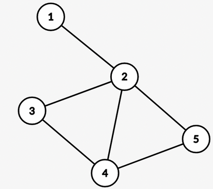
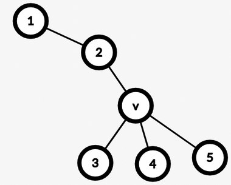

# Tutorial_(en)

We hope you liked the problems! Unfortunately, problem C turned out to be harder than usual. Please read its editorial, we hope you'll find that the intended solution is not that hard.

[1763A - Absolute Maximization](../problems/A._Absolute_Maximization.md "Codeforces Round 840 (Div. 2) and Enigma 2022 - Cybros LNMIIT")
===============================================================================================================================================

Idea: [DreadArceus](https://codeforces.com/profile/DreadArceus "Specialist DreadArceus")  
 Prepared by: [DreadArceus](https://codeforces.com/profile/DreadArceus "Specialist DreadArceus")

 **Hint 1**Which 1s in the binary representation cannot be changed to 0.

 **Hint 2**Similarly, Which 0s in the binary representation cannot be changed to 1.

 **Need more hints?**Considering the last two hints, try to maximize the maximum element and minimize the minimum element.

 **Solution**In the minimum element, we want to make every bit 0 when possible, it won't be possible to set a particular bit to 0 when that bit is set in all the elements of a. Therefore, the minimum value we can achieve after performing the operations is the bitwise AND of all the elements of a.

In the maximum element, we want to make every bit 1 when possible, it won’t be possible to set a particular bit to 1 when that bit is not set in any of the elements of a. Therefore, the maximum value we can achieve after performing the operations is the bitwise OR of all the elements of a.

Therefore the answer is (OR of the array — AND of the array).

Time Complexity: O(n)

[1763B - Incinerate](../problems/B._Incinerate.md "Codeforces Round 840 (Div. 2) and Enigma 2022 - Cybros LNMIIT")
====================================================================================================================================

Idea: [og_](https://codeforces.com/profile/og_ "Pupil og_")  
 Prepared by: [og_](https://codeforces.com/profile/og_ "Pupil og_")

 **Hint 1**What if the array p was sorted?

 **Hint 2**Is it necessary to decrease the health of each monster manually after every attack?

 **Solution 1**Sort the monsters in ascending order of their powers.

Now we iterate through the monsters while maintaining the current attack power and the total damage dealt.

Only the monsters with health greater than the total damage dealt are considered alive, and every time we encounter such a monster it will be the weakest one at the current time, thus we need to attack until the total damage dealt exceeds the current monster's health while lowering our attack power by its power each time.

If we can kill all the monsters in this way, the answer is YES, otherwise it is NO.

Time Complexity: O(nlogn)

 **Sort by power solution**[Code](https://codeforces.com/https://pastebin.com/S2i8FM73) Author: [DreadArceus](https://codeforces.com/profile/DreadArceus "Specialist DreadArceus")

 **Solution 2**Sort the monsters in ascending order of their health.

Now we maintain a count of monsters alive after each attack. This could be achieved by applying upperbound() on h array for each attack. The total damage dealt could be stored and updated in a separate variable.

To find the power of the weakest monster alive, we could just precompute the minimum power of monsters in a suffix array. In other words,

 pi=min(pi,pi+1).Time Complexity: O(nlogn)

 **Sort by health solution**[Code](https://codeforces.com/https://pastebin.com/Jv0K2K5k) Author: [og_](https://codeforces.com/profile/og_ "Pupil og_")

[1763C - Another Array Problem](../problems/C._Another_Array_Problem.md "Codeforces Round 840 (Div. 2) and Enigma 2022 - Cybros LNMIIT")
===============================================================================================================================================

Idea: [.utk.](https://codeforces.com/profile/.utk. "Specialist .utk.")  
 Prepared by: [.utk.](https://codeforces.com/profile/.utk. "Specialist .utk.")

 **Hint 1**What happens when we apply the same operation twice?

 **Hint 2**What about n = 3 ?

 **Solution**Let’s first consider the case for n≥4. The key observation to make here is that we can make all the elements of a subarray al,...ar zero by applying the operation on range [l,r] twice. Then let’s assume the maximum element mx of the array is at an index m>r. We can apply the operation on the range [l,m] and turn all its elements into mx.

Using the above information we can see that to achieve the final array with maximum sum we need to make all the elements in it equal to the maximum element in the array. Regardless of the given array this can be achieved by making the last two elements (n-1,n) zero. Then applying the operation on subarray [m,n] to make all its elements equal to mx. Then making the first two elements (1,2) zero and applying the operation on the whole array making all the elements equal to mx. Thus the maximum sum for the final array will always be n∗mx. (In case m=n−1 or n, we can operate on the left side first to reach the same solution).

For n=2 the maximum final sum would be max(a1+a2,2∗(|a1−a2|)).

For n=3, when the maximum element is present at index 1 or 3 we can make all the elements of the array into mx. When the maximum element is at index 2, we have the following options.

Case 1: We can apply the operation on (1,2), then we can convert all the elements of the array into max(a3,|a2−a1|).

Case 2: We can apply the operation on (2,3), then we can convert all the elements of the array into max(a1,|a2−a3|).

Case 3: We can apply the operation on (1,3) making all the elements in the array |a1−a3|. This is redundant since a2>a1,a3 either case 1 or case 2 will give a larger sum as a2−min(a1,a3)>max(a1,a3)−min(a1,a3).

Now considering case 1, if 3∗max(a3,|a2−a1|)≤a1+a2+a3 the maximum sum possible would be the current sum of the array (see sample 1 and 3). Therefore no operations are required. Similar case for case 2.

So the maximum possible sum for n=3 will be max(3∗a1,3∗a3,3∗|a1−a2|,3∗|a3−a2|,a1+a2+a3).

To avoid doing this casework for n=3, we can see that there are only 3 possible operations -> (1,2) , (2,3), (1,3). We will be required to perform operations (1,2) and (2,3) at most two times. So we can brute force all possible combinations of operations [(1,2),(1,2),(2,3),(2,3),(1,3)] to find the maximum sum.

 **Brute force solution**[186019483](https://codeforces.com/contest/1763/submission/186019483 "Submission 186019483 by satyam343") Author: [satyam343](https://codeforces.com/profile/satyam343 "Candidate Master satyam343")

 **Case work solution**
```cpp
#include <bits/stdc++.h>
using namespace std;
#define int long long
#define ll long long
#define pii pair<ll, ll>
int32_t mod = 1e9 + 7;


void solve()
{
    ll n;
    cin >> n;
    vector<ll> a(n);
    for (auto &i : a)
        cin >> i;
    if (n == 2)
        cout << max({2 * abs(a[0] - a[1]), a[0] + a[1]});
    else if (n == 3)
        cout << max({3 * (abs(a[0] - a[1])), 3 * (abs(a[2] - a[1])), 3 * a[0], 3 * a[2], a[0] + a[1] + a[2]});
    else
    {
        ll mx = 0;
        for (auto i : a)
            mx = max(i, mx);
        cout << n * mx;
    }
    cout<<'n';
}

int32_t main()
{
    ios::sync_with_stdio(false), cin.tie(NULL);
    ll t = 0;
    cin >> t;
    while (t--)
        solve();
}
```
Author: [.utk.](https://codeforces.com/profile/.utk. "Specialist .utk.")

[1763D - Valid Bitonic Permutations](../problems/D._Valid_Bitonic_Permutations.md "Codeforces Round 840 (Div. 2) and Enigma 2022 - Cybros LNMIIT")
====================================================================================================================================================

Idea: [warks](https://codeforces.com/profile/warks "Expert warks")  
 Prepared by: [warks](https://codeforces.com/profile/warks "Expert warks")

 **Hint 1**Can you solve the problem when x<y?

 **Spoiler**When x>y, perform i′=n−j+1, j′=n−i+1, x′=y, and y′=x.

 **Hint 2**Can you solve the problem for a fixed value of k?

 **Spoiler**Iterate over possible values of k. The total count is the sum of the individual counts. 

 **Hint 3**Club the remaining numbers into ranges as follows: [1,x−1], [x+1,y−1], and [y+1,n−1].

 **Solution**For simplicity, if x>y, perform i′=n−j+1, j′=n−i+1, x′=y, and y′=x. Hereafter, the variables i, j, x, and y, will refer to these values. Now, i<j and x<y.

For now, assume that y<n. We shall consider the case where y=n at a later stage.   
 Let us consider solving the problem for fixed k. Valid values for k are [2,i−1], [i+1,j−1], [j+1,n−1].   
 If we think about it, when x<y, k cannot lie in the range [2,i−1]. So, we can discard them as possible values for k.

Let us consider the case where k belongs to [i+1,j−1].   
 The permutation adheres to the following pattern: B1<..<Bi=x<..<Bk=n>..>Bj=y>..>Bn. 

* Numbers to the left of i must lie in the range [1,x−1]. We choose i−1 elements from [1,x−1] and place them to the left of i. There are (x−1i−1) ways to do this. The remaining x−i elements from [1,x−1] lie to the right of j by default.
* Numbers to the right of j must lie in the range [1,x−1] or [x+1,y−1]. Since numbers in the range [1,x−1] have already been placed, therefore, we choose numbers in the range [x+1,y−1], and place them in the n−j−(x−i) remaining positions. There are (y−x−1n−j−(x−i)) ways to do this. The remaining elements in the range [x+1,y−1] lie between i and k by default.
* Numbers between k and j must lie in the range [y+1,n−1]. We choose j−k−1 elements from [y+1,n−1] and place them between k and j. There are (n−y−1j−k−1) ways to do this. Afterwards, the remaining elements in the range lie between i and k by default, and the permutation is full.

 Multiplying the ways for the above three actions, we get that the answer for a fixed k, when between i and j as:   
 (x−1i−1)∗(y−x−1n−j−(x−i))∗(n−y−1j−k−1)Let us consider the case where k belongs to the range [j+1,n−1].   
 The permutation adheres to the following pattern: B1<..<Bi=x<..<Bj=y<..<Bk=n>..>Bn. 

* Similar to above, the numbers to the left of i must lie in the range [1,x−1]. We choose i−1 elements from [1,x−1], and place them to the left of i. The remaining x−i elements from [1,x−1] lie to the right of k by default.
* Numbers between i and j must lie in the range [x+1,y−1]. We choose j−i−1 elements from [x+1,y−1] and place them between i and j. There are (y−x−1j−i−1) ways to do this, and the remaining elements from [x+1,y−1] lie to the right of k by default.
* Numbers between j and k must lie in the range [y+1,n−1]. We choose k−j−1 elements from [y+1,n−1] and place them in these positions. Afterwards, the remaining elements in the range get placed to the right of k by default, and the permutation is full.

 Multiplying the ways for the above three actions, we get the answer for a fixed k, when between j+1, and n−1 as: (x−1i−1)∗(y−x−1j−i−1)∗(n−y−1k−j−1)The answer to the problem is the sum of individual answers for all iterated values of k.   


 ans=(x−1i−1)∗(y−x−1n−j−(x−i))∗∑j−1k=i+1(n−y−1j−k−1) + (x−1i−1)∗(y−x−1j−i−1)∗∑n−1k=j+1(n−y−1k−j−1)Let us now consider the case where y=n.   
 The permutation adheres to the following pattern: B1<..<Bi=x<..<Bj=Bk=n>..>Bn. 

* Again, the numbers to the left of i must lie in the range [1,x−1]. We choose i−1 elements from [1,x−1] and place them to the left of i. The remaining x−i elements from [1,x−1] lie to the right of j (here, k) by default.
* Numbers between i and j must lie in the range [x+1,y−1]. We choose j−i−1 elements form [x+1,y−1] and place them between i and j. The remaining elements from [x+1,y−1] lie to the right of j (here, k) by default, and the permutation is full.

 Multiplying the ways for the above two actions, we get the answer for k=j (y=n) as: (x−1i−1)∗(y−x−1j−i−1)With O(nmax∗log(109+7−2)) precomputation for factorials and their modular inverses, each individual test can be solved as above in O(n). Therefore, the overall complexity of this approach is O(nmax∗log(109+7−2)+t∗n), but the constraints allowed for slower solutions as well.

Bonus: Can you solve the problem when 1≤t,n≤105.

 **Code**
```cpp
#include <iostream>
#include <vector>
using namespace std;

const int MOD = 1000000007;
vector<int> fac;
vector<int> ifac;

int binExp(int base, int exp) {
    base %= MOD;
    int res = 1;
    while (exp > 0) {
        if (exp & 1) {
            res = (int) ((long long) res * base % MOD);
        }
        base = (int) ((long long) base * base % MOD);
        exp >>= 1;
    }
    return res;
}

void precompute(int n) {
    fac.resize(n + 1);
    fac[0] = fac[1] = 1;
    for (int i = 2; i <= n; i++) {
        fac[i] = (int) ((long long) i * fac[i-1] % MOD);
    }

    ifac.resize(n + 1);
    for (int i = 0; i < fac.size(); i++) {
        ifac[i] = binExp(fac[i], MOD - 2);
    }
    return;
}

int nCr(int n, int r) {
    if ((n < 0) || (r < 0) || (r > n)) {
        return 0;
    }
    return (int) ((long long) fac[n] * ifac[r] % MOD * ifac[n - r] % MOD);
}

int countValidBitonicPerm(int n, int i, int j, int x, int y) {
    if (x > y) {
        i = n - i + 1;
        j = n - j + 1;
        swap(i, j);
        swap(x, y);
    }

    int sum = 0;
    for (int k = i + 1; k < j; k++) {
        sum += nCr(n - y - 1, j - k - 1);
        sum %= MOD;
    }
    int count = (int) ((long long) nCr (x - 1, i - 1) * nCr(y - x - 1, n - j - (x - i)) % MOD * sum % MOD);

    sum = 0;
    for (int k = j + 1; k < n; k++) {
        sum += nCr(n - y - 1, k - j - 1);
        sum %= MOD;
    }
    count += (int) ((long long) nCr(x - 1, i - 1) * nCr(y - x - 1, j - i - 1) % MOD * sum % MOD);
    count %= MOD;

    if (y == n) {
        if (j == n) {
            return 0;
        } else {
            return (int) ((long long) nCr(x - 1, i - 1) * nCr(y - x - 1, j - i - 1) % MOD);
        }
    }
    
    return count;
}

int main() {
    const int MAXN = 100;
    precompute(MAXN);

    int testCases;
    cin >> testCases;
    for (int test = 1; test <= testCases; test++) {
        int n, i, j, x, y;
        cin >> n >> i >> j >> x >> y;
        cout << countValidBitonicPerm(n, i, j, x, y) << endl;
    }

    return 0;
}
```
[1763E - Node Pairs](../problems/E._Node_Pairs.md "Codeforces Round 840 (Div. 2) and Enigma 2022 - Cybros LNMIIT")
====================================================================================================================================

Idea: [crimsonred](https://codeforces.com/profile/crimsonred "Expert crimsonred")  
 Prepared by: [...nvm](https://codeforces.com/profile/...nvm "Pupil ...nvm"), [DreadArceus](https://codeforces.com/profile/DreadArceus "Specialist DreadArceus"), [crimsonred](https://codeforces.com/profile/crimsonred "Expert crimsonred")

 **Hint 1**In a directed graph, which nodes are reachable from each other? How many such pairs of nodes exist?

 **Hint 2**Think about a sequence of SCCs.

 **Solution**For two nodes u and v to be reachable from each other, they must lie in the same strongly connected component (SCC). Let's define f(i) as the minimum number of nodes required to construct an i-reachable graph. We can use dynamic programming and calculate f(i) as f(i)=min(f(i—s(s—1)2)+s) over all the valid SCC sizes s for which s(s—1)2≤i, i.e., over those s which have less pairs of the required type than i. Thus, f(p) gives us the minimum number of nodes required to create a p-reachable graph.

In all p-reachable graphs with f(p) nodes, the upper bound on the number of unidirectional pairs of nodes is (f(p)2)−p, because we have exactly p pairs of nodes which are reachable from each other. It is possible to achieve this upper bound using the following construction: let s1,s2,…,sk be any sequence of SCC sizes which agrees with the dp values we calculated earlier. Let the first SCC contain the nodes [1,s1], the second one contain [s1+1,s1+s2], and so on. We add a directed edge from u to v if u<v.

Time Complexity: O(p√p)

 **Code**
```cpp
#include <bits/stdc++.h>
using namespace std;

const int INF = 1e9;

void solve()
{
    int p;
    cin >> p;
 
    vector<int> dp(p + 1, INF);
    dp[0] = 0;
    for (int i = 1; i <= p; ++i)
        for (int s = 1; (s * (s - 1)) / 2 <= i; ++s)
            dp[i] = min(dp[i], dp[i - (s * (s - 1)) / 2] + s);

    cout << dp[p] << ' ' << ((long long) dp[p] * (dp[p] - 1)) / 2 - p << 'n';
}
 
int main()
{
    solve();
    return 0;
}
```
[1763F - Edge Queries](../problems/F._Edge_Queries.md "Codeforces Round 840 (Div. 2) and Enigma 2022 - Cybros LNMIIT")
======================================================================================================================================

Idea: [...nvm](https://codeforces.com/profile/...nvm "Pupil ...nvm"), [DreadArceus](https://codeforces.com/profile/DreadArceus "Specialist DreadArceus")  
 Prepared by: [...nvm](https://codeforces.com/profile/...nvm "Pupil ...nvm"), [DreadArceus](https://codeforces.com/profile/DreadArceus "Specialist DreadArceus")

 **Hint 1**What kind of graph meets the conditions given in the statement?

 **Answer**A graph with bridges connecting components with a hamiltonian cycle.

 **Hint 2**Which edges will never be counted in answer to any query?

 **Answer**Of course, the bridges.

 **Hint 3**Restructure the graph to be able to answer queries.

 **Hint 4**query(u,v) on a tree can be solved efficiently via Lowest Common Ancestor (LCA).

 **Solution**First, let us see examples of graphs that are valid or invalid according to the statement.

 **Valid Graph Example**

In this graph, for node 4, the longest simple cycle is 4→1→2→3→4.

S4=1,2,3,4

All simple cycles from node 4 are 4→1→2→3→4 and 4→1→3→4.

C4=1,2,3,4

So, S4=C4. Similarly, Su=Cu for all u.

A tree of such components is also a valid graph!

 **Invalid Graph Example**

Here, S4=1,2,3,4 and C4=1,2,3,4,5,6. 

So, S4≠C4

The queries ask us to count all non-bridge edges in any simple path from u to v.

There are many ways to proceed with the solution. We will first go into a simple one that gives more insight into the problem.

We can see our graph as a tree of BiConnected Components (BCCs). 

* The edges of the tree are all bridges.

 Let’s define a few things before continuing further. 

* The first node of a BCC that is visited in the DFS tree will represent that BCC.
* Let rep[u] be the representative of the BCC of node u.
* cnt[u] be the number of edges in the BCC of u.
* Root node of our tree of BCCs is root.
* lca(u,v) is the lowest common ancestor of u and v.

With all that set, let us now look at the DFS tree.

We can build an array dp to store the answer to query(root,u), for all u, and to answer queries, we can use LCA.

In a typical LCA use case, query(u, v) would be dp[u]+dp[v]−2∗dp[lca(u,v)], But is that the case here?

Let us bring attention to a few things.

 **First**Is u=rep[u]?

 **Why?**If u=rep[u], u is the first vertex of its BCC in the DFS tree. Therefore all the edges in the BCC of u will not lie in any simple path from u to root.

Example:



In this graph, Let's say root is 1. 

See that, dp[3] should be 0, and dp[4] should be 3. They are in the same BCC, but 3 is the topmost node, that is, the representative.

Let p be the parent of u.

So, to calculate dp[u],

dp[u]={dp[p]if rep[u]=u,dp[rep[u]]+cnt[u]otherwise

 **Second**Passing through the representative of a BCC.



Let's say we have a graph of this type, 

Let's choose our root to be 0 and look at node 6.

There will be no simple path from root to 6 that uses the edges of the BCC of node 2.

Therefore, dp[6] should not include edges from the BCC of node 2. This is already dealt with by our earlier definition of dp[u]!

 **Third**The cases of query(u,v).

Now, query(u,v) depends upon how u and v are connected in the graph. These are some significant cases.

**Case 1:** rep[u]=rep[v]

That is, u and v are part of the same BCC. Therefore, the answer to query(u,v) is just cnt[u].

Then, we have two cases concerning lca(u,v).

**Case 2.1:** We must visit only one node in the BCC of lca(u,v).

**Case 2.2:** We must visit at least two nodes in the BCC of lca(u,v).

Example: u=6,v=5

 

In 2.1, in any simple path from u to v we won’t have any edge from the BCC of lca(u,v). Therefore, we don’t need to include cnt[lca(u,v)] in the answer. While in 2.2, those edges will be included.

In conclusion, in this setup, we need to determine how the simple paths from u to v cross through the BCC of lca(u,v), then the queries will be answered.

 **How to distinguish?**We can use binary lifting to determine which node is the lowest ancestor of u in the DFS tree that is a part of the BCC of lca(u,v). Similarly, we can find that node for v.

We can judge which of the above cases any query(u,v) is based on these two nodes.

There are other ways to distinguish, including using a link-cut tree.

 **Or make a better graph to deal with this…**We can create a smart graph to make it so that query(u,v) is dp[u]+dp[v]−2∗dp[lca(u,v)]+val[lca(u,v)], with no casework involved.

We will create virtual nodes representing each BCC. Remove all non-bridges from the graph, and connect all nodes of a BCC to its virtual node.

For example:

 --> 

Here v is the virtual node, and all the nodes present in BCC of 2 are directly connected to the BCC's virtual node. 

Let us define the value of each actual node to be 0 and every virtual node to be the count of edges of its BCC. Build an array dp that stores the sum of the values of all vertices from root to the current node.

You can go back and see how each of the cases would be dealt with by this new graph.

