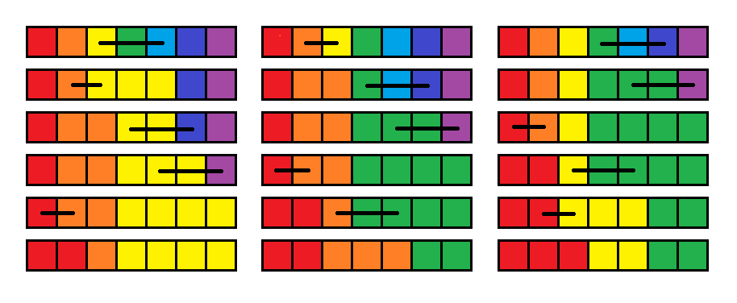

<h1 style='text-align: center;'> H. Doremy's Paint 2</h1>

<h5 style='text-align: center;'>time limit per test: 4 seconds</h5>
<h5 style='text-align: center;'>memory limit per test: 256 megabytes</h5>

Doremy has $n$ buckets of paint which is represented by an array $a$ of length $n$. Bucket $i$ contains paint with color $a_i$. Initially, $a_i=i$.

Doremy has $m$ segments $[l_i,r_i]$ ($1 \le l_i \le r_i \le n$). Each segment describes an operation. Operation $i$ is performed as follows: 

* For each $j$ such that $l_i < j \leq r_i$, set $a_j := a_{l_i}$.

Doremy also selects an integer $k$. She wants to know for each integer $x$ from $0$ to $m-1$, the number of distinct colors in the array after performing operations $x \bmod m +1, (x+1) \bmod m + 1, \ldots, (x+k-1) \bmod m +1$. Can you help her calculate these values? 
## Note

 that for each $x$ individually we start from the initial array and perform only the given $k$ operations in the given order.

#### Input

The first line of input contains three integers $n$, $m$, and $k$ ($1\le n,m\le 2\cdot 10^5$, $1 \le k \le m$) — the length of the array $a$, the total number of operations, and the integer that Doremy selects.

The $i$-th line of the following $m$ lines contains two integers $l_i$, $r_i$ ($1\le l_i\le r_i\le n$) — the bounds of the $i$-th segment.

#### Output

#### Output

 $m$ integers. The $(x+1)$-th integer should be the number of distinct colors in the array if we start from the initial array and perform operations $x \bmod m +1, (x+1) \bmod m + 1, \ldots, (x+k-1) \bmod m +1$.

## Examples

#### Input


```text
7 5 5
3 5
2 3
4 6
5 7
1 2
```
#### Output


```text
3 3 3 3 2 
```
#### Input


```text
10 9 4
1 1
2 3
3 4
7 9
6 8
5 7
2 4
9 10
1 3
```
#### Output


```text
6 6 7 6 5 5 7 7 7 
```
## Note

In the first test case, the picture below shows the resulting array for the values of $x=0,1,2$ respectively.




#### Tags 

#3400 #NOT OK #data_structures 

## Blogs
- [All Contest Problems](../Codeforces_Global_Round_24.md)
- [Announcement (en)](../blogs/Announcement_(en).md)
- [Tutorial (en)](../blogs/Tutorial_(en).md)
