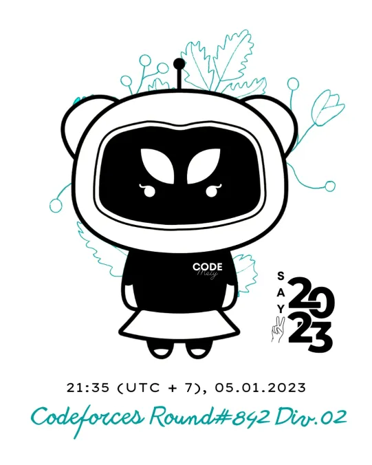

# Announcement_(en)

Hi Codeforces!
==============

[Igorfardoc](https://codeforces.com/profile/Igorfardoc "Specialist Igorfardoc"), [Vladithur](https://codeforces.com/profile/Vladithur "Specialist Vladithur"), [Alexdat2000](https://codeforces.com/profile/Alexdat2000 "Specialist Alexdat2000"), [GlowCheese](https://codeforces.com/profile/GlowCheese "Specialist GlowCheese"), [DeMen100ns](https://codeforces.com/profile/DeMen100ns "Specialist DeMen100ns"), [SPyofgame](https://codeforces.com/profile/SPyofgame "Specialist SPyofgame") and me (spelling "thanh-chau-n-s-2") are delighted to invite you to participate in [Codeforces Round #842 (Div. 2)](https://codeforces.com/contests/1768). **This round will be rated for all participants with a rating lower than 2100.**

 * Start time: [Thursday, January 5, 2023 at 20:35UTC+6](https://codeforces.com/https://www.timeanddate.com/worldclock/fixedtime.html?day=5&month=1&year=2023&hour=17&min=35&sec=0&p1=166)
* Duration: **120 minutes**.
* Number of tasks: **6**.

 **This contest is brought to you by*** [PTIT](https://codeforces.com/https://www.facebook.com/HocvienPTIT), my university.
* [Code Mely](https://codeforces.com/https://discord.gg/codemely), a Vietnamese fanpage for Computer Science.
Special thanks to:

 * [errorgorn](https://codeforces.com/profile/errorgorn "Specialist errorgorn") for his wonderful coordination.
* [Vladithur](https://codeforces.com/profile/Vladithur "Specialist Vladithur") for providing wonderful problems.
* [Alexdat2000](https://codeforces.com/profile/Alexdat2000 "Specialist Alexdat2000") for testing and translating our statements.
* Vip testers: [Valenz](https://codeforces.com/profile/Valenz "Specialist Valenz"), who spotted some critical issues in the problemset.
* [Alexdat2000](https://codeforces.com/profile/Alexdat2000 "Specialist Alexdat2000"), [Igorfardoc](https://codeforces.com/profile/Igorfardoc "Specialist Igorfardoc"), [SPyofgame](https://codeforces.com/profile/SPyofgame "Specialist SPyofgame"), [GlowCheese](https://codeforces.com/profile/GlowCheese "Specialist GlowCheese"), [DeMen100ns](https://codeforces.com/profile/DeMen100ns "Specialist DeMen100ns") for helping us in some different phases of preparing the problem set.
* All-time mighty ~~red~~ cyan testers: [gyh20](https://codeforces.com/profile/gyh20 "Specialist gyh20"), [Chenyu_Qiu](https://codeforces.com/profile/Chenyu_Qiu "Specialist Chenyu_Qiu"), [xiaoziya](https://codeforces.com/profile/xiaoziya "Specialist xiaoyiza"), [feecIe6418](https://codeforces.com/profile/feecIe6418 "Specialist feecIe6418"), [Little09](https://codeforces.com/profile/Little09 "Specialist Little09"), [ShmilyTY](https://codeforces.com/profile/ShmilyTY "Specialist ShmilyTY"), [thenymphsofdelphi](https://codeforces.com/profile/thenymphsofdelphi "Specialist thenymphsofdelphi"), [neko_nyaaaaaaaaaaaaaaaaa](https://codeforces.com/profile/neko_nyaaaaaaaaaaaaaaaaa "Specialist neko_nyaaaaaaaaaaaaaaaaa"), [LastDance](https://codeforces.com/profile/LastDance "Specialist LastDance"), [tfg](https://codeforces.com/profile/tfg "Specialist tfg"), [Andreasyan](https://codeforces.com/profile/Andreasyan "Specialist Andreasyan"), [generic_placeholder_name](https://codeforces.com/profile/generic_placeholder_name "Specialist generic_placeholder_name"), [Mangooste](https://codeforces.com/profile/Mangooste "Specialist Mangooste"), [BucketPotato](https://codeforces.com/profile/BucketPotato "Specialist BucketPotato").
* Other testers: [darkkcyan](https://codeforces.com/profile/darkkcyan "Specialist darkkcyan"), [maomao90](https://codeforces.com/profile/maomao90 "Specialist maomao90"), [tibinyte](https://codeforces.com/profile/tibinyte "Specialist tibinyte") (absolutely ~~fake~~ true color), [Gheal](https://codeforces.com/profile/Gheal "Specialist Gheal"), [bugdone](https://codeforces.com/profile/bugdone "Specialist bugdone"), [valeriu](https://codeforces.com/profile/valeriu "Specialist valeriu"), [satyam343](https://codeforces.com/profile/satyam343 "Specialist satyam343"), [alecs](https://codeforces.com/profile/alecs "Specialist alecs"), [1DWalker](https://codeforces.com/profile/1DWalker "Specialist 1DWalker"), [aineee](https://codeforces.com/profile/aineee "Specialist aineee"), [nyagami](https://codeforces.com/profile/nyagami "Specialist nyagami"), [vangtrangtan](https://codeforces.com/profile/vangtrangtan "Specialist vangtrangtan"), [hydroshiba](https://codeforces.com/profile/hydroshiba "Specialist hydroshiba"), [E404_Not_Found](https://codeforces.com/profile/E404_Not_Found "Specialist E404_Not_Found"), [DMCS](https://codeforces.com/profile/DMCS "Specialist DMCS"), [Duy_e](https://codeforces.com/profile/Duy_e "Specialist Duy_e"), [LetterC67](https://codeforces.com/profile/LetterC67 "Specialist LetterC67"), [Ignr_h31](https://codeforces.com/profile/Ignr_h31 "Specialist Ignr_h31"), [TrendBattles](https://codeforces.com/profile/TrendBattles "Specialist TrendBattles"), [kodomotachi](https://codeforces.com/profile/kodomotachi "Specialist kodomotachi").
* Other people for some reason cannot participate officially in this round: [QuangBuiCPP](https://codeforces.com/profile/QuangBuiCPP "Specialist QuangBuiCPP"), [LeCaToX](https://codeforces.com/profile/LeCaToX "Specialist LeCaToX"), [dinhsangBKA](https://codeforces.com/profile/dinhsangBKA "Specialist dinhsangBKA"), [Hungconmk](https://codeforces.com/profile/Hungconmk "Specialist Hungconmk"), [antontrygubO_o](https://codeforces.com/profile/antontrygubO_o "Specialist antontrygubO_o"), [74TrAkToR](https://codeforces.com/profile/74TrAkToR "Specialist 74TrAkToR"), [ShuiLaoshi](https://codeforces.com/profile/ShuiLaoshi "Specialist ShuiLaoshi"), [Qingyu](https://codeforces.com/profile/Qingyu "Specialist Qingyu"), [alexxela12345](https://codeforces.com/profile/alexxela12345 "Specialist alexxela12345"), [_FireGhost_](https://codeforces.com/profile/_FireGhost_ "Specialist _FireGhost_").
* [MikeMirzayanov](https://codeforces.com/profile/MikeMirzayanov "Headquarters, MikeMirzayanov") for amazing platforms Codeforces and Polygon.
* Last but not least, [you](https://codeforces.com/profile/ "
Legendary Grandmaster you") for participating and then being rage while implementing some 200 lines of code.

Edit: there will be 2 packages for two participants in Vietnam, the highest score and the luckiest. You have to set your region to Vietnam to be qualified.

The score distribution is 500−1000−1500−1750−2250−3250.

Hope to see you in the final standings!

**Editorial is [out](Tutorial_(en).md "Editorial").**

**Congratulations to the winners:**

 

|  | Div.1+2 | Div.2 |
| --- | --- | --- |
| **1** | [arvindf232](https://codeforces.com/profile/arvindf232 "International Grandmaster arvindf232") | [drizzlo](https://codeforces.com/profile/drizzlo "Newbie drizzlo") |
| **2** | [Hyperbolic](https://codeforces.com/profile/Hyperbolic "Grandmaster Hyperbolic") | [jiangly_fan_fan_fan_fan](https://codeforces.com/profile/jiangly_fan_fan_fan_fan "Newbie jiangly_fan_fan_fan_fan") |
| **3** | [drizzlo](https://codeforces.com/profile/drizzlo "Newbie drizzlo") | [BedzieMagikZa2Lata](https://codeforces.com/profile/BedzieMagikZa2Lata "Specialist BedzieMagikZa2Lata") |
| **4** | [jiangly](https://codeforces.com/profile/jiangly "Legendary Grandmaster jiangly") | [BeautifulChicken](https://codeforces.com/profile/BeautifulChicken "Unrated, BeautifulChicken") |
| **5** | [Um_nik](https://codeforces.com/profile/Um_nik "Legendary Grandmaster Um_nik") | [AE-3803](https://codeforces.com/profile/AE-3803 "Unrated, AE-3803") |

**And the first solver for each problem:**

 

|  | A | B | C | D | E | F |
| --- | --- | --- | --- | --- | --- | --- |
| **Div.1+2** | [dapingguo8](https://codeforces.com/profile/dapingguo8 "Master dapingguo8") | [tourist](https://codeforces.com/profile/tourist "Legendary Grandmaster tourist") | [youknowiknowyouknow](https://codeforces.com/profile/youknowiknowyouknow "Newbie youknowiknowyouknow") | [A_G](https://codeforces.com/profile/A_G "International Grandmaster A_G") | [nok0](https://codeforces.com/profile/nok0 "Grandmaster nok0") | [jeroenodb](https://codeforces.com/profile/jeroenodb "International Grandmaster jeroenodb") |
| **Div.2** | [celestialcoder](https://codeforces.com/profile/celestialcoder "Expert celestialcoder") | [1024mb](https://codeforces.com/profile/1024mb "Candidate Master 1024mb") | [youknowiknowyouknow](https://codeforces.com/profile/youknowiknowyouknow "Newbie youknowiknowyouknow") | [MIOC69](https://codeforces.com/profile/MIOC69 "Expert MIOC69") | [cmk666](https://codeforces.com/profile/cmk666 "Expert cmk666") | [drizzlo](https://codeforces.com/profile/drizzlo "Newbie drizzlo") |

