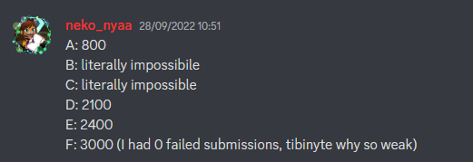
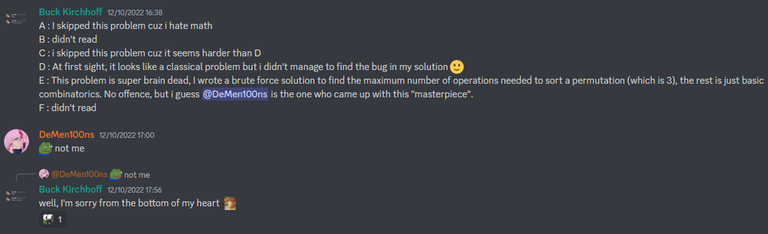
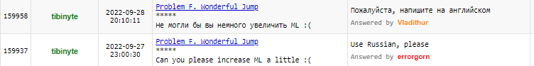

# Tutorial_(en)

Hope you liked the problems!

 **(from thanhchauns2) Before the round starts**This is my second contest on Codeforces, inspiring coordination has been done for the last several months, cannot wait until the third round is released!

 **Testers' predictions**

| Tester | A | B | C | D | E | F |
| --- | --- | --- | --- | --- | --- | --- |
| [xiaoziya](https://codeforces.com/profile/xiaoziya "International Grandmaster xiaoziya") | 900 | 1000 | 1400 | 1800 | 2100 | 3000 |
| [feecle6418](https://codeforces.com/profile/feecle6418 "Grandmaster feecle6418") | 900 | 1200 | 1400 | 1700 | 2200 | 2900 |
| [valeriu](https://codeforces.com/profile/valeriu "Candidate Master valeriu") | 800 | 1100 | 1550 | 1900 | 2200 | - |
| [LastDance](https://codeforces.com/profile/LastDance "Grandmaster LastDance") | 800 | 1200 | - | 2000 | 2200 | - |
| [neko_nyaaaaaaaaaaaaaaaaa](https://codeforces.com/profile/neko_nyaaaaaaaaaaaaaaaaa "Grandmaster neko_nyaaaaaaaaaaaaaaaaa") | 800 | - | - | 2100 | 2400 | 3000 |
| [tibinyte](https://codeforces.com/profile/tibinyte "Newbie tibinyte") | 800 | 1100 | 1550 | 1800 | 2100 | 2550 |

 **Some moments in the rating section****From neko_nyaaaaaaaaaaaaaaaaa**

 **From hoangquan05112002**

 **From _Astraea_**

 **From Valenz**

 **From TrendBattles**

 **Some comments from testers and authors****From hoangquan05112002**

 **From cadmiumky**

 **From shiwei**

 **From DMCS and DeMen100ns**

 **tfg discussing problem F**  

 **From feecle6418**

 **tibinyte and fextivity about problem A**

 **neko_nyaa and errorgorn about problem A**

 **From hoangquan05112002 again**

 **From darkkcyan**

 **From QuangBuiCP**

 **From tibinyte, the Russian sentence is `use English please`**

 **From errorgorn**

 **From SPyofgame**

[1768A - Greatest Convex](../problems/A._Greatest_Convex.md "Codeforces Round 842 (Div. 2)")

Author: [thanhchauns2](https://codeforces.com/profile/thanhchauns2 "Candidate Master thanhchauns2")

 **Hints****Hint 1**Try to brute force for k<50. Do you see anything suspicious?

 **Hint 2**Now try to brute force from k−1 to 0 for large numbers.

 **Tutorial**
### [1768A- Greatest Convex](../problems/A._Greatest_Convex.md)

Is x=k−1 always suitable?

The answer is yes, as x!+(x−1)!=(x−1)!×(x+1)=((k−1)−1)!×((k−1)+1)=(k−2)!×(k), which is clearly a multiple of k.

Therefore, x=k−1 is the answer.

Time complexity: O(1)

 **Solution**
```cpp
answer = [print(int(input()) - 1) for testcase in range(int(input()))]
```
 **Feedback*** Good problem 


[*384*](https://codeforces.com/data/like?action=like "I like this")
* Average problem 

 
[*230*](https://codeforces.com/data/like?action=like "I like this")
* Bad problem 

 
[*184*](https://codeforces.com/data/like?action=like "I like this")
[1768B - Quick Sort](../problems/B._Quick_Sort.md "Codeforces Round 842 (Div. 2)")

Author: [Vladithur](https://codeforces.com/profile/Vladithur "Master Vladithur") Preparation: [Vladithur](https://codeforces.com/profile/Vladithur "Master Vladithur") and [Alexdat2000](https://codeforces.com/profile/Alexdat2000 "Master Alexdat2000")

 **Hints****Hint 1**Try to have the last k+1 numbers sorted.

 **Hint 2**Fix some set of numbers (not necessary sorted) of size w and don't choose them in the operation. Try to have the last n−w numbers sorted.

 **Hint 3**Fix the set of numbers 1,2,3,…

 **Tutorial**
### [1768B - Quick Sort](../problems/B._Quick_Sort.md "Codeforces Round 842 (Div. 2)")

Suppose we can make operations so that x elements do not participate in any operation. Then these x elements in the final array will end up at the beginning in the order in which they were in the initial array. And since this x must be maximized to minimize the number of operations, we need to find the maximal subsequence of the numbers [1,2,…]. Let this sequence have w numbers, then the answer is ⌈n−wk⌉=⌊n−w+k−1k⌋.

 **Solution**
```cpp
#include <bits/stdc++.h>

#define all(x) (x).begin(), (x).end()
#define allr(x) (x).rbegin(), (x).rend()
#define gsize(x) (int)((x).size())

const char nl = 'n';
typedef long long ll;
typedef long double ld;

using namespace std;

void solve() {
    int n, k;
    cin >> n >> k;
    vector<int> p(n);
    for (int i = 0; i < n; i++) cin >> p[i];
    
    int c_v = 1;
    for (int i = 0; i < n; i++) {
        if (p[i] == c_v) c_v++;
    }
    
    cout << (n  - c_v + k) / k  << nl;
}

int main() {
	ios::sync_with_stdio(0); cin.tie(0);
	
	int T;
	cin >> T;
	while (T--) solve();
}

```
 **Feedback*** Good problem 

 
[*685*](https://codeforces.com/data/like?action=like "I like this")
* Average problem 

 
[*57*](https://codeforces.com/data/like?action=like "I like this")
* Bad problem 

 
[*97*](https://codeforces.com/data/like?action=like "I like this")
[1768C - Elemental Decompress](../problems/C._Elemental_Decompress.md "Codeforces Round 842 (Div. 2)")

Author: [thanhchauns2](https://codeforces.com/profile/thanhchauns2 "Candidate Master thanhchauns2")

 **Hints****Hint 1**How many times a unique number can appear in the array a?

 **Hint 2**Can there be two numbers 1 in a? What is the conclusion?

 **Hint 3**If you sort the array, which rules should the new array satisfy? Given the array [1,2,2], is there any answer for this case?

 **Hint 4**Which element should you construct first?

 **Tutorial**
### [1768C- Elemental Decompress](../problems/C._Elemental_Decompress.md)

Two cases produce no answers:

 * One element appears more than twice in a.
* After sorting, there is some index that a[i]<i (1-indexed).

 **Proof**Consider there is some index that a[i]<i, then both p[i]<i and q[i]<i must satisfy. This is also true for the first i−1 index, so the numbers that are smaller than i in both p and q are (i−1)×2+2=i∗2. This is a contradiction.

Otherwise, solutions always exist. One method is to constructively attach each element in a to p or q:

 * Traverse from the biggest element to the smallest in a, if that number haven't appeared in p then attach it to p, otherwise attach it to q.
* Traverse from the biggest element to the smallest in a again, if we attached it to p, find the biggest number that did not appear in q and attach to q, vice versa.

A naive solution requires the O(n2) method to solve. We can reduce to O(nlogn) by sorting elements in a as pairs `<element, index>`.

Time complexity: O(nlog(n))

 **Solution**
```cpp
#include <bits/stdc++.h>

using namespace std;

const int N = 200005;
int n;
int a[N], b[N], c[N], ra[N], rb[N];

void out()
{
	for (int i = 0; i < n; i++)
	{
		cout << a[i] << ' ';
	}
	cout << 'n';
	
	for (int i = 0; i < n; i++)
	{
		cout << b[i] << ' ';
	}
	cout << 'n';
}

void solve()
{
	cin >> n;
	vector<pair<int, int> > V;
	for (int i = 0; i < n; i++)
	{
		cin >> c[i];
		a[i] = b[i] = 0;
		ra[i + 1] = rb[i + 1] = 1;
		V.push_back(make_pair(c[i], i));
	}
	sort(V.rbegin(), V.rend());
	
	for (int i = 0; i < n; i++)
	{
		int k = V[i].second;
		if (ra[c[k]] == 1) a[k] = c[k], ra[c[k]]--;
		else b[k] = c[k], rb[c[k]]--;
	}
	
	int r1 = n, r2 = n;
	for (int i = 0; i < n; i++)
	{
		int k = V[i].second;
		if (a[k] == 0)
		{
			while (ra[r1] == 0) r1--;
			ra[r1]--;
			if (r1 > b[k])
			{
			    cout << "NO" << 'n';
			    return;
			}
			a[k] = r1--;
		}
		else
		{
			while (rb[r2] == 0) r2--;
			rb[r2]--;
			if (r2 > a[k])
			{
			    cout << "NO" << 'n';
			    return;
			}
			b[k] = r2--;
		}
	}
	for (int i = 1; i <= n; i++)
	{
		if (ra[i] != 0 || rb[i] != 0)
		{
			cout << "NO" << 'n';
			return;
		}
	}
	cout << "YES" << 'n';
	out();
}

int main(int argc, char* argv[])
{
	ios_base::sync_with_stdio(false); cin.tie(0); cout.tie(0);
	int t;
	cin >> t;
	while(t--)
		solve();
}
```
 **Yet another better solution**There is actually a O(n) solution to this problem.

 **Fresh meme from SPyofgame to the intended solution of the author**

 **Step 1**If there are at least k>3 positions i1,i2,…,ik that a[i1]=a[i2]=…=a[ik] then there is no solution.

 **Proof**Since we need the condition a[i]=max(p[i],q[i]), hence p[i]=a[i] or/and q[i]=a[i].

If there are already p[i1]=a[i1] and q[i2]=a[i2] then we don't have another number equal to a[ik] because p[] and q[] are two permutations (each number must appear exactly **once**).

 **Approach**
```cpp
    /// Storing position of each a[i]
    vector<vector<int> > b(n + 1);
    for (int i = 1; i <= n; ++i) {
        b[a[i]].push_back(i);

        /// max(p[i], q[i]) = a[i] so either p[i] = a[i] or/and q[i] = a[i]
        /// so if the number appear the third time or more, then "NO"
        if (b[a[i]].size() >= 3) {
            cout << "NOn";
            return 0;
        }
    }
```
 **Step 2**Since we have the max() function, we need to use the larger value firsts.

 **Proof**If we iterate from the smallest value to the top, there will be scenarios where all the remaining positions i will result in max(p[i],q[i])≥a[i] because you don't have enough smaller integers.

 **Approach**So for each x=n→1 (iterating from the largest element to the smallest element), we check for each position i that ai=x, then assign p[i]:=a[i] if a[i] didn't appear in permutation p[], otherwise assign q[i]:=a[i].

 
```cpp
    /// Initialize permutation p[1..n], q[1..n]
    vector<int> p(n + 1, -1), q(n + 1, -1);

    /// Initialize permutation position, fp[p[i]] = i, fq[q[i]] = i
    vector<int> fp(n + 1, -1), fq(n + 1, -1);
    for (int x = n; x >= 1; --x) {
        for (int i : b[x]) {
            /// Because of max(), we must save up the smaller value
            /// So we assign p[i] or q[i] by x, one by one from x large -> small
                 if (fp[x] == -1) p[fp[x] = i] = x;
            else if (fq[x] == -1) q[fq[x] = i] = x;
        }
    }
```
 **Step 3**We fill the remaining integers that wasn't used, from the largest to the smallest.

 **Approach**We use vp as the largest integer not used in permutation p[1..n].

We use vq as the largest integer not used in permutation q[1..n].

Then for each of the value x=n→1, we assign to p[i],q[i] that was not used.

 
```cpp
    for (int x = n, vp = n, vq = n; x >= 1; --x) {
        for (int i : b[x]) {
            /// Assign the remaining integers
            while (fp[vp] != -1) --vp;
            while (fq[vq] != -1) --vq;
            if (p[i] == -1 && vp > 0) p[fp[vp] = i] = vp;
            if (q[i] == -1 && vq > 0) q[fq[vq] = i] = vq;
        }
    }
```
 **Step 4**Check if the permutation p[] and q[] satisfied the solution, if it didnt then output "NO", otherwise output "YES" and the two permutations: p[1..n] and q[1..n].

 **Approach**Just iterate through each element as normal.

 
```cpp
    for (int i = 1; i <= n; ++i) {
        if (max(p[i], q[i]) != a[i]) {
            /// Statement condition is not satisfied
            cout << "NOn";
            return 0;
        }
    }

    /// Output the answer
    cout << "YESn";
    for (int i = 1; i <= n; ++i) cout << p[i] << " "; cout << "n";
    for (int i = 1; i <= n; ++i) cout << q[i] << " "; cout << "n";
```
 **Bonus**There is also another way that you can skip testing if max(p[i],q[i])=a[i]) is correct.

But the proof is a bit harder to understand, so I prefer using this code instead.

 **Full Code**
```cpp
#include <iostream>
#include <vector>

using namespace std;

int query()
{
    /// Input number of element
    int n;
    cin >> n;

    /// Input the array a[1..n]
    vector<int> a(n + 1);
    for (int i = 1; i <= n; ++i)
        cin >> a[i];

    /// Storing position of each a[i]
    vector<vector<int> > b(n + 1);
    for (int i = 1; i <= n; ++i) {
        b[a[i]].push_back(i);

        /// max(p[i], q[i]) = a[i] so either p[i] = a[i] or/and q[i] = a[i]
        /// so if the number appear the third time or more, then "NO"
        if (b[a[i]].size() >= 3) {
            cout << "NOn";
            return 0;
        }
    }

    /// Initialize permutation p[1..n], q[1..n]
    vector<int> p(n + 1, -1), q(n + 1, -1);

    /// Initialize permutation position, fp[p[i]] = i, fq[q[i]] = i
    vector<int> fp(n + 1, -1), fq(n + 1, -1);
    for (int x = n; x >= 1; --x) {
        for (int i : b[x]) {
            /// Because of max(), we must save up the larger value
            /// So we assign p[i] or q[i] by x, one by one from x large -> small
                 if (fp[x] == -1) p[fp[x] = i] = x;
            else if (fq[x] == -1) q[fq[x] = i] = x;
        }
    }

    for (int x = n, vp = n, vq = n; x >= 1; --x) {
        for (int i : b[x]) {
            /// Assign the remaining integers
            while (fp[vp] != -1) --vp;
            while (fq[vq] != -1) --vq;
            if (p[i] == -1 && vp > 0) p[fp[vp] = i] = vp;
            if (q[i] == -1 && vq > 0) q[fq[vq] = i] = vq;
        }
    }

    for (int i = 1; i <= n; ++i) {
        if (max(p[i], q[i]) != a[i]) {
            /// Statement condition is not satisfied
            cout << "NOn";
            return 0;
        }
    }

    /// Output the answer
    cout << "YESn";
    for (int i = 1; i <= n; ++i) cout << p[i] << " "; cout << "n";
    for (int i = 1; i <= n; ++i) cout << q[i] << " "; cout << "n";
    return 0;
}


signed main()
{
    ios::sync_with_stdio(NULL);
    cin.tie(NULL);


    int q = 1; /// If there is no multiquery
    cin >> q;  /// then comment this

    while (q-->0)
    {
        /// For each query
        query();


    }


    return 0;
}
```
 **Feedback*** I reached O(nlogn) solution. 

 
[*159*](https://codeforces.com/data/like?action=like "I like this")
* I reached O(n) solution. 

 
[*91*](https://codeforces.com/data/like?action=like "I like this")
 **Feedback*** Good problem 

 
[*643*](https://codeforces.com/data/like?action=like "I like this")
* Average problem 

 
[*63*](https://codeforces.com/data/like?action=like "I like this")
* Bad problem 

 
[*131*](https://codeforces.com/data/like?action=like "I like this")
[1768D - Lucky Permutation](../problems/D._Lucky_Permutation.md "Codeforces Round 842 (Div. 2)")

Author: [Vladithur](https://codeforces.com/profile/Vladithur "Master Vladithur") Preparation: [Vladithur](https://codeforces.com/profile/Vladithur "Master Vladithur") and [Alexdat2000](https://codeforces.com/profile/Alexdat2000 "Master Alexdat2000")

 **Hints****Hint 1**There are n−1 permutations of length n that have exactly one inversion in them.

 **Hint 2**This problem is similar to finding the minimum number of swaps needed to sort a permutation.

 **Hint 3**Try looking at the permutation like a graph.

 **Hint 4**Try to find the number of cycles in each of the n−1 graphs.

 **Tutorial**
### [1768D - Lucky Permutation](../problems/D._Lucky_Permutation.md "Codeforces Round 842 (Div. 2)")

For some fixed n, there are n−1 permutations that have exactly 1 inversion in them (the inversion is colored):

* 2,1,3,4,…,n−1,n
* 1,3,2,4,…,n−1,n
* 1,2,4,3,…,n−1,n...
* 1,2,3,4,…,n,n−1

Let's build a directed graph with n vertices where the i-th vertex has an outgoing edge i→pi. It is easy to see that the graph is divided up into cycles of the form i→pi→ppi→pppi→…→i.

Let cycles be the number of cycles in this graph. It is a well know fact that n−cycles is the minimum number of swaps needed to get the permutation 1,2,3,…,n from our initial one (in other words, to sort it). 

Suppose we now want to get the k-th permutation from the list above. Let x and y be such that px=k and py=k+1. 

Let us remove the edges x→k and y→k+1 from the graph and instead add the edges x→k+1 and y→k. Let cycles′ be the number of cycles in this new graph. The minimum number of swaps needed to get the k-th permutation in the list is equal to n−cycles′. 

Turns out that we can easily calculate cycles′ if we know cycles: 

* cycles′=cycles+1 if the vertices k and k+1 were in the same cycle in the initial graph,
* cycles′=cycles−1 otherwise.

To quickly check if two vertices u and v are in the same cycle, assign some id to each cycle (with a simple dfs or with a DSU) and the compare u-s cycle id with v-s cycle id.

The answer is just the minimum possible value of n−cycles′ over all 1≤k≤n−1.

Time complexity: O(n).

PS: you can also find cycles′ with data structures (for example, by maintaining a treap for each cycle).

 **Solution**
```cpp
#include <bits/stdc++.h>

#define all(x) (x).begin(), (x).end()
#define allr(x) (x).rbegin(), (x).rend()
#define gsize(x) (int)((x).size())

const char nl = 'n';
typedef long long ll;
typedef long double ld;

using namespace std;

void solve() {
	int n;
	cin >> n;
	vector<int> p(n);
	for (int i = 0; i < n; i++) {
		cin >> p[i]; p[i]--;
	}
	
	int ind = 1, ans = 0;
	vector<int> comp(n, 0);
	for (int i = 0; i < n; i++) {
		if (comp[i]) continue;
		{
			int v = i;
			while (comp[v] == 0) {
				comp[v] = ind;
				v = p[v];
				ans++;
			}
			
			ind++; ans--;
		}
	}
	
	for (int i = 0; i < n - 1; i++) {
		if (comp[i] == comp[i + 1]) {
			cout << ans - 1 << nl;
			return;
		}
	}
	cout << ans + 1 << nl;
}

int main() {
	ios::sync_with_stdio(0); cin.tie(0);
	
	int T;
	cin >> T;
	while (T--) solve();
}

```
 **Feedback*** Good problem 

 
[*486*](https://codeforces.com/data/like?action=like "I like this")
* Average problem 

 
[*35*](https://codeforces.com/data/like?action=like "I like this")
* Bad problem 

 
[*79*](https://codeforces.com/data/like?action=like "I like this")
[1768E - Partial Sorting](../problems/E._Partial_Sorting.md "Codeforces Round 842 (Div. 2)")

Author: [thanhchauns2](https://codeforces.com/profile/thanhchauns2 "Candidate Master thanhchauns2")

 **Hints****Hint 1**Given a fixed permutation, how many operations do we need to sort it?

 **Hint 2**Keep in mind there is one already sorted permutation that doesn't need to be sorted.

 **Hint 3**What if there is exactly 1 number in the range [n+1,2n] that appears in the first n numbers?

 **Hint 4**This is not really a hint, fft solutions exist, but we made sure most of them cannot pass.

 **Tutorial**
### [1768E- Partial Sorting](../problems/E._Partial_Sorting.md)

We need at most 3 operations to sort the permutation: 1−>2−>1

 * For f(p)=0, there is only one case: the initially sorted permutation.

 **Calculate**`return (38912738912739811 & 1)`

 * For f(p)≤1, this scenario appears when the first n numbers or the last n numbers are in the right places.

 **Calculate**Both cases have n fixed positions, so there will be (2n!) permutations in each case.

Intersection: since both cases share the n middle elements, (n!) permutation will appear in both cases.

So there will be 2×(2n!)−(n!) such permutations.

 * For f(p)≤2, this scenario appears when the smallest n elements' positions are in range [1,2n], or the largest n numbers' positions are in range [n+1,3n].

 **Calculate**If the smallest n elements are all in position from 1 to 2n, then:

 * There are Cn2n ways to choose n positions for these numbers.
* For each way to choose these positions, there are n! ways to choose the position for the smallest n numbers, and 2n! ways for the rest.
* The total number of valid permuations are: Cn2n×n!×2n!

If the largest n elements are all in position from n+1 to 3n, we do the same calculation.

Intersection: intersection appears when the first n numbers are all in range [1,2n] and the last n numbers are all in range [n+1,3n].

Let `intersection = 0`

 **Sketch and calculation in details**Let's talk about the numbers in range [n+1,2n]. There are n such numbers.

. Imagine there are EXACTLY i=0 numbers in this range that appear in the first n numbers. So:

 * In the first n numbers there are n numbers in range [1,n]. There are Cn−0n×n! cases.
* In the first n numbers there are 0 numbers in range [n+1,2n]. There are C0n×n! cases.
* In the last n numbers there are n numbers in range [n+1,3n], we have used 0 numbers for the first n numbers. There are Cn2n−0×n! cases.

Then we have: `intersection +=` Cn−0n×C0n×Cn2n−0×n!×n!×n!

After convert 0 to i, we have `intersection +=` Cn−in×Cin×Cn2n−i×n!×n!×n!

How about there is EXACTLY i=1 number in range [n+1,2n] appearing in the first n numbers?

 * In the first n numbers there are n−1 numbers in range [1,n]. There are Cn−1n×n! cases.
* In the first n numbers there are 1 numbers in range [n+1,2n]. There are C1n×n! cases.
* In the last n numbers there are n numbers in range [n+1,3n], we have used 1 numbers for the first n numbers. There are Cn2n−1×n! cases.

Then we have: `intersection +=` Cn−1n×C1n×Cn2n−1×n!×n!×n!

After convert 1 to i, we have `intersection +=` Cn−in×Cin×Cn2n−i×n!×n!×n!

We do the same thing with remaining cases, all the way up to i=n.

The number of intersections will be equal to: ∑ni=0Cn−in×Cin×Cn2n−i×n!×n!×n!

So, the answer will be 2×Cn2n×n!×2n!−∑ni=0Cn−in×Cin×Cn2n−i×n!×n!×n!

 * For f(p)≤3, it will be the count of all valid permutations.

 **Calculate**`return __factorial(n * __number_of_sides_of_a_triangle)`

Time complexity: O(n) 

 **Solution**
```cpp
#include <bits/stdc++.h>

using namespace std;

long long n, M;

long long frac[3000005], inv[3000005];

long long powermod(long long a, long long b, long long m)
{
	if (b == 0) return 1;
	unsigned long long k = powermod(a, b / 2, m);
	k = k * k;
	k %= m;
	if (b & 1) k = (k * a) % m;
	return k;
}

void Ready()
{
	frac[0] = 1;
	inv[0] = 1;
	for (int i = 1; i <= 3000000; i++)
	{
		frac[i] = (frac[i - 1] * i) % M;
	}
	
	inv[3000000] = powermod(frac[3000000], M - 2, M);
	
	for (int i = 3000000; i > 0; i--)
	{
		inv[i - 1] = (inv[i] * i) % M;
	}
}

long long C(long long n, long long k)
{
	return ((frac[n] * inv[k]) % M * inv[n - k]) % M;
}

int main()
{
	cin >> n >> M;
	Ready();
	long long ans[4]{};
	
	// X = 0
	
	ans[0] = 1;
	
	// X = 1
	
	ans[1] = 2 * frac[2 * n] - frac[n] - ans[0] + M + M;
	ans[1] %= M;
	
	// X = 2
	
	ans[2] = frac[2 * n];
	ans[2] = ans[2] * C(2 *n, n) % M;
	ans[2] = ans[2] * frac[n] % M;
	ans[2] = ans[2] * 2 % M;
	
	for (int i = 0; i <= n; i++)
	{
		int sub = C(n, i);
		sub = sub * C(n, n - i) % M;
		sub = sub * C(2 * n - i, n) % M;
		sub = sub * frac[n] % M;
		sub = sub * frac[n] % M;
		sub = sub * frac[n] % M;
		ans[2] = (ans[2] - sub + M) % M;
	}
	ans[2] = (ans[2] - ans[1] + M) % M;
	ans[2] = (ans[2] - ans[0] + M) % M;
	
	// X = 3
	
	ans[3] = frac[3 * n];
	ans[3] = (ans[3] - ans[2] + M) % M;
	ans[3] = (ans[3] - ans[1] + M) % M;
	ans[3] = (ans[3] - ans[0] + M) % M;
	
	long long answer = ans[1] + 2 * ans[2] + 3 * ans[3];
	answer %= M;
	
	cout << answer << endl;
}
```
 **Feedback*** Good problem 

 
[*189*](https://codeforces.com/data/like?action=like "I like this")
* Average problem 

 
[*55*](https://codeforces.com/data/like?action=like "I like this")
* Bad problem 

 
[*33*](https://codeforces.com/data/like?action=like "I like this")
[1768F - Wonderful Jump](../problems/F._Wonderful_Jump.md "Codeforces Round 842 (Div. 2)")

Author: [Vladithur](https://codeforces.com/profile/Vladithur "Master Vladithur") Preparation: [Vladithur](https://codeforces.com/profile/Vladithur "Master Vladithur") and [Alexdat2000](https://codeforces.com/profile/Alexdat2000 "Master Alexdat2000")

 **Hints****Hint 0**Use dynamic programming.

 **Hint 1**ai≤n

 **Hint 2**Compare min(ai…aj)⋅(j−i)2 with n⋅(j−i).

 **Hint 3**Compare min(ai…aj)⋅(j−i)2 with min(ai…ak)⋅(k−i)2+min(ak…aj)⋅(j−k)2 for some i<k<j.

 **Hint 4**Two cases: min(ai…aj)≥√n and min(ai…aj)<√n.

 **Hint 5**Split min(ai…aj)<√n into two more cases: min(ai…aj)=ai and min(ai…aj)=aj.

 **Tutorial**
### [1768F - Wonderful Jump](../problems/F._Wonderful_Jump.md "Codeforces Round 842 (Div. 2)")

There is a very easy O(n2) dp solution, we will show one possible way to optimize it to O(n⋅√A), where A is the maximum possible value of ai.

Let dpk be the minimum number of eris required to reach index k, dp1=0. 

Suppose we want to calculate dpj and we already know dp1,dp2,…,dpj−1. Let's look at our cost function more closely. 

We can notice that it is definitely not optimal to use the transition i→j if min(ai…aj)⋅(j−i)2>A⋅(j−i). That is, it will be more optimal to perform j−i jumps of length 1.

Transforming this inequality, we get j−i>Amin(ai…aj). So if min(ai…aj) is quite large, we only need to look at a couple of i close to j, and then do something else for the small values of min(ai…aj).

1. min(ai…aj)≥√A

To handle this case, we can just iterate over all i from max(j−√A,1) to j−1, since the transition i→j could be optimal only if j−i≤Amin(ai…aj)≤√A.

Time complexity: O(√A).

2. min(ai…aj)<√A

Another useful fact is that if there exists an index k such that i<k<j and ak=min(ai…aj), the transition i→j also cannot be optimal, since i→k followed by k→j will cost less.

Proof: min(ai…aj)⋅(j−i)2>min(ai…ak)⋅(k−i)2+min(ak…aj)⋅(j−k)2 ak⋅(j−i)2>ak⋅(k−i)2+ak⋅(j−k)2 (j−i)2>(k−i)2+(j−k)2

This leaves us two subcases two handle.

2.1 min(ai…aj)=ai

Just maintain the rightmost occurrences <j of all values from 1 to √A. Time complexity: O(√A).

2.2 min(ai…aj)=aj

Initially set i to j−1 and decrease it until ai≤aj becomes true. Time complexity: O(√A) amortized.

Total time complexity: O(n⋅√A)

 **Solution**
```cpp
#include <bits/stdc++.h>

#define all(x) (x).begin(), (x).end()
#define allr(x) (x).rbegin(), (x).rend()
#define gsize(x) (int)((x).size())

const char nl = 'n';
typedef long long ll;
typedef long double ld;

using namespace std;

const int K = 650;

int main() {
	ios::sync_with_stdio(0); cin.tie(0);
	
	int n;
	cin >> n;
	vector<ll> a(n);
	for (int i = 0; i < n; i++) cin >> a[i];
	
	vector<ll> dp(n, 1e18);
	dp[0] = 0;
	
	vector<int> st = {0};
	for (int i = 1; i < n; i++) {
		// Case 1
		{
			ll mi = a[i];
			for (int j = i - 1; j >= max(0, i - K); j--) {
				mi = min(mi, a[j]);
				dp[i] = min(dp[i], dp[j] + mi * (i - j) * (i - j));
			}
		}
		
		// Case 2
		if (a[i] <= K) {	
			for (int j = i - 1; j >= 0; j--) {
				dp[i] = min(dp[i], dp[j] + a[i] * (i - j) * (i - j));
				if (a[j] <= a[i]) break;
			}
		}
		
		// Case 3 
		{
			for (int j: st) {
				dp[i] = min(dp[i], dp[j] + a[j] * (i - j) * (i - j));
			}
			
			if (a[i] <= K) {
				while (!st.empty() && a[st.back()] >= a[i]) {
					st.pop_back();
				}
				st.push_back(i);
			}
		}
	}
	
	for (int i = 0; i < n; i++) cout << dp[i] << ' ';
	cout << endl;
}

```
 **Shorter solution (tfg)**
```cpp
#include <iostream>
#include <vector>
#include <chrono>
#include <random>
#include <cassert>
 
std::mt19937 rng((int) std::chrono::steady_clock::now().time_since_epoch().count());
 
int main() {
    std::ios_base::sync_with_stdio(false); std::cin.tie(NULL);
    int n;
    std::cin >> n;
    std::vector<int> a(n);
    for(int i = 0; i < n; i++) {
        std::cin >> a[i];
    }
    std::vector<long long> dp(n, 1e18);
    dp[0] = 0;
    for(int i = 0; i < n; i++) {
        int dist = n / a[i] + 1;
        // take from behind
        for(int j = i-1; j >= 0 && i-j <= dist; j--) {
            dp[i] = std::min(dp[i], dp[j] + (long long) a[i] * (i - j) * (i - j));
            if(a[j] <= a[i]) break;
        }
        // propagate forward
        for(int j = i+1; j < n && j-i <= dist; j++) {
            dp[j] = std::min(dp[j], dp[i] + (long long) a[i] * (i - j) * (i - j));
            if(a[j] <= a[i]) break;
        }
        std::cout << dp[i] << (i + 1 == n ? 'n' : ' ');
    }
}

```
 **Feedback*** Good problem 

 
[*161*](https://codeforces.com/data/like?action=like "I like this")
* Average problem 

 
[*6*](https://codeforces.com/data/like?action=like "I like this")
* Bad problem 

 
[*13*](https://codeforces.com/data/like?action=like "I like this")
