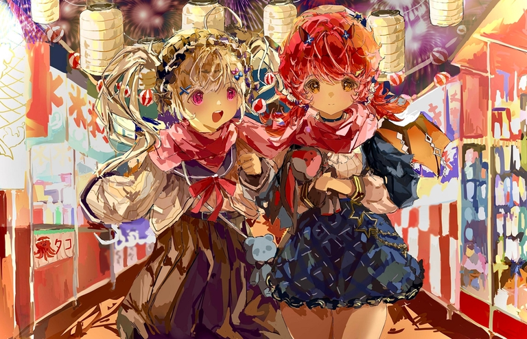

# Announcement_(en)

"It's been a long time since I came here, and I've really been through a lot." Koxia muses as she chatted idly with Mahiru.

Now that the Winter Festival is approaching. Among the flash of fireworks, in the chimes of the New Year, what is waiting for them to encounter?

Armed with girlish courage, they stepped onwards.

Hello Codeforces!

We ([Nanako](https://codeforces.com/profile/Nanako "Master Nanako"), [m_99](https://codeforces.com/profile/m_99 "International Grandmaster m_99"), [huangxiaohua](https://codeforces.com/profile/huangxiaohua "Grandmaster huangxiaohua"), [SteamTurbine](https://codeforces.com/profile/SteamTurbine "International Master SteamTurbine"), [triple__a](https://codeforces.com/profile/triple__a "International Grandmaster triple__a"), [Nezzar](https://codeforces.com/profile/Nezzar "Candidate Master Nezzar")) are very pleasured to invite you to take part in [Good Bye 2022: 2023 is NEAR](https://codeforces.com/contest/1770 "Good Bye 2022: 2023 is NEAR"), which will take place in [Friday, December 30, 2022 at 20:35UTC+6](https://codeforces.com/https://www.timeanddate.com/worldclock/fixedtime.html?day=30&month=12&year=2022&hour=17&min=35&sec=0&p1=166)!

This round consists of **8 tasks** waiting for you to solve in **150 minutes**, and will be rated for everyone!

On behalf of the author team, please allow me to express our sincere thanks to:

 * [errorgorn](https://codeforces.com/profile/errorgorn "International Grandmaster errorgorn"), for useful guidance and brilliant advice during the coordination!
* [KAN](https://codeforces.com/profile/KAN "Legendary Grandmaster KAN"), for rechecking and translating the round!
* [ak2006](https://codeforces.com/profile/ak2006 "Specialist ak2006"), [tolbi](https://codeforces.com/profile/tolbi "Candidate Master tolbi"), [Tlatoani](https://codeforces.com/profile/Tlatoani "Master Tlatoani"), [gisp_zjz](https://codeforces.com/profile/gisp_zjz "Legendary Grandmaster gisp_zjz"), [Roundgod](https://codeforces.com/profile/Roundgod "International Grandmaster Roundgod"), [Kaibad](https://codeforces.com/profile/Kaibad "Master Kaibad"), [xzm2024](https://codeforces.com/profile/xzm2024 "Master xzm2024"), [Frozencode](https://codeforces.com/profile/Frozencode "Master Frozencode"), [woruo27](https://codeforces.com/profile/woruo27 "Expert woruo27"), [ayhan23](https://codeforces.com/profile/ayhan23 "Expert ayhan23"), [compute](https://codeforces.com/profile/compute "Grandmaster compute"), [muoshuo](https://codeforces.com/profile/muoshuo "Master muoshuo"), [conqueror_of_tourist](https://codeforces.com/profile/conqueror_of_tourist "Legendary Grandmaster conqueror_of_tourist"), [googol_S0](https://codeforces.com/profile/googol_S0 "Master googol_S0"), [zengminghao](https://codeforces.com/profile/zengminghao "Master zengminghao"), [valeriu](https://codeforces.com/profile/valeriu "Candidate Master valeriu"), [manish.17](https://codeforces.com/profile/manish.17 "Master manish.17"), [cuzperf](https://codeforces.com/profile/cuzperf "Candidate Master cuzperf"), [tibinyte](https://codeforces.com/profile/tibinyte "Newbie tibinyte"), [JuanPabloAmezcua](https://codeforces.com/profile/JuanPabloAmezcua "Candidate Master JuanPabloAmezcua"), for providing valuable and constructive feedback during testing!
* [1tTx__](https://codeforces.com/https://space.bilibili.com/616141212), for the exquisite illustration!
* [MikeMirzayanov](https://codeforces.com/profile/MikeMirzayanov "Headquarters, MikeMirzayanov"), for great platforms Codeforces and Polygon!
* you and everyone, for participating and making this round have extraordinary significance!

This round is supported by [NEAR](https://codeforces.com/https://www.near.org). The participants in the top 2047 places will receive prizes as follows:

 * Ⓝ 1024 for the first place
* Ⓝ 512 for the 2-3 places
* Ⓝ 256 for the 4-7 places
* ...
* Ⓝ 1 for the 1024-2047 places

Score distribution will be announced soon.

Besides the regular editorial, materials to be public after the round will also include the Chinese statement and the Chinese editorial.

We hope you enjoy our problems and say Goodbye to your 2022 happily!

**UPD1**: Score distribution is **500 — 750 — 1250 — 1500 — 2000 — 2500 — 3250 — 4000**.

**UPD2**: Congratulations to the winners!

 1. [Benq](https://codeforces.com/profile/Benq "Legendary Grandmaster Benq")
2. [maroonrk](https://codeforces.com/profile/maroonrk "Legendary Grandmaster maroonrk")
3. [Radewoosh](https://codeforces.com/profile/Radewoosh "Legendary Grandmaster Radewoosh")
4. [Um_nik](https://codeforces.com/profile/Um_nik "Legendary Grandmaster Um_nik")
5. [tourist](https://codeforces.com/profile/tourist "Legendary Grandmaster tourist")
6. [ksun48](https://codeforces.com/profile/ksun48 "Legendary Grandmaster ksun48")
7. [ecnerwala](https://codeforces.com/profile/ecnerwala "Legendary Grandmaster ecnerwala")
8. [aaaaawa](https://codeforces.com/profile/aaaaawa "Grandmaster aaaaawa")
9. [DearMargaret](https://codeforces.com/profile/DearMargaret "Legendary Grandmaster DearMargaret")
10. [jiangly](https://codeforces.com/profile/jiangly "Legendary Grandmaster jiangly")

Thanks all for joining!

**UPD3**: The [editorial](Tutorial_2_(en).md) is available.

**UPD4**: The [Chinese statement](https://codeforces.com/contest/1770/attachments/download/18469/statement.pdf) and the [Chinese editorial](https://codeforces.com/contest/1770/attachments/download/18470/editorial.pdf) have been added into the contest attachments.

