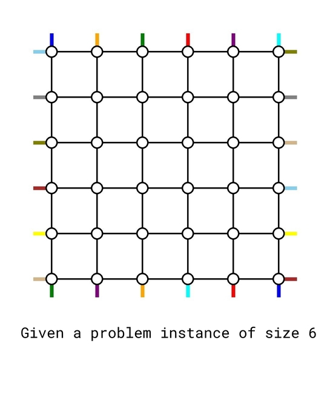
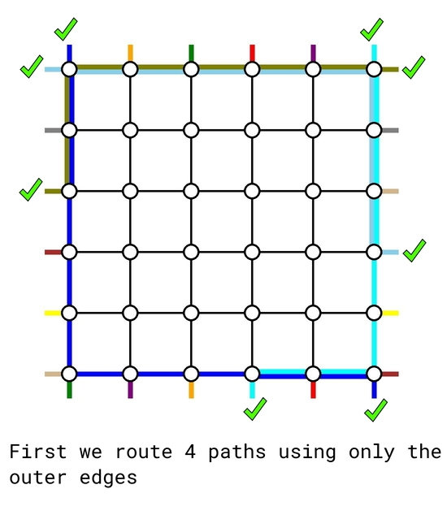
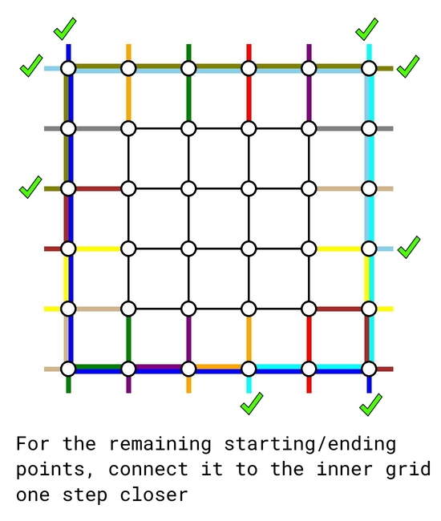
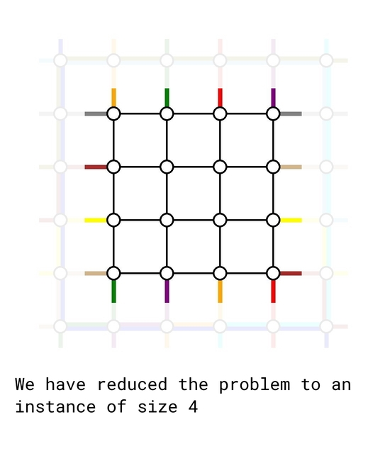

# Tutorial_2_(en)

[1770A - Koxia and Whiteboards](../problems/A._Koxia_and_Whiteboards.md "Good Bye 2022: 2023 is NEAR")
-------------------------------------------------------------------------------------------------------------

Idea by [m_99](https://codeforces.com/profile/m_99 "International Grandmaster m_99")

 **Hint 1**Exactly n items out of of a1,…,an,b1,…,bm will remain on the whiteboard at the end.

 **Hint 2**bm will always remain on the board at the end.

 **Hint 3**Consider the case where n=2 and m=2. As we mentioned in hint 2, b2 will always be written, but what about b1?

 **Solution**This problem can be solved naturally with a greedy algorithm — for i=1,2,…,m, we use bi to replace the minimal value among the current a1,a2,…,an. The time complexity is O(nm) for each test case.

Alternatively, we can first add bm to our final sum. For the remaining (n+m−1) integers, we can freely pick (n−1) out of them and add it to our final sum. This is because if we want a certain ai to remain on the board at the end, we simply do not touch it in the process. If we want a certain bi to remain on the board at the end, then on the ith operation we replace some aj that we do not want at the end by bi.

Using an efficient sorting algorithm gives us a O((n+m)log(n+m)) solution, which is our intended solution.

 **Code (m_99)**
```cpp
#include <stdio.h>
#include <bits/stdc++.h>
using namespace std;
#define rep(i,n) for (int i = 0; i < (n); ++i)
#define Inf32 1000000001
#define Inf64 4000000000000000001

int main(){
	
	int _t;
	cin>>_t;
	
	rep(_,_t){
		int n,m;
		cin>>n>>m;
		vector<long long> a(n+m);
		rep(i,n+m)scanf("%lld",&a[i]);
		
		sort(a.begin(),a.end()-1);
		reverse(a.begin(),a.end());
		
		long long ans = 0;
		rep(i,n)ans += a[i];
		
		cout<<ans<<endl;
	}
	
	
	return 0;
}
```
[1770B - Koxia and Permutation](../problems/B._Koxia_and_Permutation.md "Good Bye 2022: 2023 is NEAR")
-------------------------------------------------------------------------------------------------------------

Idea by [m_99](https://codeforces.com/profile/m_99 "International Grandmaster m_99")

 **Hint 1**For k=1, the cost is always 2n for any permutation.

 **Hint 2**For k≥2, the minimal cost is always n+1.

 **Solution**When k=1 every permutation has the same cost.

When k≥2, the minimal cost will be at least n+1. This is because there will always be at least one segment containing the element n in the permutation, contributing n to the "max" part of the sum, and the "min" part will add at least 1 to the sum.

In fact, the cost n+1 is optimal. It can be achieved by ordering the numbers in the pattern [n,1,n−1,2,n−2,3,n−3,4,…].

The time complexity is O(n) for each test case. Other careful constructions should also get Accepted.

 **Code (Nanako)**
```cpp
#include <iostream>
#define MULTI int _T; cin >> _T; while(_T--)
using namespace std;
typedef long long ll;
 
int n, k;
 
int main () {
	ios::sync_with_stdio(0);
	cin.tie(0);
	
	MULTI {
		cin >> n >> k;
		int l = 1, r = n, _ = 1;
		while (l <= r) cout << ((_ ^= 1) ? l++ : r--) << ' ';
		cout << endl;
	}
}
```
[1770C - Koxia and Number Theory](../problems/C._Koxia_and_Number_Theory.md "Good Bye 2022: 2023 is NEAR")
---------------------------------------------------------------------------------------------------------------

Idea by [triple__a](https://codeforces.com/profile/triple__a "International Grandmaster triple__a")

 **Hint 1**If ai are not pairwise distinct we get a trivial NO.

 **Hint 2**If all ai are pairwise distinct, can you construct an example with n=4 that gives an answer NO?

 **Hint 3**Perhaps you are thinking about properties such as parity? Try to generalize the idea.

 **Hint 3.5**Consider every prime. Consider Chinese Remainder Theorem.

 **Hint 4**How many primes should we check? Consider Pigeonhole Principle.

 **Solution**First, we should check whether the integers in a are pairwise distinct, as ai+x≥2 and gcd(t,t)=t, which leads to a trivial NO.

Given an integer x, let's define bi:=ai+x. The condition "gcd(bi,bj)=1 for 1≤i<j≤n" is equivalent to "every prime p should divides at most one bi". Given a prime p, how should we verify whether for every x>0, p divides at least two elements in b?

A small but guided sample is a=[5,6,7,8] with answer NO, because

 * gcd(6+x,8+x)≠1 if x≡0(mod2),
* gcd(5+x,7+x)≠1 if x≡1(mod2).

That is, if we consider [5,6,7,8] modulo 2, we obtain the multiset 1,0,1,0. Both 0 and 1 appeared twice, so for any choice of x, exactly two integers in b will be divided by 2.

This idea can be extended to larger primes. For a given prime p, let cntj be the multiplicity of j in the multiset [ai mod p,a2 mod p,…,an mod p]. If min(cnt0,cnt1,…,cntp−1)≥2, we output NO immediately.

While there are many primes up to 1018, we only need to check for the primes up to ⌊n2⌋. This is because min(cnt0,cnt1,…,cntp−1)≥2 is impossible for greater primes according to Pigeonhole Principle. Since the number of primes up to ⌊n2⌋ is at most O(nlogn), the problem can be solved in time O(n2logn).

The reason that min(cnt)≥2 is essential because for a prime p, if au≡av(modp), then it's necessary to have (x+au)≢0(modp), because gcd(x+au,x+av) will be divided by p otherwise. So actually, cnti≥2 means x≢(p−i)(modp). If min(cnt)<2 holds for all primes, then we can list certain congruence equations and use [Chinese Reminder Theorem](https://codeforces.com/https://en.wikipedia.org/wiki/Chinese_remainder_theorem) to calculate a proper x; if there exists a prime that min(cnt)≥2, then any choose of x leads to the situation that p appears twice.

 **Code (Nanako)**
```cpp
#include <iostream>
#include <algorithm>
#define MULTI int _T; cin >> _T; while(_T--)
using namespace std;
typedef long long ll;
 
const int N = 105;
const int INF = 0x3f3f3f3f;
template <typename T> bool chkmin (T &x, T y) {return y < x ? x = y, 1 : 0;}
template <typename T> bool chkmax (T &x, T y) {return y > x ? x = y, 1 : 0;}
 
int n;
ll a[N];
 
int cnt[N];
 
int main () {
	ios::sync_with_stdio(0);
	cin.tie(0);
	
	MULTI {
		cin >> n;
		for (int i = 1;i <= n;++i) {
			cin >> a[i];
		}
		
		int isDistinct = 1;
		sort(a + 1, a + n + 1);
		for (int i = 1;i <= n - 1;++i) {
			if (a[i] == a[i + 1]) isDistinct = 0;
		}
		if (isDistinct == 0) {
			cout << "NO" << endl;
			continue;
		}
		
		int CRT_able = 1;
		for (int mod = 2;mod <= n / 2;++mod) {
			fill(cnt, cnt + mod, 0);
			for (int i = 1;i <= n;++i) {
				cnt[a[i] % mod]++;
			}
			if (*min_element(cnt, cnt + mod) >= 2) CRT_able = 0;
		}
		cout << (CRT_able ? "YES" : "NO") << endl;
	}
}
```
[1770D - Koxia and Game](../problems/D._Koxia_and_Game.md "Good Bye 2022: 2023 is NEAR")
------------------------------------------------------------------------------------------------------

Idea by [m_99](https://codeforces.com/profile/m_99 "International Grandmaster m_99")

 **Hint 1**If all of a, b and c are fixed, how to determine who will win?

 **Hint 2**If a and b are fixed, design an algorithm to check if there is an array c that makes Koxia wins.

 **Hint 2.5**If you can't solve the problem in Hint 2, try to think about how it's related to graph theory.

 **Hint 3**Try to discuss the structure of components in the graph to count up the number of c.

 **Solution**Firstly, let's consider how an array c could make Koxia wins.

**Lemma 1.** In each round, Koxia should remove an element in S to make the remaining 2 elements in S the same (i.e. Mahiru's choice determined nothing actually).

 * In round n, if Koxia leaves two choices for Mahiru then Mahiru will be able to prevent d from being a permutation.
* This means if Koxia wins, there is only one choice for dn.
* Now (d1,d2,…,dn−1) have to be a permutation of a specific n−1 numbers. Apply the same argument on dn−1 and so on, we can conclude that every di only has one choice if Koxia wins.

**Lemma 2.** Let p be array of length n where we can set pi to either ai or bi. Koxia wins iff there exists a way to make p a permutation.

 * According to Lemma 1, if there is a way to make p a permutation, we can just set ci=pi. Koxia can then force Mahiru to set di=pi every round and Koxia will win.
* If it is impossible to make p a permutation, Mahiru can pick either ai or bi (at least one of them is available) every round. The resulting array d is guaranteed to not be a permutation.

First, we need an algorithm to determine if there is a way to make p a permutation.

We can transform this into a graph problem where (ai,bi) are edges in a graph with n vertices. Then there is a way to make p a permutation iff there is a way to assign a direction for every edge such that every vertex has one edge leading into it. It is not hard to see that this is equivalent to the condition that for every connected component, the number of edges equals the number of vertices. We can verify this by a Disjoint-Set Union or a graph traversal in O(nα(n)) or O(n) time complexity.

To solve the counting problem, we consider the structure of the connected components one by one. A component with |V|=|E| can be viewed as a tree with an additional edge. This additional edge can be categorized into two cases:

 * The additional edge forms a cycle together with some of the other edges. There are 2 choices for the cycle (clockwise and counterclockwise), and the choices of other edges are fixed then (point away from the cycle).
* The additional edge forms a self-loop. Then the value of ci determines nothing in this situation so it can be any integers in [1,n], and the choices of all other edges are fixed.

Therefore, if exists at least one c to make Koxia wins, then the answer is 2cycle component cnt⋅nself-loop component cnt. The time complexity is O(nα(n)) or O(n).

 **Code (Nanako, DSU)**
```cpp
#include <iostream>
#include <numeric>
#define MULTI int _T; cin >> _T; while(_T--)
using namespace std;
typedef long long ll;
 
const int N = 1e5 + 5;
const int mod = 998244353;
 
int n;
int a[N], b[N];
 
int fa[N], cnt_v[N], cnt_e[N], selfloop[N];
int vis[N];
void init () {
	iota(fa + 1, fa + n + 1, 1);
	fill(cnt_v + 1, cnt_v + n + 1, 1);
	fill(cnt_e + 1, cnt_e + n + 1, 0);
	fill(selfloop + 1, selfloop + n + 1, 0);
	fill(vis + 1, vis + n + 1, 0);
}
int getfa (int x) {
	return fa[x] == x ? x : fa[x] = getfa(fa[x]);
}
void merge (int u, int v) {
	u = getfa(u);
	v = getfa(v);
	cnt_v[u] += cnt_v[v];
	cnt_e[u] += cnt_e[v];
	selfloop[u] |= selfloop[v];
	fa[v] = u;
}
 
int main () {
	ios::sync_with_stdio(0);
	cin.tie(0);
	
	MULTI {
		cin >> n;
		for (int i = 1;i <= n;++i) {
			cin >> a[i];
		}
		for (int i = 1;i <= n;++i) {
			cin >> b[i];
		}
		
		init();
		for (int i = 1;i <= n;++i) {
			if (getfa(a[i]) != getfa(b[i])) merge(a[i], b[i]);
			cnt_e[getfa(a[i])]++;
			if (a[i] == b[i]) selfloop[getfa(a[i])] = 1;
		}
		
		ll ans = 1;
		for (int i = 1;i <= n;++i) if (vis[getfa(i)] == 0) {
			if (cnt_v[getfa(i)] != cnt_e[getfa(i)]) ans = 0;
			else ans = ans * (selfloop[getfa(i)] ? n : 2) % mod;
			vis[getfa(i)] = 1;
		}
		cout << ans << endl;
	}
}
```
 **Code (zengminghao, DFS)**
```cpp
#include <bits/stdc++.h>
using namespace std;
const int N = 1e5 + 5;
const int P = 998244353;
 
int n, a[N], b[N];
vector <int> G[N];
bool vis[N];
 
int vertex, edge, self_loop;
void dfs(int x) {
	if (vis[x]) return ;
	vis[x] = true;
	vertex++;
	for (auto y : G[x]) {
		edge++;
		dfs(y);
		if (y == x) {
			self_loop++;
		}
	}
}
 
void solve() {
	scanf("%d", &n);
	for (int i = 1; i <= n; i++) scanf("%d", &a[i]);
	for (int i = 1; i <= n; i++) scanf("%d", &b[i]);
	
	for (int i = 1; i <= n; i++) G[i].clear();
	
	for (int i = 1; i <= n; i++) {
		G[a[i]].push_back(b[i]);
		G[b[i]].push_back(a[i]);
	}
	
	int ans = 1;
	
	for (int i = 1; i <= n; i++) vis[i] = false;
	for (int i = 1; i <= n; i++) {
		if (vis[i]) continue ;
		vertex = 0;
		edge = 0;
		self_loop = 0;
		dfs(i);
		if (edge != 2 * vertex) {
			ans = 0;
		} else if (self_loop) {
			ans = 1ll * ans * n % P;
		} else {
			ans = ans * 2 % P;
		}
	}
	
	printf("%dn", ans);
}
 
int main() {
	int t;
	scanf("%d", &t);
	while (t--) {
		solve();
	}
	return 0;
}
```
[1770E - Koxia and Tree](../problems/E._Koxia_and_Tree.md "Good Bye 2022: 2023 is NEAR")
------------------------------------------------------------------------------------------------------

Idea by [m_99](https://codeforces.com/profile/m_99 "International Grandmaster m_99")

 **Hint 1**Solve a classic problem — find the sum of pairwise distances of k chosen nodes in a tree.

 **Hint 2**If we add the move operations while the direction of edges are fixed, find the sum of pairwise distances of k chosen nodes.

 **Hint 2.5**If you can't solve the problem in Hint 2, consider why writers make each edge passed by butterflies for at most once.

 **Hint 3**When the direction of edges become random, how maintaining pi as the possibility of "node i contains a butterfly" help you to get the answer?

 **Solution**At first sight, we usually think of a classic problem — find the sum of pairwise distances of k chosen nodes in a tree. For any edge, if there are x chosen nodes and n−x chosen nodes respectively on each side of it, then there will be x(n−x) pairs of nodes passing this edge. Without loss of generality, let's assign node 1 as root, and define both sizi as the number of chosen nodes in subtree i. By summing up sizson(n−sizson) for each edge (fa,son), we derive the answer, which equals to the expected value of the distance of two nodes (Uniformly randomly chosen from k nodes) after dividing by (k2).

Let's turn to Hint 2 then — add the move operations while the direction of edges are fixed. Let's define siz0i and sizi as the number of butterflies in subtree i, but before any move operation / in real time respectively. A very important observation is, although butterflies are moving, we can always claim |sizson−siz0son|≤1 because each edge is passed by butterflies for at most once. This property allows us to discuss different values of sizson to sum up the answer in constant time complexity, if you maintain butterflies' positions correctly.

When we introduce random directions additionally, if we define pi as the possibility of "node i contains a butterfly", then an equivalent statement of move operation from node u to node v will be, actually, set pu=pv=pu+pv2, which allows us to maintain p in real time easily. Similarly, by discussing values of sizson (but with possibilities of each case instead of specified moves), we get the final answer. The total time complexity is O(n).

 **Code (Nanako)**
```cpp
#include <iostream>
#include <vector>
using namespace std;
typedef long long ll;
 
const int N = 3e5 + 5;
const int mod = 998244353;
const int inv2 = 499122177;
 
ll qpow (ll n, ll m) {
	ll ret = 1;
	while (m) {
		if (m & 1) ret = ret * n % mod;
		n = n * n % mod;
		m >>= 1;
	}
	return ret;
}
ll getinv (ll a) {
	return qpow(a, mod - 2);
}
 
int n, k;
int a[N];
int u[N], v[N];
 
vector <int> e[N];
int fa[N];
ll p[N], sum[N];
void dfs (int u, int f) {
	sum[u] = p[u];
	for (int v : e[u]) if (v != f) {
		dfs(v, u);
		fa[v] = u;
		sum[u] += sum[v];
	}
}
 
int main () {
	ios::sync_with_stdio(0);
	cin.tie(0);
	
	cin >> n >> k;
	for (int i = 1;i <= k;++i) {
		cin >> a[i];
		p[a[i]] = 1;
	}
	for (int i = 1;i <= n - 1;++i) {
		cin >> u[i] >> v[i];
		e[u[i]].push_back(v[i]);
		e[v[i]].push_back(u[i]);
	}
	dfs(1, -1);
	
	ll ans = 0;
	for (int i = 1;i <= n - 1;++i) {
		if (fa[u[i]] == v[i]) swap(u[i], v[i]);
		ll puv = p[u[i]] * (1 - p[v[i]] + mod) % mod;
		ll pvu = p[v[i]] * (1 - p[u[i]] + mod) % mod;
		ll delta = 0;
		delta -= puv * sum[v[i]] % mod * (k - sum[v[i]]) % mod;
		delta -= pvu * sum[v[i]] % mod * (k - sum[v[i]]) % mod;
		delta += puv * (sum[v[i]] + 1) % mod * (k - sum[v[i]] - 1) % mod;
		delta += pvu * (sum[v[i]] - 1) % mod * (k - sum[v[i]] + 1) % mod;
		ans = (ans + sum[v[i]] * (k - sum[v[i]]) + delta * inv2) % mod;
		ans = (ans % mod + mod) % mod;
		p[u[i]] = p[v[i]] = 1ll * (p[u[i]] + p[v[i]]) * inv2 % mod;
	}
	cout << ans * getinv(1ll * k * (k - 1) / 2 % mod) % mod << endl;
}
```
[1770F - Koxia and Sequence](../problems/F._Koxia_and_Sequence.md "Good Bye 2022: 2023 is NEAR")
----------------------------------------------------------------------------------------------------------

Idea by [m_99](https://codeforces.com/profile/m_99 "International Grandmaster m_99")

 **Hint 1**From symmetry, for any non-negative integer t, the number of good sequences with a1=t, the number of good sequences with a2=t, ... are equal.

 **Hint 2**It is useful to consider the contribution of each bit to the answer independently.

 **Hint 3**Since XOR is undone twice, considering the contribution to the answer can be regarded as counting up over mod 2.

 **Hint 4**It is difficult to count those for which total or is y, but it is relatively easy to count those for which total or is a subset of y. Then, we can consider a way using the inclusion-exclusion principle.

 **Hint 5**Lucas's theorem and Kummer's theorem are useful. In particular, you can derive equivalence conditions on or.

 **Hint 6**"There are a+b white balls. For every pair (c,d) of nonnegative integers satisfying c+d=n, find the sum of the ways to choose c balls from the first a balls and d balls from the remaining b balls." The answer to this problem is a+bCn. This is because considering how to choose for every pair (c,d) of non-negative integers satisfying c+d=n merely consider the case of choosing n balls as how many balls to choose from a balls and b balls. This result is called Vandermonde's identity.

 **Solution**Let f(i,t) is the number of good sequence such that ai=t. f(1,t)=f(2,t)=...=f(n,t), so if n is even, the answer is 0. Otherwise, the answer is total xor of t such that number of good sequences such that a1=t is odd. We can consider each bit independently, so we can rewrite the problem "for each i, find the number of good sequences such that a1's i-th bit is 1, modulo 2".

Let g(y′) is the answer if y is a subset of y′(means y∣y′=y′). We can prove with induction the answer of the original problem is total xor of g(y′) such that y′ is a subset of given y. So, the goal is for each i, find the number of y′ such that y′ is a subset of y and g(y′)'s i-th bit is 1, modulo 2.

We can prove with Lucas's theorem or Kummer's theorem (p=2), "(ab)mod2 is 1" is equivalent to "b is a subset of a". The number of sequences such that the length is n and total sum is x and total or is a subset of y, modulo 2 is equal to ∑t1+…+tn=x∏(yti), because if there is ti which is not a subset of y, (yti) is 0 and the product is also 0, modulo 2. Consider Vandermonde's identity, the value is equal to (nyx). In a similar way, we can rewrite the problem to "for each i, find the number of y′ such that y′ is a subset of y and y′'s i-th bit is 1 and x−2i is a subset of ny′−2i((ny′−2ix−2i)mod2=1), modulo 2".

From the above, we can solve this problem in O(ylogy) by performing the calculation in O(1) for all i and all y′.

 **Code (errorgorn)**
```cpp
#include <bits/stdc++.h>
using namespace std;
 
#define int long long
#define ll long long
#define ii pair<ll,ll>
#define iii pair<ii,ll>
#define fi first
#define se second
#define endl 'n'
#define debug(x) cout << #x << ": " << x << endl
 
#define pub push_back
#define pob pop_back
#define puf push_front
#define pof pop_front
#define lb lower_bound
#define ub upper_bound
 
#define rep(x,start,end) for(int x=(start)-((start)>(end));x!=(end)-((start)>(end));((start)<(end)?x++:x--))
#define all(x) (x).begin(),(x).end()
#define sz(x) (int)(x).size()
 
mt19937 rng(chrono::system_clock::now().time_since_epoch().count());
 
int n,a,b;
 
bool isSub(int i,int j){
	if (i<0 || j<0) return false;
	return (j&i)==i;
}
 
signed main(){
	ios::sync_with_stdio(0);
	cin.tie(0);
	cout.tie(0);
	cin.exceptions(ios::badbit | ios::failbit);
	
	cin>>n>>a>>b;
	
	int ans=0;
	for (int sub=b;sub;sub=(sub-1)&b) rep(bit,0,20) if (sub&(1<<bit)){
		if (isSub(a-(1<<bit),n*sub-(1<<bit))){
			ans^=(1<<bit);
		}
	}
	
	cout<<ans*(n%2)<<endl;
}
```
[1770G - Koxia and Bracket](../problems/G._Koxia_and_Bracket.md "Good Bye 2022: 2023 is NEAR")
---------------------------------------------------------------------------------------------------------

Idea by [huangxiaohua](https://codeforces.com/profile/huangxiaohua "Grandmaster huangxiaohua") and [errorgorn](https://codeforces.com/profile/errorgorn "International Grandmaster errorgorn")

 **Hint 1**What special properties does the deleted bracket sequence have?

 **Hint 2**Try to solve this with O(n2) DP.

 **Hint 3**If there is no balance requirement, can multiple brackets be processed quickly with one operation?

 **Hint 4**Can you combine the last idea with divide-and-conquer or something?

 **Solution**
#### O(n2) Solution

Let us consider what properties the removed bracket subsequence has.

First, it must be a bracket subsequence in the form `))...)((....(`. The proof is simple: if there is a deleted `)` on the right-hand side of a `(`, then we can keep them in s without breaking the balancing property of the remaining sequence.

This property means that we can divide the string into 2 parts. We only delete `)` from the first part and only delete `(` from the second part. Now let us try to find the dividing point between the two parts: Consider a prefix sum based on a sequence of brackets in which each `(` is replaced by 1 and each `)` is replaced by -1.

We define a position as a *special position* if and only if the number corresponding to this position is less than the previously occurring minimum value. It is easy to see that whenever a special position occurs, we must remove an additional `)` before this position to make the bracket sequence satisfy the condition again.

Considering the above idea, we can find that only the `)` before the farthest special position may be deleted, so we can use this position as the dividing point.

We now solve two separate problems. However, we can turn the problem on deleting only '(' into the one on deleting only `)`. For example, if we are only allowed to delete `(` from `(()((()())`, it is equivalent to the number of ways to delete only `)` from `(()()))())`.

For the part where only `)` is deleted, the sufficient condition for it to be a balanced bracket sequence is that each number in the prefix sum must be greater than 0 after the operation.

Also considering the above ideas, let us define the state dpi,j, which represents after removing the breakets required by special position, the number of ways to delete additional j (j≥0) occurrence of `)` from the string up the i-th occurrence of `)` in the string.

 dpi,j={dpi−1,j+dpi−1,j−1,if i is not special;dpi−1,j+dpi−1,j+1,if i is special.Multiply the dpend,0 obtained from both parts of the string to obtain the answer. The time complexity is O(n2) and optimized implementations can run in about 9 seconds, but it is not enough to pass.

#### O(n√nlogn) Solution

Let's try to optimize the transitions when there are no special positions. For state dpi,j, after processing k individual `)`, the transitions are as follows:

 dpi+k,j=∑kl=0(kl)×dpi,j−lWe find that this transfer equation behaves as a polynomial convolution. Thus we can optimize this convolution by NTT with a time complexity of O(nlogn) for a single operation, while the worst global complexity of this Solution is O(n2logn) due to the presence of the special position.

Consider how this Solution can be combined with the O(n2) Solution. For states dpi,j where we want to consider its contribution to dpi+k, if j≥k is satisfied, then the transitions are not affected by the special position anyway.

Based on the above idea, we can adopt a mixed Solution based on periodic reconstruction: set the reconstruction period B, and within one round of the period, we use the O(n2) DP Solution to handle the part of j≤B, while for the part of j>B, we compute the answer by NTT after one round of the period.

The time complexity O(n2B+B⋅nlogn) can be optimized to O(n√nlogn) by setting the appropriate B. Although the time complexity is still high, given the low constant factor of the O(n2) solution, a decently-optimized implementation is able to get AC.

#### O(nlog2n) Solution

Consider combining the idea of extracting j≥k parts for NTT with divide-and-conquer. Suppose now that the interval to be processed is (l,r), where the DP polynomial passed is s. We proceed as follows:

 * Count the number of special positions num in the interval (l,r), extract the part of the polynomial s corresponding to the state j≥num, and convolute it with the current interval alone.
* Pass the part of the polynomial s corresponding to the state j<num into the interval (l,mid), and then pass the result into the interval (mid+1,r) to continue the operation.
* Add the polynomials obtained by the above two steps directly, and return the obtained polynomial.

How to calculate the time complexity of performing the above operations? Let's analyze the operations passed into the left interval and the right interval separately.

 * When passing in the left interval (l,mid), the size of the polynomial for the NTT operation is the number of special positions in the interval (l,r) minus the number of special positions in the left interval (l,mid), i.e., the number of special positions in the right interval (mid+1,r), which does not exceed the length of the right interval (mid+1,r).
* When passed into the right interval (mid+1,r), the size of the polynomial does not exceed the length of the left interval (l,mid).
* Also, the length of the combinatorial polynomial multiplied with s is the interval length + 1.

In summary, the size of the two polynomials for the NTT operation in the interval (l,r) does not exceed the interval length + 1. Thus the time complexity of this solution is divide-and-conquer combined with the time complexity of NTT, i.e. O(nlog2n).

 **Code (errorgorn)**
```cpp
#include <bits/stdc++.h>
#include <ext/pb_ds/assoc_container.hpp>
#include <ext/pb_ds/tree_policy.hpp>
#include <ext/rope>
using namespace std;
using namespace __gnu_pbds;
using namespace __gnu_cxx;
 
#define int long long
#define ll long long
#define ii pair<ll,ll>
#define iii pair<ii,ll>
#define fi first
#define se second
#define endl 'n'
#define debug(x) cout << #x << ": " << x << endl
 
#define pub push_back
#define pob pop_back
#define puf push_front
#define pof pop_front
#define lb lower_bound
#define ub upper_bound
 
#define rep(x,start,end) for(auto x=(start)-((start)>(end));x!=(end)-((start)>(end));((start)<(end)?x++:x--))
#define all(x) (x).begin(),(x).end()
#define sz(x) (int)(x).size()
 
#define indexed_set tree<ll,null_type,less<ll>,rb_tree_tag,tree_order_statistics_node_update>
//change less to less_equal for non distinct pbds, but erase will bug
 
mt19937 rng(chrono::system_clock::now().time_since_epoch().count());
 
const int MOD=998244353;
 
ll qexp(ll b,ll p,int m){
    ll res=1;
    while (p){
        if (p&1) res=(res*b)%m;
        b=(b*b)%m;
        p>>=1;
    }
    return res;
}
 
ll inv(ll i){
	return qexp(i,MOD-2,MOD);
}
 
ll fix(ll i){
	i%=MOD;
	if (i<0) i+=MOD;
	return i;
}
 
ll fac[1000005];
ll ifac[1000005];
 
ll nCk(int i,int j){
	if (i<j) return 0;
	return fac[i]*ifac[j]%MOD*ifac[i-j]%MOD;
}
 
//https://github.com/kth-competitive-programming/kactl/blob/main/content/numerical/NumberTheoreticTransform.h
const ll mod = (119 << 23) + 1, root = 62; // = 998244353
// For p < 2^30 there is also e.g. 5 << 25, 7 << 26, 479 << 21
// and 483 << 21 (same root). The last two are > 10^9.
typedef vector<int> vi;
typedef vector<ll> vl;
void ntt(vl &a) {
	int n = sz(a), L = 31 - __builtin_clz(n);
	static vl rt(2, 1);
	for (static int k = 2, s = 2; k < n; k *= 2, s++) {
		rt.resize(n);
		ll z[] = {1, qexp(root, mod >> s, mod)};
		rep(i,k,2*k) rt[i] = rt[i / 2] * z[i & 1] % mod;
	}
	vi rev(n);
	rep(i,0,n) rev[i] = (rev[i / 2] | (i & 1) << L) / 2;
	rep(i,0,n) if (i < rev[i]) swap(a[i], a[rev[i]]);
	for (int k = 1; k < n; k *= 2)
		for (int i = 0; i < n; i += 2 * k) rep(j,0,k) {
			ll z = rt[j + k] * a[i + j + k] % mod, &ai = a[i + j];
			a[i + j + k] = ai - z + (z > ai ? mod : 0);
			ai += (ai + z >= mod ? z - mod : z);
		}
}
vl conv(const vl &a, const vl &b) {
	if (a.empty() || b.empty()) return {};
	int s = sz(a) + sz(b) - 1, B = 32 - __builtin_clz(s), n = 1 << B;
	int inv = qexp(n, mod - 2, mod);
	vl L(a), R(b), out(n);
	L.resize(n), R.resize(n);
	ntt(L), ntt(R);
	rep(i,0,n) out[-i & (n - 1)] = (ll)L[i] * R[i] % mod * inv % mod;
	ntt(out);
	return {out.begin(), out.begin() + s};
}
 
vector<int> v;
 
vector<int> solve(int l,int r,vector<int> poly){
	if (poly.empty()) return poly;
	
	if (l==r){
		poly=conv(poly,{1,1});
		poly.erase(poly.begin(),poly.begin()+v[l]);
		return poly;
	}
	
	int m=l+r>>1;
	int num=0;
	rep(x,l,r+1) num+=v[x];
	num=min(num,sz(poly));
	
	vector<int> small(poly.begin(),poly.begin()+num);
	poly.erase(poly.begin(),poly.begin()+num);
	
	vector<int> mul;
	rep(x,0,r-l+2) mul.pub(nCk(r-l+1,x));
	poly=conv(poly,mul);
	
	small=solve(m+1,r,solve(l,m,small));
	poly.resize(max(sz(poly),sz(small)));
	rep(x,0,sz(small)) poly[x]=(poly[x]+small[x])%MOD;
	
	return poly;
}
 
int solve(string s){
	if (s=="") return 1;
	v.clear();
	
	int mn=0,curr=0;
	for (auto it:s){
		if (it=='(') curr++;
		else{
			curr--;
			if (curr<mn){
				mn=curr;
				v.pub(1);
			}
			else{
				v.pub(0);
			}
		}
	}
	
	return solve(0,sz(v)-1,{1})[0];
}
 
int n;
string s;
int pref[500005];
 
signed main(){
	ios::sync_with_stdio(0);
	cin.tie(0);
	cout.tie(0);
	cin.exceptions(ios::badbit | ios::failbit);
	
	fac[0]=1;
	rep(x,1,1000005) fac[x]=fac[x-1]*x%MOD;
	ifac[1000004]=inv(fac[1000004]);
	rep(x,1000005,1) ifac[x-1]=ifac[x]*x%MOD;
	
	cin>>s;
	n=sz(s);
	pref[0]=0;
	rep(x,0,n) pref[x+1]=pref[x]+(s[x]=='('?1:-1);
	
	int pos=min_element(pref,pref+n+1)-pref;
	string a=s.substr(0,pos),b=s.substr(pos,n-pos);
	reverse(all(b)); for (auto &it:b) it^=1;
	cout<<solve(a)*solve(b)%MOD<<endl;
}
```
[1770H - Koxia, Mahiru and Winter Festival](../problems/H._Koxia,_Mahiru_and_Winter_Festival.md "Good Bye 2022: 2023 is NEAR")
-------------------------------------------------------------------------------------------------------------------------

Idea by [SteamTurbine](https://codeforces.com/profile/SteamTurbine "International Master SteamTurbine")

 **Hint 1**In what scenario the maximum congestion is 1?

 **Hint 2**Assume you have a blackbox that can solve any problem instance of size n−2, use it to solve a problem instance of size n.

 **Preface**This is a special case for a problem called *congestion minimization*. While in general this problem is NP-hard, for this special structure it can be solved efficiently.

The only case where the maximum congestion is 1, is when p=q=[1,2,…,n]. This can be proved by a pigeonhole argument — if there exists some pi≠i or qi≠i, the total length of the 2n paths will be strictly greater than the number of edges which means at least one edge has to be used more than once.

Our goal now is to try constructing a routing scheme with maximum congestion 2. We will show that this is always doable for any input. We will first show a pictorial sketch that presents the idea, and fill in the details later.

We also provide you a python script that visualize the output to help you debug, you can find it at the end of this section.

 **Solution (sketch)**   

 **Solution (details)**The solution is based on induction. The base cases n=0 and n=1 are trivial. Now assume we can solve any problem instance for size up to k−2. We will treat it as a blackbox to solve a problem instance of size k.

Given any problem instance of size k, first we route the following 4 demand pairs using only the outer edges:

 * the top-bottom pair that starts at (1,1), using the left and bottom edges;
* the top-bottom pair that starts at (1,k), using the right and bottom edges;
* the left-right pair that starts at (1,1), using the top and right edges;
* the left-right pair that ends at (1,k), using the left and top edges. However, if this is the same pair as above, then we route another arbitrary left-right pair using the left, top and right edges.

As of now, there are k−2 top-bottom demands and k−2 left-right demands remain to be routed. We simply connect their starting and ending points one step closer to the center, retaining their relative order. In such way, we reduced the problem to a problem instance of size k−2 which we already knew how to solve.

 **Code (SteamTurbine)**
```cpp
#include <bits/stdc++.h>
#define FOR(i,s,e) for (int i=(s); i<(e); i++)
#define FOE(i,s,e) for (int i=(s); i<=(e); i++)
#define FOD(i,s,e) for (int i=(s)-1; i>=(e); i--)
#define PB push_back
using namespace std;

struct Paths{
	/* store paths in order */
	vector<vector<pair<int, int>>> NS, EW;
	
	Paths(){
		NS.clear();
		EW.clear();
	}
};

Paths solve(vector<int> p, vector<int> q){
	int n = p.size();
	Paths Ret;
	Ret.NS.resize(n);
	Ret.EW.resize(n);
	
	// Base case
	if (n == 0) return Ret;
	if (n == 1){
		Ret.NS[0].PB({1, 1});
		Ret.EW[0].PB({1, 1});
		return Ret;
	}

	// Route NS flow originating from (1, 1) and (1, n) using leftmost and rightmost edges
	FOE(i,1,n){
		Ret.NS[0].PB({i, 1});
		Ret.NS[n-1].PB({i, n});
	}
	// Routing to final destination using bottom edges
	FOE(i,2,p[0]) Ret.NS[0].PB({n, i});
	FOD(i,n,p[n-1]) Ret.NS[n-1].PB({n, i});

	// Create p'[] for n-2 instance
	vector<int> p_new(0);
	FOE(i,1,n-2) p_new.PB(p[i] - (p[i]>p[0]) - (p[i]>p[n-1]));

	// Route EW flow originating from (1, 1) using topmost and rightmost edges
	FOE(i,1,n) Ret.EW[0].PB({1, i});
	FOE(i,2,q[0]) Ret.EW[0].PB({i, n});

	// Route EW flow originating in (m, 1) with q[m] as small as possible
	int m = 1;
	// special handle so congestion is 1 if possible
	if (p[0] == 1 && p[n-1] == n && q[0] == 1 && q[n-1] == n){
		m = n - 1;
		FOE(i,1,n) Ret.EW[n-1].PB({n, i});
	}
	else{
		FOR(i,1,n) if (q[i] < q[m]) m = i;
		// Route(m+1, 1) --> (1, 1) --> (1, n) --> (q[m], n)
		
		FOD(i,m+2,2) Ret.EW[m].PB({i, 1});
		FOR(i,1,n) Ret.EW[m].PB({1, i});
		FOE(i,1,q[m]) Ret.EW[m].PB({i, n});
	}
	
	// Create q'[] for n-2 instance
	vector<int> q_new(0);
	FOR(i,1,n) if (i != m) q_new.PB(q[i] - (q[i]>q[0]) - (q[i]>q[m]));

	if (n > 1){
		Paths S = solve(p_new, q_new);
		int t;
		
		// connect NS paths
		FOR(i,1,n-1){
			Ret.NS[i].PB({1, i+1});
			for (auto [x, y]: S.NS[i-1]){
				Ret.NS[i].PB({x+1, y+1});
				t = y + 1;
			}
			Ret.NS[i].PB({n, t});
			if (p[i] != t) Ret.NS[i].PB({n, p[i]});
		}

		// connect EW paths
		int l = 0;
		FOR(i,1,n) if (i != m){
			Ret.EW[i].PB({i+1, 1});
			if (i > m) Ret.EW[i].PB({i, 1});
			
			for (auto [x, y]: S.EW[l]){
				Ret.EW[i].PB({x+1, y+1});
				t = x + 1;
			}
			
			Ret.EW[i].PB({t, n});
			if (q[i] != t) Ret.EW[i].PB({q[i], n});
			++l;
		}
	}

	return Ret;
}

int main(){
	int n;
	vector<int> p, q;
	
	scanf("%d", &n);
	p.resize(n), q.resize(n);
	FOR(i,0,n) scanf("%d", &p[i]);
	FOR(i,0,n) scanf("%d", &q[i]);

	Paths Solution = solve(p, q);
	
	for (auto path: Solution.NS){
		printf("%d", path.size());
		for (auto [x, y]: path) printf(" %d %d", x, y);
		puts("");
	}
	
	for (auto path: Solution.EW){
		printf("%d", path.size());
		for (auto [x, y]: path) printf(" %d %d", x, y);
		puts("");
	}
	return 0;
}

```
 **Visualizer (Python script)**
```cpp
  
# ---------------------------------------------------  

# Visualize the ouput

# Pass the output as stdin to the script

# Only works for output with congestion at most 2

# Code by SteamTurbine Dec 2022

# ---------------------------------------------------

from PIL import Image, ImageDraw, ImageColor
from sys import stdin
import random


# Visual the ouput

# Pass the output as stdin to the script

Lines = [line for line in stdin if len(line.strip()) > 0]       
n = int(len(Lines)/2)

im = Image.new('RGB', (n*150+200, n*150+200), (255, 255, 255))
draw = ImageDraw.Draw(im)

S = {(0,0,0,0)}
Dict = {}
Colors = ['orange', 'blue', 'green', 'red', 'skyblue', 'olive', 'brown', 'yellow', 'gray', 'tomato', 'tan' , 'purple', 'cyan', 'skyblue']

# use color map if n is large
if (n+n > len(Colors)):
    Colors = []
    for name, code in ImageColor.colormap.items():
        if (name != "black" and name != "white"): Colors.append(name)
    random.shuffle(Colors)


# draw blank lines

# lines to down
for i in range(1, n+1, 1):
    for j in range(1, n, 1):
        draw.line((i*150+20, j*150+20, i*150+20, j*150+170), fill = 'black', width = 5)

# lines to right
for i in range(1, n, 1):
    for j in range(1, n+1, 1):
        draw.line((i*150+20, j*150+20, i*150+170, j*150+20), fill = 'black', width = 5)

for i in range(len(Lines)):
    line = Lines[i]
    arr = [int(x) for x in line.split()] 
    pathlen = arr[0]            
    color = Colors[i % len(Colors)]
    
    
# draw source and sink
    if (i >= n):
        
# x from 0 to n
        y = arr[1]
        x = arr[2]
        draw.line((x*150-40, y*150+20, x*150+20, y*150+20), fill=color, width=12)
        y = arr[len(arr)-2]
        x = arr[len(arr)-1]
        draw.line((x*150+20, y*150+20, x*150+80, y*150+20), fill=color, width=12)
    else:
        
# y from 0 to n
        y = arr[1]
        x = arr[2]
        draw.line((x*150+20, y*150-40, x*150+20, y*150+20), fill=color, width=12)
        y = arr[len(arr)-2]
        x = arr[len(arr)-1]
        draw.line((x*150+20, y*150+20, x*150+20, y*150+80), fill=color, width=12)         
    
    for k in range(3, len(arr), 2):        
        (y1, x1, y2, x2) = arr[k-2:k+2]
        
        if (x1 > x2): (x1, y1, x2, y2) = (x2, y2, x1, y1)
        elif (x1 == x2) and (y1 > y2): (x1, y1, x2, y2) = (x2, y2, x1, y1)
        
        
# check if set used
        if ((x1, y1, x2, y2) in S):
            old_color = Dict[(x1, y1, x2, y2)]
            used = 1
        else:
            used = 0
            S.add((x1, y1, x2, y2))
            Dict[(x1, y1, x2, y2)] = color
               
        
# drawline
        if (x1 == x2):
            if (used):
                draw.line((x1*150+26, y1*150+20, x2*150+26, y2*150+20), fill=old_color, width=12)            
                draw.line((x1*150+14, y1*150+20, x2*150+14, y2*150+20), fill=color, width=12)
            else: draw.line((x1*150+20, y1*150+20, x2*150+20, y2*150+20), fill=color, width=12)            
        else:
            if (used):
                draw.line((x1*150+20, y1*150+26, x2*150+20, y2*150+26), fill=old_color, width=12)
                draw.line((x1*150+20, y1*150+14, x2*150+20, y2*150+14), fill=color, width=12)
            else: draw.line((x1*150+20, y1*150+20, x2*150+20, y2*150+20), fill=color, width=12)
            
# draw nodes
for i in range(1, n+1, 1):
    for j in range(1, n+1, 1):
        draw.ellipse((i*150, j*150, i*150+40, j*150+40), fill = 'white', outline = 'black', width = 5)

im.show()
im.save("problemF.png")

```
