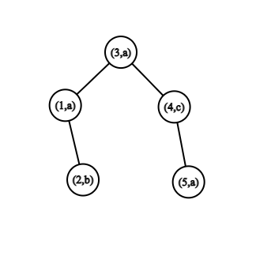
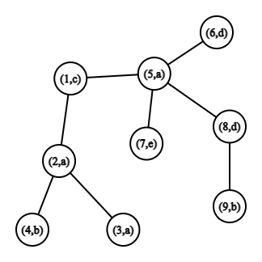

<h1 style='text-align: center;'> D. Hossam and (sub-)palindromic tree</h1>

<h5 style='text-align: center;'>time limit per test: 1 second</h5>
<h5 style='text-align: center;'>memory limit per test: 256 megabytes</h5>

Hossam has an unweighted tree $G$ with letters in vertices.

Hossam defines $s(v, \, u)$ as a string that is obtained by writing down all the letters on the unique simple path from the vertex $v$ to the vertex $u$ in the tree $G$.

A string $a$ is a subsequence of a string $s$ if $a$ can be obtained from $s$ by deletion of several (possibly, zero) letters. For example, "dores", "cf", and "for" are subsequences of "codeforces", while "decor" and "fork" are not.

A palindrome is a string that reads the same from left to right and from right to left. For example, "abacaba" is a palindrome, but "abac" is not.

Hossam defines a sub-palindrome of a string $s$ as a subsequence of $s$, that is a palindrome. For example, "k", "abba" and "abhba" are sub-palindromes of the string "abhbka", but "abka" and "cat" are not.

Hossam defines a maximal sub-palindrome of a string $s$ as a sub-palindrome of $s$, which has the maximal length among all sub-palindromes of $s$. For example, "abhbka" has only one maximal sub-palindrome — "abhba". But it may also be that the string has several maximum sub-palindromes: the string "abcd" has $4$ maximum sub-palindromes.

Help Hossam find the length of the longest maximal sub-palindrome among all $s(v, \, u)$ in the tree $G$.

## Note

 that the sub-palindrome is a subsequence, not a substring.

### Input

The first line contains one integer $t$ ($1 \le t \le 200$) — the number of test cases.

The first line of each test case has one integer number $n$ ($1 \le n \le 2 \cdot 10^3$) — the number of vertices in the graph.

The second line contains a string $s$ of length $n$, the $i$-th symbol of which denotes the letter on the vertex $i$. It is guaranteed that all characters in this string are lowercase English letters.

The next $n - 1$ lines describe the edges of the tree. Each edge is given by two integers $v$ and $u$ ($1 \le v, \, u \le n$, $v \neq u$). These two numbers mean that there is an edge $(v, \, u)$ in the tree. It is guaranteed that the given edges form a tree.

It is guaranteed that sum of all $n$ doesn't exceed $2 \cdot 10^3$.

### Output

For each test case output one integer — the length of the longest maximal sub-palindrome among all $s(v, \, u)$.

## Example

### Input


```text
25abaca1 21 33 44 59caabadedb1 22 32 41 55 65 75 88 9
```
### Output

```text

3
5

```
## Note

In the first example the maximal subpalindromes are "aaa" with letters in vertices $1, \, 3, \, 5$, or "aca" with letters in vertices $1, \, 4, \, 5$.

  The tree from the first example. In the second example there is only one maximal palindrome "bacab" with letters in vertices $4, \, 2, \, 1, \, 5, \, 9$.

  The tree from the second example. 

#### Tags 

#2100 #NOT OK #brute_force #data_structures #dfs_and_similar #dp #strings #trees 

## Blogs
- [All Contest Problems](../Codeforces_Round_837_(Div._2).md)
- [Announcement (en)](../blogs/Announcement_(en).md)
- [Tutorial (en)](../blogs/Tutorial_(en).md)
