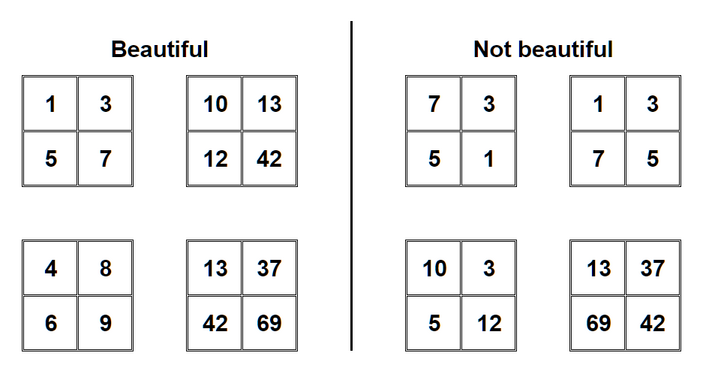
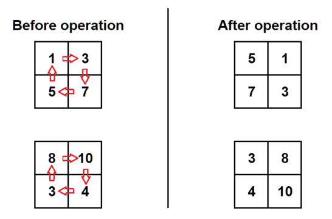

<h1 style='text-align: center;'> B. Matrix Rotation</h1>

<h5 style='text-align: center;'>time limit per test: 2 seconds</h5>
<h5 style='text-align: center;'>memory limit per test: 512 megabytes</h5>

You have a matrix $2 \times 2$ filled with distinct integers. You want your matrix to become beautiful. The matrix is beautiful if the following two conditions are satisfied:

* in each row, the first element is smaller than the second element;
* in each column, the first element is smaller than the second element.

  You can perform the following operation on the matrix any number of times: rotate it clockwise by $90$ degrees, so the top left element shifts to the top right cell, the top right element shifts to the bottom right cell, and so on:

  Determine if it is possible to make the matrix beautiful by applying zero or more operations.

### Input

The first line contains one integer $t$ ($1 \le t \le 1000$) — the number of test cases.

Each test case consists of two lines. Each of those lines contains two integers — the elements of the corresponding row of the matrix. In each matrix, all four elements are distinct integers from $1$ to $100$.

### Output

For each test case, print YES if the matrix can become beautiful, or NO otherwise. You may print each letter in any case (YES, yes, Yes will all be recognized as positive answer, NO, no and nO will all be recognized as negative answer).

## Example

### Input


```text
61 35 78 103 48 104 36 19 27 54 21 24 3
```
### Output

```text

YES
YES
NO
YES
YES
NO

```


#### Tags 

#800 #OK #brute_force #implementation 

## Blogs
- [All Contest Problems](../Codeforces_Round_839_(Div._3).md)
- [Announcement](../blogs/Announcement.md)
- [Tutorial](../blogs/Tutorial.md)
