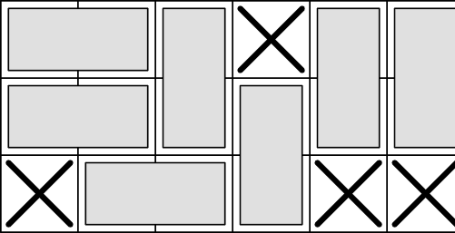

<h1 style='text-align: center;'> D. Dominoes</h1>

<h5 style='text-align: center;'>time limit per test: 3 seconds</h5>
<h5 style='text-align: center;'>memory limit per test: 1024 megabytes</h5>

Dora likes to play with dominoes. She takes $n \times m$ table, marks some cells as occupied, and then tries to fill all unoccupied cells with $2 \times 1$ dominoes.

  Her little brother Dani loves to play pranks on his older sister. So when she is away, he marks two more unoccupied cells as occupied. He wants to do it in such a way that it will be impossible to fill all unoccupied cells with dominoes.

Help Dani to count the number of ways he can select these two cells. Since Dani can only count to one million, if this number of ways is $x$, output $\min(x, 10^6)$.

##### Input

The first line contains integers $n$ and $m$ ($1\le n, m\le 1000$). Next $n$ lines contain $m$ characters each — the initial state of the table. Character "#" corresponds to an occupied cell, and character "." corresponds to an unoccupied cell. It is guaranteed that there are at least two unoccupied cells, and that it is possible to fill all unoccupied cells with dominoes.

##### Output

Let $x$ be the number of ways Dani can mark two cells in such a way that it will be impossible to fill all unoccupied cells with dominoes. 

Print one integer $\min(x, 10^6)$.

## Examples

##### Input


```text
3 6
...#..
......
#...##
```
##### Output


```text
52
```
##### Input


```text
2 2
..
..
```
##### Output


```text
2
```
##### Input


```text
2 2
#.
#.
```
##### Output


```text
0
```


#### Tags 

#2600 #NOT OK #combinatorics #flows #graph_matchings #greedy 

## Blogs
- [All Contest Problems](../2022-2023_ICPC,_NERC,_Northern_Eurasia_Onsite_(Unrated,_Online_Mirror,_ICPC_Rules,_Teams_Preferred).md)
- [Announcement](../blogs/Announcement.md)
