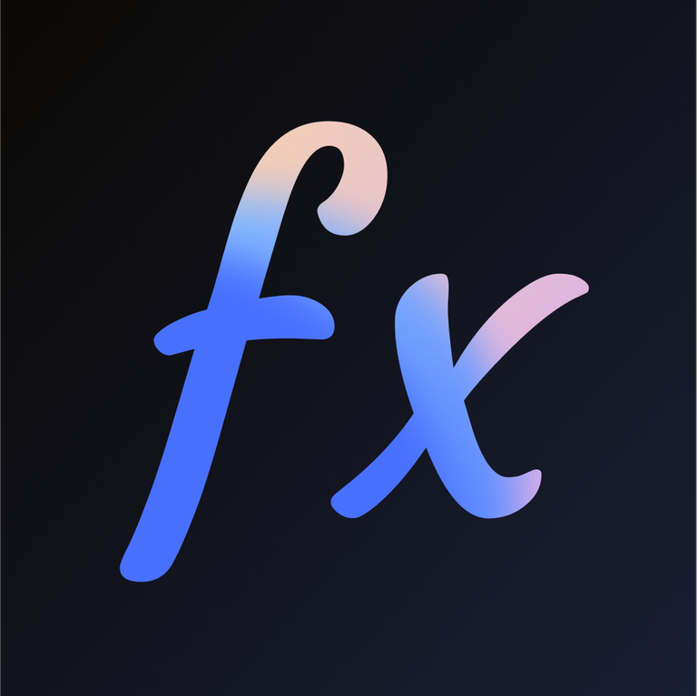

# Announcement_(en)

Hello, Codeforces!

Winter holiday is coming! And we are excited to invite you to our third round, [Polynomial Round 2022 (Div. 1 + Div. 2, Rated, Prizes!)](https://codeforces.com/contest/1774), which will be held on [Saturday, December 17, 2022 at 20:35UTC+6](https://codeforces.com/https://www.timeanddate.com/worldclock/fixedtime.html?day=17&month=12&year=2022&hour=17&min=35&sec=0&p1=166). You are given **8 problems** and **2.5 hours** to solve them.

All problems were written and prepared by [Ecrade_](https://codeforces.com/profile/Ecrade_ "Grandmaster Ecrade_"), [Little09](https://codeforces.com/profile/Little09 "Grandmaster Little09"), [ChthollyNotaSeniorious](https://codeforces.com/profile/ChthollyNotaSeniorious "Master ChthollyNotaSeniorious"), [JianfengZhu](https://codeforces.com/profile/JianfengZhu "Grandmaster JianfengZhu"), [Cirno_9baka](https://codeforces.com/profile/Cirno_9baka "International Grandmaster Cirno_9baka"), [mejiamejia](https://codeforces.com/profile/mejiamejia "Expert mejiamejia") and me. 

And thanks to [dorijanlendvaj](https://codeforces.com/profile/dorijanlendvaj "Legendary Grandmaster dorijanlendvaj"), [gisp_zjz](https://codeforces.com/profile/gisp_zjz "Legendary Grandmaster gisp_zjz"), [gamegame](https://codeforces.com/profile/gamegame "Legendary Grandmaster gamegame"), [triple__a](https://codeforces.com/profile/triple__a "International Grandmaster triple__a"), [Chenyu_Qiu](https://codeforces.com/profile/Chenyu_Qiu "International Grandmaster Chenyu_Qiu"), [Suiseiseki](https://codeforces.com/profile/Suiseiseki "International Grandmaster Suiseiseki"), [aaaaawa](https://codeforces.com/profile/aaaaawa "Grandmaster aaaaawa"), [leukocyte](https://codeforces.com/profile/leukocyte "International Master leukocyte"), [waaitg](https://codeforces.com/profile/waaitg "International Master waaitg"), [Kubic](https://codeforces.com/profile/Kubic "International Grandmaster Kubic"), [LHQing](https://codeforces.com/profile/LHQing "Master LHQing"), [RedLycoris](https://codeforces.com/profile/RedLycoris "Master RedLycoris"), [lucaperju](https://codeforces.com/profile/lucaperju "International Grandmaster lucaperju"), [njupt_lyy](https://codeforces.com/profile/njupt_lyy "Master njupt_lyy"), [Kilo_5723](https://codeforces.com/profile/Kilo_5723 "Grandmaster Kilo_5723"), [Huah](https://codeforces.com/profile/Huah "Grandmaster Huah"), [prvocislo](https://codeforces.com/profile/prvocislo "International Master prvocislo"), [foreverlasting](https://codeforces.com/profile/foreverlasting "Grandmaster foreverlasting"), [thanhchauns2](https://codeforces.com/profile/thanhchauns2 "Candidate Master thanhchauns2"), [Rhodoks](https://codeforces.com/profile/Rhodoks "Grandmaster Rhodoks"), [JohnVictor](https://codeforces.com/profile/JohnVictor "Master JohnVictor"), [Psychotic_D](https://codeforces.com/profile/Psychotic_D "Expert Psychotic_D"), [VinstaG173](https://codeforces.com/profile/VinstaG173 "Candidate Master VinstaG173"), [dannyboy20031204](https://codeforces.com/profile/dannyboy20031204 "Master dannyboy20031204"), [4qqqq](https://codeforces.com/profile/4qqqq "Candidate Master 4qqqq"), [CoupDeGrace](https://codeforces.com/profile/CoupDeGrace "Master CoupDeGrace"), [wsyear](https://codeforces.com/profile/wsyear "International Master wsyear"), [5ab](https://codeforces.com/profile/5ab "International Master 5ab"), [Lavine](https://codeforces.com/profile/Lavine "Master Lavine"), [absi2011](https://codeforces.com/profile/absi2011 "Pupil absi2011"), [UtopianZ](https://codeforces.com/profile/UtopianZ "Candidate Master UtopianZ") for testing and good advice, [antontrygubO_o](https://codeforces.com/profile/antontrygubO_o "International Grandmaster antontrygubO_o") for his excellent round coordination and help with preparation and [MikeMirzayanov](https://codeforces.com/profile/MikeMirzayanov "Headquarters, MikeMirzayanov") for great systems Codeforces and Polygon.And you, for participating!

This is our third round! Although you may find members in our team and testers who helped are not the same as the past, our permanent love and enthusiasm for coding will not change. Conspicuously, great efforts have been put in it. We are sincerely looking forward to your participation and we hope everyone will enjoy it. Besides, this round is sponsored, which indicates that everyone has an opportunity to get the prize!

**UPD1: Here is the score distribution:**

**500 — 1000 — 1500 — 1500 — 2000 — (1500 + 1000) — 3250 — 4000**

UPD2: Sorry to everyone! We must apologize because the pretest of B is not strong, leading to FST for many people. It is our fault! We don't want to make excuses. This time, we did a bad job and let everyone down. We all blamed ourselves sadly. Although we have invited a lot of testers but most of them passed all the tests, and even some of them get 'WA', they fixed their code and passed it. So we didn't pay too much attention to it -- we thought it was 'normal'. However, we didn't suppose the pretests were so weak that lots of participants get FST. Sorry again! (>_<)

And personally, firstly, I must apologize to all of you. I let you down this time. I blamed myself sadly. And I accept all the critical opinions. However, secondly, I know that you must feel angry when you find your B got FST, and that's all our fault, but because my birthday is coming, I intended to use this contest to record the growth of me and my team members, as well as my happy memories on codeforces, so could you please don't scold me too harshly when criticizing me? (Actually I am crying when typing this words; I blamed myself sadly when I saw lots of FST). I will regard all your comments as the most valuable things which urge me to become a better person and help me grow to a more mature person, but maybe I will be very painful if I see comments or messages as 'you are a trash''trash round'. (⑉꒦ິ^꒦ິ⑉)

Sorry! We did a bad job because of our carelessness this time, but we promise we will try our best to improve our comprehensive abilities, and bring a better round next time! We will keep in mind every word of encouragement and criticism, which is the driving force for our growth. Wish you happy everyday! (•ω•)

**UPD3: [Tutorial](Tutorial_(en).md) is available.** 

Thanks for all the warmth and kindness!!! I felt deeply guilty during the past few hours, now I feel better. I really appreciate your warmth and kindness!!! (●'◡'●)

We made the contest just because we would like to share our interesting ideas with you. If you like any of the ideas, we will be very delighted!!! o(≥ω≤)o

**UPD4:Congratulations to the winners**

 1. [Um_nik](https://codeforces.com/profile/Um_nik "Legendary Grandmaster Um_nik")
2. [maroonrk](https://codeforces.com/profile/maroonrk "Legendary Grandmaster maroonrk")
3. [tourist](https://codeforces.com/profile/tourist "Legendary Grandmaster tourist")
4. [inaFSTream](https://codeforces.com/profile/inaFSTream "Legendary Grandmaster inaFSTream")
5. [ksun48](https://codeforces.com/profile/ksun48 "Legendary Grandmaster ksun48")
6. [LJC00118](https://codeforces.com/profile/LJC00118 "Legendary Grandmaster LJC00118")
7. [ugly2333](https://codeforces.com/profile/ugly2333 "Legendary Grandmaster ugly2333")
8. [bruhopen](https://codeforces.com/profile/bruhopen "Master bruhopen")
9. [ecnerwala](https://codeforces.com/profile/ecnerwala "Legendary Grandmaster ecnerwala")
10. [Rewinding](https://codeforces.com/profile/Rewinding "Legendary Grandmaster Rewinding")

And for my personal gifts: the two random number is 91 and 1028, so congratulations to [sd0061](https://codeforces.com/profile/sd0061 "Grandmaster sd0061") and [regain0001](https://codeforces.com/profile/regain0001 "Expert regain0001")!!! (The rank contained the virtual participants at that time, which improves randomness, only if the time and the rank both accorded with the number , you can get the gifts!!!) o(〃'▽'〃)o 

Thanks to all the warmth and kindness!!! You really light up my heart!!! We will try our best next time and prepare a better round to share our interesting ideas with you!!! ✧⁺(๑•ω•๑)⁺✧ 

   And here is the information from our title sponsor:

**Prizes**

The participants who end up in the first 255 positions will receive prizes. The participant on the first place will receive $256, the next two participants will receive $128, the next four participants will receive $64, etc. Prizes will be distributed in OP (Optimism) tokens.

**About Polynomial**

Polynomial is building in decentralized finance – a more fair, accessible, efficient, and transparent financial system enabled by crypto. Polynomial automates financial derivative strategies to create products that deliver passive yield on various assets. Polynomial Earn is the first DeFi Options Vault (DOV) that executes completely on-chain by selling options directly to an AMM.

If you have a background in mathematics or software engineering and a knack for problem-solving, we want to hear from you. You will have the opportunity to work on cutting-edge technology and tackle complex problems alongside a talented and driven team. 

  [Contact form →](https://codeforces.com/userForm/2cfa68fdb526c70f) By joining us at this early stage, you will make fundamental decisions that will shape the course of Polynomial. We prefer passionate, quick learners with a history of excellence.

Find out more about us on our website [polynomial.fi](https://codeforces.com/https://www.polynomial.fi/) or texting [rivalq](https://codeforces.com/profile/rivalq "Grandmaster rivalq").

If you wish to be part of our remote-first team or apply for an internship, please [fill in the form](https://codeforces.com/userForm/2cfa68fdb526c70f) or email [gautham@polynomial.fi](https://codeforces.com/mailto:gautham@polynomial.fi). Make sure to apply before Dec 20, 2022.

We wish everyone good luck and have a positive delta!

