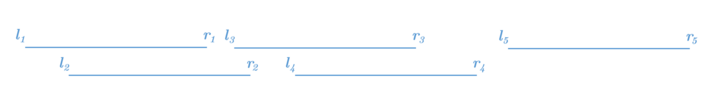
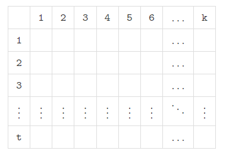
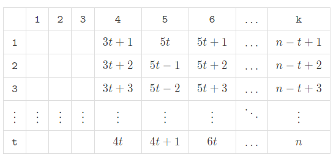
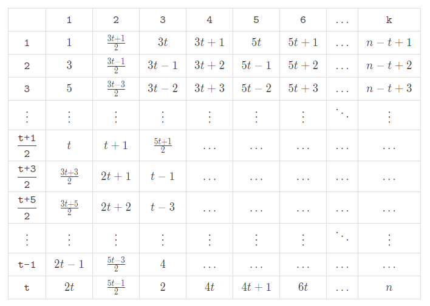
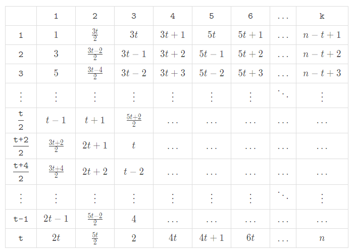
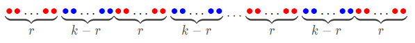

# Tutorial_(en)

Thanks for your participation! I am so sorry for my careless review. We were preparing for this round for many months and made some problems which writers and testers are all like. We do want to give everyone a good time to enjoy the contest. But carelessness is deadly. In problem B, some test cases should have been made, but we missed them in not only the pretests but also the final tests. In fact, we had not noticed it until some suspicious hacks appeared. I and all co-authors sincerely regret our mistake and hope you can forgive us.

Besides, few people are cyberbullying authors, please do not do so. If you have a bad experience, you can downvote me because of our fault.

[1774A - Add Plus Minus Sign](../problems/A._Add_Plus_Minus_Sign.md)  
Idea: [Cirno_9baka](https://codeforces.com/profile/Cirno_9baka "International Grandmaster Cirno_9baka")

 **Solution**The answer is the number of 1s modulo 2.

We can get that by adding '-' before the 2nd,4th,⋯,2k-th 1, and '+' before the 3rd,5th,⋯,2k+1-th 1.

 **Code**
```cpp
#include <bits/stdc++.h>
using namespace std;

char c[1005];
int main() {
  int t;
  scanf("%d", &t);
  int n;
  while (t--) {
    scanf("%d", &n);
    scanf("%s", c + 1);
    int u = 0;
    for (int i = 1; i <= n; ++i) {
      bool fl = (c[i] == '1') && u;
      u ^= (c[i] - '0');
      if (i != 1) putchar(fl ? '-' : '+');
    }
    putchar('n');
  }
}

```
[1774B - Coloring](../problems/B._Coloring.md)  
Idea: [Cirno_9baka](https://codeforces.com/profile/Cirno_9baka "International Grandmaster Cirno_9baka")

 **Solution**First, We can divide n cells into ⌈nk⌉ segments that except the last segment, all segments have length k. Then in each segment, the colors in it are pairwise different. It's easy to find any ai should be smaller than or equal to ⌈nk⌉.

Then we can count the number of ai which is equal to ⌈nk⌉. This number must be smaller than or equal to nmodk, which is the length of the last segment.

All a that satisfies the conditions above is valid. We can construct a coloring using the method below:

First, we pick out all colors i that ai=⌈nk⌉, then we use color i to color the j-th cell in each segment.

Then we pick out all colors i that ai<⌈nk⌉−1 and use these colors to color the rest of cells with cyclic order(i.e. color j-th cell of the first segment, of second the segment ... of the ⌈nk⌉ segment, and let j+1. when one color is used up, we begin to use the next color)

At last, we pick out all colors i that ai=⌈nk⌉−1, and color them with the cyclic order.

This method will always give a valid construction.

 **Code**
```cpp
#include <bits/stdc++.h>
using namespace std;

int main() {
  int t;
  scanf("%d", &t);
  while (t--) {
    int n, m, k;
    scanf("%d %d %d", &n, &m, &k);
    int fl = 0;
    for (int i = 1; i <= m; ++i) {
      int a;
      scanf("%d", &a);
      if (a == (n + k - 1) / k) ++fl;
      if (a > (n + k - 1) / k) fl = 1 << 30;
    }
    puts(fl <= (n - 1) % k + 1 ? "YES" : "NO");
  }
}
```
[1774C - Ice and Fire](../problems/C._Ice_and_Fire.md)  
Idea: [Little09](https://codeforces.com/profile/Little09 "Grandmaster Little09")

 **Solution**We define fi to mean that the maximum x satisfies si−x+1=si−x+2=...=si.

It can be proved that for x players, fx−1 players are bound to lose and the rest have a chance to win. So the answer to the first i battles is ansi=i−fi+1.

Next, we prove this conclusion. Suppose there are n players and n−1 battles, and sn−1=1, and there are x consecutive 1 at the end. If x=n−1, then obviously only the n-th player can win. Otherwise, sn−1−x must be 0. Consider the following facts:

 1. Players 1 to x have no chance to win. If the player i (1≤i≤x) can win, he must defeat the player whose temperature value is lower than him in the last x battles. However, in total, only the i−1 player's temperature value is lower than his. Because i−1<x, the i-th player cannot win.
2. Players from x+1 to n have a chance to win. For the player i (x+1≤i≤n), we can construct: in the first n−2−x battles, we let all players whose temperature value in [x+1,n] except the player i fight so that only one player will remain. In the (n−1−x)-th battle, we let the remaining player fight with the player 1. Since sn−1−x=0, the player 1 will win. Then there are only the first x players and the player i in the remaining x battles, so the player i can win.

For sn−1=0, the situation is similar and it will not be repeated here.

 **Code**
```cpp
#include <bits/stdc++.h>
using namespace std;

const int N = 300005;
int T, n, ps[2];
char a[N];

void solve() {
  scanf("%d %s", &n, a + 1);
  ps[0] = ps[1] = 0;
  for (int i = 1; i < n; ++i) {
    ps[a[i] - 48] = i;
    if (a[i] == '0')
      printf("%d ", ps[1] + 1);
    else
      printf("%d ", ps[0] + 1);
  }
  putchar('n');
}
int main() {
  scanf("%d", &T);
  while (T--) solve();
  return 0;
}
```
[1774D - Same Count One](../problems/D._Same_Count_One.md)  
Idea: [mejiamejia](https://codeforces.com/profile/mejiamejia "Expert mejiamejia") and [AquaMoon](https://codeforces.com/profile/AquaMoon "International Master AquaMoon")

 **Solution**Considering that we need to make the number of 1s in each array the same, we should calculate the sum of 1s, and every array has sum/n 1s. Because only the same position of two different arrays can be selected for exchange each time, for a position pos, we traverse each array each time. If the number of 1s in this array is not enough, then we need to turn some 0s into 1s; If the number of 1s in this array is more than we need, then some 1s should be turned into 0s. It can be proved that as long as the total number of 1s is a multiple of n, the number of 1s in each array can be made the same through exchanges.

 **Code**
```cpp
#include <bits/stdc++.h>

int main() {
  int T;
  scanf("%d", &T);
  while (T--) {
    int n, m;
    scanf("%d %d", &n, &m);
    std::vector<std::vector<int>> A(n, std::vector<int>(m, 0));
    std::vector<int> sum(n, 0);
    for (int i = 0; i < n; ++i) {
      for (int j = 0; j < m; ++j) {
        scanf("%d", &A[i][j]);
        sum[i] += A[i][j];
      }
    }
    int tot = 0;
    for (int i = 0; i < n; ++i) tot += sum[i];
    if (tot % n) {
      puts("-1");
      continue;
    }
    tot /= n;
    std::vector<std::tuple<int, int, int>> ans;
    std::vector<int> Vg, Vl;
    Vg.reserve(n), Vl.reserve(n);
    for (int j = 0; j < m; ++j) {
      for (int i = 0; i < n; ++i) {
        if (sum[i] > tot && A[i][j]) Vg.push_back(i);
        if (sum[i] < tot && !A[i][j]) Vl.push_back(i);
      }
      for (int i = 0; i < (int)std::min(Vl.size(), Vg.size()); ++i) {
        ++sum[Vl[i]], --sum[Vg[i]];
        ans.emplace_back(Vl[i], Vg[i], j);
      }
      Vl.clear(), Vg.clear();
    }
    printf("%dn", (int)ans.size());
    for (auto [i, j, k] : ans) printf("%d %d %dn", i + 1, j + 1, k + 1);
  }
  return 0;
}
```
[1774E - Two Chess Pieces](../problems/E._Two_Chess_Pieces.md)  
Idea: [Cirno_9baka](https://codeforces.com/profile/Cirno_9baka "International Grandmaster Cirno_9baka")

 **Solution**We can find that for any d-th ancestor of some bi, the first piece must pass it some time. Otherwise, we will violate the distance limit. The second piece must pass the d-th ancestor of each bi as well. Then we can add the d-th ancestor of each ai to the array b, and add the d-th ancestor of each bi to the array a.

Then we can find now we can find a solution that each piece only needs to visit its nodes using the shortest route, without considering the limit of d, and the total length can be easily computed. We can find that if we adopt the strategy that we visit these nodes according to their DFS order(we merge the array of a and b, and sort them according to the DFS order, if the first one is from a, we try to move the first piece to this position, otherwise use the second piece), and move the other piece one step closer to the present piece only if the next step of the present piece will violate the distance limit, then we can ensure the movement exactly just let each piece visit its necessary node without extra operations.

 **Code**
```cpp
#include <bits/stdc++.h>
using namespace std;

const int N = 1e6 + 5;
int t[N * 2], nxt[N * 2], cnt, h[N];
int n, d;
void add(int x, int y) {
  t[++cnt] = y;
  nxt[cnt] = h[x];
  h[x] = cnt;
}
int a[N], b[N];
bool f[2][N];
void dfs1(int x, int fa, int dis) {
  a[dis] = x;
  if (dis > d)
    b[x] = a[dis - d];
  else
    b[x] = 1;
  for (int i = h[x]; i; i = nxt[i]) {
    if (t[i] == fa) continue;
    dfs1(t[i], x, dis + 1);
  }
}
void dfs2(int x, int fa, int tp) {
  bool u = 0;
  for (int i = h[x]; i; i = nxt[i]) {
    if (t[i] == fa) continue;
    dfs2(t[i], x, tp);
    u |= f[tp][t[i]];
  }
  f[tp][x] |= u;
}

int main() {
  ios_base::sync_with_stdio(false);
  cin.tie(0);
  cout.tie(0);
  cin >> n >> d;
  for (int i = 1; i < n; i++) {
    int x, y;
    cin >> x >> y;
    add(x, y), add(y, x);
  }
  dfs1(1, 0, 1);
  for (int i = 0; i <= 1; i++) {
    int num;
    cin >> num;
    for (int j = 1; j <= num; j++) {
      int x;
      cin >> x;
      f[i][x] = 1, f[i ^ 1][b[x]] = 1;
    }
  }
  for (int i = 0; i <= 1; i++) dfs2(1, 0, i);
  int ans = 0;
  for (int i = 0; i <= 1; i++)
    for (int j = 2; j <= n; j++)
      if (f[i][j]) ans += 2;
  cout << ans;
  return 0;
}
```
[1774F1 - Magician and Pigs (Easy Version)](../problems/F1._Magician_and_Pigs_(Easy_Version).md)  
Idea: [Little09](https://codeforces.com/profile/Little09 "Grandmaster Little09")

 **Solution**Let X=maxx.

Think about what ‘Repeat’ is doing. Assuming the total damage is tot (tot is easy to calculate because it will be multiplied by 2 after each ‘Repeat’ and be added after each ‘Attack’). After repeating, each pig with a current HP of w (w>tot) will clone a pig with a HP of w−tot.

Why? ‘Repeat’ will do what you just did again, so each original pig will certainly create a pig the same as it, and it will be attacked by tot, so it can be considered that a pig with w−tot HP has been cloned.

Next, the problem is to maintain a multiset S, which supports: adding a number, subtracting x for all numbers, and inserting each number after subtracting tot. Find the number of positive elements in the final multiset.

tot in ‘Repeat’ after the first ‘Attack’ will multiply by 2 every time, so it will exceed X in O(logX) times. That is, only O(logX) ‘Repeat’ operations are effective. So we can maintain S in brute force. Every time we do ‘Repeat’, we take out all the numbers larger than tot, then subtract and insert them again. Note that we may do some ‘Repeat’ operations when tot=0, which will result in the number of pigs generated before multiplying by 2. Therefore, we also need to maintain the total multiplication.

If you use map to maintain it, the time complexity is O((n+X)log2X). It can pass F1. You can also use some ways to make the time complexity O((n+X)logX).

 **Code**
```cpp
// Author: Little09
// Problem: F. Magician and Pigs (Easy Version)

#include <bits/stdc++.h>
using namespace std;

#define ll long long
const ll mod = 998244353, inv = (mod + 1) / 2;
int n;
map<ll, ll> s;
ll tot, mul = 1, ts = 1;
inline void add(ll &x, ll y) { (x += y) >= mod && (x -= mod); }

int main() {
  ios_base::sync_with_stdio(false);
  cin.tie(0);
  cout.tie(0);
  cin >> n;
  while (n--) {
    int op;
    cin >> op;
    if (op == 1) {
      ll x;
      cin >> x;
      add(s[x + tot], ts);
    } else if (op == 2) {
      ll x;
      cin >> x;
      tot += x;
    } else if (tot <= 2e5) {
      if (tot == 0)
        mul = mul * 2 % mod, ts = ts * inv % mod;
      else {
        for (ll i = tot + 2e5; i > tot; i--) add(s[i + tot], s[i]);
        tot *= 2;
      }
    }
  }
  ll res = 0;
  for (auto i : s)
    if (i.first > tot) add(res, i.second);
  res = res * mul % mod;
  cout << res;
  return 0;
}
```
[1774F2 - Magician and Pigs (Hard Version)](../problems/F2._Magician_and_Pigs_(Hard_Version).md)  
Idea: [Little09](https://codeforces.com/profile/Little09 "Grandmaster Little09")

 **Solution**For F1, there is another way. Consider every pig. When `Repeat`, it will clone, and when `Attack`, all its clones will be attacked together. Therefore, considering all the operations behind each pig, you can choose to reduce x (the current total damage) or not when `Repeat`, and you must choose to reduce x when `Attack`. Any final choice will become a pig (living or not).

We just need to calculate how many `Repeat` choices can make a living pig. For `Repeat` of x=0, there is no difference between the two choices. For the `Repeat` of x≥2×105, it is obvious that you can only choose not to reduce x. Except for the above parts, there are only O(logx) choices. You can just find a subset or use knapsack to solve it. It can also pass F1 and the time complexity is O((n+X)logX).

The bottleneck of using this method to do F2 lies in the backpack. The problem is that we need to find how many subsets whose sum <x of of a set whose size is O(logX).

Observation: if you sort the set, each element is greater than the sum of all elements smaller than it. We can use observation to solve the problem. Consider each element from large to small. Suppose you now need to find elements and subsets of <x. If the current element ≥x, it must not be selected; If the current element <x, if it is not selected, the following elements can be selected at will (the sum of all the following elements is less than it). It can be recursive. Thus, for a given x, we can find the number of subsets whose sum <x within O(logX).

The time complexity is O(nlogX).

 **Code**
```cpp
// Author: Little09
// Problem: F. Magician and Pigs

#include <bits/stdc++.h>
using namespace std;

#define ll long long
#define mem(x) memset(x, 0, sizeof(x))
#define endl "n"
#define printYes cout << "Yesn"
#define printYES cout << "YESn"
#define printNo cout << "Non"
#define printNO cout << "NOn"
#define lowbit(x) ((x) & (-(x)))
#define pb push_back
#define mp make_pair
#define pii pair<int, int>
#define fi first
#define se second

const ll inf = 1000000000000000000;
// const ll inf=1000000000;
const ll mod = 998244353;
// const ll mod=1000000007;

const int N = 800005;
int n, m;
ll a[N], b[N], c[N], cnt, s[N], d[N], cntd;

int main() {
  ios_base::sync_with_stdio(false);
  cin.tie(0);
  cout.tie(0);
  cin >> n;
  ll maxs = 1e9, sum = 0;
  for (int i = 1; i <= n; i++) {
    cin >> a[i];
    if (a[i] != 3) cin >> b[i];
    if (a[i] == 2) sum += b[i];
    sum = min(sum, maxs);
    if (a[i] == 3) b[i] = sum, sum = sum * 2;
    sum = min(sum, maxs);
  }
  sum = 0;
  ll res = 1, ans = 0;
  for (int i = n; i >= 1; i--) {
    if (a[i] == 2)
      sum += b[i];
    else if (a[i] == 3) {
      if (b[i] == maxs) continue;
      if (b[i] == 0) {
        res = res * 2 % mod;
        continue;
      }
      c[++cnt] = b[i];
    } else {
      b[i] -= sum;
      if (b[i] <= 0) continue;
      ll su = 0, r = b[i];
      for (int j = 1; j <= cnt; j++) {
        if (r > c[j]) {
          su = (su + (1ll << (cnt - j))) % mod;
          r -= c[j];
        }
      }
      su = (su + 1) % mod;
      ans = (ans + su * res) % mod;
    }
  }
  cout << ans;
  return 0;
}
```
[1774G - Segment Covering](../problems/G._Segment_Covering.md)  
Idea: [ChthollyNotaSeniorious](https://codeforces.com/profile/ChthollyNotaSeniorious "Master ChthollyNotaSeniorious") and [JianfengZhu](https://codeforces.com/profile/JianfengZhu "Grandmaster JianfengZhu")

 **Hint 1**If there exist two segments (l1,r1),(l2,r2) such that l1≤l2≤r2≤r1 and we choose (l1,r1), number of ways of choosing (l2,r2) at the same time will be equal to that of not choosing. Hence if we choose (l1,r1), the signed number of ways will be 0. So we can delete (l1,r1).

 **Hint 2**It can be proved that the absolute value of every fl,r−gl,r doesn't exceed 1.

Proof: First, find segments (li,ri) which are completely contained by (l,r).

Let us sort (li,ri) in ascending order of li. As there does not exist a segment that contains another, ri are also sorted.

Assume that l2<l3≤r1 and r3≥r2. If we choose segments 1 and 3, choosing 2 or not will be the same except for the sign. So 3 is useless. So we can delete such useless segments. After the process, l3>r1,l4>r2,⋯ will be held. If [l1,r1]∪[l2,r2]∪⋯∪[lk,rk]=[l,r], answer will be (−1)k, else answer will be 0.

 **Solution**This picture shows what the segments eventually are like:



For [li,ri], we can find the lowest j such that lj>ri and construct a tree by linking such i and j. Then the LCA of 1 and 2 will be 5, where the answer becomes 0.

So we can get the answer of (ql,qr) quickly by simply finding the LCA of two segments -- the segment starting with ql (if no segment starts with ql, the answer is 0), and the first segment whose l is greater than ql (if it do not intersect with the previous segment, the answer is 0).

And find the segment ending with qr. If it is on the path of the two segments, the answer will be ±1. Else, the answer will be 0.

 **Code**
```cpp
#include <bits/stdc++.h>

#define File(a) freopen(a ".in", "r", stdin), freopen(a ".out", "w", stdout)

using tp = std::tuple<int, int, int>;
const int sgn[] = {1, 998244352};
const int N = 200005;

int x[N], y[N];
std::vector<tp> V;
bool del[N];
int fa[20][N];
int m, q;

int main() {
  scanf("%d %d", &m, &q);
  for (int i = 1; i <= m; ++i)
    scanf("%d %d", x + i, y + i), V.emplace_back(y[i], -x[i], i);
  std::sort(V.begin(), V.end());
  int mxl = 0;
  for (auto [y, x, i] : V) {
    if (-x <= mxl) del[i] = true;
    mxl = std::max(mxl, -x);
  }
  V.clear();
  x[m + 1] = y[m + 1] = 1e9 + 1;
  for (int i = 1; i <= m + 1; ++i) {
    if (!del[i]) V.emplace_back(x[i], y[i], i);
  }
  std::sort(V.begin(), V.end());
  for (auto [x, y, id] : V) {
    int t = std::get<2>(*std::lower_bound(V.begin(), V.end(), tp{y + 1, 0, 0}));
    fa[0][id] = t;
  }
  fa[0][m + 1] = m + 1;
  for (int k = 1; k <= 17; ++k) {
    for (int i = 1; i <= m + 1; ++i) fa[k][i] = fa[k - 1][fa[k - 1][i]];
  }
  for (int i = 1; i <= q; ++i) {
    int l, r;
    scanf("%d %d", &l, &r);
    int u = std::lower_bound(V.begin(), V.end(), tp{l, 0, 0}) - V.begin(), v = u + 1;
    u = std::get<2>(V[u]);
    if (x[u] != l || y[u] > r) {
      puts("0");
      continue;
    }
    if (y[u] == r) {
      puts("998244352");
      continue;
    }
    v = std::get<2>(V[v]);
    if (y[v] > r || x[v] > y[u]) {
      puts("0");
      continue;
    }
    int numu = 0, numv = 0;
    for (int i = 17; i >= 0; --i) {
      if (y[fa[i][u]] <= r) {
        u = fa[i][u];
        numu += !i;
      }
    }
    for (int i = 17; i >= 0; --i) {
      if (y[fa[i][v]] <= r) {
        v = fa[i][v];
        numv += !i;
      }
    }
    if (u == v || (y[u] != r && y[v] != r))
      puts("0");
    else
      printf("%dn", sgn[numu ^ numv]);
  }
  return 0;
}
```
[1774H - Maximum Permutation](../problems/H._Maximum_Permutation.md)  
Idea: [Ecrade_](https://codeforces.com/profile/Ecrade_ "Grandmaster Ecrade_")

 **Solution**When it seems to be hard to come up with the whole solution directly, simplified questions can often be a great helper. So first let us consider the case where n is the multiple of k.

Let t=nk.

What is the largest value one can obtain theoretically? Pick out t subsegments a[1:k],a[k+1:2k],…,a[n−k+1:n], and one can see that the answer cannot be greater than the average value of the sum of each subsegment, that is n(n+1)2t=k(n+1)2.

#### Case 1: k is even

If k is even, one can construct a=[1,n,2,n−1,3,n−2,…,n2,n2+1] to reach the maximum value.

#### Case 2: k is odd

For easy understanding let us put a[1:k],a[k+1:2k],…,a[n−k+1:n] into a t×k table from top to bottom like this:



Note that the difference value between two consecutive subsegments is equal to the difference value between two values in the same column in this table. It inspires us to fill in the last k−3 columns in an S-shaped way like this:



Then our goal is to split the remaining 3t numbers into 3 groups and minimize the difference value between the sum of each group.

If n is odd, the theoretical maximum value mentioned above is an integer, and the sum of each group must be equal to reach that value. Otherwise, the theoretical maximum value mentioned above is not an integer, and the sum of each group cannot be determined. So let us first consider the case where n is odd. A feasible approach to split the numbers is as follows:

 (1,3t+12,3t),(3,3t−12,3t−1),…,(t,t+1,5t+12),(2,2t,5t−12),(4,2t−1,5t−32),…,(t−1,3t+32,2t+1)Then fill them into the table:



Similarly, one can come up with an approach when n is even:



Okay, it's time for us to go back to the original problem.

Let n=qk+r (r,q∈N,1≤r<k).

Split n elements like this:



As shown in the picture, there are (q+1) red subsegments with r elements each, and q blue subsegments with (k−r) elements each. What is the largest value one can obtain theoretically now? Pick out q non-intersecting subsegments consisting of a whole red subsegment and a whole blue segement each, and one can see that the answer cannot be greater than the average value of the sum of each subsegment, that is the sum of 1∼n subtracted by the sum of any whole red subsegment, then divide by q. Similarly, the answer cannot be greater than the sum of 1∼n added by the sum of any whole blue subsegment, then divide by (q+1).

Thus, our goal is to make the maximum sum of each red subsegment the minimum, and make the minimum sum of each blue subsegment the maximum. Now here comes an interesting claim: it can be proved that,

 * If r≠1 and k−r≠1, one can fill the red subsegments using the method when n is the multiple of k (here n′=(q+1)r,k′=r ) with 1∼(q+1)r, and the blue subsegments (here n′=q(k−r),k′=k−r ) with the remaining numbers;
* If r=1, one can fill the red subsegments with 1∼(q+1) from left to right, and the first element of the blue subsegments with (q+2)∼(2q+1) from right to left, and the blue subsegments without the first element using the method when n is the multiple of k (here n′=q(k−2),k′=k−2 ) with the remaining numbers;
* If k−r=1 and q=1, one can let ak=n, and fill the rest two subsegments using the method when n is the multiple of k (here n′=n−1,k′=k−1 ) with the remaining numbers;
* If k−r=1 and q>1, one can fill the blue subsegments with (n−q+1)∼n from right to left, and the first element of the red subsegments with 1∼(q+1) from right to left, and the red subsegments without the first element using the method when n is the multiple of k (here n′=(q+1)(r−1),k′=r−1 ) with the remaining numbers,

then the constraints can both be satisfied and the value of the permutation is theoretically maximum. The proof is omitted here.

Time complexity: O(∑n)

**Bonus: solve the problem if k≥2.**

 **Code**
```cpp
#include<bits/stdc++.h>
using namespace std;

typedef long long ll;
ll t,n,k,seq[100009],ans[100009];
inline ll read(){
  ll s = 0,w = 1;
  char ch = getchar();
  while (ch > '9' || ch < '0'){ if (ch == '-') w = -1; ch = getchar();}
  while (ch <= '9' && ch >= '0') s = (s << 1) + (s << 3) + (ch ^ 48),ch = getchar();
  return s * w;
}

ll f(ll x,ll y,ll k){return (x - 1) * k + y;}
void get(ll n,ll k){
  if (!(k & 1)){
    for (ll i = 1;i <= n >> 1;i += 1) seq[(i << 1) - 1] = i,seq[i << 1] = n + 1 - i;
    return;
  }
  ll m = n / k,cur = 3 * m;
  for (ll i = 4;i <= k;i += 1){
    if (i & 1) for (ll j = m;j >= 1;j -= 1) seq[f(j,i,k)] = ++ cur;
    else for (ll j = 1;j <= m;j += 1) seq[f(j,i,k)] = ++ cur;
  }
  for (ll i = 1;i <= (m + 1 >> 1);i += 1){
    seq[f(i,1,k)] = (i << 1) - 1;
    seq[f(i,2,k)] = ((3 * m + 3) >> 1) - i;
    seq[f(i,3,k)] = 3 * m - i + 1;
  }
  for (ll i = (m + 3 >> 1);i <= m;i += 1){
    ll delta = i - (m + 3 >> 1);
    seq[f(i,1,k)] = ((3 * m + 3) >> 1) + delta;
    seq[f(i,2,k)] = (m << 1) + 1 + delta;
    seq[f(i,3,k)] = m - (m & 1) - (delta << 1);
  }
}
void print(){
  ll res = 0,sum = 0;
  for (ll i = 1;i <= k;i += 1) sum += ans[i];
  res = sum;
  for (ll i = k + 1;i <= n;i += 1) sum += ans[i] - ans[i - k],res = min(res,sum);
  printf("%lldn",res);
  for (ll i = 1;i <= n;i += 1) printf("%lld ",ans[i]);
  puts("");
}

int main(){
  t = read();
  while (t --){
    n = read(),k = read();
    if (!(n % k)){
      get(n,k);
      for (ll i = 1;i <= n;i += 1) ans[i] = seq[i];
      print();
      continue;
    }
    ll q = n / k,r = n % k;
    if (r == 1){
      ll cur = 0,delta = (q << 1) + 1;
      for (ll i = 1;i <= n;i += k) ans[i] = ++ cur;
      for (ll i = n - k + 1;i >= 2;i -= k) ans[i] = ++ cur;
      get(q * (k - 2),k - 2),cur = 0;
      for (ll i = 3;i <= n;i += k) for (ll j = i;j <= i + k - 3;j += 1) ans[j] = seq[++ cur] + delta;
      print();
      continue;
    }
    if (k - r == 1){
      if (q == 1){
        ll cur = 0;
        ans[k] = n;
        get(n - 1,k - 1);
        for (ll i = 1;i < k;i += 1) ans[i] = seq[++ cur];
        for (ll i = k + 1;i <= n;i += 1) ans[i] = seq[++ cur];
        print();
        continue;
      }
      ll cur = n + 1,delta = q + 1;
      for (ll i = k;i <= n;i += k) ans[i] = -- cur;
      cur = 0;
      for (ll i = 1;i <= n;i += k) ans[i] = ++ cur;
      get((q + 1) * (r - 1),r - 1),cur = 0;
      for (ll i = 2;i <= n;i += k) for (ll j = i;j <= i + r - 2;j += 1) ans[j] = seq[++ cur] + delta;
      print();
      continue;
    }
    ll cur = 0,delta = (q + 1) * r;
    get((q + 1) * r,r);
    for (ll i = 1;i <= n;i += k) for (ll j = i;j <= i + r - 1;j += 1) ans[j] = seq[++ cur];
    get(q * (k - r),k - r),cur = 0;
    for (ll i = r + 1;i <= n;i += k) for (ll j = i;j <= i + (k - r) - 1;j += 1) ans[j] = seq[++ cur] + delta;
    print();
  }
  return 0;
}
```
