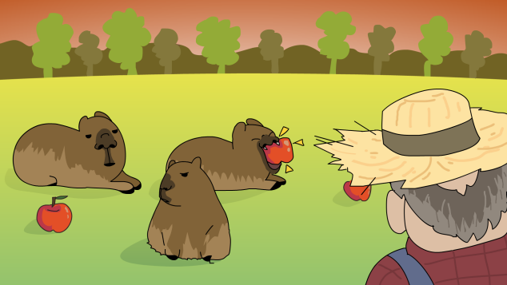

<h1 style='text-align: center;'> A2. Gardener and the Capybaras (hard version)</h1>

<h5 style='text-align: center;'>time limit per test: 1 second</h5>
<h5 style='text-align: center;'>memory limit per test: 256 megabytes</h5>

This is an hard version of the problem. The difference between the versions is that the string can be longer than in the easy version. You can only do hacks if both versions of the problem are passed.

Kazimir Kazimirovich is a Martian gardener. He has a huge orchard of binary balanced apple trees.

Recently Casimir decided to get himself three capybaras. The gardener even came up with their names and wrote them down on a piece of paper. The name of each capybara is a non-empty line consisting of letters "a" and "b".

Denote the names of the capybaras by the lines $a$, $b$, and $c$. Then Casimir wrote the nonempty lines $a$, $b$, and $c$ in a row without spaces. For example, if the capybara's name was "aba", "ab", and "bb", then the string the gardener wrote down would look like "abaabbb".

The gardener remembered an interesting property: either the string $b$ is lexicographically not smaller than the strings $a$ and $c$ at the same time, or the string $b$ is lexicographically not greater than the strings $a$ and $c$ at the same time. In other words, either $a \le b$ and $c \le b$ are satisfied, or $b \le a$ and $b \le c$ are satisfied (or possibly both conditions simultaneously). Here $\le$ denotes the lexicographic "less than or equal to" for strings. Thus, $a \le b$ means that the strings must either be equal, or the string $a$ must stand earlier in the dictionary than the string $b$. For a more detailed explanation of this operation, see "
## Note

s" section.

Today the gardener looked at his notes and realized that he cannot recover the names because they are written without spaces. He is no longer sure if he can recover the original strings $a$, $b$, and $c$, so he wants to find any triplet of names that satisfy the above property.

  
### Input

Each test contains multiple test cases. The first line contains the number of test cases $t$ ($1 \le t \le 10^4$). The description of the test cases follows.

The only line of a test case contains the string $s$ ($3 \le |s| \le 2 \cdot 10^5$) — the names of the capybaras, written together. The string consists of English letters 'a' and 'b' only.

It is guaranteed that the sum of string lengths over all test cases does not exceed $4 \cdot 10^5$.

### Output

For each test case, print three strings $a$, $b$ and $c$ on a single line, separated by spaces — names of capybaras, such that writing them without spaces results in a line $s$. Either $a \le b$ and $c \le b$, or $b \le a$ and $b \le c$ must be satisfied.

If there are several ways to restore the names, print any of them. If the names cannot be recovered, print ":(" (without quotes).

## Example

### Input


```text
5bbbaabaaaaabbaabbb
```
### Output

```text

b bb a
a b a
a a a
ab b a
a bb b
```
## Note

A string $x$ is lexicographically smaller than a string $y$ if and only if one of the following holds: 

* $x$ is a prefix of $y$, but $x \ne y$;
* in the first position where $x$ and $y$ differ, the string $x$ has the letter 'a', and the string $y$ has the letter 'b'.

Now let's move on to the examples.

In the first test case, one of the possible ways to split the line $s$ into three lines —is "b", "bb", "a".

In the third test case, we can see that the split satisfies two conditions at once (i.e., $a \le b$, $c \le b$, $b \le a$ and $b \le c$ are true simultaneously).


#### Tags 

#900 #NOT OK #constructive_algorithms #greedy 

## Blogs
- [All Contest Problems](../Codeforces_Round_843_(Div._2).md)
- [Announcement](../blogs/Announcement.md)
- [Tutorial](../blogs/Tutorial.md)
