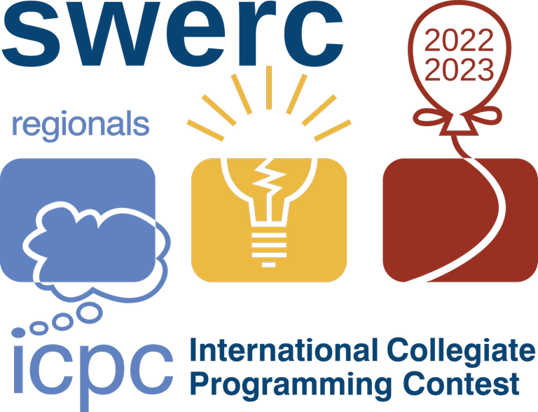

# Announcement_(en)

The Southwestern Europe Regional Contest will take place on the 19th of February in Milan. It is the ICPC regional contest (i.e., the winning teams will advance to the ICPC World Finals) for teams from France, Israel, Italy, Portugal, Spain, and Switzerland.

The mirror contest [SWERC 2022-2023 - Online Mirror (Unrated, ICPC Rules, Teams Preferred)](https://codeforces.com/contest/1776 "SWERC 2022-2023 - Online Mirror (Unrated, ICPC Rules, Teams Preferred)") will be held on Codeforces at [Sunday, February 19, 2023 at 17:05UTC+6](https://codeforces.com/https://www.timeanddate.com/worldclock/fixedtime.html?day=19&month=2&year=2023&hour=14&min=5&sec=0&p1=166) and will last 5 hours. 

The mirror contest will contain the problems from the official competition plus some additional problems.

I am the chief judge for the competition and I want to thank:

 * The amazing set of judges who proposed and prepared the problems: [cescmentation_folch](https://codeforces.com/profile/cescmentation_folch "Гроссмейстер cescmentation_folch"), [cip999](https://codeforces.com/profile/cip999 "Мастер cip999") (vice chief judge), [gangsterveggies](https://codeforces.com/profile/gangsterveggies "Мастер gangsterveggies"), [Giove](https://codeforces.com/profile/Giove "Мастер Giove"), [gog.gerard](https://codeforces.com/profile/gog.gerard "Мастер gog.gerard"), [jinlifu1999](https://codeforces.com/profile/jinlifu1999 "Кандидат в мастера jinlifu1999"), [Petr](https://codeforces.com/profile/Petr "Легендарный гроссмейстер Petr"), [Simon](https://codeforces.com/profile/Simon "Кандидат в мастера Simon"), [tap_tapii](https://codeforces.com/profile/tap_tapii "Кандидат в мастера tap_tapii"), [Um_nik](https://codeforces.com/profile/Um_nik "Легендарный гроссмейстер Um_nik").
* The MIT team composed of [antontrygubO_o](https://codeforces.com/profile/antontrygubO_o "Легендарный гроссмейстер antontrygubO_o"), [Rewinding](https://codeforces.com/profile/Rewinding "Легендарный гроссмейстер Rewinding"), [TLE](https://codeforces.com/profile/TLE "Легендарный гроссмейстер TLE") for testing the round and [Philae](https://codeforces.com/profile/Philae "Международный мастер Philae") for proofreading the statements.
* Everyone involved in the organization of SWERC, in particular [Dariost](https://codeforces.com/profile/Dariost "Кандидат в мастера Dariost") (director) and [edomora97](https://codeforces.com/profile/edomora97 "Специалист edomora97") (technical director).
* The developers of DOMjudge, the contest system used in the official contest.
* [MikeMirzayanov](https://codeforces.com/profile/MikeMirzayanov "Штаб, MikeMirzayanov") for Polygon (that we used to prepare the problems) and for letting us host the mirror on Codeforces.

I invite you to participate in the contest and I hope that you will like the problems.

On the difficulty  
 The contest features problems with **difficulties from div2A to div1F**; so anyone can find something at their level.

Many teams with little experience participate in SWERC, so the problem set should be enjoyable also for div2 contestants. On the other hand, solving all the problems should be challenging even for the strongest teams in the world: the [MIT team](https://codeforces.com/team/92349) did not AK in 5 hours.

Rules  

 1. The contest is unrated, so your codeforces rating will not be affected.
2. The scoring is ICPC-style: teams are first sorted by number of problems solved, then the time-penalty is used as a tie-break. An incorrect submission gives a 20 minutes penalty.
3. We encourage participation as a team.
4. If you are participating in a team, we encourage you to use only one computer for coding the solutions (as in an ICPC contest). Regarding using templates, googling, and copy-pasting code: feel free to do it.

 **Rationale of rule 4.**We decided to write explicitly rule 4 since there is always the doubt of how one should participate in this kind of mirrors. Not allowing the usage of templates and copy-pasting is a not-so-funny rule of icpc contests, so we decided not to include it for this mirror. On the other hand, using only one computer is a cool rule which makes this kind of contests unique, so we decided to include it.

UPDATE: We hope you liked the problems! 

We uploaded the editorial of the contest (you can find it at <https://codeforces.com/contest/1776>, among the contest materials).

The solution to problem N submitted in the mirror contest by the team *Let it rot* is a quadratic solution which they managed to squeeze in the time limit. This was not the expected solution. So, morally, this problem is still unsolved! In the next days I might decrease the time limit. We have a solution which gets AC in less than one second but we wanted to be generous with the time limit. It turns out, we were too generous.

Congratulations to all the participants of the onsite contest and in particular to the three teams solving 11 problems:

 1. **ENS Ulm 1** -- **École Normale Supérieure de Paris**
2. **gETHyped** -- **ETH Zürich**
3. **P+P+P** -- **Harbour.Space University**
