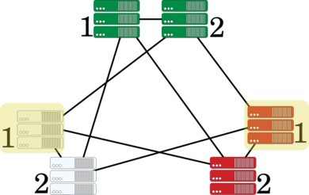
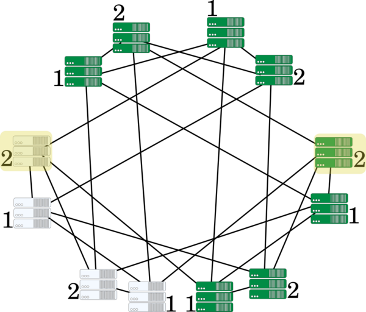

<h1 style='text-align: center;'> J. Italian Data Centers</h1>

<h5 style='text-align: center;'>time limit per test: 2 seconds</h5>
<h5 style='text-align: center;'>memory limit per test: 256 megabytes</h5>

An Italian data center consists of a set of servers, each colored green, white, or red, and a set of wires connecting them. Each wire connects two distinct servers and two servers are connected by at most one wire. Additionally, the data center is connected, i.e. there is a way to transmit information between any two servers through a sequence of wires.

To judge all of the contestant submissions, SWERC has an Italian data center. Since every year the number of contestants doubles, the data center needs to grow to adapt to the extra load. To address this, SWERC builds a new data center based on the previous year's one by following these steps:

* For each server $s$ in the old data center, the new data center contains two servers $s_1$ and $s_2$ of the same color as $s$. A wire is placed connecting the two servers $s_1$ and $s_2$.
* For each wire connecting servers $s$ and $t$ in the old data center: if $s$ and $t$ have the same color, then a wire is placed in the new data center connecting $s_1$ and $t_1$ and another wire connecting $s_2$ and $t_2$; otherwise, a wire is placed in the new data center connecting $s_1$ and $t_2$ and another one connecting $s_2$ and $t_1$.

One can show that if the old data center is connected than the new data center is also connected.

You are given the Italian data center that SWERC currently has, which contains $n$ servers (indexed by $1, \, 2, \, \dots, \, n$) and $m$ wires connecting them. The organization wants to know how good their data center will be after $k$ years, so you should determine the diameter of the data center SWERC will have in $k$ years. The diameter of the data center is the largest distance between any two servers, i.e. the shortest number of wires that have to be used to transmit something between the two servers.

###### Input

The first line contains three integers $n$, $m$ and $k$ ($2 \leq n \leq 100$, $n - 1 \leq m \leq n (n - 1) / 2$, $0 \leq k \leq 100$) — the number of servers, the number of wires, and the number of years to consider.

The second line contains $n$ integers $c_1, \, c_2, \, \dots, \, c_n$ ($1 \leq c_i \leq 3$) — $c_i$ is the color of server $i$ (where $1$ stands for green, $2$ for white and $3$ for red).

Each of the next $m$ lines contains two integers $s_i$ and $t_i$ ($1 \leq s_i, t_i \leq n$) — the two servers the $i$-th wire connects.

It is guaranteed that the data center is connected, the endpoints of each wire are distinct, and that there are no repeated wires.

###### Output

Print the diameter of SWERC's data center after $k$ years.

## Examples

###### Input


```text
3 3 0
1 2 3
1 2
2 3
3 1
```
###### Output


```text
1
```
###### Input


```text
3 3 1
1 2 3
1 2
2 3
3 1
```
###### Output


```text
2
```
###### Input


```text
3 3 2
1 2 1
1 2
2 3
3 1
```
###### Output


```text
3
```
###### Input


```text
8 14 100
3 3 2 2 1 2 2 1
2 7
1 5
7 8
4 6
2 8
1 8
2 6
6 7
1 6
1 4
3 5
1 3
4 5
5 7
```
###### Output


```text
53
```
## Note

In the first sample, the Italian data center is the following:

  The distance between any pair of servers is $1$ so the diameter is $1$.

In the second sample, the initial Italian data center is the one from the first sample.

After one year we obtain the following (where the numbers indicate which copy the server refers to):

  Consider the highlighted servers. The distance between them is $2$ and there is no pair of servers with greater distance, so the diameter is $2$.

In the third sample, the data center after one year is the following:

  After one more year:

  Consider the highlighted servers. The distance between them is $3$ and there is no pair of servers with greater distance, so the diameter is $3$.


#### Tags 

#2500 #NOT OK #graphs #shortest_paths 

## Blogs
- [All Contest Problems](../SWERC_2022-2023_-_Online_Mirror_(Unrated,_ICPC_Rules,_Teams_Preferred).md)
- [Announcement (en)](../blogs/Announcement_(en).md)
