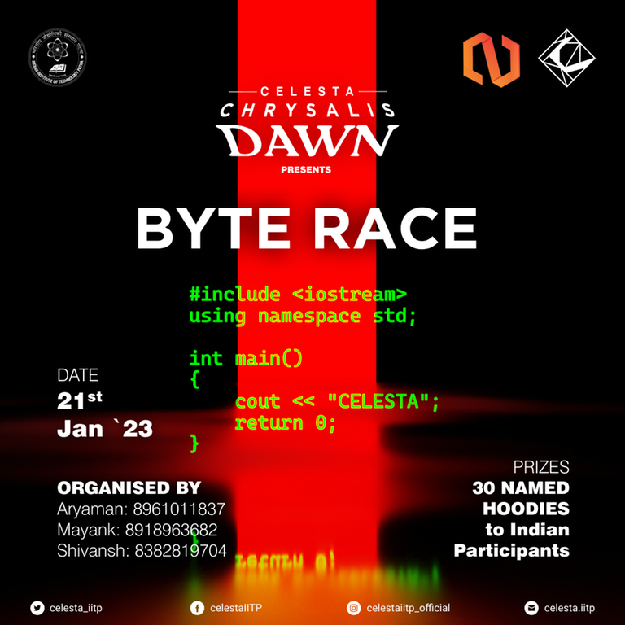

# Announcement_(en)

Hello, Codeforces!

NJACK — the Computer Science Club of IIT Patna is excited to invite you to **ByteRace 2023** — [Codeforces Round 845 (Div. 2) and ByteRace 2023](https://codeforces.com/contest/1777 "Codeforces Round 845 (Div. 2) and ByteRace 2023") under **Celesta** — the annual Techno-Management Fest of IIT Patna.

The contest will take place on [Saturday, January 21, 2023 at 20:35UTC+6](https://codeforces.com/https://www.timeanddate.com/worldclock/fixedtime.html?day=21&month=1&year=2023&hour=17&min=35&sec=0&p1=166). **This round will be rated for participants with rating lower than 2100.**

Many thanks to all the people who made this round possible:

 * The problems were authored and prepared by me, [quantau](https://codeforces.com/profile/quantau "Expert quantau"), [mayankfrost](https://codeforces.com/profile/mayankfrost "Candidate Master mayankfrost"), [ShivanshJ](https://codeforces.com/profile/ShivanshJ "Candidate Master ShivanshJ"), [Crocuta](https://codeforces.com/profile/Crocuta "Candidate Master Crocuta") and [AwakeAnay](https://codeforces.com/profile/AwakeAnay "International Master AwakeAnay").
* [irkstepanov](https://codeforces.com/profile/irkstepanov "International Grandmaster irkstepanov") and [KAN](https://codeforces.com/profile/KAN "Legendary Grandmaster KAN") for coordinating the round!
* [jenishmonpara](https://codeforces.com/profile/jenishmonpara "Expert jenishmonpara"), [100gods](https://codeforces.com/profile/100gods "Candidate Master 100gods") and [V_S_M](https://codeforces.com/profile/V_S_M "Expert V_S_M") for their guidance throughout the process.
* VIP testers: [YashPant](https://codeforces.com/profile/YashPant "Specialist YashPant") and [Newtech66](https://codeforces.com/profile/Newtech66 "Expert Newtech66") <3
* Shoutout to [AwakeAnay](https://codeforces.com/profile/AwakeAnay "International Master AwakeAnay") for doing absolutely nothing.
* [dorijanlendvaj](https://codeforces.com/profile/dorijanlendvaj "Legendary Grandmaster dorijanlendvaj"), [Golovanov399](https://codeforces.com/profile/Golovanov399 "International Grandmaster Golovanov399"), [nor](https://codeforces.com/profile/nor "Master nor"), [defnotmee](https://codeforces.com/profile/defnotmee "Master defnotmee") and [ilya151098](https://codeforces.com/profile/ilya151098 "Expert ilya151098") for testing and providing detailed feedback that improved the quality and balance of the round significantly.
* Our lord and saviour [MikeMirzayanov](https://codeforces.com/profile/MikeMirzayanov "Headquarters, MikeMirzayanov") for great systems Codeforces and Polygon.

You will have *2 hours* to solve *6 problems*.

The scoring distribution will be updated later. 

 I love KaoriI love Kaori**UPD**: Scoring distribution: 500−1000−1500−2000−2250−2750500−1000−1500−2000−2250−2750

**UPD**: [Editorial](Tutorial_(en).md)

**UPD**: Congratulations to the winners!

**Official winners:**

 1. [jiangly_fan_fan_fan_fan](https://codeforces.com/profile/jiangly_fan_fan_fan_fan "Candidate Master jiangly_fan_fan_fan_fan")
2. [ducati](https://codeforces.com/profile/ducati "Candidate Master ducati")
3. [xiachong](https://codeforces.com/profile/xiachong "Newbie xiachong")
4. [FasterThanLight](https://codeforces.com/profile/FasterThanLight "Candidate Master FasterThanLight")
5. [Remask_588_handles](https://codeforces.com/profile/Remask_588_handles "Unrated, Remask_588_handles")

**Unofficial winners:**

 1. [noimi](https://codeforces.com/profile/noimi "Legendary Grandmaster noimi")
2. [jiangly_fan_fan_fan_fan](https://codeforces.com/profile/jiangly_fan_fan_fan_fan "Candidate Master jiangly_fan_fan_fan_fan")
3. [Nyaan](https://codeforces.com/profile/Nyaan "International Grandmaster Nyaan")
4. [ducati](https://codeforces.com/profile/ducati "Candidate Master ducati")
5. [neal](https://codeforces.com/profile/neal "Legendary Grandmaster neal")

**First solves:**

A: [noimi](https://codeforces.com/profile/noimi "Legendary Grandmaster noimi") at 00:00   
 B: [neal](https://codeforces.com/profile/neal "Legendary Grandmaster neal") at 00:02   
 C: [noimi](https://codeforces.com/profile/noimi "Legendary Grandmaster noimi") at 00:06   
 D: [noimi](https://codeforces.com/profile/noimi "Legendary Grandmaster noimi") at 00:09   
 E: [noimi](https://codeforces.com/profile/noimi "Legendary Grandmaster noimi") at 00:15   
 F: [sjc061031](https://codeforces.com/profile/sjc061031 "Master sjc061031") at 00:13

**PRIZES:** 30 hoodies (customizable with name) will be given to:

 * Top 20 Indian participants
* Random 10 from top 100 (rank 21-100) Indian participants

Note: we will identify Indian participants through their flags and they may be asked for address proofs later.

See you all in the standings!

**UPD**: Here is the list of people who won hoodies. We will contact you all soon. Congrats!

Top 20 Indian participants

 * [socho](https://codeforces.com/profile/socho "Master socho")
* [aryanc403](https://codeforces.com/profile/aryanc403 "Master aryanc403")
* [JrNTR](https://codeforces.com/profile/JrNTR "Master JrNTR")
* [Kira_1234](https://codeforces.com/profile/Kira_1234 "Candidate Master Kira_1234")
* [KDVinit](https://codeforces.com/profile/KDVinit "Grandmaster KDVinit")
* [IceKnight1093](https://codeforces.com/profile/IceKnight1093 "International Master IceKnight1093")
* [Everule](https://codeforces.com/profile/Everule "International Grandmaster Everule")
* [kshitij_sodani](https://codeforces.com/profile/kshitij_sodani "Grandmaster kshitij_sodani")
* [shiven](https://codeforces.com/profile/shiven "Master shiven")
* [mexomerf](https://codeforces.com/profile/mexomerf "Master mexomerf")
* [18o3](https://codeforces.com/profile/18o3 "Candidate Master 18o3")
* [abhidot](https://codeforces.com/profile/abhidot "Candidate Master abhidot")
* [used-fft](https://codeforces.com/profile/used-fft "International Master used-fft")
* [towrist](https://codeforces.com/profile/towrist "Master towrist")
* [udhavvarma03](https://codeforces.com/profile/udhavvarma03 "Master udhavvarma03")
* [Suri429](https://codeforces.com/profile/Suri429 "Candidate Master Suri429")
* [_akasi](https://codeforces.com/profile/_akasi "Candidate Master _akasi")
* [Phantom_Deluxe](https://codeforces.com/profile/Phantom_Deluxe "Candidate Master Phantom_Deluxe")
* [ghoul932](https://codeforces.com/profile/ghoul932 "Master ghoul932")
* [shadow9236](https://codeforces.com/profile/shadow9236 "Master shadow9236")

Random 10 from top 100 (rank 21 — 100) Indian participants

 * [ShlokG](https://codeforces.com/profile/ShlokG "Master ShlokG")
* [Harsha221B](https://codeforces.com/profile/Harsha221B "Expert Harsha221B")
* [Pandemonium2024](https://codeforces.com/profile/Pandemonium2024 "Candidate Master Pandemonium2024")
* [YPK](https://codeforces.com/profile/YPK "Master YPK")
* [BeastCode](https://codeforces.com/profile/BeastCode "Expert BeastCode")
* [abhi_atg](https://codeforces.com/profile/abhi_atg "Expert abhi_atg")
* [ShubhamAvasthi](https://codeforces.com/profile/ShubhamAvasthi "Expert ShubhamAvasthi")
* [rohit2593](https://codeforces.com/profile/rohit2593 "Candidate Master rohit2593")
* [karthikeya09](https://codeforces.com/profile/karthikeya09 "Expert karthikeya09")
* [Abhishek_Srivastava](https://codeforces.com/profile/Abhishek_Srivastava "Expert Abhishek_Srivastava")

#### **About Celesta**

Celesta is the annual Techno-Management Fest of IIT Patna. Celesta conducts a variety of events in various technical domains. Some of these are open and free for all, with exciting prizes and goodies for the winners!

You can head over to our [website](https://codeforces.com/https://celesta.iitp.ac.in/) and check it out for yourself!

Good luck!

