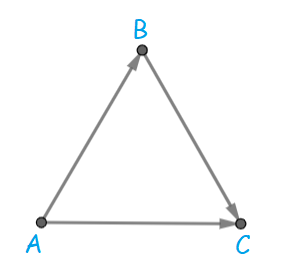

# Editorial_for_Hello_2023_(en)

[1779A - Hall of Fame](../problems/A._Hall_of_Fame.md "Hello 2023")
-----------------------------------------------------------------------------------

Author: [n0sk1ll](https://codeforces.com/profile/n0sk1ll "Master n0sk1ll")

 **Hint**What happens when L appears after some R in the string?

 **Solution**Suppose that there exists an index i such that si=R and si+1=L. Lamp i illuminates trophies i+1,i+2,…n and lamp i+1 illuminates 1,2,…i. We can conclude that all trophies are illuminated if L appears right after some R. So, strings LLRRLL,LRLRLR,RRRLLL,… do not require any operations to be performed on them, since they represent configurations of lamps in which all trophies are already illuminated.

Now, we consider the case when such i does not exist and think about how we can use the operation **once**. Notice that if R appears right after some L, an operation can be used to transform LR into RL, and we have concluded before that all trophies are illuminated in that case. So, if LR appears in the string, we perform the operation on it.

An edge case is when L and R are never adjacent (neither LR nor RL appears). Notice that si=si+1 must hold for i=1,2,…n−1 in that case, meaning that LL…L and RR…R are the only impossible strings for which the answer is −1.

 **Bonus Problem**Solve the task in which q≤105 range queries are given: for each segment [l,r] print the required index l≤i<r, 0 or −1.

[1779B - MKnez's ConstructiveForces Task](../problems/B._MKnez's_ConstructiveForces_Task.md "Hello 2023")
------------------------------------------------------------------------------------------------------

Author: [n0sk1ll](https://codeforces.com/profile/n0sk1ll "Master n0sk1ll")

 **Hint 1**There always exists an answer for **even** n. Can you find it?

 **Hint 2**There always exists an answer for **odd** n≥5. Can you find it?

 **Solution**If n is **even**, the array [−1,1,−1,1,…,−1,1] is a solution. The sum of any two adjacent elements is 0, as well as the sum of the whole array.

Suppose that n is **odd** now. Since si−1+si and si+si+1 are both equal to the sum of the whole array for each i=2,3,…n−1, it must also hold that si−1+si=si+si+1, which is equivalent to si−1=si+1. Let's fix s1=a and s2=b. The condition above produces the array s=[a,b,a,b,…a,b,a] (remember that we consider an **odd** n). 

Let k be a positive integer such that n=2k+1. The sum of any two adjacent elements is a+b and the sum of the whole array is (k+1)a+kb. Since the two values are equal, we can conclude that ka+(k−1)b=0. a=k−1 and b=−k produces an answer. But, we must be careful with a=0 and b=0 since that is not allowed. If k=1 then ka+(k−1)b=0 implies ka=0 and a=0, so for n=2⋅1+1=3 an answer does not exist. Otherwise, one can see that a=k−1 and b=−k will be non-zero, which produces a valid answer. So, the array [k−1,−k,k−1,−k,…,k−1,−k,k−1] is an answer for k≥2 (n≥5).

 **Bonus Problem**Solve a generalized task with given m — find an array a1,a2,…an (ai≠0) such that ai+ai+1+…ai+m−1 is equal to the sum of the whole array for each i=1,2,…n−m+1 (or determine that it is impossible to find such array).

[1779C - Least Prefix Sum](../problems/C._Least_Prefix_Sum.md "Hello 2023")
---------------------------------------------------------------------------------------

Author: [n0sk1ll](https://codeforces.com/profile/n0sk1ll "Master n0sk1ll")

 **Hint 1**Try a greedy approach.

 **Hint 2**What data structure supports inserting an element, finding the maximum and erasing the maximum? That is right, a binary heap, or STL *priority_queue*.

 **Solution**Let pi=a1+a2+…ai and suppose that px<pm for some x<m. Let x be the greatest such integer. Performing an operation to any element in the segment [1,x] does nothing since pm−px stays the same. Similarly, performing an operation to any element in segment [m+1,n] does not affect it.

A greedy idea is to choose the maximal element in segment [x+1,m] and perform an operation on it, because it decreases pm as much as possible. Repeat this process until pm eventually becomes less than or equal to px. It might happen that a new py such that py<pm and y<x emerges. In that case, simply repeat the algorithm until pm is less than or equal to any prefix sum in its "left".

Suppose that px<pm and x>m now. The idea is the same, choose a minimal element in segment [m+1,x] and perform an operation on it as it increases px as much as possible. And repeat the algorithm as long as such x exists.

To implement this, solve the two cases independently. Let's describe the first case as the second one is analogous. Iterate over i from m to 1 and maintain a priority queue. If pi<pm, pop the queue (possibly multiple times) and decrease pm accordingly (we simulate performing the "optimal" operations). Notice that one does not have to update any element other than pm. Add ai to the priority queue afterwards.

The time complexity is O(nlogn).

 **Bonus Problem**Solve the task for each m=1,2,…,n i.e. print n integers: the minimum number of operations required to make a1+a2+…am a least prefix sum for each m (the tasks are independent).

[1779D - Boris and His Amazing Haircut](../problems/D._Boris_and_His_Amazing_Haircut.md "Hello 2023")
----------------------------------------------------------------------------------------------------

Author: [n0sk1ll](https://codeforces.com/profile/n0sk1ll "Master n0sk1ll")

 **Stupid Hint**If ai<bi for some i, then an answer does **not** exist since a cut cannot make a hair taller.

 **Hint**If you choose to perform a cut on some segment [l,r] with a razor of size x, you can "greedily" extend it (decrease l and increase r) as long as x≥bi for each i in that segment and still obtain a correct solution.

 **Solution**There exist some data structures (segment tree, dsu, STL maps and sets, …) ideas, but there is also a simple solution with a STL stack. 

Consider an and bn. If bn is greater, the answer is `NO` since it is an impossible case (see "Stupid Hint" section). If an is greater, then a cut on range [l,n] with a razor of size bn has to be performed. Additionally, l should be as small as possible (see "Hint" section). For each i in the range, if ai becomes exactly equal to bi, we consider the position i *satisfied*. If an and bn are equal, then we simply pop both arrays' ends (we ignore those values as they are already *satisfied*) and we continue our algorithm.

Onto the implementation. We keep track (and count) of each razor size we must use. This can simply be done by putting the corresponding sizes into some container (array or vector) and checking at the end whether it is a subset of x1,x2,…xm (the input array of allowed razors). To do this, one can use sorting or maps. This part works in O(nlogn+mlogm) time.

Implementing cuts is more challenging, though. To do this, we keep a monotone stack which represents all cuts which are valid until "now" (more formally, all cuts with their l being ≤i, and the value of l will be determined later). The top of the stack will represent the smallest razor, and the size of razors does **not decrease** as we pop it. So, we pop the stack as long as the top is smaller than bn (since performing an operation which makes ai less than bi is not valid). After this, if the new top is exactly equal to bn we can conclude that we have satisfied an=bn with some previous cut and we simply continue our algorithm. Otherwise, we add bn to the stack as a cut must be performed. This part works in O(n+m) time.

Total complexity is O(nlogn+mlogm) because of sorting/mapping.

 **Bonus Problem**Solve the task in O(n+m) total complexity.

[1779E - Anya's Simultaneous Exhibition](../problems/E._Anya's_Simultaneous_Exhibition.md "Hello 2023")
-----------------------------------------------------------------------------------------------------

Author: [n0sk1ll](https://codeforces.com/profile/n0sk1ll "Master n0sk1ll")

 **Hint**A tournament graph is given. Player i is a candidate master if for every other player there exists a path from i to them. Can you find *one* candidate master? (which helps in finding all of them)

 **Lemma 1**Statement: If player i has the highest out-degree, then they are a candidate master.

Proof: Let's prove a stronger claim, if player i has the highest out degree, then they reach every other player in 1 or 2 edges. Let S1 be the set of players which are immediately reachable and let S2 be the set of other players (not including i). Choose some x∈S2. If x is not reachable from i, then it has an edge to it as well as to every player in S1, meaning that the out-degree of x is at least |S1|+1. This is a contradiction, since i has out-degree exactly equal to |S1| and the initial condition was for i to have the highest out-degree. So, every x∈S2 is reachable by i, which proves the lemma.

 **Lemma 2**Statement: There exists an integer w such that player i is a candidate master if and only if its out-degree is greater than or equal to w.

Proof: Let S1,S2,…Sk represent the strongly connected components (SCC) of the tournament graph, in the topological order (S1 is the "highest" component, while Sk is the "lowest"). Since the graph is a tournament, it holds that there exists a directed edge from x to y for each x∈Si, y∈Sj, i<j. We can also conclude that x has a higher out-degree than y for each x∈Si, y∈Sj, i<j. The same holds for i=1, which proves the lemma since S1 is the set of candidate masters, and also each player in it has **strictly higher** out-degree than every other player not in it. 

 **Solution**For each player, we host a simul which includes every other player (but themselves). This tells us the necessary out-degrees and we can easily find one candidate master (the one with highest out-degree).

The second step is to sort all players by out-degree in non-increasing order and maintain the current w described in "Lemma 2". Its initial value is the out-degree of player 1. As we iterate over players, we host additional simuls: if player i wins a match against at least one player among 1,2,…j (the set of current candidate masters), then i is also a candidate master, as well as j+1,j+2,…i−1, we update the set accordingly and eventually decrease w.

The first step requires n simuls to be hosted, and the same hold for step 2. In total, that is 2n simuls (or slightly less, depending on implementation).

 **Bonus Problem**Solve the task if n−1 simuls are allowed to be hosted.

[1779F - Xorcerer's Stones](../problems/F._Xorcerer's_Stones.md "Hello 2023")
----------------------------------------------------------------------------------------

Author: [n0sk1ll](https://codeforces.com/profile/n0sk1ll "Master n0sk1ll")

 **Hint 1.1**If **XOR** of all stones equals 0, then by performing one spell to the root we obtain an answer.

 **Hint 1.2**Solve the task for **even** n.

 **Hint 1.3**If n is **even**, performing a spell to the root guarantees that all nodes will have the same number of stones, meaning that the total **XOR** of the tree is 0, thus performing the same spell again makes all nodes have 0 stones.

 **Hint 2.1**Consider **even** and **odd** subtrees. What does a spell do to them?

 **Hint 2.2**A spell performed to the **odd** subtree does nothing. It does not change the total **XOR**, and it also makes performing a spell to some node in its subtree useless as their **XOR**s would be 0 anyway. Thus, we are only interested in **even** subtrees.

 **Solution**Please refer to the hints as steps. Let's finish the casework:

Let nodes u and v have **even** subtrees. And let the spell be performed on u, and then on v slightly later. Consider the following 3 cases:

 1. u is an ancestor of v; performing a spell on v does not make sense as its subtree's **XOR** is already 0.
2. v is an ancestor of u; performing a spell on u does not make sense either as it will be "eaten" by v later. More formally, let su be the current **XOR** of u's subtree. We define sv and s1 analogously. A spell performed on u sets sv:=sv⊕su and s1:=s1⊕su. Later, the spell performed on v sets s1:=s1⊕sv. Notice that the final state of s1 is the same as if only the spell on v was performed (since su⊕su=0). This means that the total **XOR** stays the same independent of whether we perform a spell on u or not.
3. Neither u or v is a parent of the other; this is the only case we are interested in and we will use this as a fact.

We only need to choose some subtrees such that their total **XOR** is equal to the **XOR** of the root. Why? Because after applying the spells to them the total **XOR** becomes 0, and that problem has been solved in "Hint 1.1". Of course, each pair of subtrees must satisfy the condition in case 3, thus finding the subtrees is possible with dynamic programming and reconstruction. In each node we keep an array of size 32 which tells us the possible **XOR** values obtained by performing spells on nodes in its subtree. Transitions are done for each edge, from child to parent, in similar fashion to the knapsack problem, but with **XOR** instead of sums.

Time complexity is O(nA2) and memory complexity is O(nA). It is possible to optimize this, but not necessary.

 **Bonus Problem**Can you minimize the number of operations?

 **Bonus Problem Hint**The number of them is ≤6 (in an optimal case).

[1779G - The Game of the Century](../problems/G._The_Game_of_the_Century.md "Hello 2023")
----------------------------------------------------------------------------------------------

Author: [Giove](https://codeforces.com/profile/Giove "Master Giove")

 **Hint**Consider the sides of the big triangle. If they have the same orientation (clockwise or counter-clockwise), 0 segments have to be inverted since the village is already biconnected. 

 **Solution**If the three sides do not all have the same orientation, inverting some segments is necessary. The following picture represents them (or rather, one case, but every other is analogous).

There are two "major" paths:

 * A→C
* A→B→C

Each road has a "beginning" in one of the paths, hence it is possible to reach every intersection from A. Similarly, C can be reached from every other intersection. The problem is that C acts as a tap as it cannot reach anything.

To make the village biconnected, we will make it possible for C to reach A by inverting the smallest number of road segments. Intuitively, that will work since for every intersection x there exists a cycle A→x→C→A. A formal proof is given at the end of this section.

The task is to find a shortest path from C to A, with edges having weights of 0 (its direction is already as desired) and 1 (that edge has to be inverted). To implement this in O(n), one has to notice that we are only interested in the closest road of each direction to the big triangle's side. One can prove that by geometrically looking at the strongly connected components, and maybe some casework is required. But, the implementation is free of boring casework.

Now, it is possible to build a graph with vertices which belong to at least one of the 6 roads we take into consideration (there are 3 pairs of opposite directions). One can run a 0-1 BFS and obtain the shortest path.

This will indeed make the village biconnected as a shortest path does not actually pass through sides A→B and B→C (why would it? it is not optimal making effort to reach it just to invert some unnecessary additional road segments) The shortest path from C to A intersects the side A→C though (possibly multiple times), but it can be proved that every intersection on it is reachable from C. Also, sides A→B and B→C are reachable from C since A is reachable from C. This means that all sides are reachable by both A and C, and so is every other intersection.

 **Bonus Problem**Solve the problem if it is required to process q≤105 queries: invert a given road (and every segment in it), then print the minimum number of road segments you need to additionally invert to make the village biconnected (and not perform them, they are independent from the queries).

[1779H - Olympic Team Building](../problems/H._Olympic_Team_Building.md "Hello 2023")
--------------------------------------------------------------------------------------------

Author: [n0sk1ll](https://codeforces.com/profile/n0sk1ll "Master n0sk1ll")

Huge thanks to [dario2994](https://codeforces.com/profile/dario2994 "International Grandmaster dario2994") for helping me solve and prepare this problem.

 **Hint 1**Try reversing the process.

 **Hint 2**Start with some multiset x containing only 1 element. We will try to make x an *absolute winner*. Extend it by repeatedly adding subsets of equal sizes to it (which have sum less than or equal to the current one).

 **Fake Solution**A simple greedy solution is to always extend the current subset with the one which has the maximum sum. This, however, gives **WA** as `100 100 101 98 89 103 103 104 111 680 1 1 1 1 1 2` is a counter-example. (see it for yourself!)

 **Lemma**Statement: If it is possible to extend some multiset A to the whole array s, we consider it *winning*. If A≤B holds for some subset B, then B is also *winning*. Here, A≤B means that there exists a bijection f:A→B such that x≤f(x) for each x∈A.

Proof: Let A,A1,A2,…Ak be a *winning* sequence of extensions. By definition of A≤B, we can swap each element of A with some other element. There are three cases:

 1. If we swap some x∈A with an element which is already in A, nothing happens.
2. If we swap some x∈A with an element which is not in any Ai, the sum of A increases hence it is also *winning*.
3. If we swap some x∈A with an element which is contained in some Ai, the sum of A increases, the sum of Ai decreases and the sum of sums of A,A1,…,Ai stays the same. The sequence remains winning.
 **Solution**Special cases of the lemma are subsets of size 1. We can conclude that if x is winning and x≤y, then so is y. The answer is binary-searchable. Let's work with some fixed si=x from now on. The idea is to maintain a list of current possible *winning* subsets. The motivation of lemma is to exclude subsets which cannot produce the answer. 

 1. we can see that sj,si≤si−1,si for each j<i−1, hence the only *interesting* subset is si−1,si (we excluded others because if one of them is an answer, then so is si−1,si. We will use this without explanation later on).
2. we extend si−1,si further to a subset of size 4. There will be at most 15 new subsets and it can be proved by using the lemma and two pointers.
3. extend the current subsets to have size 8. And, of course, use the lemma again and exclude unnecessary subsets. Implementing it properly should be fast enough. A fact is that there will be **at most** 8000 subsets we have to consider. Although, proving it is not trivial. Consider all subsets of size 4 and a partial ordering of them. In our algorithm we have excluded all subsets with large sum and then we excluded all subsets which are less than some other included set. So, the max collection of such subsets is less in size than the max antichain of 4-subsets with respect to ≤. Following the theory, a max anti-chain can have size at most maxkf(k), where f(k) is the number of 4-subsets with indices having sum exactly k. Hard-coding this gives us an approximation of 519. This value should be multiplied by 15, since we had that many 4-subsets to begin with. This is less than 8000, which is relatively small.
4. Extending the 8-subsets further sounds like an impossible task. But, greedy finally comes in handy. Every 8-subset should be extended with another 8-subset which maximizes the sum. It is not hard to see that if an answer exists, then this produces a correct answer too. We are left with solving 8-sum in an array of size 24. As we need to do this around 8000 times, we use the **meet in the middle** approach. It can be done in around 212 operations if merge sort is used (it spares us the "12" factor in 12⋅212).

Summary: Solving the task for n≤16 is trivial. Let's fix n=32. Calculating the exact complexity does not make much sense as n is fixed, but we will calculate the rough number of basic arithmetic operations used. Firstly, a binary search is used, which is log32=5 operations. Then, we generate 8-subsets which can be implemented quickly (but is not trivial). The **meet in the middle** part consumes 8000⋅212 operations. The total number of operations is roughly 5⋅8000⋅4096=163840000, which gives us a decent upper bound.

 **Bonus Problem**Try to construct a strong test against fake greedy solutions :)

