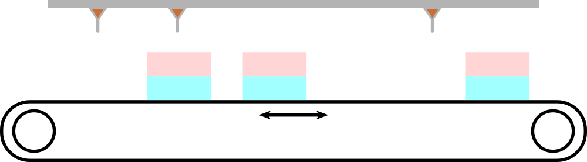
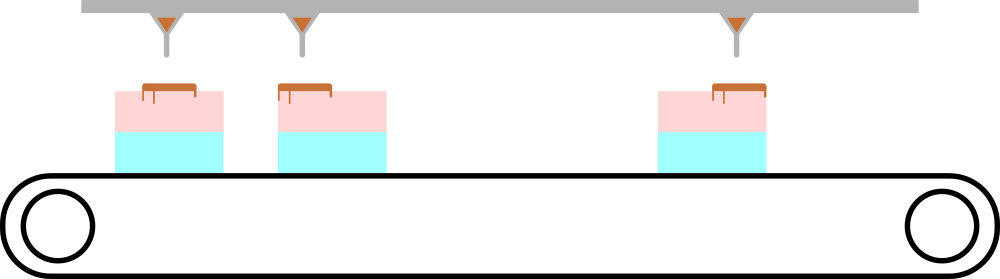

<h1 style='text-align: center;'> B. Cake Assembly Line</h1>

<h5 style='text-align: center;'>time limit per test: 1 second</h5>
<h5 style='text-align: center;'>memory limit per test: 256 megabytes</h5>

A cake assembly line in a bakery was once again optimized, and now $n$ cakes are made at a time! In the last step, each of the $n$ cakes should be covered with chocolate.

Consider a side view on the conveyor belt, let it be a number line. The $i$-th cake occupies the segment $[a_i - w, a_i + w]$ on this line, each pair of these segments does not have common points. Above the conveyor, there are $n$ dispensers, and when a common button is pressed, chocolate from the $i$-th dispenser will cover the conveyor segment $[b_i - h, b_i + h]$. Each pair of these segments also does not have common points.

  Cakes and dispensers corresponding to the first example. The calibration of this conveyor belt part has not yet been performed, so you are to make it. Determine if it's possible to shift the conveyor so that each cake has some chocolate on it, and there is no chocolate outside the cakes. You can assume that the conveyour is long enough, so the cakes never fall. Also note that the button can only be pressed once.

  In the first example we can shift the cakes as shown in the picture. 
### Input

Each test contains multiple test cases. The first line contains the number of test cases $t$ ($1 \le t \le 10^5$). The description of the test cases follows.

The first line of each test case contains three integers $n$, $w$, and $h$ ($1 \le n \le 10^5$; $1 \le w, h \le 10^5$; $h \le w$) — the number of cakes and dispensers, as well as the halfwidths of cakes and segments on which the chocolate is dispensed.

The second line contains $n$ integers $a_1$, $a_2$, ..., $a_n$ ($1 \le a_i \le 10^9$) — the positions of the cakes centers. It is guaranteed that $a_i + w < a_{i + 1} - w$ for all $i$.

The third line contains $n$ integers $b_1$, $b_2$, ..., $b_n$ ($1 \le b_i \le 10^9$) — the positions of the dispensers. It is guaranteed that $b_i + h < b_{i + 1} - h$ for all $i$.

It is guaranteed that the sum of $n$ over all test cases does not exceed $10^5$.

### Output

For each test case output "YES", if it's possible to shift the conveyor in such a way that each cake ends up with some chocolate, and no chocolate is outside the cakes, and "NO" otherwise.

You can output the answer in any case (upper or lower). For example, the strings "yEs", "yes", "Yes", and "YES" will be recognized as positive responses.

## Example

### Input


```text
43 10 565 95 16540 65 1455 2 11 6 11 16 214 9 14 19 243 3 213 22 295 16 254 4 127 36 127 13635 50 141 144
```
### Output

```text

YES
YES
NO
YES

```
## Note

The first example is shown in the figures in the statement.

In the second example, we can move the conveyor, for example, so that the centers of the cakes are at $4, 9, 14, 19, 24$.

In the third example, we can't move the conveyor accordingly.


#### Tags 

#1300 #NOT OK #brute_force #sortings 

## Blogs
- [All Contest Problems](../Codeforces_Round_850_(Div._2,_based_on_VK_Cup_2022_-_Final_Round).md)
- [Announcement](../blogs/Announcement.md)
- [Tutorial](../blogs/Tutorial.md)
