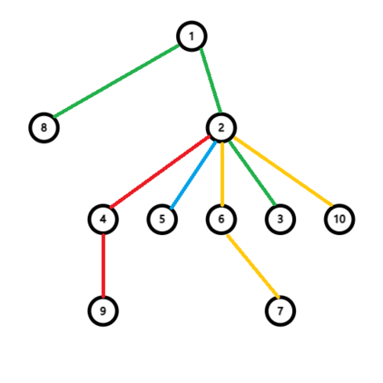

# Tutorial_(en)

[1787A - Exponential Equation](../problems/A._Exponential_Equation.md)

Idea & Solution: [rsj](https://codeforces.com/profile/rsj "Master rsj")

 **Tutorial**
### [1787A - Exponential Equation](../problems/A._Exponential_Equation.md "TypeDB Forces 2023 (Div. 1 + Div. 2, Rated, Prizes!)")

For even n, a key observation is that x=1,y=n2 is always legit.

And for odd n, notice that xyy+yxx=xy(xy−1+yx−1). So if x or y is an even number, obviously xyy+yxx is an even number. Otherwise if both x and y are all odd numbers , xy−1 and yx−1 are all odd numbers, so xy−1+yx−1 is an even number, and xyy+yxx is also an even number. That means xyy+yxx is always even and there's no solution for odd n.

[1787B - Number Factorization](../problems/B._Number_Factorization.md)

Idea & Solution: [rsj](https://codeforces.com/profile/rsj "Master rsj")

 **Tutorial**
### [1787B - Number Factorization](../problems/B._Number_Factorization.md "TypeDB Forces 2023 (Div. 1 + Div. 2, Rated, Prizes!)")

First, apii is equivalent to the product of a1i for p times, so it is sufficient to set all pi to 1.

Decomposite n to some prime factors, greedily choose the most number of distinct prime numbers, the product is the maximum.

 **Solution**
```cpp
#include <bits/stdc++.h>
using namespace std;
#define mp make_pair
pair<int, int> s[110];
int d[110];
void get() {
	int n, l = 0, i, c;
	cin >> n;
	for (i = 2; i * i <= n; i++) {
		if (n % i == 0) {
			c = 0;
			while (n % i == 0) c++, n /= i;
			s[++l] = make_pair(c, i);
		}
	}
	if (n != 1) s[++l] = make_pair(1, n);
	sort(s + 1, s + l + 1), d[l + 1] = 1;
	for (i = l; i >= 1; i--) d[i] = d[i + 1] * s[i].second;
	int ans = 0;
	for (i = 1; i <= l; i++) if (s[i].first != s[i - 1].first) ans += d[i] * (s[i].first - s[i - 1].first);
	cout << ans << endl;
}
signed main() {
	ios::sync_with_stdio(0);
	cin.tie(0);
	int T;
	cin >> T;
	while (T--) get();
	return 0;
}
```
[1787C - Remove the Bracket](../problems/C._Remove_the_Bracket.md)

Idea & Solution: [rsj](https://codeforces.com/profile/rsj "Master rsj")

 **Fact**This is the reason why the problem was named as *Remove the Bracket*. 

 Product=a1⋅a2⋅a3⋅…⋅an==a1⋅(x2+y2)⋅(x3+y3)⋅…⋅(xn−1+yn−1)⋅an=?=a1⋅x2+y2⋅x3+y3⋅…⋅xn−1+yn−1⋅an.However, We discussed to remove it on 28th Jan in the statement. Really sorry for inconvenience of the statement!

 **Tutorial**
### [1787C - Remove the Bracket](../problems/C._Remove_the_Bracket.md "TypeDB Forces 2023 (Div. 1 + Div. 2, Rated, Prizes!)")

(xi−s)(yi−s)≥0 tells us either min(xi,yi)≥s or max(xi,yi)≤s, so pickable xi is a consecutive range.

Just consider (xi+yi), remove the bracket then it turns to …+yi−1⋅xi+yi⋅xi+1+…. When yi−1=xi+1, the result is constant, so we assume that yi−1<xi+1. 

If xi does not hit the maximum, increase xi by 1 and decrease yi by 1, the result will increase by yi−1 and decrease by xi+1, which means decrease by xi+1−yi−1, always better. So xi will either hit the maximum or the minimum. Thus, each number has only two ways of rewriting that might be optimal.

This can be done with DP.

 **Solution**
```cpp
#include <bits/stdc++.h>
using namespace std;
const int N = 200005;
long long f[N][2],x[N],y[N];
void get() {
	int i,n,s,j;
	cin>>n>>s;
	for(i=1; i<=n; i++) {
		cin>>j;
		if(i==1||i==n) x[i]=y[i]=j;
		else if(j<=s) x[i]=0,y[i]=j;
		else x[i]=s,y[i]=j-s;
	}
	f[1][0]=f[1][1]=0;
	for(i=2; i<=n; i++) {
		f[i][0]=min(f[i-1][0]+y[i-1]*x[i],f[i-1][1]+x[i-1]*x[i]);
		f[i][1]=min(f[i-1][0]+y[i-1]*y[i],f[i-1][1]+x[i-1]*y[i]);
	}
	cout<<f[n][0]<<endl;
}
int main() {
	ios::sync_with_stdio(0);
	cin.tie(0);
	int T; cin>>T;
	while(T--) get();
	return 0;
}
```
[1787D - Game on Axis](../problems/D._Game_on_Axis.md)

Idea & Solution: [jiangtaizhe001](https://codeforces.com/profile/jiangtaizhe001 "Candidate Master jiangtaizhe001")

 **Tutorial**
### [1787D - Game on Axis](../problems/D._Game_on_Axis.md "TypeDB Forces 2023 (Div. 1 + Div. 2, Rated, Prizes!)")

First, add directed edges from i to i+ai. If there's a path from 1 to x satisfying x<1 or x>n, the game end. We consider all nodes x satisfying x<1 or x>n to be the end node, and we call the path which starts at node 1 until it loops or ends the key path.

If we can end the game at first:

Let's count the opposite: the number of invalid pairs. The graph with the end node forms a tree. Changing edges not on the key path is always legal. If changing the edges on the key path, for node x, we can only change its successor to other connected components, its precursor or itself on the tree with the end node.

For the answer, use dfs to count the number of precursors for every nodes on this tree, which is the size of subtree.

If we cannot end the game at first:

We can only change the edge on the key path, redirect them to any nodes on the tree with the end node.

 **Solution**
```cpp
#include <bits/stdc++.h>
using namespace std;
const int N = 200005;
int a[N];
int v[N]; //= 1 -> in the tree with the end node
int s[N]; //subtree size
struct E {
	int to;
	E *nex;
} *h[N];
void add(int u, int v) {
	E *cur = new E;
	cur->to = v, cur->nex = h[u], h[u] = cur;
}
void dfs(int u) {
	s[u] = v[u] = 1;
	for (E *cur = h[u]; cur; cur = cur->nex)
		dfs(cur->to), s[u] += s[cur->to];
}
void get() {
	int i, j, n;
	cin >> n;
	for (i = 1; i <= n + 1; i++)
		s[i] = v[i] = 0, h[i] = 0;
	for (i = 1; i <= n; i++) {
		cin >> a[i], a[i] = min(i + a[i], n + 1);
		if (a[i] <= 0) a[i] = n + 1;
		add(a[i], i);
	}
	dfs(n + 1); //start with the end point, dfs the tree
	long long ans = 0;
	if (v[1] == 1) {
		j = 1; do { ans -= s[j] + (n - s[n + 1] + 1), j = a[j]; }
		while (j != n + 1);
		ans += 1ll * n * (2 * n + 1);
	} else {
		j = 1; do { ans += (n + s[n + 1]), v[j] = 2, j = a[j]; }
		while (v[j] != 2);
	}
	cout << ans << endl;
}
int main() {
	ios::sync_with_stdio(0);
	cin.tie(0);
	int T;
	cin >> T;
	while (T--) get();
	return 0;
}
```
[1787E - The Harmonization of XOR](../problems/E._The_Harmonization_of_XOR.md)

Idea & Solution: [jiangtaizhe001](https://codeforces.com/profile/jiangtaizhe001 "Candidate Master jiangtaizhe001"), [rsj](https://codeforces.com/profile/rsj "Master rsj")

 **Tutorial**
### [1787E - The Harmonization of XOR](../problems/E._The_Harmonization_of_XOR.md "TypeDB Forces 2023 (Div. 1 + Div. 2, Rated, Prizes!)")

First, we observe that three subsequences can combine into one, so we only need to care about the maximum number of subsequences.

Make subsequences in the form of [a,a⊕x] as much as possible, leave [x] alone if possible, and the rest becomes a subsequence. This would be optimal.

Proof:

Let B be the highest bit of x, i.e. the B-th bit of x is on.

Let M be the number of numbers from 1 to n satisfying the B-th bit is on.

Then the number of subsequences must be smaller than or equal to M, since there's at least one B-th-bit-on number in each subsequence.

These B-th-bit-on numbers XOR x must be smaller than themselves, so we can always obtain M subsequences.

 **Bonus Problem****Bonus Problem:** What if x=0?

[1787F - Inverse Transformation](../problems/F._Inverse_Transformation.md)

Idea & Solution: [qzhwlzy](https://codeforces.com/profile/qzhwlzy "Specialist qzhwlzy"), [rsj](https://codeforces.com/profile/rsj "Master rsj")

 **Tutorial**
### [1787F - Inverse Transformation](../problems/F._Inverse_Transformation.md "TypeDB Forces 2023 (Div. 1 + Div. 2, Rated, Prizes!)")

Consider another question: Given the initial permutation a and find the permutation a′ on the k-th day?

After a day, element x will become σ(x)=ax, so we can consider the numbers as nodes, and we add directed edges from x to ax. Note that a is a permutation, so the graph consists of several cycles. After one day, ax will become aσ(x)=aax – the second element after x in the corresponding cycle. Similarly, we can conclude that ax will become the 2k-th element after x.

If a cycle c has an odd length l. Because 2kmodl≠0, the cycle will never split, the element cx will become c(x+2k)modl on the k-th day. Otherwise, if a cycle c has an even length l, after the first day, c1 will become c3, c3 will become c5, …, c2l−1 will become c1. And so will the even indices – that means the original cycle split into two small cycles of the same size l2. So, if a cycle of length l=p⋯2q will split into 2q small cycles of length p after exactly q days.

 

|  |  |  |
| --- | --- | --- |

 Images illustrating how a 12-node cycle split in two days. Because the length of a cycle l≤n, so we can perform the transformation for at least logn days to split all the cycles of even lengths into cycles of odd lengths. Then we can use our conclusion to calculate the final permutation on the k-th day.

Now let's back to our question. We observed that n∑i=11f(i) means the number of cycles in the original graph. Then we need to construct the original permutation a of the least possible cycle. As we've said before, the cycle of length l=p⋯2q will split into 2q small cycles of length p after exactly q days. So we can count all the cycles in permutation a′.

For cycles of odd length l, we can combine some of them. Specifically, we can combine 2q cycles into a cycle of length l⋯2q in the original permutation a. Note that q must be less than or equal to k.

And for cycles of even length l, we can also combine them. But because they haven't been split on the k-th day, we must combine exactly 2k cycles. So if the number of these cycles isn't a multiple of 2k, just print NO.

 **Solution**
```cpp
#include <bits/stdc++.h>
using namespace std;
const int N = 200005;
int dest[N], visit[N], ans[N], mp[N], ansinv[N], sp;
int pow2(int y, int M) {
	long long x = 2, ans = 1;
	while (y) {
		if (y & 1) ans = ans * x % M;
		x = x * x % M, y >>= 1;
	}
	return ans % M;
}
vector<int> cyc[N];
void get() {
	sp = 0;
	int n, i, j, m, z, o;
	cin >> n >> m;
	for (i = 1; i <= n; i++) cyc[i].clear();
	for (i = 1; i <= n; i++) visit[i] = 0, cin >> dest[i];
	for (i = 1; i <= n; i++) {
		if (visit[i]) continue;
		j = i, z = 0; do { ++z, visit[j] = 1, j = dest[j]; } while (j != i);
		cyc[z].push_back(i);
	}
	int lim = pow2(min(m, 20), 1e9), s = 0, d, t, num, cp;
	for (i = 1; i <= n; i++) {
		if (!cyc[i].size()) continue;
		int siz = cyc[i].size();
		if (i % 2 == 0 && siz % lim) {
			cout << "NO" << endl; return;
		} else {
			cp = -1;
			for (j = lim; j > 0; j /= 2) {
				while (siz >= j) {
					siz -= j, d = s + j * i, t = j;
					while (t--) {
						++s, ++cp, num = s, o = cyc[i][cp];
						do {
						    ans[num] = o, num += pow2(m, i * j);
						    if (num > d) num -= j * i;
						    o = dest[o];
						} while (o != cyc[i][cp]);
					}
					for (int k = sp + 1; k < sp + j * i; k++) mp[k] = k + 1;
					mp[sp + j * i] = sp + 1, sp += j * i, s = d;
				}
			}
		}
	}
	cout << "YES" << endl;
	for (i = 1; i <= n; i++) ansinv[ans[i]] = i;
	for (i = 1; i <= n; i++) cout << ans[mp[ansinv[i]]] << " n"[i == n];
}
int main() {
	ios::sync_with_stdio(0), cin.tie(0);
	int T;
	cin >> T;
	while (T--) get();
	return 0;
}
```
[1787G - Colorful Tree Again](../problems/G._Colorful_Tree_Again.md)

Idea & Solution: [rsj](https://codeforces.com/profile/rsj "Master rsj"), [275307894a](https://codeforces.com/profile/275307894a "Grandmaster 275307894a")

 **Tutorial**
### [1787G - Colorful Tree Again](../problems/G._Colorful_Tree_Again.md "TypeDB Forces 2023 (Div. 1 + Div. 2, Rated, Prizes!)")

On the original tree, all good paths are constant and one edge can only be on at most one good path.

For each color c, find all edges of color c, and judge if they form a simple path by counting the degree of each node on the path. If so, mark these edges and calculate the length.

When a query changes a node u, several paths across u are infected.

For example,

  An example doodle, assume that we are destroying node 2. If we are destroying node 2, path 8−1−2−3, 2−4−9, 2−5, and 7−6−2−10 will not be good paths.

A brute-force solution is to use a priority queue, delete length of bad paths, find the maximum length.

To gain better time complexity, treat two cases of influenced paths separately:

1. Only one path that goes from the ancestor of u to its subtree, like 8−1−2−3.

2. All paths whose LCA is u will be infected, like 2−4−9, 2−5, and 7−6−2−10.

This inspires us to maintain these paths according to their LCAs. That is, use priority queue on every node u to maintain all paths whose LCA is u.

Then use a global priority queue to maintain the answer of all paths maintained on all nodes.

**UPD:** An alternative implementation using segment tree [comment link](Tutorial_(en).md?#comment-998516).

[1787H - Codeforces Scoreboard](../problems/H._Codeforces_Scoreboard.md)

Idea & Solution: [jiangtaizhe001](https://codeforces.com/profile/jiangtaizhe001 "Candidate Master jiangtaizhe001"), [rsj](https://codeforces.com/profile/rsj "Master rsj")

 **Something To Say**Have to declare that we built up Problem H from zero. ;)

 **Tutorial**
### [1787H - Codeforces Scoreboard](../problems/H._Codeforces_Scoreboard.md "TypeDB Forces 2023 (Div. 1 + Div. 2, Rated, Prizes!)")

Since max{bi−ki⋅t,ai}=bi−min{ki⋅t,bi−ai}, we can pre-calculate the sum of bi. Let ci=bi−ai. Now our mission is to minimize the sum of min{ki⋅t,bi−ai}.

If we assume min{ki⋅t,bi−ai}=ki⋅t for some i, sort these problems in descending order of ki, then assign 1,2,3,… to their t in order. For min{ki⋅t,bi−ai}=bi−ai, they can be directly calculated.

There comes a DP solution: Let fi,j be the minimum sum, when considering first i problems (after sorting), j problems of them satisfying min{ki⋅t,bi−ai}=ki⋅t.

fi,j={fi−1,j+cij=0min{fi−1,j+ci,fi−1,j−1+ki⋅j}j>0

The time complexity is O(n2).

We can find that fi,j is convex. Proof below:

Let gi,j=fi,j−fi,j−1.

Thus fi,j=fi,0+j∑k=1gi,k, rewrite this formula with the original recursive formula.

Then fi,0+j∑k=1gi,k=min{fi−1,0,j∑k=1gi−1,k+ci,fi−1,0+j−1∑k=1gi−1,k+ki⋅j} ci+j∑k=1gi,k=j−1∑k=1gi−1,k+min{gi−1,j+ci,ki⋅j} Let j−1 be j ci+j−1∑k=1gi,k=j−2∑k=1gi−1,k+min{gi−1,j−1+ci,ki⋅(j−1)} Subtract the above two formulas from each other gi,j=gi−1,j−1+min{gi−1,j+ci,ki⋅j}−min{gi−1,j−1+ci,ki⋅(j−1)}

Because k is monotone non-increasing, so we can use mathematical induction to proof that for j, the increase speed of gi−1,j is faster than that of ki⋅j. We can find a critical value M that ∀j≤M,gi,j<ki⋅j and ∀j>M,gi,j>ki⋅j.

So compared gi with gi+1, the first part of the sequence remains unchanged, and the last part is added with ki, with an additional number ki⋅j in the middle, where j is the maximum number satisfied gi−1,j−1≤ki⋅j. 

Use the treap to maintain this sequence, which might be called the slope trick.

[1787I - Treasure Hunt](../problems/I._Treasure_Hunt.md)

Idea & Solution: [275307894a](https://codeforces.com/profile/275307894a "Grandmaster 275307894a")

 **Tutorial**
### [1787I - Treasure Hunt](../problems/I._Treasure_Hunt.md "TypeDB Forces 2023 (Div. 1 + Div. 2, Rated, Prizes!)")

First, we observe that: maxl>porr≤p(p∑i=1ai+r∑i=lai)=nmaxp=1p∑i=1ai+maxl,rr∑i=lai.

Proof: We can proof it by contradiction. Define g(l,r,p) as p∑i=1ai+r∑i=lai. Suppose l≤p<r when g(l,r,p) hits the maximum value. If r∑i=p+1ai≥0, g(l,r,r)≥g(l,r,p), otherwise g(l,p,p)>g(l,r,p). So the above observation is always correct.

So we can divide the problem into two parts: nmaxp=1p∑i=1ai and maxl,rr∑i=lai.

For nmaxp=1p∑i=1ai, it's easy to solve it by using a stack to calculate the prefix maximum value, and then calculate the answer.

And for maxl,rr∑i=lai, consider divide and conquer. For a part [l,r],let m=⌊l+r2⌋. Define h(L,R) as maxL≤l,r≤Rr∑i=lai. We want to calculate the sum of h(L,R) satisfied l≤L≤m<R<r. Obviously h(L,R)=max(max(h(L,m),h(m+1,R)),maxL≤p≤mm∑j=paj+maxm<p≤Rp∑j=m+1aj), and it's easy to calculate above four value in the time complexity of O(r−l). We can use binary search to calculate the maximum value. So the problem can be solved in the time complexity of O(nlog2n).

But it's not good enough. We can solve it in the time complexity of O(nlogn) based on the following theorem:

Define f(p) as max1≤q≤pq∑i=1ai. h(1,p)−f(p) is non-decreasing.

Proof: Actually, if we extend the first theorem, we will find l>p or r=p :

If l>p, so r∑i=p+1ai<0. When we add an element at the back of the sequence: If len∑i=1ai>p∑i=1ai, p and r become len at the same time. So Δf(len)<Δh(1,len) since r∑i=p+1ai<0. Otherwise if len∑i=1ai≤p∑i=1ai, Δf(len)=0 while Δh(1,len)≥0. So the theorem always holds in this circumstance.

If p=r, Δf(len)=Δh(1,len), so the theorem holds too.

Because of the theorem, we can replace binary search by two pointers. So the final time complexity is O(nlogn).

I'm really sorry for the unsatisfactory problems and the tough 3 hours ;)

However, I still hope you can enjoy the problems after the contest. The editorial hasn't been fully checked, so feel free to comment if there're errors, typos or you have questions about them. We'll check them out tomorrow. Thanks!

