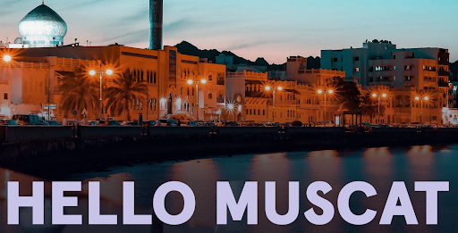

# Announcement

Hello Codeforces!

On [Tuesday, January 24, 2023 at 20:35UTC+6](https://codeforces.com/https://www.timeanddate.com/worldclock/fixedtime.html?day=24&month=1&year=2023&hour=17&min=35&sec=0&p1=166) [Educational Codeforces Round 142 (Rated for Div. 2)](https://codeforces.com/contest/1792 "Educational Codeforces Round 142 (Rated for Div. 2)") will start.

Series of Educational Rounds continue being held as [Harbour.Space University](https://codeforces.com/https://harbour.space/) initiative! You can read the details about the cooperation between [Harbour.Space University](https://codeforces.com/https://harbour.space/) and Codeforces in the [blog post](//codeforces.com/blog/entry/51208).

This round will be **rated for the participants with rating lower than 2100**. It will be held on extended ICPC rules. The penalty for each incorrect submission until the submission with a full solution is 10 minutes. After the end of the contest, you will have 12 hours to hack any solution you want. You will have access to copy any solution and test it locally.

You will be given **6 or 7 problems** and **2 hours** to solve them.

The problems were invented and prepared by Adilbek [adedalic](https://codeforces.com/profile/adedalic "International Master adedalic") Dalabaev, Vladimir [vovuh](https://codeforces.com/profile/vovuh "Master vovuh") Petrov, Ivan [BledDest](https://codeforces.com/profile/BledDest "International Grandmaster BledDest") Androsov, Maksim [Neon](https://codeforces.com/profile/Neon "Candidate Master Neon") Mescheryakov and me. Also, huge thanks to Mike [MikeMirzayanov](https://codeforces.com/profile/MikeMirzayanov "Headquarters, MikeMirzayanov") Mirzayanov for great systems Polygon and Codeforces.

Good luck to all the participants!

Our friends at Harbour.Space also have a message for you:

*Hey, Codeforces!*

*Preparations are under way for the second “Hello Muscat 2023” ICPC programming bootcamp, the continuation of the “Hello” bootcamp series, organised by **Harbour.Space University**, in collaboration with **PhazeRo**, **Gutech**, **UK Oman Digital Club**, **Leagues of Code**, **Gutech CS Club** and **Codeforces**!* 

*Quite exciting, isn’t it? Now it's time for you to dive deeper into the competitive programming world with the 8 days intensive Hello Muscat 2023. It will take place in Muscat, Oman and online from **March 8th to March 16th, 2023**, both participation formats are available. As always, we can’t wait to see you there to learn, practice and compete on the international stage, smoothing your road towards the joined World Finals 2022 and 2023 in Egypt!*

*Our coaching line-up combines talent and experience, featuring ICPC world champions winners and finalists, as well as legendary names from the field of competitive programming: Mike Mirzayanov [MikeMirzayanov](https://codeforces.com/profile/MikeMirzayanov "Headquarters, MikeMirzayanov"), Yahor Dubovik [244mhq](https://codeforces.com/profile/244mhq "International Grandmaster 244mhq"), Artem Plotkin [Rox](https://codeforces.com/profile/Rox "Candidate Master Rox"), Maksym Oboznyi [MaksymOboznyi](https://codeforces.com/profile/MaksymOboznyi "Grandmaster MaksymOboznyi") and Nikolay Budin [budalnik](https://codeforces.com/profile/budalnik "International Grandmaster budalnik").*

**The Bootcamp will be split into three divisions:** 

 * ***Division A.** Division A will be a mirror of the Petrozavodsk Programming Camp. Suitable for teams who already qualified for the world finals ICPC or are aiming that high.*
* ***Division B.** Designed to help teams prepare for the next season of ICPC regional competitions. Appropriate as an introduction for teams and students just getting their foot in the door of the world of ICPC and competitive programming competitions in general.*
* ***Division C.** Designed for newcomers to the world of ICPC competitive programming.*

**Types of participation: On-Site and Online**

_We believe that participation in our Bootcamp should be accessible by all teams wherever they are and that is why we made onsite and online types of participation. **20% Early Bird Discount is offered to universities and participants who register and pay before Jan 31st 2023.**

 * **On-site:**

*Price: 1500 € — 1200 €*

*What is included: training, contests, access to the recordings of the lectures, accommodation for 9 nights in a 4 star hotel **Mysk**, breakfast and lunch, transfer from hotel to venue every day, leisure, entertainment and welcome pack.*

 * **Online:**

*Price: 100 € — 80 €*

*What is included: training, contests, access to the recordings of the lectures.*

  [Learn more about Hello Muscat 2023→](https://codeforces.com/https://join.harbour.space/icpc-bootcamp) *Good luck with the round!*

**UPD:** [Editorial is out](Tutorial.md)

