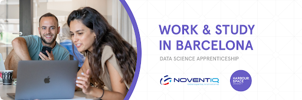

# Announcement

Hello Codeforces!

On [Thursday, February 16, 2023 at 20:35UTC+6](https://codeforces.com/https://www.timeanddate.com/worldclock/fixedtime.html?day=16&month=2&year=2023&hour=17&min=35&sec=0&p1=166) [Educational Codeforces Round 143 (Rated for Div. 2)](https://codeforces.com/contest/1795 "Educational Codeforces Round 143 (Rated for Div. 2)") will start.

Series of Educational Rounds continue being held as [Harbour.Space University](https://codeforces.com/https://harbour.space/) initiative! You can read the details about the cooperation between [Harbour.Space University](https://codeforces.com/https://harbour.space/) and Codeforces in the [blog post](//codeforces.com/blog/entry/51208).

This round will be **rated for the participants with rating lower than 2100**. It will be held on extended ICPC rules. The penalty for each incorrect submission until the submission with a full solution is 10 minutes. After the end of the contest, you will have 12 hours to hack any solution you want. You will have access to copy any solution and test it locally.

You will be given **6 or 7 problems** and **2 hours** to solve them.

The problems were invented and prepared by Adilbek [adedalic](https://codeforces.com/profile/adedalic "International Master adedalic") Dalabaev, Vladimir [vovuh](https://codeforces.com/profile/vovuh "Master vovuh") Petrov, Ivan [BledDest](https://codeforces.com/profile/BledDest "International Grandmaster BledDest") Androsov, Maksim [Neon](https://codeforces.com/profile/Neon "Candidate Master Neon") Mescheryakov and me. Also, huge thanks to Mike [MikeMirzayanov](https://codeforces.com/profile/MikeMirzayanov "Headquarters, MikeMirzayanov") Mirzayanov for great systems Polygon and Codeforces.

Good luck to all the participants!

Our friends at Harbour.Space also have a message for you:

*Hello Codeforces!*

*We look forward to seeing Mike Mirzayanov and Nikolay Kalinin again at our Barcelona campus when they teach [Advanced Algorithms and Data Structures.](https://harbour.space/computer-science/courses/advanced-algorithms-and-data-structures-mirzayanov-kalinin-768?utm_source=codeforces&utm_medium=partner&utm_campaign=bcn_b2c)* 

*In this course, students focus on key and in-depth algorithms and data structures that form a modern computer specialist’s toolkit.*

*We are always excited to see Codeforces participants as our students at Harbour.Space! Once again we are giving a special discount for the single course participation in Barcelona, Spain (travel costs and accommodation are not included).*

  [Sign Up Here→](https://harbour.space/computer-science/courses/advanced-algorithms-and-data-structures-mirzayanov-kalinin-768?utm_source=codeforces&utm_medium=partner&utm_campaign=bcn_b2c)   **APPRENTICESHIP OPPORTUNITY IN BARCELONA**  **NOVENTIQ x HARBOUR.SPACE***50% of the spots have been filled already, hurry up not to miss your opportunity to get selected!* 

*At **Harbour.Space University**, we continue providing work-study opportunities; in this case, we offer motivated **Data Scientists** the opportunity to work and **study in Barcelona** in partnership with **Noventiq**, the leading global solutions and services provider in digital transformation and cybersecurity.* 

*We are looking to distribute scholarships for intensive study programmes at the highest level for eligible candidates that will join our journey.*

***Candidates will be working on the following tasks:*** 

 * *Invent and implement approaches to solving problems of computer vision and machine learning, form requirements together with the team;*
* *Plan experiments, train models, evaluate their quality and embed them in pipelines;*
* *Work with data, the formation of technical requirements for markup;*
* *Register the results of training runs of models and track the dynamics of their performance;*
* *Write algorithms for pre and post-processing of images and videos, the logic of scenarios for processing media data;*
* *Conduct research in the field of Computer Vision: classification, detection, segmentation;*
* *Engage in the optimization of neural networks: distillation, quantization, pruning;*
* *Prepare models for production.*
* *Carry out the development of custom algorithms and modules for our video analytics platform*

*All successful applicants will be eligible for a 100% Tuition Fee Scholarship (22.900 €/year) provided by Noventiq company for the Data Science programme.*

***CANDIDATE’S COMMITMENT***

***Study Commitment:** 3 hours/day* *You will complete 15 modules (each three weeks long) in one year. The daily class workload is 3 hours, plus homework to complete in your own time.*

***Work Commitment:** 6 hours/day* *Immerse yourself in the professional world during your apprenticeship. You’ll learn from the best and get to apply your newly acquired knowledge in the field from day one.*

***University requirements***

 * *Bachelor's degree in the field of Mathematics, Statistics, Data Science, Computer Science or similar*
* *English proficiency*

***Work requirements***

 * *Excellent knowledge and experience in using Python, as well as TensorFlow/PyTorch;*
* *Experience in implementing Deep Learning models for commercial projects;*
* *Experience in solving real problems in the field of Computer Vision*
* *Experience with Linux OS, Git, Docker;*
* *Understand the principles of operation of current popular architectures of neural networks;*
* *Possession of the culture of conducting experiments, you know about reproducibility and logging, you can objectively assess the quality of the model;*
* *Spanish language proficiency;*

  [Apply Here Now→](https://codeforces.com/https://scholarships.harbour.space/noventiq-data-science?utm_source=malagi&utm_medium=partner&utm_campaign=bcn_b2b) **UPD:** [Editorial is out](Tutorial.md)

