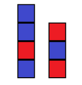
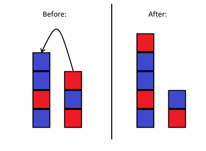
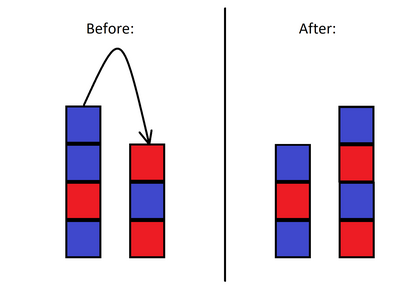

<h1 style='text-align: center;'> A. Two Towers</h1>

<h5 style='text-align: center;'>time limit per test: 2 seconds</h5>
<h5 style='text-align: center;'>memory limit per test: 256 megabytes</h5>

There are two towers consisting of blocks of two colors: red and blue. Both towers are represented by strings of characters B and/or R denoting the order of blocks in them from the bottom to the top, where B corresponds to a blue block, and R corresponds to a red block.

  These two towers are represented by strings BRBB and RBR. You can perform the following operation any number of times: choose a tower with at least two blocks, and move its top block to the top of the other tower.

   The pair of towers is beautiful if no pair of touching blocks has the same color; i. e. no red block stands on top of another red block, and no blue block stands on top of another blue block.

You have to check if it is possible to perform any number of operations (possibly zero) to make the pair of towers beautiful.

### Input

The first line contains one integer $t$ ($1 \le t \le 1000$) — the number of test cases.

Each test case consists of three lines:

* the first line contains two integers $n$ and $m$ ($1 \le n, m \le 20$) — the number of blocks in the first tower and the number of blocks in the second tower, respectively;
* the second line contains $s$ — a string of exactly $n$ characters B and/or R, denoting the first tower;
* the third line contains $t$ — a string of exactly $m$ characters B and/or R, denoting the second tower.
### Output

For each test case, print YES if it is possible to perform several (possibly zero) operations in such a way that the pair of towers becomes beautiful; otherwise print NO.

You may print each letter in any case (YES, yes, Yes will all be recognized as positive answer, NO, no and nO will all be recognized as negative answer).

## Example

### Input


```text
44 3BRBBRBR4 7BRBRRRBRBRB3 4RBRBRBR5 4BRBRRBRBR
```
### Output

```text

YES
YES
YES
NO

```
## Note

In the first test case, you can move the top block from the first tower to the second tower (see the third picture).

In the second test case, you can move the top block from the second tower to the first tower $6$ times.

In the third test case, the pair of towers is already beautiful.


#### Tags 

#800 #OK #brute_force #implementation #strings 

## Blogs
- [All Contest Problems](../Educational_Codeforces_Round_143_(Rated_for_Div._2).md)
- [Announcement](../blogs/Announcement.md)
- [Tutorial](../blogs/Tutorial.md)
