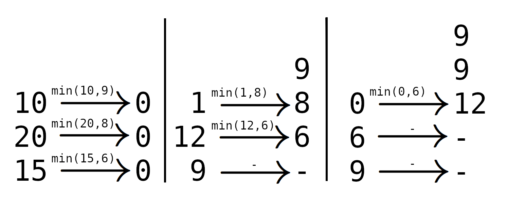

<h1 style='text-align: center;'> C. Tea Tasting</h1>

<h5 style='text-align: center;'>time limit per test: 2 seconds</h5>
<h5 style='text-align: center;'>memory limit per test: 256 megabytes</h5>

A tea manufacturer decided to conduct a massive tea tasting. $n$ sorts of tea will be tasted by $n$ tasters. Both the sorts of tea and the tasters are numbered from $1$ to $n$. The manufacturer prepared $a_i$ milliliters of the $i$-th sort of tea. The $j$-th taster can drink $b_j$ milliliters of tea at once.

The tasting will be conducted in steps. During the first step, the $i$-th taster tastes the $i$-th sort of tea. The $i$-th taster drinks $\min(a_i, b_i)$ tea (how much is available of the $i$-th sort and how much the $i$-th taster can drink). $a_i$ also decreases by this amount.

Then all tasters move to the previous sort of tea. Thus, during the second step, the $i$-th taster tastes the $(i-1)$-st sort of tea. The $i$-th taster drinks $\min(a_{i-1}, b_i)$ tea. The $1$-st person ends the tasting.

During the third step, the $i$-th taster tastes the $(i-2)$-nd sort of tea. The $2$-nd taster ends the tasting. This goes on until everyone ends the tasting.

Take a look at the tasting process for $n = 3$, $a = [10, 20, 15]$, $b = [9, 8, 6]$. In the left row, there are the current amounts of each sort of tea. In the right column, there are current amounts of tea each taster has drunk in total. The arrow tells which taster each tea goes to on the current step. The number on the arrow is the amount — minimum of how much is available of the sort of tea and how much the taster can drink.

  For each taster, print how many milliliters of tea he/she will drink in total.

### Input

The first line contains a single integer $t$ ($1 \le t \le 10^4$) — the number of testcases.

The first line of each testcase contains a single integer $n$ ($1 \le n \le 2 \cdot 10^5$) — the number of sorts of tea and the number of tasters.

The second line contains $n$ integers $a_1, a_2, \dots, a_n$ ($1 \le a_i \le 10^9$) — the amount of each sort of tea.

The third line contains $n$ integers $b_1, b_2, \dots, b_n$ ($1 \le b_i \le 10^9$) — the amount of tea each taster can drink at once.

The sum of $n$ over all testcases doesn't exceed $2 \cdot 10^5$.

### Output

For each testcase, print $n$ integers — the $i$-th value should be equal to the total amount of tea the $i$-th taster will drink.

## Example

### Input


```text
4310 20 159 8 6157413 8 5 43 4 2 131000000000 1000000000 10000000001 1 1000000000
```
### Output

```text

9 9 12 
5 
3 8 6 4 
1 2 2999999997 

```
## Note

The first testcase is described in the statement. Here are the remaining amounts of each sort of tea after each step and the total amount of tea each taster has drunk: 

* $a = [1, 12, 9]$, $\mathit{ans} = [9, 8, 6]$
* $a = [0, 6, 9]$, $\mathit{ans} = [9, 9, 12]$
* $a = [0, 6, 9]$, $\mathit{ans} = [9, 9, 12]$

In the second testcase, the only taster drinks $\min(5, 7)$ milliliters of tea of the only sort.

Here are the remaining amounts of each sort of tea after each step and the total amount of tea each taster has drunk for the third testcase: 

* $a = [10, 4, 3, 3]$, $\mathit{ans} = [3, 4, 2, 1]$;
* $a = [6, 2, 2, 3]$, $\mathit{ans} = [3, 8, 4, 2]$;
* $a = [4, 1, 2, 3]$, $\mathit{ans} = [3, 8, 6, 3]$;
* $a = [3, 1, 2, 3]$, $\mathit{ans} = [3, 8, 6, 4]$.

Here are the remaining amounts of each sort of tea after each step and the total amount of tea each taster has drunk for the fourth testcase: 

* $a = [999999999, 999999999, 0]$, $\mathit{ans} = [1, 1, 1000000000]$;
* $a = [999999998, 0, 0]$, $\mathit{ans} = [1, 2, 1999999999]$;
* $a = [0, 0, 0]$, $\mathit{ans} = [1, 2, 2999999997]$.


#### Tags 

#1500 #OK #binary_search #data_structures #implementation 

## Blogs
- [All Contest Problems](../Educational_Codeforces_Round_143_(Rated_for_Div._2).md)
- [Announcement](../blogs/Announcement.md)
- [Tutorial](../blogs/Tutorial.md)
