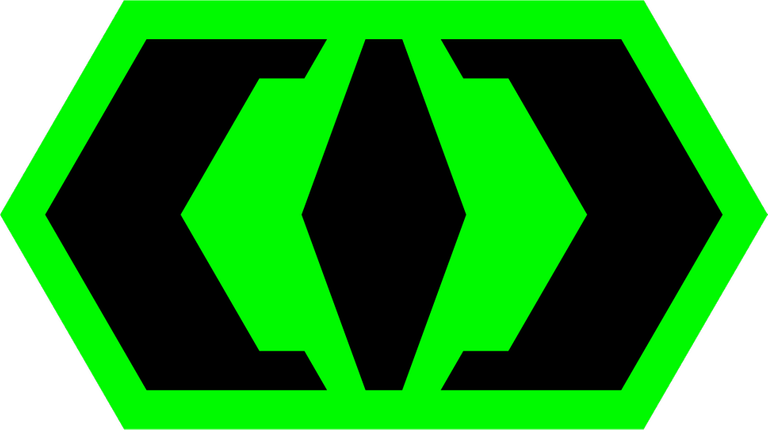
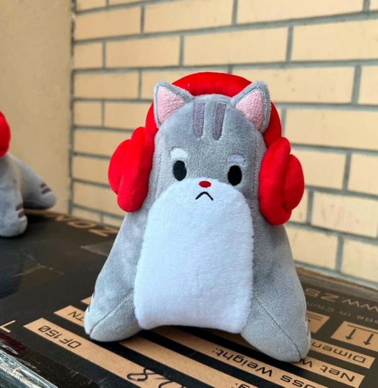

# Announcement

 Hi!

This round is sponsored by esports team [cybercats](https://codeforces.com/https://linktr.ee/cybercats). The team was founded in October 2021 by me and [subscriber](https://codeforces.com/profile/subscriber "International Master subscriber"). 

We currently have a Dota 2 roster, playing in the [second division of EEU DPC](https://codeforces.com/https://liquipedia.net/dota2/Dota_Pro_Circuit/2023/1/Eastern_Europe/Division_II). Come support us on streams and in the comments!

As a thank you to Codeforces and the competitive programming community, we decided to make this round and **give away 100 plush cybercats!**

The prizes will be awarded to the **first 100 places** in the round.

Follow our social networks:

   [(RU) VK](https://codeforces.com/https://vk.com/cybercatsgg)    [(RU) telegram](https://codeforces.com/https://t.me/cybercatsgg)    [(RU) youtube](https://codeforces.com/https://www.youtube.com/@cybercatsgg)    [(EN) twitter](https://codeforces.com/https://twitter.com/cybercatsgg).

The problem set was prepared by [subscriber](https://codeforces.com/profile/subscriber "International Master subscriber"), [isaf27](https://codeforces.com/profile/isaf27 "International Grandmaster isaf27"), [KAN](https://codeforces.com/profile/KAN "Legendary Grandmaster KAN"), [Catmoonlight](https://codeforces.com/profile/Catmoonlight "International Master Catmoonlight"), [jdurie](https://codeforces.com/profile/jdurie "International Grandmaster jdurie") and [BucketPotato](https://codeforces.com/profile/BucketPotato "Grandmaster BucketPotato").

Round was tested by [enot110](https://codeforces.com/profile/enot110 "International Grandmaster enot110"), [izban](https://codeforces.com/profile/izban "International Grandmaster izban"), [qwerty787788](https://codeforces.com/profile/qwerty787788 "International Grandmaster qwerty787788"), [MateoCV](https://codeforces.com/profile/MateoCV "Grandmaster MateoCV"), [ilyakrasnovv](https://codeforces.com/profile/ilyakrasnovv "Master ilyakrasnovv"), [blobugh](https://codeforces.com/profile/blobugh "Master blobugh"), [ak2006](https://codeforces.com/profile/ak2006 "Specialist ak2006"), [Valters07](https://codeforces.com/profile/Valters07 "Expert Valters07"), [DiegoGarcia](https://codeforces.com/profile/DiegoGarcia "Candidate Master DiegoGarcia"), [Chaska](https://codeforces.com/profile/Chaska "Specialist Chaska"), [kzyKT](https://codeforces.com/profile/kzyKT "Candidate Master kzyKT"), [Dan4Life](https://codeforces.com/profile/Dan4Life "Specialist Dan4Life"), [FedeNQ](https://codeforces.com/profile/FedeNQ "Expert FedeNQ"), [alysonNBS](https://codeforces.com/profile/alysonNBS "Pupil alysonNBS"), [petertromso](https://codeforces.com/profile/petertromso "Specialist petertromso") and [jojonicho](https://codeforces.com/profile/jojonicho "Specialist jojonicho").

**UPD.** Scoring distribution: 500 — 1000 — 1500 — (1500 — 750) — 2250 — 2500 — 3000 — 3500.

**UPD.** [editorial](Tutorial_(en).md)

