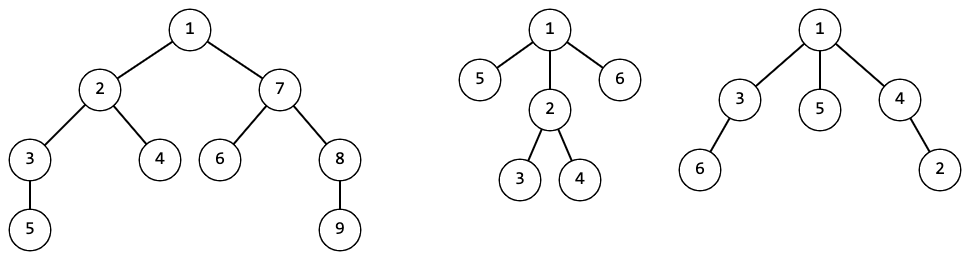
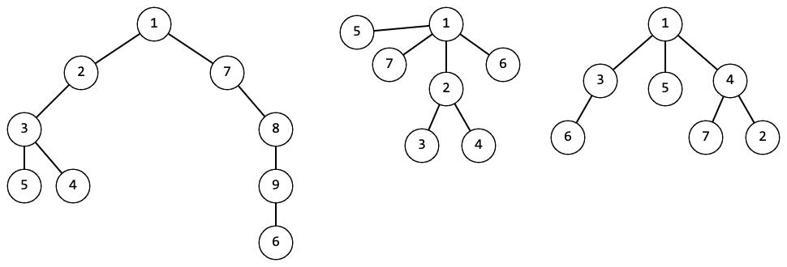

<h1 style='text-align: center;'> G. Symmetree</h1>

<h5 style='text-align: center;'>time limit per test: 2 seconds</h5>
<h5 style='text-align: center;'>memory limit per test: 256 megabytes</h5>

Kid was gifted a tree of $n$ vertices with the root in the vertex $1$. Since he really like symmetrical objects, Kid wants to find out if this tree is symmetrical.

  For example, the trees in the picture above are symmetrical.   And the trees in this picture are not symmetrical. Formally, a tree is symmetrical if there exists an order of children such that:

* The subtree of the leftmost child of the root is a mirror image of the subtree of the rightmost child;
* the subtree of the second-left child of the root is a mirror image of the subtree of the second-right child of the root;
* ...
* if the number of children of the root is odd, then the subtree of the middle child should be symmetrical.
### Input

The first line of input data contains single integer $t$ ($1 \le t \le 10^4$) — the number of test cases in the test.

The first line of each case contains an integer $n$ ($1 \le n \le 2 \cdot 10^5$) — the number of vertices in the tree.

The following $n-1$ lines contain two integers each $u$ and $v$ ($1 \le u, v \le n$, $u \neq v$) — indices of vertices connected by an edge.

It is guaranteed that the sum of $n$ over all cases does not exceed $2 \cdot 10^5$.

### Output

### Output

 $t$ strings, each of which is the answer to the corresponding test case. As an answer, output "YES" if this tree is symmetrical, and "NO" otherwise.

You can output the answer in any case (for example, the strings "yEs", "yes", "Yes" and "YES" will be recognized as a positive answer).

## Example

### Input


```text
661 51 61 22 32 471 51 33 61 44 74 291 22 42 33 51 77 67 88 9102 99 102 36 74 31 23 82 56 5103 28 109 74 28 22 14 56 55 71
```
### Output

```text

YES
NO
YES
NO
NO
YES

```


#### Tags 

#2200 #NOT OK #dfs_and_similar #hashing #implementation #trees 

## Blogs
- [All Contest Problems](../Codeforces_Round_855_(Div._3).md)
- [Announcement](../blogs/Announcement.md)
- [Tutorial](../blogs/Tutorial.md)
