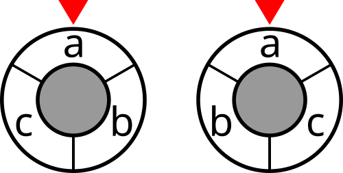
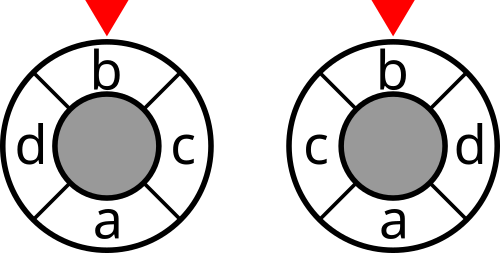
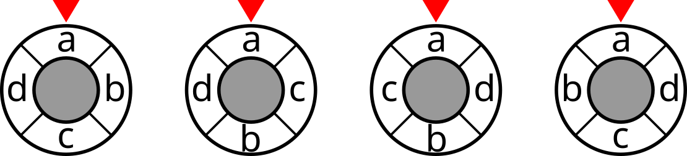

<h1 style='text-align: center;'> H. Code Lock</h1>

<h5 style='text-align: center;'>time limit per test: 7 seconds</h5>
<h5 style='text-align: center;'>memory limit per test: 512 megabytes</h5>

Lara has a safe that is locked with a circle-shaped code lock that consists of a rotating arrow, a static circumference around the arrow, an input screen, and an input button.

The circumference of the lock is split into $k$ equal sections numbered from $1$ to $k$ in clockwise order. Arrow always points to one of the sections. Each section is marked with one of the first $k$ letters of the English alphabet. No two sections are marked with the same letter.

Due to the lock limitations, the safe's password is a string of length $n$ that consists of first $k$ letters of the English alphabet only. Lara enters the password by rotating the lock's arrow and pressing the input button. Initially, the lock's arrow points to section $1$ and the input screen is empty. In one second she can do one of the following actions. 

* Rotate the arrow one section clockwise. If the arrow was pointing at section $x < k$ it will now point at section $x + 1$. If the arrow was pointing at section $k$ it will now point at section $1$.
* Rotate the arrow one section counter-clockwise. If the arrow was pointing at section $x > 1$ it will now point at section $x - 1$. If the arrow was pointing at section $1$ it will now point at section $k$.
* Press the input button. The letter marked on the section that the arrow points to will be added to the content of the input screen.

 As soon as the content of the input screen matches the password, the safe will open. Lara always enters her password in the minimum possible time.Lara has recently found out that the safe can be re-programmed. She can take the first $k$ letters of the English alphabet and assign them to the sectors in any order she likes. Now she wants to re-arrange the letters in a way that will minimize the number of seconds it takes her to input the password. Compute this minimum number of seconds and the number of ways to assign letters, for which this minimum number of seconds is achieved.

Two ways to assign letters to sectors are considered to be distinct if there exists at least one sector $i$ that is assigned different letters.

##### Input

The first line of the input contains two integers $k$ and $n$ ($2 \leq k \leq 16$, $2 \leq n \leq 100\,000$) — the number of sectors on the lock's circumference and the length of Lara's password, respectively.

The second line of the input contains a string of length $n$ that consists of the first $k$ lowercase letters of the English alphabet only. This string is the password.

##### Output

On the first line print minimum possible number of seconds it can take Lara to enter the password and open the safe if she assigns letters to sectors optimally.

On the second line print the number of ways to assign letters optimally.

## Examples

##### Input


```text
3 10
abcabcabca
```
##### Output


```text
19
2
```
##### Input


```text
4 20
bcbcbcbcadadadadcbda
```
##### Output


```text
40
2
```
##### Input


```text
4 6
adcbda
```
##### Output


```text
12
4
```
## Note

The initial states of optimal arrangements for the first example are shown in the figure below.

  The initial states of optimal arrangements for the second example are shown in the figure below.

  The initial states of optimal arrangements for the third example are shown in the figure below.

  

#### Tags 

#3300 #NOT OK #bitmasks #dp 

## Blogs
- [All Contest Problems](../Nebius_Welcome_Round_(Div._1_+_Div._2).md)
- [Announcement (en)](../blogs/Announcement_(en).md)
- [Tutorial (en)](../blogs/Tutorial_(en).md)
