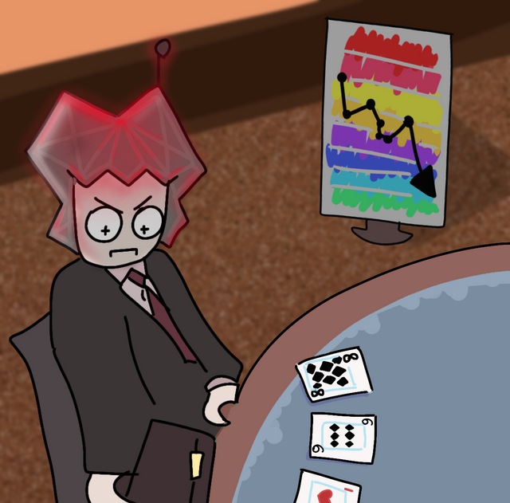

# Announcement

Hello, Codeforces!

I am very glad to invite you to the [Codeforces Round #861 (Div. 2)](https://codeforces.com/contest/1808), which will take place in [Wednesday, March 29, 2023 at 15:05UTC+6](https://codeforces.com/https://www.timeanddate.com/worldclock/fixedtime.html?day=29&month=3&year=2023&hour=12&min=5&sec=0&p1=166). **This round will be rated for the participants with rating lower than 2100.**

My sincere thanks to:

 * [KAN](https://codeforces.com/profile/KAN "Legendary Grandmaster KAN") и [Aleks5d](https://codeforces.com/profile/Aleks5d "International Master Aleks5d") for the great coordination of this round!
* [Wind_Eagle](https://codeforces.com/profile/Wind_Eagle "Master Wind_Eagle"), [BaluconisTima](https://codeforces.com/profile/BaluconisTima "Master BaluconisTima"), [kartel](https://codeforces.com/profile/kartel "Master kartel"), [gepardo](https://codeforces.com/profile/gepardo "International Grandmaster gepardo") and [244mhq](https://codeforces.com/profile/244mhq "International Grandmaster 244mhq") for the tasks ideas, and also [BaluconisTima](https://codeforces.com/profile/BaluconisTima "Master BaluconisTima"), [244mhq](https://codeforces.com/profile/244mhq "International Grandmaster 244mhq"), [VEGAnn](https://codeforces.com/profile/VEGAnn "Grandmaster VEGAnn"), [Vladik](https://codeforces.com/profile/Vladik "Master Vladik") and [andrew](https://codeforces.com/profile/andrew "Grandmaster andrew") for preparing the tasks.
* [vilcheuski](https://codeforces.com/profile/vilcheuski "International Master vilcheuski") and [programmer228](https://codeforces.com/profile/programmer228 "International Master programmer228") the rest of the author team, without whom this round would not have happened.
* [BaluconisTima](https://codeforces.com/profile/BaluconisTima "Master BaluconisTima") for the splendacious pictures, which complement each problem.
* [MikeMirzayanov](https://codeforces.com/profile/MikeMirzayanov "Headquarters, MikeMirzayanov") for Codeforces and Polygon platforms.
* You for participating in this round.

~~You will have 2 hours and 30 minutes for solving 6 tasks, **one of which will be divided into easy and hard verions.**~~ The round is based on the problems from the Belarusian National Olympiad. **We kindly ask all Belarusian students who participated in this olympiad, to refrain from taking part in this round and discussing the problems publicly before the round ends.**

I hope you will enjoy the round!

**Round testers (will be available later):** [Ormlis](https://codeforces.com/profile/Ormlis "Legendary Grandmaster Ormlis"), [4qqqq](https://codeforces.com/profile/4qqqq "Candidate Master 4qqqq"), [nnv-nick](https://codeforces.com/profile/nnv-nick "Candidate Master nnv-nick"), [olya.masaeva](https://codeforces.com/profile/olya.masaeva "Candidate Master olya.masaeva"), [Makcum888](https://codeforces.com/profile/Makcum888 "Master Makcum888").

~~**Preliminary score distribution: 750-1000-1500-2000-2500-3250**~~.

**UPD: the round was rebalanced.** You will have 2 hours for solving 5 tasks, one of which will be divided into easy, medium and hard verions.

**Score distribution: 750-1000-1500-1750-(1750+1000+750)**.

Editorial: <Tutorial_(en).md>

Winners:

Div. 1 + Div. 2:

1) [BurnedChicken](https://codeforces.com/profile/BurnedChicken "International Grandmaster BurnedChicken")

2) [maspy](https://codeforces.com/profile/maspy "International Grandmaster maspy")

3) [happylmb](https://codeforces.com/profile/happylmb "Specialist happylmb")

Div. 2:

1) [happylmb](https://codeforces.com/profile/happylmb "Specialist happylmb")

2) [Cherished](https://codeforces.com/profile/Cherished "Unrated, Cherished")

3) [2021_yes](https://codeforces.com/profile/2021_yes "Specialist 2021_yes")

