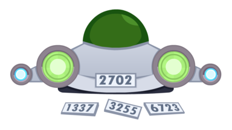

<h1 style='text-align: center;'> A. Lucky Numbers</h1>

<h5 style='text-align: center;'>time limit per test: 1 second</h5>
<h5 style='text-align: center;'>memory limit per test: 256 megabytes</h5>

Olympus City recently launched the production of personal starships. Now everyone on Mars can buy one and fly to other planets inexpensively.

Each starship has a number —some positive integer $x$. Let's define the luckiness of a number $x$ as the difference between the largest and smallest digits of that number. For example, $142857$ has $8$ as its largest digit and $1$ as its smallest digit, so its luckiness is $8-1=7$. And the number $111$ has all digits equal to $1$, so its luckiness is zero.

Hateehc is a famous Martian blogger who often flies to different corners of the solar system. To release interesting videos even faster, he decided to buy himself a starship. When he came to the store, he saw starships with numbers from $l$ to $r$ inclusively. While in the store, Hateehc wanted to find a starship with the luckiest number.

Since there are a lot of starships in the store, and Hateehc can't program, you have to help the blogger and write a program that answers his question.

  
### Input

The first line contains an integer $t$ ($1 \le t \le 10\,000$) —the number of test cases.

Each of the following $t$ lines contains a description of the test case. The description consists of two integers $l$ and $r$ ($1 \le l \le r \le 10^6$) — the largest and smallest numbers of the starships in the store.

### Output

Print $t$ lines, one line for each test case, containing the luckiest starship number in the store.

If there are several ways to choose the luckiest number, output any of them.

## Example

### Input


```text
559 6342 4915 1553 571 100
```
### Output

```text

60
49
15
57
90

```
## Note

Let's look at two test examples: 

* the luckiness of the number $59$ is $9 - 5 = 4$;
* the luckiness of $60$ equals $6 - 0 = 6$;
* the luckiness of $61$ equals $6 - 1 = 5$;
* the luckiness of $62$ equals $6 - 2 = 4$;
* the luckiness of $63$ is $6 - 3 = 3$.

 Thus, the luckiest number is $60$.In the fifth test example, the luckiest number is $90$.


#### Tags 

#900 #OK #brute_force #implementation 

## Blogs
- [All Contest Problems](../Codeforces_Round_861_(Div._2).md)
- [Announcement](../blogs/Announcement.md)
- [Tutorial (en)](../blogs/Tutorial_(en).md)
