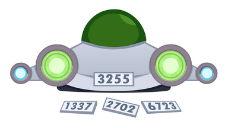

<h1 style='text-align: center;'> C. Unlucky Numbers</h1>

<h5 style='text-align: center;'>time limit per test: 2 seconds</h5>
<h5 style='text-align: center;'>memory limit per test: 256 megabytes</h5>

In this problem, unlike problem A, you need to look for unluckiest number, not the luckiest one.

## Note

 that the constraints of this problem differ from such in problem A.

Olympus City recently launched the production of personal starships. Now everyone on Mars can buy one and fly to other planets inexpensively.

Each starship has a number —some positive integer $x$. Let's define the luckiness of a number $x$ as the difference between the largest and smallest digits of that number. For example, $142857$ has $8$ as its largest digit and $1$ as its smallest digit, so its luckiness is $8-1=7$. And the number $111$ has all digits equal to $1$, so its luckiness is zero.

Hateehc is a famous Martian blogger who often flies to different corners of the solar system. To release interesting videos even faster, he decided to buy himself a starship. When he came to the store, he saw starships with numbers from $l$ to $r$ inclusively. While in the store, Hateehc wanted to find a starship with the unluckiest number.

Since there are a lot of starships in the store, and Hateehc can't program, you have to help the blogger and write a program that answers his question.

  
### Input

The first line contains an integer $t$ ($1 \le t \le 600$) —the number of test cases.

Each of the following $t$ lines contains a description of the test case. The description consists of two integers $l$, $r$ ($1 \le l \le r \le 10^{18}$) — the largest and smallest numbers of the starships in the store.

### Output

Print $t$ lines, one line for each test case, containing the unluckiest starship number in the store.

If there are several ways to choose the unluckiest number, output any of them.

## Example

### Input


```text
559 6342 4948 5390 901 100
```
### Output

```text

63
44
53
90
1

```
## Note

Let's look at two test examples: 

* the luckiness of the number $59$ is $9 - 5 = 4$;
* the luckiness of $60$ equals $6 - 0 = 6$;
* the luckiness of $61$ equals $6 - 1 = 5$;
* the luckiness of $62$ equals $6 - 2 = 4$;
* the luckiness of $63$ is $6 - 3 = 3$.

 So the unluckiest number is $63$.In the fifth test case, the unluckiest numbers are $1$, $2$, $3$, $4$, $5$, $6$, $7$, $8$, $9$, $11$, $22$, $33$, $44$, $55$, $66$, $77$, $88$, $99$, so you are allowed to choose any of them.


#### Tags 

#1900 #NOT OK #brute_force #dp #greedy #implementation 

## Blogs
- [All Contest Problems](../Codeforces_Round_861_(Div._2).md)
- [Announcement](../blogs/Announcement.md)
- [Tutorial (en)](../blogs/Tutorial_(en).md)
