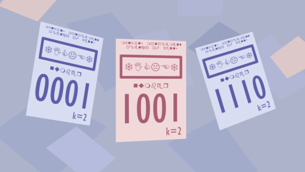

<h1 style='text-align: center;'> E1. Minibuses on Venus (easy version)</h1>

<h5 style='text-align: center;'>time limit per test: 3 seconds</h5>
<h5 style='text-align: center;'>memory limit per test: 256 megabytes</h5>

This is the easy version of the problem. The only difference between the three versions is the constraints on $n$ and $k$. You can make hacks only if all versions of the problem are solved.

Maxim is a minibus driver on Venus.

To ride on Maxim's minibus, you need a ticket. Each ticket has a number consisting of $n$ digits. However, as we know, the residents of Venus use a numeral system with base $k$, rather than the decimal system. Therefore, the ticket number can be considered as a sequence of $n$ integers from $0$ to $k-1$, inclusive.

The residents of Venus consider a ticket to be lucky if there is a digit on it that is equal to the sum of the remaining digits, modulo $k$. For example, if $k=10$, then the ticket $7135$ is lucky because $7 + 1 + 5 \equiv 3 \pmod{10}$. On the other hand, the ticket $7136$ is not lucky because no digit is equal to the sum of the others modulo $10$.

Once, while on a trip, Maxim wondered: how many lucky tickets exist? At the same time, Maxim understands that this number can be very large, so he is interested only in the answer modulo some prime number $m$.

  
#### Input

The only line of the input contains three integers $n$, $k$ and $m$ ($1 \le n \le 100$, $1 \le k \le 30$, $10^8 \le m \le 10^9 + 7$, $m$ is a prime number) — the number of digits on the ticket, the base of the numeral system on Venus, and the module for answer calculation.

#### Output

Print one integer — the number of lucky tickets modulo $m$, i. e. the remainder after dividing the answer by $m$.

## Examples

#### Input


```text
3 2 1000000007
```
#### Output


```text
4
```
#### Input


```text
3 4 1000000007
```
#### Output


```text
28
```
## Note

In the first example, there are only four lucky tickets: $000$, $011$, $101$, and $110$.


#### Tags 

#2200 #NOT OK #combinatorics #divide_and_conquer #dp 

## Blogs
- [All Contest Problems](../Codeforces_Round_861_(Div._2).md)
- [Announcement](../blogs/Announcement.md)
- [Tutorial (en)](../blogs/Tutorial_(en).md)
