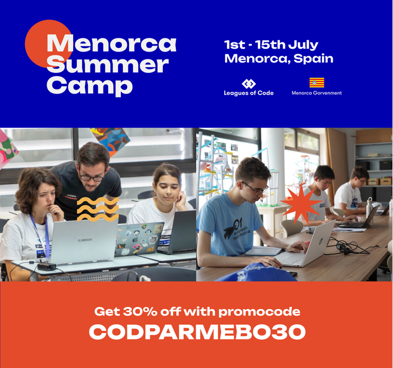

# Announcement

Hello Codeforces!

On [Thursday, March 23, 2023 at 20:35UTC+6](https://codeforces.com/https://www.timeanddate.com/worldclock/fixedtime.html?day=23&month=3&year=2023&hour=17&min=35&sec=0&p1=166) [Educational Codeforces Round 145 (Rated for Div. 2)](https://codeforces.com/contest/1809 "Educational Codeforces Round 145 (Rated for Div. 2)") will start.

Series of Educational Rounds continue being held as [Harbour.Space University](https://codeforces.com/https://harbour.space/) initiative! You can read the details about the cooperation between [Harbour.Space University](https://codeforces.com/https://harbour.space/) and Codeforces in the [blog post](//codeforces.com/blog/entry/51208).

This round will be **rated for the participants with rating lower than 2100**. It will be held on extended ICPC rules. The penalty for each incorrect submission until the submission with a full solution is 10 minutes. After the end of the contest, you will have 12 hours to hack any solution you want. You will have access to copy any solution and test it locally.

You will be given **6 or 7 problems** and **2 hours** to solve them.

The problems were invented and prepared by Adilbek [adedalic](https://codeforces.com/profile/adedalic "International Master adedalic") Dalabaev, Ivan [BledDest](https://codeforces.com/profile/BledDest "International Grandmaster BledDest") Androsov, Maksim [Neon](https://codeforces.com/profile/Neon "Candidate Master Neon") Mescheryakov and me. Also, huge thanks to Mike [MikeMirzayanov](https://codeforces.com/profile/MikeMirzayanov "Headquarters, MikeMirzayanov") Mirzayanov for great systems Polygon and Codeforces.

Good luck to all the participants!

Our friends at Harbour.Space also have a message for you:

 *Hey, Codeforces!*

*We're excited to announce that registration for the Leagues of Code Summer Camp is now open! This year, Harbour.Space University and Leagues of Code are organising a programming camp in Menorca from July 1st to the 15th!*

*Our Summer Camp is a training program that will teach participants competitive programming. We are inviting students ages 10 to 18 interested in improving their skills or seeking intensive, high-level training. Participants will be divided into classes based on their level and previous experience. Classes will be held in English.*

*Join a coding camp that brings you the brightest stars in tech!*

*Here is a summary of the camp :*

 * *Duration: 2 weeks*
* *Dates: July 1st to 15th*
* *Place: Menorca*
* *Levels:*

 1. **Zero**: *Our "Zero" course is designed for anyone without programming experience. Through interactive lessons and engaging activities, they'll learn the fundamentals of coding and build a strong foundation for future learning*
2. **Beginner**: *Our beginner coding course is designed for participants who have some basic programming knowledge but want to take their skills to the next level. The course covers programming fundamentals and builds on prior knowledge, focusing on problem-solving, critical thinking, and project-based learning*
3. **Intermediate**: *Become a pro-grammarians by diving into the main concepts of web and game development. No coding experience? No problem! We'll help you get started, and by the end of the bootcamp, you'll be a coding ninja with a cool project under your belt!*
4. **Advanced**: *Ready to put your brain to the test? Our camp will have you solving algorithms like a pro and competing like a champion with the guidance of world medalists. By the end of camp, you'll be a coding champion with a trophy in your virtual hands!*

*Ready to join our Summer Camp in Menorca? We have a 30% discount for Codeforces participants using the code CODPARMEBO30.*

  [Register here→](https://join.leaguesofcode.com/camps/menorca-summer?utm_source=codeforces&utm_medium=partner&utm_campaign=) **UPD:** [Editorial is out](Tutorial.md)

