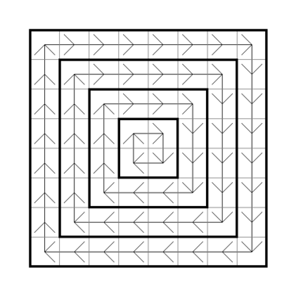

<h1 style='text-align: center;'> B. Conveyor Belts</h1>

<h5 style='text-align: center;'>time limit per test: 3 seconds</h5>
<h5 style='text-align: center;'>memory limit per test: 256 megabytes</h5>

Conveyor matrix $m_n$ is matrix of size $n \times n$, where $n$ is an even number. The matrix consists of concentric ribbons moving clockwise.

In other words, the conveyor matrix for $n = 2$ is simply a matrix $2 \times 2$, whose cells form a cycle of length $4$ clockwise. For any natural $k \ge 2$, the matrix $m_{2k}$ is obtained by adding to the matrix $m_{2k - 2}$ an outer layer forming a clockwise cycle.

  The conveyor matrix $8 \times 8$. You are standing in a cell with coordinates $x_1, y_1$ and you want to get into a cell with coordinates $x_2, y_2$. A cell has coordinates $x, y$ if it is located at the intersection of the $x$th row and the $y$th column.

Standing on some cell, every second you will move to the cell next in the direction of movement of the tape on which you are. You can also move to a neighboring cell by spending one unit of energy. Movements happen instantly and you can make an unlimited number of them at any time.

Your task is to find the minimum amount of energy that will have to be spent to get from the cell with coordinates $x_1, y_1$ to the cell with coordinates $x_2, y_2$.

For example, $n=8$ initially you are in a cell with coordinates $1,3$ and you want to get into a cell with coordinates $6, 4$. You can immediately make $2$ movements, once you are in a cell with coordinates $3, 3$, and then after $8$ seconds you will be in the right cell.

### Input

The first line contains an integer $t$ ($1 \le t \le 2 \cdot 10^5$) — the number of test cases.

The descriptions of the test cases follow.

The description of each test case consists of one string containing five integers $n$, $x_1$, $y_1$, $x_2$ and $y_2$ ($1 \le x_1, y_1, x_2, y_2 \le n \le 10^9$) — matrix size and the coordinates of the start and end cells. It is guaranteed that the number $n$ is even.

### Output

For each test case, print one integer in a separate line — the minimum amount of energy that will have to be spent to get from the cell with coordinates $x_1, y_1$ to the cell with coordinates $x_2, y_2$.

## Example

### Input


```text
52 1 1 2 24 1 4 3 38 1 3 4 6100 10 20 50 1001000000000 123456789 987654321 998244353 500000004
```
### Output

```text

0
1
2
9
10590032

```


#### Tags 

#1000 #OK #implementation #math 

## Blogs
- [All Contest Problems](../Codeforces_Round_863_(Div._3).md)
- [Announcement](../blogs/Announcement.md)
- [Tutorial](../blogs/Tutorial.md)
