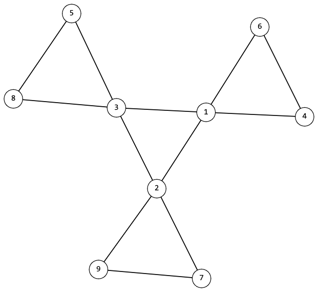

<h1 style='text-align: center;'> F. Is It Flower?</h1>

<h5 style='text-align: center;'>time limit per test: 2 seconds</h5>
<h5 style='text-align: center;'>memory limit per test: 256 megabytes</h5>

Vlad found a flowerbed with graphs in his yard and decided to take one for himself. Later he found out that in addition to the usual graphs, $k$-flowers also grew on that flowerbed. A graph is called a $k$-flower if it consists of a simple cycle of length $k$, through each vertex of which passes its own simple cycle of length $k$ and these cycles do not intersect at the vertices. For example, $3$-flower looks like this:

  Note that $1$-flower and $2$-flower do not exist, since at least $3$ vertices are needed to form a cycle.

Vlad really liked the structure of the $k$-flowers and now he wants to find out if he was lucky to take one of them from the flowerbed.

#### Input

The first line of input contains the single integer $t$ ($1 \le t \le 10^4$) — the number of test cases in the test.

The descriptions of the cases follow. An empty string is written before each case.

The first line of each case contains two integers $n$ and $m$ ($2 \le n \le 2 \cdot 10^5$, $1 \le m \le \min(2 \cdot 10^5, \frac{n \cdot (n-1)}{2})$) — the number of vertices and edges in the graph, respectively.

The next $m$ lines contain two integers each $u$ and $v$ ($1 \le u, v \le n$, $u \ne v$) — numbers of vertices connected by an edge. It is guaranteed that the graph does not contain multiple edges and self-loops.

It is guaranteed that the sum of $n$ over all test cases does not exceed $2 \cdot 10^5$. It is also guaranteed for the sum of $m$ over all test cases.

#### Output

#### Output

 $t$ lines, each of which is the answer to the corresponding test case. As an answer, output "YES" if Vlad's graph is a $k$-flower for some $k$, and "NO" otherwise.

You can output the answer in any case (for example, the strings "yEs", "yes", "Yes" and "YES" will be recognized as a positive answer).

## Examples

#### Input


```text
5  
9 121 23 12 31 64 16 43 83 55 89 72 97 2  
8 121 23 12 31 64 16 43 83 55 88 72 87 2  
4 31 24 23 1  
6 86 36 45 35 23 23 12 12 4  
5 72 42 53 43 54 14 51 5
```
#### Output

```text

YES
NO
NO
NO
NO

```
#### Input


```text
4  
2 11 2  
8 91 28 48 26 46 54 73 23 72 5  
9 122 92 86 96 86 56 19 89 39 18 38 75 7  
3 31 21 32 3
```
#### Output

```text

NO
NO
NO
NO

```


#### Tags 

#2100 #NOT OK #dfs_and_similar #graphs #implementation 

## Blogs
- [All Contest Problems](../Codeforces_Round_863_(Div._3).md)
- [Announcement](../blogs/Announcement.md)
- [Tutorial](../blogs/Tutorial.md)
