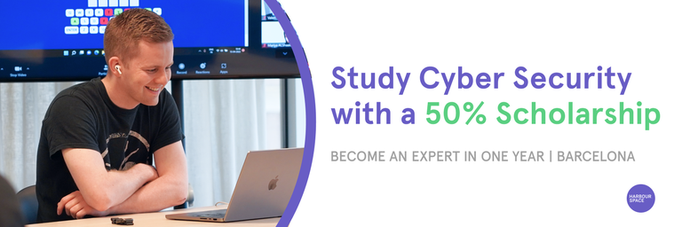

# Announcement

Hello Codeforces!

On [Thursday, April 6, 2023 at 20:35UTC+6](https://codeforces.com/https://www.timeanddate.com/worldclock/fixedtime.html?day=6&month=4&year=2023&hour=17&min=35&sec=0&p1=166) [Educational Codeforces Round 146 (Rated for Div. 2)](https://codeforces.com/contest/1814 "Educational Codeforces Round 146 (Rated for Div. 2)") will start.

Series of Educational Rounds continue being held as [Harbour.Space University](https://codeforces.com/https://harbour.space/) initiative! You can read the details about the cooperation between [Harbour.Space University](https://codeforces.com/https://harbour.space/) and Codeforces in the [blog post](//mirror.codeforces.com/blog/entry/51208).

This round will be **rated for the participants with rating lower than 2100**. It will be held on extended ICPC rules. The penalty for each incorrect submission until the submission with a full solution is 10 minutes. After the end of the contest, you will have 12 hours to hack any solution you want. You will have access to copy any solution and test it locally.

You will be given **6 or 7 problems** and **2 hours** to solve them.

The problems were invented and prepared by Adilbek [adedalic](https://codeforces.com/profile/adedalic "International Master adedalic") Dalabaev, Ivan [BledDest](https://codeforces.com/profile/BledDest "International Grandmaster BledDest") Androsov, Maksim [Neon](https://codeforces.com/profile/Neon "Candidate Master Neon") Mescheryakov and me. Also, huge thanks to Mike [MikeMirzayanov](https://codeforces.com/profile/MikeMirzayanov "Headquarters, MikeMirzayanov") Mirzayanov for great systems Polygon and Codeforces.

Good luck to all the participants!

Our friends at Harbour.Space also have a message for you:

*Hey, Codeforces!*

*Once again, it is time for another exciting **scholarship opportunity** from Harbour.Space!*

*We are looking for talented individuals who want to launch their careers in **Cyber Security** with a **50% scholarship to study in Barcelona**.*

*If you love technology and looking for an exciting career, then Cyber Security might be for you!* 

*But don't just take our word for it — as a member of the Codeforces community, you know the value of continuous learning and growth. The Cyber Security master’s programme at Harbour.Space responds to a growing market need, driven by increasing threats of global cyberwarfare, for cyber professionals with advanced training in both defensive cybersecurity and offensive cyber actions. The programme is designed to provide the knowledge, skills, and abilities required to perform critical cybersecurity tasks successfully.*

***Requirements:*** 

 * *Bachelor’s Degree*
* *Professional fluency in English*
* *Your CV in English*

***What you will learn:*** 

 * *Applied Threat Intelligence*
* *Threat Hunting*
* *Reverse Engineering and Malware Analysis*
* *Digital Forensics and Incident Response*
* *Pentesting and Ethical Hacking*
* *Hardware Conception of Processing Modules for the IoT*
* *Networks and Protocols*
* *Crisis Management and Communications*
* *BlockChain and IAM*
* *Soft Skills: Team Building, Presentation Skills and Meeting Facilitation*
* *And more*

*Make sure to apply **before April 30th, 2023**, to be eligible for the scholarship and reduced application fee.*

   [APPLY NOW →](https://study.harbour.space/cyber-security?utm_source=codeforces&utm_medium=partner&utm_campaign=bcn_b2c_cyber_security_re-launch) *Keep in touch and follow us on [LinkedIn](https://codeforces.com/https://www.linkedin.com/school/harbour-space/) for more scholarship opportunities. And follow us on [Instagram](https://codeforces.com/https://www.instagram.com/harbour.space/) to evidence student life, events, and success stories from students.*

*We are always happy to see Codeforces members join the Harbour.Space family.* 

*[Apply now](https://study.harbour.space/cyber-security?utm_source=codeforces&utm_medium=partner&utm_campaign=bcn_b2c_cyber_security_re-launch) to learn from the best in the field and take your career to the next level!*

*Good luck on your round, and see you next time!* 

*Harbour.Space University*

**UPD: The contest is unrated. We apologize for the inconvenience.** 

**UPD:** [Editorial is out](Tutorial.md)

