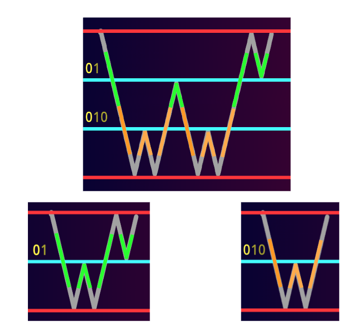

# Tutorial_(en)

Thanks for participating, and happy Easter!

### [1816A - Ian Visits Mary](../problems/A._Ian_Visits_Mary.md "Codeforces Round 865 (Div. 2)")

 **Editorial**Let us show that Ian can get to Mary within two moves. Indeed, consider (x1,y1) and (x2,y2) where x2−x1=1, since the value of the x-coordinates of a point lying on the segment joining (x1,y1) and (x2,y2), and is not at the endpoints, is strictly between x1 and x2, but there are no integers strictly between x1 and x2, the point must not be a lattice point. Similarly, no lattice points lie on the segment joining (x1,y1) and (x2,y2) with y2−y1=1 except for the endpoints. Therefore, Ian can jump from (0,0) to (x−1,1) to (x,y).

 **Implementation**
```cpp
#include<bits/stdc++.h>
using namespace std;
 
void solve(){
    int a,b;
    cin >> a >> b;
    cout << 2 << "n" << a-1 << ' ' << 1 << "n" << a << ' ' << b << "n";
}
 
int main(){
    int t;
    cin >> t;
    while(t--){
        solve();
    }
}
```
 **Remark**Originally, the problem asks you for the minimal amount of steps, which requires gcd. Since it would be too hard, we had a quite last-minute change to the current statement.

### [1816B - Grid Reconstruction](../problems/B._Grid_Reconstruction.md "Codeforces Round 865 (Div. 2)")

 **Hint**Consider the parity (odd/even) of i+j. What do you observe?

 **Editorial**Observe that ai,j will be added if (i+j) is even, and will be subtracted otherwise. This forms a checkered pattern.

Obviously, it is optimal for all values that will be added to be strictly larger than all values that will be subtracted. Also, the difference between the value of adjacent grids should be *almost* equal (by some definition of *almost*).

We construct array a as follows:

 * a1,1=2n−1 and a2,n=2n
* For 2≤i≤n and i is even, a1,i=i and a2,i−1=i−1
* For 2≤i≤n and i is odd, a1,i=n+i−1 and a2,i−1=n+(i−1)−1

For example, when n=10, the output will be

 
```cpp
19 2 12 4 14 6 16 8 18 10
1 11 3 13 5 15 7 17 9 20
```
 **Insights on how to find the construction**(This is a very informal proof. See "Proof" below for a formal proof.)

First of all, due to the checkered pattern, a1,1,a2,2,a1,3,⋯,a2,n should be filled with n+1,n+2,n+3,⋯,2n, and a2,1,a1,2,a2,3,⋯,a1,n should be filled with 1,2,3,⋯,n. In particular, a1,1 and a2,n should be 2n−1 and 2n.

Next, as we are trying to maximise the minimum, the difference between paths shouldn't be large (since the minimum path will be smaller if the difference is larger). Notice that a path consists of a prefix of a1 and a suffix of a2, and the difference between 2 adjacent paths is ±(a1,k−a2,k−1) (depending on the parity of k). It is optimal for the difference to be as small as possible (which is 1).

Finally, it is optimal that a1,k−a2,k−1 stays constant in the whole array. If they are different, the difference between 2 paths (not adjacent) will be larger than 1, which is suboptimal.

 **Proof**Consider the cost of the top right path and bottom left path.

The cost of the top right path is a1,1−a1,2+a1,3−⋯−a1,n+a2,n.

The cost of the bottom right path is a1,1−a2,1+a2,2−a2,3+...+a2,n.

Summing both values, we get

a1,1+a2,n+((a1,1−a1,2+a1,3−a1,4+...−a1,n)+(−a2,1+a2,2−a2,3+...+a2,n))

which is equal to

a1,1+a2,n+((a1,1+a2,2+a1,3+a2,4+⋯+a2,n)−(a2,1+a1,2+a2,3+a1,4+⋯+a1,n))

This value attains maximum when a1,1=2n, a2,n=2n−1, (a1,1+a2,2+a1,3+a2,4+⋯+a2,n)=((n+1)+(n+2)+(n+3)+⋯+2n) and (a2,1+a1,2+a2,3+a1,4+⋯+a1,n)=(1+2+3+⋯+n), which is (2n+(2n−1)+((n)((n+1)+2n)2)−((n)(1+n)2))=(n2+4n−1).

Therefore, the upper bound for the maximum cost is ⌊n2+4n−12⌋=12n2+2n−1. We will now show that the construction above meets the upper bound.

Let Pk be the cost of the path a1,1,a1,2,a1,3,⋯,a1,k,a2,k,a2,k+1,⋯,a2,n.

Observe that Pk−Pk−1=(−1)k(a1,k−a2,k−1)=(−1)k, as the paths differ by exactly 2 grids and a1,k−a2,k−1=1 (from the above construction).

Calculating P,

P1=(2n−1)−2+(n+2)−4+(n+4)−⋯−(n−2)+2n=(2n−1)+(n)(n2−1)−n+2n=12n2+2n−1

P2=P1+(−1)2=12n2+2n

P3=P2+(−1)3=12n2+2n−1

⋯

Therefore, min(P)=12n2+2n−1, which achieves the upper bound.

 **Implementation**
```cpp
#include <bits/stdc++.h>
using namespace std;
int main() {
    int t;
    cin >> t;
    while (t--) {
        int n;
        cin >> n;
        
        int ans[3][n + 1];
        
        ans[1][1] = 2 * n - 1;
        ans[2][n] = 2 * n;

        for (int i = 2; i <= n; i++) {
            if (i % 2 == 0) {
                ans[1][i] = i;
                ans[2][i - 1] = i - 1;
            } else {
                ans[1][i] = n + (i - 1);
                ans[2][i - 1] = n + (i - 1) - 1;
            }
        }

        for (int i = 1; i <= 2; i++) {
            for (int j = 1; j <= n; j++) {
                cout << ans[i][j] << (j == n ? 'n' : ' ');
            }
        }
    }
}
```
 **Question**Can you find a construction for a n×n grid (and give a formal proof)? (We don't have a solution)

### [1815A - Ian and Array Sorting](https://codeforces.com/contest/1815/problem/A "Codeforces Round 865 (Div. 1)")

 **Hint 1**Consider difference array [a2−a1,a3−a2,...,an−an−1]. If the original array is non-decreasing, what properties does the difference array have?

 **Hint 2**Operations to the original array correspond to what operations in the difference array?

 **Editorial**We consider the difference array bi=ai+1−ai (1≤i≤n−1). Then the original array is non-decreasing if and only if all elements of the difference array is non-negative. We can see that either bi is increased by 1 and bi+2 is decreased by 1 or vice versa for 1≤i≤n−3, b2 is increased or decreased by 1 or bn−2 is increased or decreased by 1.

If n is odd, then n−2 is odd. What we can do is to increase b2 and bn−2 enough number of times, and then do bi increase by 1 and bi+2 decrease by 1 or vice versa enough times to distribute the values to other elements of b. Doing this, we can make all of the elements of b non-negative, which is what we want. So we output 'YES' no matter what for odd n.

For even n, n−2 is even. So by increasing b2 and bn−2 enough number of times, then distributing, we can only ensure that the elements of b with even indices are non-negative. Since the only operation that affects odd indices is increasing bi by 1 and decreasing bi+2 by 1 or vice versa, we can see that the sum of the elements of b with odd indices will not change. If the sum of the elements of b with odd indices is at least 0, we can distribute the values such that in the end, all of them are non-negative, so we should output 'YES'. But if the sum of elements of b with odd indices is negative, there must exist a negative bi in the end, and we should output 'NO'.

 **Implementation**
```cpp
#include<bits/stdc++.h>
using namespace std;

void solve(){
    int n;
    cin >> n;
    int arr[n];
    long long int altsum=0;
    for(int i=0;i<n;i++){
        cin >> arr[i];
        if(i%2==0){
            altsum-=arr[i];
        }
        else{
            altsum+=arr[i];
        }
    }
    if(n%2==1||altsum>=0){
        cout << "YESn";
    }
    else{
        cout << "NOn";
    }
    return;
}

int main(){
    ios_base::sync_with_stdio(false);
    cin.tie(NULL); cout.tie(NULL);
    int t;
    cin >> t;
    while(t--){
        solve();
    }
}
```
### [1815B - Sum Graph](https://codeforces.com/contest/1815/problem/B "Codeforces Round 865 (Div. 1)")

 **Hint 1**Consider using a type 1 operation on x=n+1 and x=n+2. What do you notice?

 **Hint 2**The resulting graph, after performing type 1 operations according to hint 1, will be a chain (e.g. when n=6, it should look like 1−6−2−5−3−4). Now, try to figure out a position k such that node pk is one of the endpoints of the chain. Once you figure that out, how can you make use of this to solve the full problem?

 **Editorial**There are many ways to solve this problem. My original solution is rather difficult to implement correctly, and a bit complicated. During round testing, tester [rsj](https://codeforces.com/profile/rsj "Master rsj") found an alternative solution, which is, in my opinion, one that's a lot easier to understand and implement.

Firstly, use a type 1 operation on x=n+1 and x=n+2 (or you can do x=n and x=n+1). Then, the graph should look like a chain (e.g. when n=6, it should look like 1−6−2−5−3−4). Note that there are actually two edges between each pair of directly connected nodes, but it is irrelevant to the task.

Next, use a type 2 query on all pairs of (1,i) where 2≤i≤n. Take the maximum of the query results. Let k be one of the values such that the query result of (1,k) is maximum among all (1,i). It is easy to see that, node pk is one of the endpoints of the chain.

Afterwards, use a type 2 query on all pairs of (k,i) where 1≤i≤n and i≠k. Since node pk is an endpoint of the chain, all the query results are distinct and you can recover the exact node that each query result corresponds to. 

A problem arises that it is unclear about which endpoint node pk actually is. But this issue can be solved easily: since the problem allows outputting two permutations that can be p, just try both endpoints and output the corresponding permutations.

In total, 2 type 1 operations and 2n−2 type 2 operations are used, which sums up to 2n operations. As stated in the sample description, you don't even need any operations when n=2. It is also easy to see that the actual number of operations required is 2n−1 since there is a pair of duplicate type 2 operations, but we allow duplicating the operation anyway.

 **Implementation**
```cpp
#include <bits/stdc++.h>
using namespace std;
void solve(int tc) {
  int n; cin >> n;
  cout << "+ " << n+1 << endl;
  cout << "+ " << n+2 << endl;
  int l = 1, r = n;
  int ord[n+1];
  for(int i=1; i<=n; i++) {
    if(i & 1) ord[i] = l++;
    else ord[i] = r--;
  }
  int dist1[n+1];
  dist1[1] = 0;
  int ma = 0, id;
  for(int i=2; i<=n; i++) {
    cout << "? 1 " << i << endl;
    cin >> dist1[i];
    if(dist1[i] > ma) {
      ma = dist1[i];
      id= i;
    }
  }
  int p[n+1], q[n+1];
  p[id] = ord[1];
  q[id] = ord[n];
  for(int i=1; i<=n; i++) {
    if(i != id) {
      cout << "? " << id << " " << i << endl;
      int x;
      cin >> x;
      p[i] = ord[x+1];
      q[i] = ord[n-x];
    }
  }
  cout << "!";
  for(int i=1; i<=n; i++) cout << " " << p[i];
  for(int i=1; i<=n; i++) cout << " " << q[i];
  cout << endl;

}
int32_t main() {
  int t = 1; cin >> t;
  for(int i=1; i<=t; i++) solve(i);
}
```
 **Harder version**Try to solve the problem using at most n+⌊n2⌋+2 queries.

 **Solution to harder version**Refer to this [comment](Codeforces_Round_865_(en).md?#comment-1021812). Thanks to [-1e11](https://codeforces.com/profile/-1e11 "Master -1e11") and [FatihSolak](https://codeforces.com/profile/FatihSolak "Master FatihSolak") for the solution. (To pass this problem using this solution, optimizations for n=2 are needed, as mentioned in the editorial section.)

Another way of solving the harder version provided by [sysia](https://codeforces.com/profile/sysia "Candidate Master sysia"): refer to this [comment](Tutorial_(en).md?#comment-1022221).

### [1815C - Between](https://codeforces.com/contest/1815/problem/C "Codeforces Round 865 (Div. 1)")

 **Editorial**Construct a graph with n vertices and add a directed edge a→b if between every two a there must be a b. 

Let va be the number of occurrences of a. The key observation is that if a→b, then va≤vb+1. 

Suppose ak→ak−1→⋯a1 is a directed path, where a1=1. Then since v1=1, we must have 

Unable to parse markup [type=CF_MATHJAX]

. In other words, vs≤ds. where ds is one plus the length of the shortest directed path from s to 1.Therefore, the total array length does not exceed ∑ni=1di. We claim that we can achieve this.

It is easy to calculate the ds by a BFS. Let Ti consists of vertices x such that vx=s. Let M the largest value of di among all i∈1,2⋯n. Consider

 [TM],[TM−1][TM],[TM−2][TM−1][TM],⋯[T1][T2][T3]⋯[Tm]where for each i, vertices in various occurrences of Ti must be arranged in the same order.

It is easy to check that this construction satisfies all the constraints and achieve the upper bound ∑ni=1di. Thus, this output is correct.

The sequence can be arbitrarily long if and only if there is some v that does not have a path directed to 1. To see this, let S be the set of vertices that do not have path directed to 1, then the following construction gives an arbitrarily long output that satisfy all constraints:

 1[S][S][S]⋯ **Implementation**
```cpp
#include<bits/stdc++.h>
using namespace std;

void solve(){
    int n,m;
    cin >> n >> m;
    vector <int> adj[n+1];
    int occ[n+1];
    occ[1]=1;
    for(int i=0;i<m;i++){
        int x,y;
        cin >> x >> y;
        adj[y].push_back(x);
    }
    for(int i=2;i<=n;i++){
        occ[i]=0;
    }
    queue <int> bfs;
    bfs.push(1);
    while(bfs.size()>0){
        int f=bfs.front();
        bfs.pop();
        for(int i=0;i<adj[f].size();i++){
            if(occ[adj[f][i]]==0){
                occ[adj[f][i]]=occ[f]+1;
                bfs.push(adj[f][i]);
            }
        }
    }
    vector <int> v[n+1];
    int ans=0;
    for(int i=1;i<=n;i++){
        if(occ[i]==0){
            cout << "INFINITEn";
            return;
        }
        v[occ[i]].push_back(i);
        ans+=occ[i];
    }
    cout << "FINITEn" << ans << endl;
    for(int i=n;i>=1;i--){
        for(int j=n;j>=i;j--){
        if(i%2!=j%2){
            continue;
        }
        for(int k=0;k<v[j].size();k++){
        cout << v[j][k] << ' ';
    }
    }
    }
    for(int i=2;i<=n;i++){
        for(int j=n;j>=i;j--){
        if(i%2!=j%2){
            continue;
        }
        for(int k=0;k<v[j].size();k++){
        cout << v[j][k] << ' ';
    }
    }
    }
    cout << endl;
    return;
}

int main(){
    int t;
    cin >> t;
    while(t--){
        solve();
    }
}

```
### [1815D - XOR Counting](https://codeforces.com/contest/1815/problem/D "Codeforces Round 865 (Div. 1)")

 **Hint 1**The cases when m=1 and m≥3 are relatively much easier than when m=2.

 **Hint 2**When m=2, perform an O(logn) DP on answer. Notice we have to DP another thing as well. What is it?

 **Editorial**If m=1, it is clear that we only can have a1=n so the answer is n.

If m≥3, [x,n−x2,n−x2,0,0,...] gives a xor of x, so all x with the same parity as n and at most n can be achieved. Notice xor and sum are identical in terms of parity, and a⊕b≤a+b. So these restrict that only values of x that has same parity with n and is at most n is possible as a result of the xor. Therefore, we can use O(1) to calculate the sum of all non-negative integers at most n and have same parity as n.

It remains to handle the case when m=2. We create the functions f(n) and g(n), where f(n) is the sum of all possible values of the xor and g(n) counts the number of all possible values of the xor. We then consider the following:

If n is odd, then one of a1,a2 is even and the other is odd. WLOG assume a1 is even and a2 is odd. Then we let a′1=a12 and a′2=a2−12. We can see that a′1+a′2=n−12 and a1⊕a2=2(a′1⊕a′2)+1. Hence we know that g(n)=g(n−12), and f(n)=2f(n−12)+g(n−12).

If n is even, there are two cases. If a1 and a2 are both even, we let a′1=a12 and a′2=a22. We can see that a′1+a′2=n2 and a1⊕a2=2(a′1⊕a′2). If a1 and a2 are both odd, we let a′1=a1−12 and a′2=a2−12. We can see that a′1+a′2=n2−1 and a1⊕a2=2(a′1⊕a′2). Hence we know that f(n)=2f(n2)+2f(n2−1), and g(n)=g(n2)+g(n2−1). 

So we can simply DP. It can be seen that the time complexity is O(logn) per test case, so we are done.

 **Implementation**
```cpp
#include<bits/stdc++.h>
using namespace std;

unordered_map <long long int,long long int> npos,spos;

const int MOD=998244353;

long long int solve(long long int n){
    if(npos[n]!=0){
        return spos[n];
    }
    if(n%2==1){
        solve(n/2);
        npos[n]=npos[n/2];
        spos[n]=spos[n/2]*2+npos[n/2];
        spos[n]%=MOD;
    }
    else{
        solve(n/2); solve(n/2-1);
        npos[n]=npos[n/2]+npos[n/2-1];
        spos[n]=(spos[n/2]+spos[n/2-1])*2;
        spos[n]%=MOD;
    }
    return spos[n];
}

int main(){
    ios_base::sync_with_stdio(false);
    cin.tie(NULL); cout.tie(NULL);
    npos[0]=1;
    spos[0]=0;
    int t;
    cin >> t;
    while(t--){
        long long int n,m;
        cin >> n >> m;
        if(m==2){
            cout << solve(n) << endl;
        }
        else if(m==1){
            cout << n%MOD << endl;
        }
        else if(n%2==0){
            cout << (((n/2)%MOD)*((n/2+1)%MOD))%MOD << endl;
        }
        else{
            cout << (((n/2+1)%MOD)*((n/2+1)%MOD))%MOD << endl;
        }
    }
}
```
### [1815E - Bosco and Particle](https://codeforces.com/contest/1815/problem/E "Codeforces Round 865 (Div. 1)")

 **Hint 1**If the oscillator string is periodic, what should we do?

 **Hint 2**Use the case when n=1 to help you calculate the answer.

 **Observation 1**Observe that whole process is periodic. 

Note that the process is reversible. If you are in some state s, consisting of position of the particle and the current state position of each oscillator, you can decide the next state and the previous state. This implies the state transition graph is a permutation, so it decomposes into cycles.

 **Editorial**Firstly, we can easily see that removing cycles for the oscillator strings does not affect the answer. To help us calculating the answer easier, we have to remove cycle. You can remove cycle using any fast enough string algorithm such as KMP.

It is not difficult to see that if all strings are non-periodic, then being periodic with respect to the particle position x is the same as being periodic with respect to both x and all oscillator states.

Let ai be the number of times the particle hits oscillator i when moving downwards and bi be the number of times the particle hits oscillator i when moving upwards in each cycle.

For each oscillator i, consider the case when n=1 and oscillator i is the only oscillator. Let a′i be the number of times the particle hits oscillator i when moving downwards and b′i be the number of times the particle hits the oscillator i when moving upwards in each cycle.

Then we must have ai=ka′i and bi=kb′i for some positive integer k. Also, we must have ai=bi−1 as the number of times the particle goes from oscillator i−1 to oscillator i is same as the number of times the particle goes from oscillator i to oscillator i−1. It can be shown that the smallest integers ai and bi satisfying the above constraints must be the period. 

We can calculate the the smallest such integers, by factoring each k and maintain the primes. In other words, we can separately consider the p-adic valuation of the a′i's and b′i's to get the p-adic valuation of ai's and bi's for each prime. Below is a visualisation:



Notice the answer is 2(a1+a2+...+an+bn), which can be easily calculated. So we are done.

 **Implementation**
```cpp
#include<bits/stdc++.h>
using namespace std;
 
vector <int> prime;
bool p[1000001];
 
const long long int mod=998244353;
 
void init(){
    p[1]=0;
    for(int i=2;i<=1000000;i++){
        p[i]=1;
    }
    for(int i=2;i<=1000000;i++){
        if(p[i]){
            prime.push_back(i);
        }
        for(int j=i;j<=1000000;j+=i){
            p[j]=0;
        }
    }
    return;
}
 
long long int bigmod(long long int n,long long int k){
    long long int pown=n,ans=1;
    while(k>0){
        if(k%2){
            ans*=pown;
            ans%=mod;
        }
        pown*=pown;
        pown%=mod;
        k/=2;
    }
    return ans;
}
 
int vp(long long int n,int p){
    int ans=0;
    if(n==0){
        return 10000000;
    }
    while(n%p==0){
        n/=p;
        ans++;
    }
    return ans;
}
 
string rpc(string str){
    int i=0;
    int len=str.length();
    int j=-1;
    int nextval[len];
    nextval[i]=-1;
    while (i<len){
        if (j==-1||str[i]==str[j]){
            i++;
            j++;
            nextval[i]=j;
        }
        else
        j=nextval[j];
    }
    if ((len)%(len-nextval[len])==0) return str.substr(0,len-nextval[len]);
    else return str;
}
 
int main(){
    init();
    int n;
    cin >> n;
    int lim=n;
    pair<int,int> arr[n];
    for(int i=0;i<n;i++){
        string s;
        cin >> s;
        s=rpc(s);
        int x=0,y=0,ptr=0;
        bool b=true;
        do{
            if(b){
                x++;
            }
            else{
                y++;
            }
            if(s[ptr]=='0'){
                b=1-b;
            }
            ptr++;
            ptr%=s.length();
        }while(!b||(ptr!=0));
        arr[i]={x,y};
        if(y==0&&lim==n){
            lim=i;
        }
    }
    long long int times[n+1];
    for(int i=0;i<=n;i++){
        times[i]=1;
    }
    for(int i=0;i<prime.size();i++){
        int p=prime[i],curl=0,curr=0,difp[lim+1]={0};
        for(int j=1;j<=lim;j++){
            int l=vp(arr[j-1].first,p);
            int r=vp(arr[j-1].second,p);
            if(curr<l){
                curl+=(l-curr);
                curr=r;
            }
            else{
                curr+=(r-l);
            }
            difp[j]=r-l;
        }
        int cur=curl;
        for(int j=0;j<=lim;j++){
            cur+=difp[j];
            times[j]*=bigmod(p,cur);
            times[j]%=mod;
        }
    }
    long long int ans=0;
    for(int i=0;i<=lim;i++){
        ans+=times[i];
        ans%=mod;
    }
    cout << (2*ans)%mod << endl;
}
```
### [1815F - OH NO1 (-2-3-4)](https://codeforces.com/contest/1815/problem/F "Codeforces Round 865 (Div. 1)")

 **Key Idea 1**Go through from vertex 1 through n and decided their final weights in this order. When deciding the weights for v , make sure it is different from w if w<v and v is adjacent to w. Ignore vertices x where x is adjacent to v but have x>v. 

 **Key Idea 2**If there are at least d+1 options to take from, and d of them are not available, then there is still some option to take. 

 **Editorial**Let's try to decide the final weights of 1 through n in this order. For a triangle a<b<c, we call a the first vertex, b the second vertex, c the third vertex. Consider each triangle individually, if we can achieve the following task then we are done: By only adjusting edges of this triangle:

 * There is at least one option for the first vertex
* After fixing a particular option for the first vertex, there are at least two options for the the second vertex
* After fixing particular options for the first two vertices, there are at least three options for the third vertex

To see this is enough: Suppose a vertex v is in A triangles as the first vertex, B triangles as the second vertex, and C triangles as the third vertex. It is not difficult to see v have exactly B+2×C neighbours that are of smaller index, and there are at least B+2×C+1 options. 

Finally, by using the following specific edge weights, the goal can be achieved:

 * 1,4,4 gives weights 5,5,8
* 2,3,3 gives weights 5,5,6
* 3,2,2 gives weights 5,5,4
* 1,4,3 gives weights 5,4,7
* 2,3,2 gives weights 5,4,5
* 3,2,1 gives weights 5,4,3

These numbers aren't exactly just completely random. You can see that they are composed of two components: A (+1,−1,−1) part and a (0,0,−1) part. Upto two copies of the first option and upto one copy of the second option have been used.

There is also a simple solution in this specific case where G consists of triangles and use only weights 1,2,3. 

This is a special case of 1-2-3 conjecture, which states that the above statement holds for arbitrary graph and using only the weights 1,2,3 (and no 4). Recently (March 2023) it has a claimed proof. The claimed algorithm is far from a linear time algorithm however.

 **Implementation (Tester: gamegame)**
```cpp
#include<bits/stdc++.h>
using namespace std;
typedef long long ll;
#define fi first
#define se second
const ll mod=998244353;
const int N=2e6+1;
ll n,m;
vector<pair<int,int> >adj[N];
array<int,3>e[N];
array<int,3>f[N];
ll a[N],b[N];
pair<int,int>vis[10000005];
void solve(){
    cin >> n >> m;
    for(int i=1; i<=n ;i++){
        adj[i].clear();
    }
    for(int i=1; i<=n ;i++){
        cin >> a[i];
    }
    for(int i=1; i<=m ;i++){
        for(int j=0; j<3 ;j++){
        cin >> e[i][j];
        adj[e[i][j]].push_back({i,j});
    }
        f[i][0]=3;
        f[i][1]=1;
        f[i][2]=1;
        a[e[i][0]]+=f[i][0]+f[i][2];
        a[e[i][1]]+=f[i][1]+f[i][0];
        a[e[i][2]]+=f[i][2]+f[i][1];
    }
    for(int i=1; i<=n ;i++){
        for(auto c:adj[i]){
        for(int d=0; d<c.se ;d++){
        vis[a[e[c.fi][d]]]={c.fi,d};
    }
    }
        while(vis[a[i]].fi!=0){
            int ed=vis[a[i]].fi;
            if(i==e[ed][1]){
                a[i]++;
                a[e[ed][2]]++;
                f[ed][1]++;
            }
            else{
                a[i]+=2;

                f[ed][0]--;
                f[ed][1]++;
                f[ed][2]++;
            }
        }

        for(auto c:adj[i]){
        for(int d=0; d<c.se ;d++){
        vis[a[e[c.fi][d]]]={0,0};
    }
    }
    }
    for(int i=1; i<=m ;i++){
        cout << f[i][0] << ' ' << f[i][1] << ' ' << f[i][2] << 'n';
    }
}
int main(){
    ios::sync_with_stdio(false);cin.tie(0);
    int t;cin >> t;while(t--) solve();
}
```
