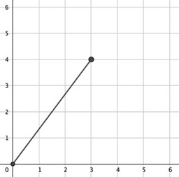
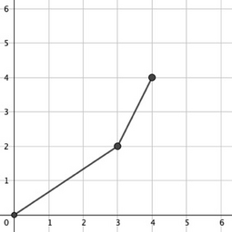
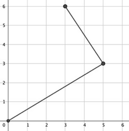

<h1 style='text-align: center;'> A. Ian Visits Mary</h1>

<h5 style='text-align: center;'>time limit per test: 1 second</h5>
<h5 style='text-align: center;'>memory limit per test: 256 megabytes</h5>

Ian and Mary are frogs living on lattice points of the Cartesian coordinate plane, with Ian living on $(0,0)$ and Mary living on $(a,b)$. 

Ian would like to visit Mary by jumping around the Cartesian coordinate plane. Every second, he jumps from his current position $(x_p, y_p)$ to another lattice point $(x_q, y_q)$, such that no lattice point other than $(x_p, y_p)$ and $(x_q, y_q)$ lies on the segment between point $(x_p, y_p)$ and point $(x_q, y_q)$. 

As Ian wants to meet Mary as soon as possible, he wants to jump towards point $(a,b)$ using at most $2$ jumps. Unfortunately, Ian is not good at maths. Can you help him?

A lattice point is defined as a point with both the $x$-coordinate and $y$-coordinate being integers.

### Input

The first line contains a single integer $t$ ($1 \le t \le 500$) — the number of test cases. The description of test cases follows.

The first and only line of each test case contains two integers $a$ and $b$ ($1\le a,b\le 10^9$) — the coordinates of the lattice point where Mary lives.

### Output

For each test case, print an integer $n$ ($1 \le n \le 2$) on the first line, denoting the number of jumps Ian uses in order to meet Mary. 
## Note

 that you do not need to minimize the number of jumps.

On the $i$-th line of the next $n$ lines, print two integers $0 \le x_i,y_i \le 10^9$ separated by a space, denoting Ian's location $(x_i,y_i)$ after the $i$-th jump. $x_n = a$, $y_n = b$ must hold.

Ian's initial location and his locations after each of the $n$ jumps need not be distinct.

If there are multiple solutions, output any.

## Example

### Input


```text
83 44 43 62 21 17 32022 20231000000000 1000000000
```
### Output

```text

1
3 4
2
3 2
4 4
2
5 3
3 6
2
1 0
2 2
1
1 1
1
7 3
1
2022 2023
2
69420420 469696969
1000000000 1000000000

```
## Note

In the first test case:



$(0,0) \to (3,4)$

In the second test case:



$(0,0) \to (3,2) \to (4,4)$

In the third test case:



$(0,0) \to (5,3) \to (3,6)$


#### Tags 

#800 #OK #constructive_algorithms #geometry #number_theory 

## Blogs
- [All Contest Problems](../Codeforces_Round_865_(Div._2).md)
- [Codeforces Round 865 (en)](../blogs/Codeforces_Round_865_(en).md)
- [Tutorial (en)](../blogs/Tutorial_(en).md)
