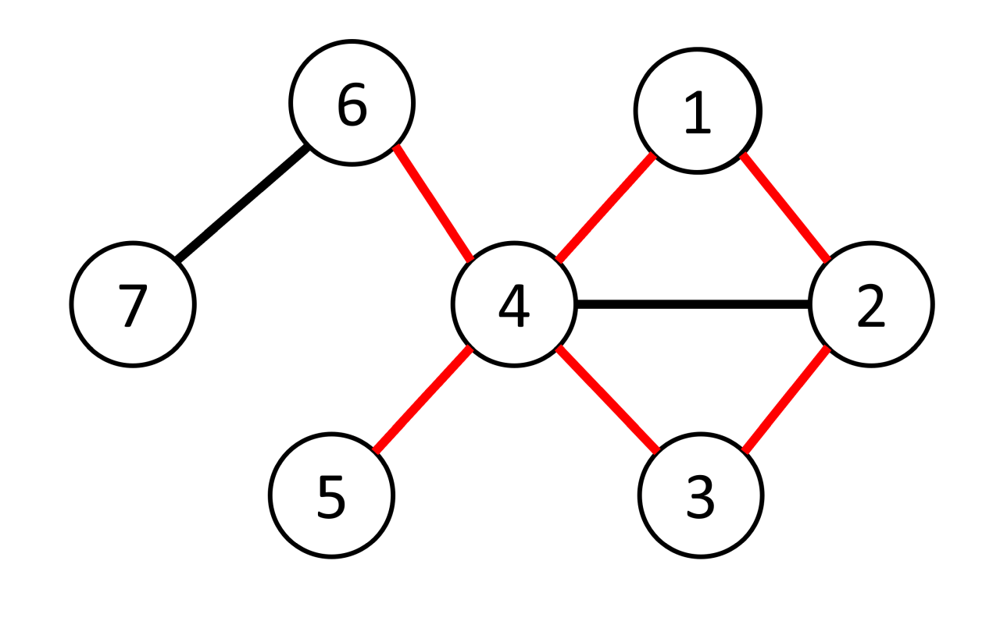

<h1 style='text-align: center;'> B. Fish Graph</h1>

<h5 style='text-align: center;'>time limit per test: 1 second</h5>
<h5 style='text-align: center;'>memory limit per test: 256 megabytes</h5>

You are given a simple undirected graph with $n$ nodes and $m$ edges. 
## Note

 that the graph is not necessarily connected. The nodes are labeled from $1$ to $n$.

We define a graph to be a Fish Graph if it contains a simple cycle with a special node $u$ belonging to the cycle. Apart from the edges in the cycle, the graph should have exactly $2$ extra edges. Both edges should connect to node $u$, but they should not be connected to any other node of the cycle. 

Determine if the graph contains a subgraph that is a Fish Graph, and if so, find any such subgraph.

In this problem, we define a subgraph as a graph obtained by taking any subset of the edges of the original graph.

  Visualization of example 1. The red edges form one possible subgraph that is a Fish Graph. 
### Input

The first line of input contains the integer $t$ ($1 \leq t \leq 1000$), the number of test cases. The description of test cases follows.

The first line of each test case contains two integers, $n$ and $m$ ($1 \le n, m \le 2\,000$) — the number of nodes and the number of edges.

Each of the next $m$ lines contains the description of an edge. Each line contains two integers $u_i$ and $v_i$ ($1 \leq u_i, v_i \leq n$, $u_i\neq v_i$) — an edge connects node $u_i$ to node $v_i$.

It is guaranteed that no two edges connect the same unordered pair of nodes.

Furthermore, it is guaranteed that the sum of $n$ and the sum of $m$ over all test cases both do not exceed $2\,000$.

### Output

For each testcase, output "YES" if the graph contains a subgraph that is a Fish Graph, otherwise print "NO". If the answer is "YES", on the following lines output a description of the subgraph.

The first line of the description contains one integer $k$ — the number of edges of the subgraph. 

On the next $k$ lines, output the edges of the chosen subgraph. Each of the $k$ lines should contains two integers $u$ and $v$ ($1\le u, v\le n$, $u\neq v$) — the edge between $u$ and $v$ belongs to the subgraph. The order in which $u$ and $v$ are printed does not matter, as long as the two nodes are connected by an edge in the original graph. The order in which you print the edges does not matter, as long as the resulting subgraph is a fish graph.

If there are multiple solutions, print any.

## Example

### Input


```text
37 81 22 33 44 14 54 64 26 77 76 71 22 33 44 11 33 54 41 33 44 11 2
```
### Output

```text

YES
6
5 4
6 4
4 3
1 4
2 1
3 2
YES
5
5 3
2 3
3 1
4 3
1 4
NO

```
## Note

In the first example, a possible valid subgraph contains the cycle $1 \rightarrow 2 \rightarrow 3 \rightarrow 4 \rightarrow 1$. The special node of this cycle is node $4$. The two extra edges $4 - 5$ and $4 - 6$ are both connected to $4$, completing the Fish Graph.

In the second example, a possible valid subgraph contains the cycle $1 \rightarrow 3 \rightarrow 4 \rightarrow 1$. The special node of this cycle is node $3$. The two extra edges $3 - 2$ and $3 - 5$ are both connected to $3$, completing the Fish Graph.

In the last example, it can be proven that there is no valid subgraph. 


#### Tags 

#1900 #NOT OK #brute_force #constructive_algorithms #dfs_and_similar #graphs 

## Blogs
- [All Contest Problems](../Codeforces_Round_869_(Div._1).md)
- [Codeforces Round #869 (en)](../blogs/Codeforces_Round_869_(en).md)
- [Tutorial (en)](../blogs/Tutorial_(en).md)
