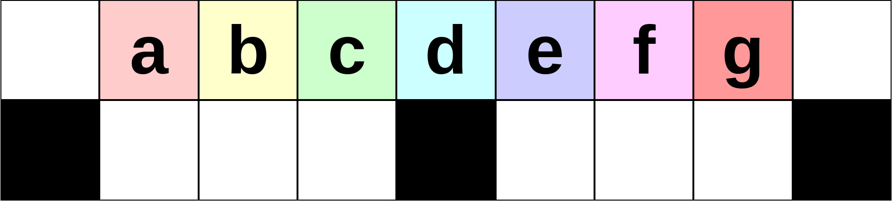
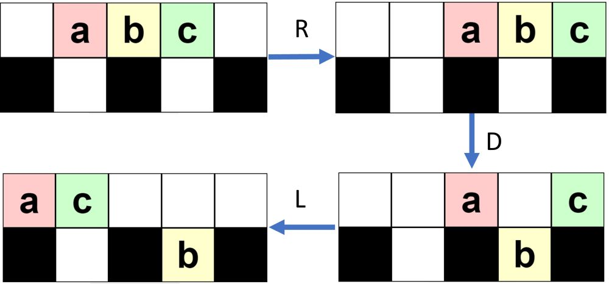

<h1 style='text-align: center;'> D. Toy Machine</h1>

<h5 style='text-align: center;'>time limit per test: 1 second</h5>
<h5 style='text-align: center;'>memory limit per test: 256 megabytes</h5>

There is a toy machine with toys arranged in two rows of $n$ cells each ($n$ is odd).

  Initial state for $n=9$. Initially, $n-2$ toys are placed in the non-corner cells of the top row. The bottom row is initially empty, and its leftmost, rightmost, and central cells are blocked. There are $4$ buttons to control the toy machine: left, right, up, and down marked by the letters L, R, U, and D correspondingly.

When pressing L, R, U, or D, all the toys will be moved simultaneously in the corresponding direction and will only stop if they push into another toy, the wall or a blocked cell. Your goal is to move the $k$-th toy into the leftmost cell of the top row. The toys are numbered from $1$ to $n-2$ from left to right. Given $n$ and $k$, find a solution that uses at most $1\,000\,000$ button presses.

To test out the toy machine, a [web page](https://assets.codeforces.com/files/56ff21637146a30d/game.html) is available that lets you play the game in real time. 

#### Input

The first and only line contains two integers, $n$ and $k$ ($5 \le n \le 100\,000$, $n$ is odd, $1 \le k \le n-2$) — the number of cells in a row, and the index of the toy that has to be moved to the leftmost cell of the top row.

#### Output

On a single line, output a description of the button presses as a string of at most $1\,000\,000$ characters. The string should only contain the characters L, R, U, and D. The $i$-th character in the string is the $i$-th button that is pressed. After all the button presses are performed, the $k$-th toy should be in the leftmost cell of the top row.

If there are multiple solutions, print any. The number of button presses does not have to be minimized.

## Examples

#### Input


```text
5 1
```
#### Output


```text
RDL
```
#### Input


```text
7 2
```
#### Output


```text
RDL
```
## Note

In the first example, there will be $5-2 = 3$ toys. The first toy needs to end up in the leftmost cell of the top row. The moves RDL will achieve this, see the picture for a better understanding. Another possible solution would be to do one button press L.

  Visualization of the moves for the first example. 

#### Tags 

#2700 #NOT OK #constructive_algorithms #games #implementation 

## Blogs
- [All Contest Problems](../Codeforces_Round_869_(Div._1).md)
- [Codeforces Round #869 (en)](../blogs/Codeforces_Round_869_(en).md)
- [Tutorial (en)](../blogs/Tutorial_(en).md)
