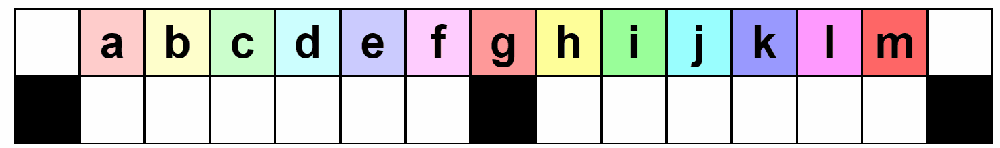

# Tutorial_(en)

[1818A - Politics](../problems/A._Politics.md "Codeforces Round 869 (Div. 2)")

Problem idea: [adamant](https://codeforces.com/profile/adamant "Master adamant")   
 Preparation: [adamant](https://codeforces.com/profile/adamant "Master adamant")

 **Editorial**
### [1818A - Politics](../problems/A._Politics.md "Codeforces Round 869 (Div. 2)")

The members that stay in the end must have the same take about each of the discussed opinions (if takes about some opinion differ for two members, at least one of them should have left during the discussion of that opinion). It means that the people that are left must all have the same takes as the president. On the other hand, all such people can stay if you expel everybody else in advance, so the problem just asks you to count the number of people with the same takes on all opinions as the president.

 **Solution**
```cpp
void solve() {
    int n, k;
    cin >> n >> k;
    string t[n];
    int ans = n;
    for(int i = 0; i < n; i++) {
        cin >> t[i];
        if(t[i] != t[0]) {
            ans--;
        }
    }
    cout << ans << "n";
}
```
[1818B - Indivisible](../problems/B._Indivisible.md "Codeforces Round 869 (Div. 2)")

Problem idea: [adamant](https://codeforces.com/profile/adamant "Master adamant")   
 Preparation: [adamant](https://codeforces.com/profile/adamant "Master adamant")

 **Editorial**
### [1818B - Indivisible](../problems/B._Indivisible.md "Codeforces Round 869 (Div. 2)")

If n>1 is odd, there is no solution, as the sum of the whole array n(n+1)2 is always divisible by n. Otherwise, the solution is as follows:

1. Start with the identity permutation 1,2,…,n.
2. Swap the adjacent pairs to get 2,1,4,3,6,5,...,n,n−1.

Indeed, consider the sum of a sub-array al,…,ar. There are 2 cases: 

* l and r have different parity: the sum is (r−l+1)(l+r)2 and its greatest common divisor with r−l+1 is r−l+12, as l+r is not divisible by 2;
* l and r have the same parity: the sum is (r−l+1)(l+r)2+1 or (r−l+1)(l+r)2−1, depending on the parity. The first summand is divisible by r−l+1, as l+r is even. So, the whole sum has the remainder 1 or −1 modulo r−l+1, thus it can't be divisible by it.
 **Solution**
```cpp
void solve() {
    int n;
    cin >> n;
    if(n == 1) {
        cout << 1 << "n";
    } else if(n % 2) {
        cout << -1 << "n";
    } else {
        int a[n];
        iota(a, a + n, 1);
        for(int i = 0; i < n; i += 2) {
            swap(a[i], a[i + 1]);
        }
        for(auto it: a) {
            cout << it << ' ';
        }
        cout << "n";
    }
}
```
[1817A - Almost Increasing Subsequence](https://codeforces.com/contest/1817/problem/A "Codeforces Round 869 (Div. 1)")

Problem idea: [dario2994](https://codeforces.com/profile/dario2994 "International Grandmaster dario2994")   
 Preparation: [jeroenodb](https://codeforces.com/profile/jeroenodb "Grandmaster jeroenodb")

 **Editorial**
### [1817A - Almost Increasing Subsequence](https://codeforces.com/contest/1817/problem/A "Codeforces Round 869 (Div. 1)")

It is not obvious how the condition in the statement for an almost-increasing subsequence can be turned into a fast data structure that can support queries. So instead of tackling the problem head on, let's try to make an upperbound for how many elements can be in the maximum length almost-increasing subsequence.

Assume you're given a query about the subarray of the original array [al,al+1,…,ar]. Let's partition this array into decreasing subarrays. This means everytime when ai<ai+1 we place a cut between ai and ai+1. For example, consider the array [4,6,7,2,2,3], it will be cut into [4],[6],[7,2,2],[3]. All these small subarrays are non-increasing, which means that any subsequence of such a subarray is non-increasing. Because an almost-increasing subsequence cannot have three consecutive elements x≥y≥z, in each of the subarrays of our partition at most 2 elements can be chosen to insert into our almost-increasing subsequence. 

Actually we can put exactly min elements of each subarray into the increasing subsequence, by taking the first and the last element of each subarray. This is valid, because the cuts for the partition were made at places where a_i < a_{i+1}, so every b_i \geq b_{i+1} in our candidate subsequence is preceded and followed by a b_j < b_{j+1}. By our upperbound, this construction is optimal.

The sum,  \sum_\limits \text{partition} \min( \text{|subarray|}, 2) can be calculated for one query in linear time, giving a O(n q) solution. 

To optimize this, the sum  \sum_\limits \text{partition} \min( \text{|subarray|}, 2) can be rewritten to  \sum_\limits \text{partition}|\text{subarray}| - |\text{inner elements}|, where inner elements of a subarray are all the elements that are not the first or last element. For such elements a_i, we know that a_{i-1} \geq a_i \geq a_{i+1}. The sum of lengths over the partition sums to r-l+1. So we're left with counting the number of special indices l < i < r such that a_{i-1} \geq a_i \geq a_{i+1}. This can be done with O(n) preprocessing and O(1) queries using prefix sums. For a query we can output r-l+1 - |\textit{special} \ \text{indices}|. There are some literal edgecases, where some care in the implementation is needed.

The total time complexity is O(n+q).

 **Solution**
```cpp
#include "bits/stdc++.h"
using namespace std;
typedef vector<int> vi;

int main() {
    ios_base::sync_with_stdio(false);
    cin.tie(NULL);
    int n,q; cin >> n >> q;
    vi a(n);
    for(int& i : a) cin >> i;
    vi p(n-1);
    for(int i=1;i<n-1;++i) {
        int downhill = a[i-1]>=a[i] and a[i]>=a[i+1];
        p[i] = p[i-1] + downhill;
    }
    while(q--) {
        int l,r; cin >> l >> r;
        --l,--r;
        if(l==r) {
            cout << "1n";
        } else {
            int ans = (r-l+1) - p[r-1] + p[l];
            cout << ans << 'n';
        }
    }
}
```
[1817B - Fish Graph](https://codeforces.com/contest/1817/problem/B "Codeforces Round 869 (Div. 1)")

Problem idea: [jeroenodb](https://codeforces.com/profile/jeroenodb "Grandmaster jeroenodb")   
 Preparation: [jeroenodb](https://codeforces.com/profile/jeroenodb "Grandmaster jeroenodb")

 **Hint 1**Can you find a necessary condition for whether a Fish Subgraph exists?

 **Hint 2**For the Fish Subgraph to exist, the graph must have a cycle with one node in the cycle having degree at least 4.

 **Hint 3**When the necessary condition is satisfied, actually, you can always find a Fish Subgraph. Try to prove this, and see if your proof can be turned into an algorithm.

 **Editorial**
### [1817B - Fish Graph](https://codeforces.com/contest/1817/problem/B "Codeforces Round 869 (Div. 1)")

Try to prove this, and see if your proof can be turned into an algorithm.

Firstly, let's try to find some necessary conditions for a Fish Subgraph to exist. Because the Fish Graph has a cycle with two extra edges attached, the original must contain a cycle with a node in the cycle having degree at least 4. It turns out this condition is actually sufficient, let's prove this:

So, assume a graph contains a cycle, and one of the nodes in the cycle has deg(u) \geq 4. We will only look at this cycle, and two extra edges connected to the special node that are not cycle edges, and remove all the other edges from consideration. 

These two extra edges could have both endpoints inside the cycle, creating diagonal(s) and not the fins of the Fish Graph we want. If both edges don't form diagonals of the cycle, we've found a Fish Graph. Otherwise, let's label the nodes in the cycle v_1 v_2 \dots v_k, and label the two extra edges e_1 and e_2. Look at the diagonal that connects nodes v_1 and v_d, with d>2 as small as possible. Using it, we find a smaller cycle v_1 v_2 ... v_d. To finish the proof, we notice that one of the edges from \{e_1,e_2\} and the edge v_1 v_k now have become free to use as fins of the Fish Graph, as they are no longer diagonals of the smaller cycle. \square

This proof can be turned into an algorithm solving the problem.

First off, we need to find any cycle with a node with degree \geq 4. Let's brute force the node u, which must have degree \geq 4. Then brute force the first edge of the cycle uv (by looping over the adjacency list of node u). Now to find any cycle, it suffices to find a path from v to u, temporarily deleting the edge uv. This can be done with DFS or BFS. When a cycle is found, all edges except 2 extra edges can be removed from consideration, and the proof for sufficiency can be implemented to fix possible diagonals. For BFS it is even easier, because it already finds the shortest path from u to v, making diagonals impossible. The time complexity will be \mathcal{O}(m \cdot (n+m)), because the algorithm loops over all edges, and does a graph traversal for each of them. 

Bonus: How do you make this algorithm \mathcal{O}(n+m)?

 **Solution**
```cpp
#include "bits/stdc++.h"
using namespace std;
#define all(x) begin(x),end(x)
typedef vector<int> vi;
typedef vector<vi> vvi;
typedef pair<int,int> pi;

void solve() {
    int n,m; cin >> n >> m;
    vvi adj(n);
    while(m--) {
        int u,v; cin >> u >> v;
        --u,--v;
        adj[u].push_back(v);
        adj[v].push_back(u);
    }
    // find cycle and node with big degree.
    for(int u=0;u<n;++u) if(adj[u].size()>=4) for(int v : adj[u]) {
        // find path from u to v, without edge (u,v)
        vi cur;
        vi p;
        vector<bool> vis(n);
        auto dfs = [&](auto&& self, int at) -> void {
            vis[at]=1;
            cur.push_back(at);
            if(at==v) {
                p=cur;
                return;
            }
            for(int to : adj[at]) if(!vis[to]) {
                if(at==u and to==v) continue;
                self(self,to);
                if(!p.empty()) return;
            }
            cur.pop_back();
        };
        dfs(dfs,u);
        if(p.empty()) continue;
        // found cycle, with a node with degree >=4
        vi extra = adj[u];
        extra.resize(4);
        int mn = p.size();
        for(auto i : extra) {
            auto it = find(all(p),i);
            if(it!=p.begin()+1) {
                mn = min(mn,int(it-p.begin())+1);
            }
        }
        p.resize(mn);
        partition(all(extra),[&](int i) {return count(all(p),i)==0;});
        extra.resize(2);

        cout << "YESn";
        cout << p.size()+2 << 'n';
        auto out = [&](int a, int b) {cout << a+1 << ' ' << b+1 << 'n';};
        int prv=p.back();
        for(auto i : p) {
            out(i,prv);
            prv=i;
        }
        out(u,extra[0]);
        out(u,extra[1]);
        return;
    }

    cout << "NOn";
}

int main() {
    ios_base::sync_with_stdio(false);
    cin.tie(NULL);
    int t; cin >> t;
    while(t--) solve();
}
```
[1817C - Similar Polynomials](https://codeforces.com/contest/1817/problem/C "Codeforces Round 869 (Div. 1)")

Problem idea: [adamant](https://codeforces.com/profile/adamant "Master adamant")   
 Preparation: [adamant](https://codeforces.com/profile/adamant "Master adamant")

 **Editorial**
### [1817C - Similar Polynomials](https://codeforces.com/contest/1817/problem/C "Codeforces Round 869 (Div. 1)")

Not that if polynomials are equivalent, they must have the same leading coefficient k.

Let A(x) = \dots + a x^{d-1} + k x^d and B(x) = \dots + b x^{d-1} + k x^d. Then

 B(x-s) = \dots + (b-k s d)x^{d-1} + x^d. 

So, if A(x) and B(x) are equivalent, then A(x) \equiv B(x-s), where a = b-k s d, or s = \frac{b-a}{kd}.

General remark. On a more intuitive level, you can perceive s as the value by which you should shift the argument of A(x), so that the sums of roots of A(x) and B(x) coincide, as the coefficient near x^{d-1} is just the negated sum of roots of the polynomials.

Lagrange interpolation approach. Generally, if f(x_0)=y_0, \dots, f(x_d) = y_d, it is possible to represent f(x) as

 f(x) = \sum\limits_{i=0}^d y_i \prod\limits_{j \neq i} \frac{x - x_j}{x_i - x_j}. 

From this, it is possible to find the coefficients near x^d and x^{d-1}, that is a sum of corresponding coefficients in each individual summand. Altogether it sums up as

 [x^{d}]f(x) = \sum\limits_{i=0}^d y_i \prod\limits_{j \neq i} \frac{1}{x_i - x_j} = \sum\limits_{i=0}^d y_i \prod\limits_{j \neq i} \frac{1}{i-j} = \sum\limits_{i=0}^d y_i \frac{(-1)^{d-i}}{i! (d-i)!} 

Let's denote c_i = \frac{(-1)^{d-i}}{i! (d-i)!}, then it simplifies a bit as

 [x^d] f(x) = \sum\limits_{i=0}^d y_i c_i, 

and for the coefficient near d-1 we should note that [x^{d-1}] (x-x_1) \dots (x-x_d) = -(x_1 + \dots + x_d), thus

 [x^{d-1}]f(x) = -\sum\limits_{i=0}^d y_i c_i \sum\limits_{j \neq i} j = -\sum\limits_{i=0}^d y_i c_i \left(\frac{d(d+1)}{2} - i\right). 

Knowing the coefficients near x^d and x^{d-1} for both A(x) and B(x), it is easy to find a=[x^{d-1}]A(x), b=[x^{d-1}]B(x) and k = [x^d] A(x) = [x^d] B(x), which in turn allow us to compute s with the formula above.

Finite differences approach. You can consider adjacent differences in values \Delta A(i) = A(i) - A(i+1). The result \Delta A(i) is a polynomial in i that has a degree d-1. Taking the differences d-1 times, we get the values of \Delta^{d-1} A(x) and \Delta^{d-1} B(x) in x=\{0, 1\}. On the other hand, \Delta^{d-1} B(x) = \Delta^{d-1} A(x+s), so you still need to find s, but \Delta^{d-1} A(x) and \Delta^{d-1} B(x) are the polynomials of degree 1, which makes the whole problem trivial.

Note: To compute \Delta^{d-1} A(0) and \Delta^{d-1} A(1) in O(d), one can use the binomial formula:

 \Delta^k A(x) = \sum\limits_{i=0}^k (-1)^i \binom{k}{i} A(x+i). 

Indeed, if we denote by S an operator such that S A(x) = A(x+1), then

 \Delta^k A(x)= (I-S)^k A(x)= \sum\limits_{i=0}^k (-1)^i \binom{k}{i} S^i A(x) = \sum\limits_{i=0}^k (-1)^i \binom{k}{i} A(x+i). 

 **Solution**
```cpp
  
const int mod = 1e9 + 7;

namespace algebra {
    const int maxn = 3e6 + 42;
    mt19937 rng(chrono::steady_clock::now().time_since_epoch().count()); 

    template<typename T>
    T bpow(T x, size_t n) {
        if(n == 0) {
            return T(1);
        } else {
            auto t = bpow(x, n / 2);
            t = t * t;
            return n % 2 ? x * t : t;
        }
    }

    const int m = mod;
    struct modular {
        int r;
        constexpr modular(): r(0) {}
        constexpr modular(int64_t rr): r(rr % m) {if(r < 0) r += m;}
        modular inv() const {return bpow(*this, m - 2);}
        modular operator - () const {return r ? m - r : 0;}
        modular operator * (const modular &t) const {return (int64_t)r * t.r % m;}
        modular operator / (const modular &t) const {return *this * t.inv();}
        modular operator += (const modular &t) {r += t.r; if(r >= m) r -= m; return *this;}
        modular operator -= (const modular &t) {r -= t.r; if(r < 0) r += m; return *this;}
        modular operator + (const modular &t) const {return modular(*this) += t;}
        modular operator - (const modular &t) const {return modular(*this) -= t;}
        modular operator *= (const modular &t) {return *this = *this * t;}
        modular operator /= (const modular &t) {return *this = *this / t;}
        
        bool operator == (const modular &t) const {return r == t.r;}
        bool operator != (const modular &t) const {return r != t.r;}
        bool operator < (const modular &t) const {return r < t.r;}
        
        explicit operator int() const {return r;}
        int64_t rem() const {return 2 * r > m ? r - m : r;}
    };
    
    istream& operator >> (istream &in, modular &x) {
        return in >> x.r;
    }
    
    ostream& operator << (ostream &out, modular const& x) {
        return out << x.r;
    }
    
    vector<modular> F(maxn), RF(maxn);
    
    template<typename T>
    T fact(int n) {
        static bool init = false;
        if(!init) {
            F[0] = T(1);
            for(int i = 1; i < maxn; i++) {
                F[i] = F[i - 1] * T(i);
            }
            init = true;
        }
        return F[n];
    }
    
    template<typename T>
    T rfact(int n) {
        static bool init = false;
        if(!init) {
            RF[maxn - 1] = T(1) / fact<T>(maxn - 1);
            for(int i = maxn - 2; i >= 0; i--) {
                RF[i] = RF[i + 1] * T(i + 1);
            }
            init = true;
        }
        return RF[n];
    }
}

using namespace algebra;

using base = modular;


void solve() {
    int d;
    cin >> d;
    vector<base> A(d + 1), B(d + 1);
    copy_n(istream_iterator<base>(cin), d + 1, begin(A));
    copy_n(istream_iterator<base>(cin), d + 1, begin(B));
    base s = 0, k2 = 0;
    auto coef = [&](int i) {
        return base((d - i) % 2 ? -1 : 1) * rfact<base>(i) * rfact<base>(d - i);
    };
    for(int i = 0; i <= d; i++) {
        s += (A[i] - B[i]) * coef(i) * (d * (d + 1) / 2 - i);
        k2 += (A[i] + B[i]) * coef(i);
    }
    s *= base(2) / (k2 * d);
    cout << s << "n";
}
```
[1817D - Toy Machine](https://codeforces.com/contest/1817/problem/D "Codeforces Round 869 (Div. 1)")

Problem idea: [adamant](https://codeforces.com/profile/adamant "Master adamant")   
 Preparation: [jeroenodb](https://codeforces.com/profile/jeroenodb "Grandmaster jeroenodb")

 **Editorial**Instead of caring about the positions of all the toys, we only need to care about the position of the special toy with index k. The other toys can be treated as undistinguishable. 

The intended way of solving this problem is playing the game in the webpage, trying to come up with some simple combinations of operations that make the special toy move to another position in a predictable way. Using these building blocks in a smart way, finding a way to move the special toy to the topleft. 

As the size of the grid can be up to 100\,000 and we can make 1\,000\,000 moves, we will be aiming for a solution which does a linear number of moves.

There are lots of potential solutions which use a linear number of moves, here is a relatively painless one:

Do casework on k:

 * Case 1: If 1 \leq k < \frac{n-1}{2}, we initally make one \texttt{R} button press to align the toys with the right boundary. After this, there is an easy pattern to expose all the toys in the left halve, one by one: \texttt{DRURDRUR...} repeated. When the special toy is exposed, the repeating pattern is stopped, and \texttt{DL} are pressed. Toy k will be moved to the topleft corner.

 **Visualization** Left halve solution for n=15.

 * Case 2: If k = \frac{n-1}{2}, the puzzle can be solved in two moves: \texttt{DL}.

 **Visualization** Solution for middle toy and n=15.

 * Case 3: If \frac{n-1}{2} < k \leq n-2, we try to reduce back to case 1, by moving the special toy to the left halve, and ensuring that all other toys are in the top row. Using symmetry, we can apply case 1 to k^\prime = n-1 - k, but mirror all horizontal moves, to move the toy to the topright corner. The other toys are no longer all in the top row. To fix this, the last pattern we need is again \texttt{DRURDRUR...} repeated. After a while of repeating this, all toys will be in the right halve of the board, occupying the top and bottom row. To finish moving the special toy (which stayed in the topright corner), we do the buttons presses \texttt{LDRU}. All toys end up in the top row, and the special toy will be at position k_\text{new} = \frac{n-1}{2} - 1, so this successfully reduces to case 1.

 **Visualization** Full solution for right halve for n=15.

How many moves does this take? In case 1 the pattern \texttt{DRUR} needs to be repeated at most \approx \frac{n}{2} times. In case 3, we need to use the first pattern \frac{n}{2} times, and we use the second pattern \frac{n}{2} times. We reduce down to case 1, but luckily the special toy is already close to the correct position, so only a constant number of extra moves are done.

So in total, this solution uses O(1) + \max \left( 4\frac{n}{2}, 4 \cdot 2 \frac{n}{2} \right) = 4n + O(1) moves. So this solution fits well within the constraints, although it is pretty wasteful.

Bonus: Can you prove that the optimal number of moves needed in the worstcase (over all k) for a width of n is \Omega(n)? We only did some testing of small cases, with a bruteforce BFS solution, and found that the worstcase is around n/2 button presses.

 **Solution**
```cpp
#include "bits/stdc++.h"
using namespace std;

int main() {
    int n,k; cin >> n >> k;
    --k;
    int half = (n-3)/2;
    string res = "";
    if(k==half) {
        res = "DL";
    } else {
        while(true) {
            if(k<half) {
                res+="R";
                int need = half-1-k;
                while(need--) {
                    res+="DRUR";
                }
                res+="DL";
                break;
            } else {
                int need = k-half-1;
                while(need--) {
                    res+="LDLU";
                }
                res+="LDR";
                for(int i=0;i<half+1;++i) {
                    res+="DRUR";
                }
                res+="LDRU"; 
                k = half-1;
            }
        }
    }
    cout << res << 'n';
}
```
[1817E - Half-sum](https://codeforces.com/contest/1817/problem/E "Codeforces Round 869 (Div. 1)")

Problem idea: [adamant](https://codeforces.com/profile/adamant "Master adamant")   
 Preparation: [adamant](https://codeforces.com/profile/adamant "Master adamant")

 **Editorial**
### [1817E - Half-sum](https://codeforces.com/contest/1817/problem/E "Codeforces Round 869 (Div. 1)")

Similar to the Huffman encoding, the process described in the statement can be represented as constructing a tree, in which on every step we take two trees with weights a and b, and connect them with a shared root into a single tree with weight \frac{a+b}{2}.

In the end of the process, we have two trees with weights A and B, and we want to maximize |A-B|. In these trees, let h_i be the height of the leaf corresponding to a_i. Then a_i contributes to the final answer with the coefficient either 2^{-h_i}, or -2^{-h_i}, depending on which tree it is in.

If we fix any set \{h_1, \dots, h_n\} and would need to distribute a_1, \dots, a_n between the heights, assuming A < B, it would always be better to send smaller numbers to the A-tree and bigger numbers to the B-tree, so that the positive impact belongs to bigger numbers and the negative impact belongs to the smaller numbers. That being said, if a_1 \leq a_2 \leq \dots \leq a_n, it is always optimal to choose a number 1 \leq k < n and send a_1, a_2, \dots, a_k to the A-tree, while sending a_{k+1}, a_{k+2}, \dots, a_n to the B-tree. Now we need to understand, how to pick an optimal k and how to construct optimal trees with a fixed k.

Assume that a_1, a_2, \dots, a_k will all go to the A-tree, for which we want to minimize the weight. What is the optimal distribution of h_1, h_2, \dots, h_k? Turns out, there always exists an optimal configuration, in which the constructed tree is very skewed, in a way that each vertex has at most 1 child that is not a leaf.

Indeed, consider a vertex v which has two children L and R, both of which have children of its own. Let x be a leaf with the smallest weight in the whole sub-tree of v (without loss of generality, assume that it's a descendant of L). If we swap x with R, we will effectively swap coefficients with which x and R contribute to the weight of A overall.

In other words, if the initial contribution was 2^{-h_x} \cdot x + 2^{-h_R} \cdot R, it will become 2^{-h_x} \cdot R + 2^{-h_R} \cdot x. Note that x \leq R and h_x > h_R. As a consequence, the later sum is not worse than the former and it's always optimal to swap x and R due to the [rearrangement inequality](https://codeforces.com/https://en.wikipedia.org/wiki/Rearrangement_inequality).

Similar argument works for the tree B, except for we want to maximize sum in it, rather than minimize it.

With this in mind, if the split is a_1, a_2, \dots, a_k and a_{k+1}, a_{k+2}, \dots, a_n, then the heights are 1, 2, 3, \dots, k-2, k-1, k-1 for the first block, and similar (but reversed) for the second block. This allows us to find a specific value of |A-B| for each specific k in O(n).

How to improve from that? We suggest two possible approaches here.

Divide and conquer approach. Assume that the optimal k belongs to the interval [l, r]. In this case, all numbers outside the interval will have the same coefficients regardless of specific k, as long as k itself is from the interval. This means that we can solve the problem with divide and conquer approach:

1. Let m = \lfloor \frac{r-l}{2}\rfloor;
2. Find best k recursively on [l, m] and [m, r];
3. Compare them on the whole [l; r], and return the best of them.

Which makes overall O(n \log n) complexity.

Alternative approach. Let's compare the distribution of coefficients for |A|=k and |A|=k-1:

 

| \mathbf{|A| = k} | -a_1 \color{green}{2^{-1}} | -a_2 \color{green}{2^{-2}} | \dots | -a_{k-2} \color{green}{2^{-(k-2)}} | -a_{k-1} \color{red}{2^{-(k-1)}} | -a_k \color{red}{2^{-(k-1)}} | a_{k+1} \color{red}{2^{-(n-k-1)}} | a_{k+2} \color{green}{2^{-(n-k-1)}} | \dots | a_{n-1} \color{green}{2^{-2}} | a_{n} \color{green}{2^{-1}} |
| --- | --- | --- | --- | --- | --- | --- | --- | --- | --- | --- | --- |
| \mathbf{|A| = k-1} | -a_1 \color{green}{2^{-1}} | -a_2 \color{green}{2^{-2}} | \dots | -a_{k-2} \color{green}{2^{-(k-2)}} | -a_{k-1} \color{blue}{2^{-(k-2)}} | a_k \color{blue}{2^{-(n-k)}} | a_{k+1} \color{blue}{2^{-(n-k)}} | a_{k+2} \color{green}{2^{-(n-k-1)}} | \dots | a_{n-1} \color{green}{2^{-2}} | a_{n} \color{green}{2^{-1}} |

 As you see, almost all coefficients stay the same, except for coefficients near a_{k-1}, a_k and a_{k+1}:

 

|  | \mathbf{|A|=k} | \mathbf{|A|=k-1} |
| --- | --- | --- |
| a_{k-1} \cdot \square | -2^{-(k-1)} | -2^{-(k-2)} |
| a_{k} \cdot \square | -2^{-(k-1)} | 2^{-(n-k)} |
| a_{k+1} \cdot \square | 2^{-(n-k-1)} | 2^{-(n-k)} |

 Therefore, let f(k) be the optimal answer for |A|=k, and let \alpha=k-1, \beta=n-k we may say that

 f(k) - f(k-1) = (a_{k+1}-a_k)2^{-\beta} - (a_k - a_{k-1}) 2^{-\alpha}. 

Or, multiplying it with 2^n we get

 2^n[f(k) - f(k-1)] = (a_{k+1}-a_k)2^{k} - (a_k - a_{k-1}) 2^{n-k+1}. 

We can sum it up to get the difference between f(k) and f(j) for arbitrary j < k:

 2^n [f(k) - f(j)] = (d_k 2^k + \dots + d_{j+1} 2^{j+1}) - (d_{k-1}2^{n-(k-1)} + \dots + d_j 2^{n-j}), 

where d_i = a_{i+1} - a_i. Then, assuming d_k > 0, we can bound it as

 2^n [f(k) - f(j)] \geq 2^k - 2^{n-j}\max d_i = 2^k - 2^{n-j+\log \max d_i}. 

The later means that f(k) > f(j) when k + j > n + \log \max d_i, which is the case when k > \frac{n}{2} + \log \max d_i and j \geq \frac{n}{2}. By the same argument, we may show that f(k) > f(j) when k < \frac{n}{2} - \log \max d_i and k < j < \frac{n}{2}. In other words, it means that one of the following holds for the value k, on which the maximum value of f(k) is achieved:

* k is the first position in the array, at which d_k = a_{k+1} - a_k > 0,
* k is the last position in the array, at which d_k = a_{k+1} - a_k > 0,
* k belongs to the segment [\frac{n}{2} - \log \max d_i, \frac{n}{2} + \log \max d_i] \subset [\frac{n}{2}-30, \frac{n}{2}+30].

Therefore, there are at most 64 positions of interest in the array which can be checked manually. Moreover, optimal value in the segment [\frac{n}{2}-30, \frac{n}{2}+30] can be found by checking every possible position while ignoring all the elements outside of the segment (due to the result from the divide and conquer approach). This allows, assuming a_1 \leq a_2 \leq \dots \leq a_n, to resolve the problem in O(n).

 **Solution**
```cpp
// split into 1, ..., k and k+1, ..., n
pair<int, istring> check_k(istring const& a, int k) {
    int n = size(a);
    istring A(n, 0), B(n, 0);
    for(int i = 0; i < n; i++) {
        if(i <= k) {
            A[min(k, i + 1)] += a[i];
        } else {
            B[min(n - k - 2, n - i)] += a[i];
        }
    }
    // multiply by 2^(n - i - 1) instead of dividing by 2^i
    reverse(all(A));
    reverse(all(B));
    int carry = 0;
    // subtract A from B and normalize base 2
    for(int i = 0; i < n; i++) {
        B[i] -= A[i] - carry;
        carry = B[i] >> 1; // floor(B[i] / 2)
        B[i] &= 1;
    }
    if(carry < 0) {
        return {-1, {}}; // it's always possible to make it positive
    }
    while(carry) {
        B.push_back(carry & 1);
        carry >>= 1; 
    }
    while(!B.empty() && B.back() == 0) {
        B.pop_back();
    }
    reverse(all(B));
    return {(int)size(B) - n, B};
}

const int mod = 1e9 + 7;

int bpow(int x, int n) {
    if(!n) {
        return 1;
    } else if(n % 2) {
        return int64_t(x) * bpow(x, n - 1) % mod;
    } else {
        return bpow(int64_t(x) * x % mod, n / 2);
    }
}

int inv(int x) {
    return bpow(x, mod - 2);
}

void solve() {
    int n;
    cin >> n;
    istring a(n, 0);
    for(int i = 0; i < n; i++) {
        cin >> a[i];
    }
    sort(all(a));
    auto cand = check_k(a, 0);
    int cnt = 0;
    for(int i = 1; i < n; i++) {
        if(a[i] != a[i - 1]) {
            cand = max(cand, check_k(a, i - 1));
            cnt++;
            if(cnt == 30) {
                break;
            }
        }
    }
    cnt = 0;
    istring b = a;
    reverse(all(b));
    for(int i = 1; i < n; i++) {
        if(b[i] != b[i - 1]) {
            cand = max(cand, check_k(a, n - i - 1));
            cnt++;
            if(cnt == 30) {
                break;
            }
        }
    }
    auto [sz, ansf] = cand;
    int ans = 0;
    for(size_t i = 0; i < size(ansf); i++) {
        ans = (ans + bpow(2, (mod - 1) + (sz - i)) * ansf[i]) % mod;
    }
    cout << ans << "n";
}
```
[1817F - Entangled Substrings](https://codeforces.com/contest/1817/problem/F "Codeforces Round 869 (Div. 1)")

Problem idea: [adamant](https://codeforces.com/profile/adamant "Master adamant")   
 Preparation: [adamant](https://codeforces.com/profile/adamant "Master adamant") 

 **Editorial**
### [1817F - Entangled Substrings](https://codeforces.com/contest/1817/problem/F "Codeforces Round 869 (Div. 1)")

Suffix automaton approach. For every substring a of s we can define the longest string \hat{a} such that a only occurs in s as a specific substring of \hat{a}. To find \hat{a}, we find the longest strings x and y such that the occurrences of a are always preceded by x and always succeeded by y. Then, we can say that \hat{a} = x a y.

If you're familiar with suffix structures you would recognize that in this terms, xa is the longest string that belongs to the same state of the suffix automaton of s as a. Knowing that, how would we find \hat{a} = x a y? When we add a new character at the end of a substring, we make a transition in the suffix automaton via this character.

Generally, if the state of the string xa has transitions via two different characters, it would mean that the string y is empty, as it means that different strings may succeed the occurrences of xa. Also, if the state is terminal, it would mean that the last occurrence of xa is at the suffix of s and it can not be succeeded by any non-empty string. If the state is not terminal, and its only transition is by a character c, it means that the string xa is always succeeded by c.

The facts above mean that to find xay, we may start with the state of the suffix automaton that corresponds to the string a, and then, while the state is non-terminal, and it only has a single out-going transition, we move to a next state via this transition. In the end, xay would be the longest string of the state we ended up in.

Now back to the problem. Note that if a string a only occurs in s as a substring of another string t, it means that \hat{a} = \hat{t}. In terms of the strings a, b and c from the statement it means that \hat{a} = \hat{b} = \widehat{acb}.

Assume that we grouped together the states of the suffix automaton that end up in the same state if you follow unique out-going transitions from them until you get into a state with two possible transitions, or a terminal state. Each group corresponds to a unique largest string such that any string that belongs to any state from the group only occurs in s as a specific substring of the largest string.

Note that for strings that belong to the same state of the suffix automaton, they also have the same string y. The length |y| determines the unique position in which all the strings from the state occur in the largest string as set of nested suffixes. So, for the largest string t, their right position of occurrences will be |t|-|y|, and their lengths form the contiguous segment [len(link(q)) + 1, len(q)]. Thus, the whole problem reduces for each group of states to the following:

We have a bunch of triplets (l_1, l_2, r). Each triple denotes a set of segments [l_1, r], [l_1 + 1, r], \dots, [l_2, r]. You need to count the number of non-overlapping pairs of segments. This can be done in O(n \log n) with the help of segment tree.

Suffix array approach. There is an alternative solution using suffix arrays (suggested by Dario).

Let a_0, \dots, a_{n-1} be the suffix array and b_0, \dots, b_{n-2} be the longest common prefix of adjacent elements of the suffix array.

1. We say that [l, r] is good for length len if the positions a[l, r] are exactly the occurrences of a sub-string of length len. This is equivalent to b_{l-1}, b_r < len and b_i \geq len for all l \leq i < r.
2. There are at most O(n) good intervals (an interval is good if it is good for any length). Indeed they are a subset of the sub-trees of the Cartesian tree of the array b.
3. Now we iterate over the good intervals. Let [l, r] be a good intervals for the lengths [u, v]. Consider a translation t and check if by adding t to all elements a_l, a_{l+1}, .., a_r one gets a good interval. This can be checked in O(1). This check can be done from t=u to t=v and one can stop as soon as a bad t is found. If t is a good translation; then we can count in O(1) the corresponding good pairs of sub-strings A, B. And this concludes the problem.
4. It remains to perform quickly step 3. Given two good intervals I, J we say that J follows I if a[J] coincides with the array one obtains adding 1 to all elements of a[I]. The "following" relationship creates a family of chains on the good intervals.
5. One performs step 3 independently on the various chains.
 **Solution**
```cpp
map<char, int> to[maxn];
int len[maxn], link[maxn];
int last, sz = 1;

void add_letter(char c) {
    int p = last;
    last = sz++;
    len[last] = len[p] + 1;
    for(; to[p][c] == 0; p = link[p]) {
        to[p][c] = last;
    }
    int q = to[p][c];
    if(q != last) {
        if(len[q] == len[p] + 1) {
            link[last] = q;
        } else {
            int cl = sz++;
            len[cl] = len[p] + 1;
            link[cl] = link[q];
            to[cl] = to[q];
            link[last] = link[q] = cl;
            for(; to[p][c] == q; p = link[p]) {
                to[p][c] = cl;
            }
        }
    }
}

int term[maxn];
int used[maxn], comp[maxn], dist[maxn];
vector<int> in_comp[maxn];

void dfs(int v = 0) {
    comp[v] = v;
    dist[v] = 0;
    used[v] = 1;
    for(auto [c, u]: to[v]) {
        if(!used[u]) {
            dfs(u);
        }
        if(to[v].size() == 1 && !term[v]) {
            comp[v] = comp[u];
            dist[v] = dist[u] + 1;
        }
    }
    in_comp[comp[v]].push_back(v);
}

void solve() {
    string s;
    cin >> s;
    for(auto c: s) {
        add_letter(c);
    }
    for(int p = last; p; p = link[p]) {
        term[p] = 1;
    }
    term[0] = 1;
    dfs();
    int64_t ans = 0;
    for(int v = 0; v < sz; v++) {
        if(in_comp[v].size()) {
            int m = in_comp[v].size();
            sort(all(in_comp[v]), [&](int a, int b) {
                return dist[a] > dist[b];
            });
            vector<int64_t> A(m), B(m);
            for(int i = 0; i < m; i++) {
                int u = in_comp[v][i];
                int L = dist[u];
                int R = L + len[link[u]];
                // L' must be larger than R
                int cnt = len[u] - len[link[u]];
                A[i] = (int64_t)cnt * L;
                B[i] = cnt;
                if(i > 0) {
                    A[i] += A[i - 1];
                    B[i] += B[i - 1];
                }
                auto it = upper_bound(all(in_comp[v]), R, [&](int R, int b) {
                    return R > dist[b];
                }) - begin(in_comp[v]);
                if(it) {
                    it--;
                    ans += A[it] - B[it] * R;
                }
            }
        }
    }
    cout << ans << "n";
}
```
