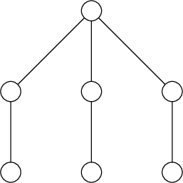

# Tutorial_(en)

[1820A - Yura's New Name](https://codeforces.com/contest/1820/problem/A "Codeforces Round 866 (Div. 2)")

Author: [FairyWinx](https://codeforces.com/profile/FairyWinx "Grandmaster FairyWinx")

Preparation: [FairyWinx](https://codeforces.com/profile/FairyWinx "Grandmaster FairyWinx")

 **Editorial**
### [1820A - Yura's New Name](https://codeforces.com/contest/1820/problem/A "Codeforces Round 866 (Div. 2)")

Let's see that if initial name contains "__" as a substring, we have to add character "^" between these two characters because both smiley faces start and end with character "^" and don't contain "__" as a substring. Also let's see that the resulting name have to start and end with character "^" and it's length have to be at least two.

To calculate the answer we have to count the number of indices $i$ such that $s_i = s_{i + 1} =$ "_". After that we have to increment the answer if the first character of the name equals to "_" and increment the answer if the last character of the name equals to "_".

Also we shouldn't forget about the case when the initials name equals to "^" — in this case the answer equals to one.

Time complexity: $\mathcal{O}(\lvert s \rvert)$.

 **Solution**
```cpp
#include <bits/stdc++.h>

using namespace std;

int main() {
    int t;
    cin >> t;
    while (t--) {
        string s;
        cin >> s;
        if (s == "^") {
            cout << 1 << 'n';
            continue;
        }
        int ans = 0;
        if (s[0] == '_')
            ++ans;
        if (s.back() == '_')
            ++ans;
        for (int i = 0; i < (int) s.size() - 1; ++i) {
            if (s[i] == '_' && s[i + 1] == '_')
                ++ans;
        }
        cout << ans << 'n';
    }
}
```
[1820B - JoJo's Incredible Adventures](https://codeforces.com/contest/1820/problem/B "Codeforces Round 866 (Div. 2)")

Author: [golikovnik](https://codeforces.com/profile/golikovnik "Grandmaster golikovnik")

Preparation: [teraqqq](https://codeforces.com/profile/teraqqq "International Grandmaster teraqqq")

 **Editorial**
### [1820B - JoJo's Incredible Adventures](https://codeforces.com/contest/1820/problem/B "Codeforces Round 866 (Div. 2)")

First of all, consider the cases if the given string consists only of ones and only of zeros. It's easy to see that answers for these cases are $n^2$ and $0$.

In all other cases let's split all strings into segments that consist only of ones. Also if the first and the last characters of the string equals to "1", these two characters will be in one segment. In other words, the pair of ones will lay inside one group if there exists some cyclic shift that these two ones are consecutive. Let the maximum length of such segment be equal to $k$. Then it can be shown that the answer equals to $\lfloor \frac{k+1}{2} \rfloor \cdot \lceil \frac{k+1}{2} \rceil$.

We will proof this fact in such way. If there exists some rectangle of size $a \times b$. Considering its first row, we can see that it has $a+b-1$ consecutive ones. But it means that $a+b \leq k+1$. Without loss of generality, if $a \le b$, we can do the following replacements: $a = \lfloor \frac{k+1}{2} \rfloor - \lambda$, $b = \lceil \frac{k+1}{2} \rceil + \lambda$. It means that $ab = \lceil \frac{k+1}{2} \rceil \cdot \lfloor \frac{k+1}{2} \rfloor - \lambda^2 \le \lceil \frac{k+1}{2} \rceil \cdot \lfloor \frac{k+1}{2} \rfloor$.

Time complexity: $\mathcal{O}(n)$.

 **Solution**
```cpp
#include <bits/stdc++.h>

using namespace std;
using ll = long long;

int main() {
    ios::sync_with_stdio(0); cin.tie(0);

    int t = 1;
    cin >> t;
    while (t--) {
        string s; cin >> s; s += s;
        int k = 0, z = 0;
        for (char c : s) {
            z = c == '1' ? z+1 : 0;
            k = max(k, z);
        }
        const int n = s.size() / 2;

        if (k > n) {
            cout << (ll)n*n << 'n';
        } else {
            const ll side_a = (k+1)/2;
            const ll side_b = (k+2)/2;
            cout << side_a * side_b << 'n';
        }
    }
}
```
[1819A - Constructive Problem](../problems/A._Constructive_Problem.md "Codeforces Round 866 (Div. 1)")

Author: [TeaTime](https://codeforces.com/profile/TeaTime "Master TeaTime")

Preparation: [golikovnik](https://codeforces.com/profile/golikovnik "Grandmaster golikovnik")

 **Editorial**
### [1819A - Constructive Problem](../problems/A._Constructive_Problem.md "Codeforces Round 866 (Div. 1)")

Let the current value of mex equal to $m$ and the value of mex after performing operation equals to $m'$. It's easy to see that in the resulting array there should exist element equals to $m + 1$ (if it doesn't exist, the value of mex won't be equal to $m + 1$). Also notice that $k$ should be equal to $m$ because this value didn't appear in the array before the operation and must appear there after performing the operation. Consider the following cases.

* If there exists such $i$ that $a_i = m + 1$, let's find the minimum value $l$ and the maximum value $r$ such that $a_l = a_r = m + 1$. It's easy to see that the performed operation should cover these elements. We already know which value of $k$ to select. Now notice that there are no profits from using longer segments because $m'$ is already not greater than $m + 1$ (there are no elements equal to $m + 1$) and longer segments may make $m'$ less.
* If there is no such $i$ that $a_i = m$ but there exists $i$ such that $a_i > m + 1$, $m'$ is already not greater than $m + 1$. Similarly with the previous case, we can find any $i$ such that $a_i > m + 1$ and replace $a_i$ with $m$.
* In all other cases if there exist two indices $i \ne j$ such that $a_i = a_j$, we can replace one of these elements with $m$. In this case we will make $m'$ equals to $m + 1$. If there are no such indices, $m$ equals to the length of the array and we cannot increment $m$.

The only thing we have to do after considering cases is to check if the performed operation leads to correct value of $m'$.

Time complexity: $\mathcal{O}(n \log n)$.

 **Solution**
```cpp
//  Nikita Golikov, 2023

#include <bits/stdc++.h>

using namespace std;

using uint = unsigned int;
using ll = long long;
using ull = unsigned long long;

#ifdef GOLIKOV
    #define debug(x) cerr << (#x) << ":t" << (x) << endl
#else
    #define debug(x) 238;
#endif

template <class A, class B>
bool smin(A& x, B&& y) {
  if (y < x) {
    x = y;
    return true;
  }
  return false;
}

template <class A, class B>
bool smax(A& x, B&& y) {
  if (x < y) {
    x = y;
    return true;
  }
  return false;
}

template <class T>
int calcMex(vector<T> v) {
  sort(v.begin(), v.end());
  v.erase(unique(v.begin(), v.end()), v.end());
  int n = int(v.size());
  for (int i = 0; i < n; ++i) if (v[i] != i) return i;
  return n;
}

bool solveTest() {
  int n; cin >> n;
  vector<int> a(n);
  map<int, int> leftOcc, rightOcc;
  for (int i = 0; i < n; ++i) {
    cin >> a[i];
    rightOcc[a[i]] = i;
    if (!leftOcc.count(a[i])) leftOcc[a[i]] = i;
  }
  int mex = calcMex(a);
  if (leftOcc.count(mex + 1)) {
    int L = leftOcc[mex + 1], R = rightOcc[mex + 1];
    for (int i = L; i <= R; ++i) {
      a[i] = mex;
    }
    int mx = calcMex(a);
    assert(mx <= mex + 1);
    return mx == mex + 1;
  }
  for (int i = 0; i < n; ++i) {
    assert(a[i] != mex);
    if (a[i] > mex || (leftOcc[a[i]] != rightOcc[a[i]])) {
      return true;
    }
  }
  return false;
}

int main() {
#ifdef GOLIKOV
  assert(freopen("in", "rt", stdin));
  auto _clock_start = chrono::high_resolution_clock::now();
#endif
  ios::sync_with_stdio(false);
  cin.tie(nullptr);

  int t; cin >> t;
  while (t--) {
    cout << (solveTest() ? "Yes" : "No") << 'n';
  }

#ifdef GOLIKOV
  cerr << "Executed in " << chrono::duration_cast<chrono::milliseconds>(
      chrono::high_resolution_clock::now()
          - _clock_start).count() << "ms." << endl;
#endif
  return 0;
}
```
[1819B - The Butcher](../problems/B._The_Butcher.md "Codeforces Round 866 (Div. 1)")

Author: [Tikhon228](https://codeforces.com/profile/Tikhon228 "Master Tikhon228")

Preparation: [Kon567889](https://codeforces.com/profile/Kon567889 "Master Kon567889")

 **Editorial**
### [1819B - The Butcher](../problems/B._The_Butcher.md "Codeforces Round 866 (Div. 1)")

Note that we know the area of the original rectangle. This value can be calculated as the sum of the areas of the given rectangles. Now let's consider two similar cases: the first cut was horizontal or the first cut was vertical. We will present the solution for the first case, the second one is considered similarly.

If the first cut was horizontal, then there exists a rectangle which width is equal to the width of the entire original rectangle. Moreover, it's easy to notice that this is a rectangle with the maximum width. Knowing the width and area, we also know the height of the rectangle we need. The only thing left is to come up with an algorithm that, for given $h$ and $w$, tells us whether it is possible to construct a rectangle with such dimensions.

We will perform the following procedure: let us have a rectangle $\{h', w'\}$ for which $h' = h$ or $w' = w$ holds, and cut off our current rectangle with the rectangle $\{h', w'\}$. Formally, if $w' = w$, we will make $h -= h'$, if $h = h'$, we will make $w -= w'$. Note that this greedy algorithm is correct, since at each iteration we performed either a horizontal cut or a vertical cut. Thus, at each iteration of our algorithm, we should have only one option: to remove some rectangle corresponding to a vertical cut or to remove a rectangle corresponding to a horizontal cut. We can choose any of these rectangles.

Having performed this algorithm in the case where the first cut was vertical and in the case where the first cut was horizontal, we will check both potential answers.

Time complexity: $\mathcal{O}(n \log n)$.

 **Solution**
```cpp
//#pragma GCC target("trapv")
#include <iostream>
#include <vector>
#include <algorithm>
#include <set>
#include <string>
#include <cmath>
#include <map>
#include <iostream>
#include <list>
#include <stack>
#include <cassert>
using namespace std;

typedef long long ll;
typedef long double ld;

#define fastInp cin.tie(0); cout.tie(0); ios_base::sync_with_stdio(0);

const ll INF = 1e9 * 1e9 + 100, SZ = 1100;

ll n;
vector<pair<ll, ll>> vec;
map<ll, pair<ll, ll>> blocks;

pair<ll, ll> solve() {
	set<pair<ll, ll>> widest, longest;

	for (size_t i = 0; i < vec.size(); i++) {
		widest.insert({ vec[i].first, i });
		longest.insert({ vec[i].second, i });

		blocks[i] = vec[i];
	}

	pair<ll, ll> ans = { -1, -1 };
	bool mode = 0;
	ll prevw = INF, prevh = INF, prv = -1;
	bool cringe = 0;
	while (widest.size() != 0) {
		if (mode == 0) {
			ll cur = (*widest.rbegin()).first, sum = 0;
			if (ans.second == -1) ans.second = cur;
			prv = blocks[(*widest.rbegin()).second].second;

			while (widest.size() > 0 && (*widest.rbegin()).first == cur) {
				auto it = (--widest.end());
				longest.erase({blocks[it->second].second, it->second });
				sum += blocks[it->second].second;
				widest.erase(it);
			}

			if (!cringe) ans.first = sum;
			prv = sum;
			if (prevw == INF) {
				prevh = cur;
			} else {
				prevw -= sum;
				if (prevh != cur) return { -1, -1 };
			}
		} else {
			ll cur = (*longest.rbegin()).first, sum = 0;
			if (!cringe) {
				ans.first = cur + prv;
				cringe = 1;
			}

			while (longest.size() > 0 && (*longest.rbegin()).first == cur) {
				auto it = (--longest.end());
				widest.erase({ blocks[it->second].first, it->second });
				sum += blocks[it->second].first;
				longest.erase(it);
			}

			if (prevw == INF) {
				prevw = cur;
				prevh -= sum;
				if (prevw != cur) return { -1, -1 };
			} else {
				prevh -= sum;
				if (prevw != cur) return { -1, -1 };
			}
		}

		mode ^= 1;
	}

	if (prevh == 0 || prevw == 0 || prevh == INF || prevw == INF) {
		return ans;
	} else {
		return { -1, -1 };
	}
}

signed main() {
	fastInp;

    ll t;
    cin >> t;
    
    while (t--) {
        vec.clear();
        blocks.clear();
    	cin >> n;
    
    	vec.resize(n);
    	for (auto& c : vec) cin >> c.first >> c.second;
    
    	vector<pair<ll, ll>> ans;
    
    	ans.push_back(solve());
    	swap(ans.back().first, ans.back().second);
    	if (ans.back().first == -1) ans.pop_back();
    
    	for (auto& c : vec) swap(c.first, c.second);
    
    	ans.push_back(solve());
    	if (ans.back().first == -1) ans.pop_back();
    
    	if (ans.size() == 2 && ans[0] == ans[1]) {
    		ans.pop_back();
    	}
    	cout << ans.size() << "n";
    
    	for (auto c : ans) cout << c.first << " " << c.second << "n";
    }
    
	return 0;
}
```
[1819C - The Fox and the Complete Tree Traversal](../problems/C._The_Fox_and_the_Complete_Tree_Traversal.md "Codeforces Round 866 (Div. 1)")

Author: [golikovnik](https://codeforces.com/profile/golikovnik "Grandmaster golikovnik")

Preparation: [DishonoredRighteous](https://codeforces.com/profile/DishonoredRighteous "Grandmaster DishonoredRighteous")

 **Editorial**
### [1819C - The Fox and the Complete Tree Traversal](../problems/C._The_Fox_and_the_Complete_Tree_Traversal.md "Codeforces Round 866 (Div. 1)")

Note that if the tree contains the subgraph shown below, then there is no answer. To prove this it is enough to consider all possible cases for how a cyclic route can pass through the upper vertex and understand that it is impossible to construct such route.

  Let's assume that the tree does not contain the subgraph shown. It is easy to see that in this case, the tree can be represented as a path and vertices directly attached to it. To check that the tree can be represented in this way, we will find the diameter of the tree and check that all other vertices are directly connected to it. Now we need to learn how to build a cyclic route.

Number the vertices of the diameter from $1$ to $k$ in the order of traversal of the diameter from one end to the other. Now let's build the route as follows. Firstly, visit vertex $1$, then visit all vertices not on the diameter attached to vertex $2$, then move to vertex $3$, then to all vertices not on the diameter attached to vertex $4$, and so on. When we reach the end of the diameter, we will visit all vertices of the diameter with even numbers, as well as all vertices of the tree not on the diameter attached to the vertices of the diameter with odd numbers. Now let's make the same route in the opposite direction along the diameter, but through vertices of a different parity, which reaches vertex $2$.

Time complexity: $\mathcal{O}(n)$.

 **Solution**
```cpp
// #pragma comment(linker, "/stack:200000000")
// #pragma GCC optimize("Ofast,no-stack-protector")
// #pragma GCC target("sse,sse2,sse3,ssse3,sse4,popcnt,abm,mmx,avx,avx2,tune=native")
// #pragma GCC optimize("unroll-loops")

#include <stdio.h>
#include <bits/stdc++.h>

#ifdef PERVEEVM_LOCAL
    #define debug(x) std::cerr << (#x) << ":t" << (x) << std::endl
#else
    #define debug(x) 238
#endif

#define fastIO std::ios_base::sync_with_stdio(false); std::cin.tie(0); std::cout.tie(0)
#define NAME "File"

using ll = long long;
using ld = long double;

#ifdef PERVEEVM_LOCAL
    std::mt19937 rnd(238);
#else
    std::mt19937 rnd(std::chrono::high_resolution_clock::now().time_since_epoch().count());
#endif

template<typename T>
bool smin(T& a, const T& b) {
    if (b < a) {
        a = b;
        return true;
    }
    return false;
}

template<typename T>
bool smax(T& a, const T& b) {
    if (a < b) {
        a = b;
        return true;
    }
    return false;
}

const double PI = atan2(0.0, -1.0);
const int INF = 0x3f3f3f3f;
const ll LINF = (ll)2e18;
const int N = 200100;

std::vector<int> g[N];
int d[N], par[N];
bool onDiameter[N];

void dfs(int v, int p, int depth) {
	d[v] = depth;
	par[v] = p;

	for (auto to : g[v]) {
		if (to != p) {
			dfs(to, v, depth + 1);
		}
	}
}

void run() {
	int n;
	scanf("%d", &n);

	for (int i = 0; i < n - 1; ++i) {
		int from, to;
		scanf("%d%d", &from, &to);
		g[from - 1].push_back(to - 1);
		g[to - 1].push_back(from - 1);
	}    

	dfs(0, 0, 0);
	int v1 = 0;
	for (int i = 0; i < n; ++i) {
		if (d[i] > d[v1]) {
			v1 = i;
		}
	}

	dfs(v1, v1, 0);
	int v2 = v1;
	for (int i = 0; i < n; ++i) {
		if (d[i] > d[v2]) {
			v2 = i;
		}
	}

	std::vector<int> diameter;
	for (int v = v2; v != v1; v = par[v]) {
		onDiameter[v] = true;
		diameter.push_back(v);
	}
	onDiameter[v1] = true;
	diameter.push_back(v1);
	std::reverse(diameter.begin(), diameter.end());

	for (int i = 0; i < n; ++i) {
		if (onDiameter[i]) {
			continue;
		}
		if (!onDiameter[par[i]]) {
			printf("Non");
			return;
		}
	}

	printf("Yesn");
	std::vector<int> ans;
	for (int i = 0; i < (int)diameter.size(); i += 2) {
		ans.push_back(diameter[i]);
		if (i + 1 != (int)diameter.size()) {
			for (auto to : g[diameter[i + 1]]) {
				if (!onDiameter[to]) {
					ans.push_back(to);
				}
			}
		}
	}

	if (diameter.size() % 2 == 0) {
		for (int i = (int)diameter.size() - 1; i > 0; i -= 2) {
			ans.push_back(diameter[i]);
			if (i - 1 >= 0) {
				for (auto to : g[diameter[i - 1]]) {
					if (!onDiameter[to]) {
						ans.push_back(to);
					}
				}
			}
		}
	} else {
		for (int i = (int)diameter.size() - 1; i > 0; i -= 2) {
			ans.push_back(diameter[i - 1]);
			if (i - 2 >= 0) {
				for (auto to : g[diameter[i - 2]]) {
					if (!onDiameter[to]) {
						ans.push_back(to);
					}
				}
			}
		}
	}

	assert((int)ans.size() == n);
	for (auto i : ans) {
		printf("%d ", i + 1);
	}
	printf("n");
}

int main(void) {
    // freopen(NAME".in", "r", stdin);
    // freopen(NAME".out", "w", stdout);

    #ifdef PERVEEVM_LOCAL
        auto start = std::chrono::high_resolution_clock::now();
    #endif

    run();

    #ifdef PERVEEVM_LOCAL
        auto end = std::chrono::high_resolution_clock::now();
        std::cerr << "Execution time: "
                  << std::chrono::duration_cast<std::chrono::milliseconds>(end - start).count()
                  << " ms" << std::endl;
    #endif

    return 0;
}
```
[1819D - Misha and Apples](../problems/D._Misha_and_Apples.md "Codeforces Round 866 (Div. 1)")

Author: [Um_nik](https://codeforces.com/profile/Um_nik "Legendary Grandmaster Um_nik")

Preparation: [dshindov](https://codeforces.com/profile/dshindov "Candidate Master dshindov")

 **Editorial**
### [1819D - Misha and Apples](../problems/D._Misha_and_Apples.md "Codeforces Round 866 (Div. 1)")

In this problem, we need to choose which types of apples will be sold in stores with $k_i = 0$. Let's fix some arrangement of apples and consider the last moment in it when the apples disappeared from the backpack. All the apples that we took after this moment will go into the final answer, and if there was also a store with $k_i = 0$ among these stores, then the answer is equal to $m$.

Depending on the arrangement of apples, the moments of the last zeroing may change, so let's find all such moments of time after which disappearance may occur, and for all such moments, let's check if we can reach the end without zeroing, and if we can, then what is the maximum number of apples we can collect after that.

Formally, let's calculate $\mathrm{canZero}_i$ for all $0 \leq i \leq n$, equal to 1 if there is such an arrangement of apples that after purchases in stores on the segment $[1, i]$, the backpack will be empty, and 0 otherwise, with $\mathrm{canZero}_0 = 1$. Also, let's calculate $\mathrm{maxRemain}_i$ for all $0 \leq i \leq n$, equal to 0 if after passing on the segment $[i + 1, n]$ with an initially empty backpack, we are guaranteed to empty the backpack at least once, otherwise equal to $m$ if there is a store with $k_i = 0$ on this segment, otherwise equal to the total number of apples on this segment, with $\mathrm{maxRemain}_n = 0$.

The second array is easily calculated by definition. Let's consider one of the ways to build the first array. We will build it from left to right. If $k_i = 0$, then we can guarantee that the backpack will be empty after this store, so the value of $\mathrm{canZero}_i$ for such $i$ is 1. Otherwise, consider all the apples in this store. After the $i$-th store, the apples will disappear if one of these apples was already in the backpack before. Let's find the maximum such $j < i$ that the store $j$ contains one of the apples in the store $i$, or $k_j = 0$. Now let's find the maximum such $s < j$ that $\mathrm{canZero}_s = 1$. Then we check that there will be no disappearances on the segment $[s + 1, i - 1]$. In this case, $\mathrm{canZero}_i = 1$, otherwise it is equal to 0.

Then the answer will be $\max\limits_{\mathrm{canZero}_i = 1} \mathrm{maxRemain}_i$.

Time complexity: $\mathcal{O}(n)$.

 **Solution**
```cpp
#include <bits/stdc++.h>

#include <exception>

using namespace std;
using ll = long long;

void solve() {
    int n, m;
    cin >> n >> m;
    vector<vector<int>> apples(n);
    for (int i = 0; i < n; ++i) {
        int k;
        cin >> k;
        for (int j = 0; j < k; ++j) {
            int x;
            cin >> x;
            apples[i].push_back(x);
        }
    }
    // vector<int> last(m + 1, -1);
    unordered_map<int, int> last;
    auto get_last = [&](int i) {
        if (!last.count(i)) {
            return -1;
        } else {
            return last[i];
        }
    };
    vector<char> can_zero(n + 1, false);
    vector<int> prev(n + 1, 0);
    can_zero[0] = true;
    int oops = -1;
    for (int i = 0; i < n; ++i) {
        if (apples[i].empty()) {
            can_zero[i + 1] = true;
            last[0] = i;
        } else {
            int nearest_pair = get_last(0);
            int new_oops = oops;
            for (int x : apples[i]) {
                nearest_pair = max(nearest_pair, get_last(x));
                new_oops = max(new_oops, get_last(x));
                last[x] = i;
            }
            if (nearest_pair != -1) {
                int nearest_zero = prev[nearest_pair];
                if (oops < nearest_zero) {
                    can_zero[i + 1] = true;
                }
            }
            oops = new_oops;
        }
        if (can_zero[i + 1]) {
            prev[i + 1] = i + 1;
        } else {
            prev[i + 1] = prev[i];
        }
    }
    // vector<char> used(m + 1, false);
    unordered_set<int> used;
    vector<int> max_cnt(n + 1, 0);
    int current_cnt = 0;
    for (int i = n - 1; i >= 0; --i) {
        bool fail = false;
        if (apples[i].empty()) {
            used.insert(0);
        }
        for (int x : apples[i]) {
            if (used.count(x)) {
                fail = true;
                break;
            }
            used.insert(x);
            ++current_cnt;
        }
        if (fail) {
            break;
        }
        if (used.count(0)) {
            max_cnt[i] = m;
        } else {
            max_cnt[i] = current_cnt;
        }
    }
    int ans = 0;
    for (int i = 0; i <= n; ++i) {
        if (can_zero[i]) {
            ans = max(ans, max_cnt[i]);
        }
    }
    cout << ans << 'n';
}

int main() {
    cin.tie(nullptr)->sync_with_stdio(false);
    int t = 1;
    cin >> t;
    while (t--) solve();
}
```
[1819E - Roads in E City](../problems/E._Roads_in_E_City.md "Codeforces Round 866 (Div. 1)")

Author: [Tikhon228](https://codeforces.com/profile/Tikhon228 "Master Tikhon228")

Preparation: [grphil](https://codeforces.com/profile/grphil "Master grphil")

 **Editorial**
### [1819E - Roads in E City](../problems/E._Roads_in_E_City.md "Codeforces Round 866 (Div. 1)")

Let's consider city as a graph. We will call an edge good if the road is repaired, and bad if the road is not repaired.

Since we know that we can reach any vertex from any other vertex using good edges, we will find the minimum spanning tree of the graph built on good edges. To do this, we will iterate through the edges one by one and check if the graph remains connected by good edges after removing that edge. If the graph remains connected, we will remove the edge. After this actions, only the good edges that form the minimum spanning tree of the graph will remain.

Let's find out how to check if the graph remains connected after removing an edge. Suppose we are trying to remove an edge between vertices $A$ and $B$. If the graph remains connected after removing this edge, then the answer to any query will be $1$. Otherwise, the graph will be divided into 2 connected components. Let the starting vertex for the next query be $S$. This vertex will be in one of the two connected components. If we choose a random vertex from $A$ and $B$ as the finishing vertex, there will be no path between the starting and finishing vertices using good edges with probability $1/2$. Therefore, if we make $45$ such queries, then with probability $1/2^{45}$, start and finish will be in same components for all queries. In the remaining cases, there will be no path at least in one query, which will indicate that the graph will no longer be connected by good edges after removing the edge.

This way, we can obtain the minimum spanning tree in $m \cdot 47$ queries.

After obtaining the minimum spanning tree, we will check if all other edges are good. Let's check the edge between vertices $C$ and $D$. We can find a path between vertices $C$ and $D$ in the minimum spanning tree, remove any edge from it, and then vertices $C$ and $D$ will be in different connected components. After that, we will add the edge $CD$, and using an algorithm similar to the previous one, we will check if the graph is connected by good edges. To do this, we will ask about a random vertex $C$ or $D$ 45 times.

This way, we can find all other good edges in $m \cdot 49$ queries.

 **Solution**
```cpp
#include <bits/stdc++.h>

#define x first
#define y second

using namespace std;

mt19937 rnd;

struct solve {

vector<pair<int, int>> r;

vector<vector<pair<int, int>>> s;

vector<int> ans;

int n, m;

static constexpr int rep = 45;

int dfs(int a, int p, int b) {
	for (auto i : s[a]) {
		if (i.x == b) {
			return i.y;
		}
		if (i.x == p) {
			continue;
		}

		int x = dfs(i.x, a, b);

		if (x != -1) {
			return x;
		}
	}
	return -1;
}

solve() {
	cin >> n >> m;
	r.resize(m);
	for (int i = 0; i < m; i++) {
		cin >> r[i].x >> r[i].y;
		r[i].x--;
		r[i].y--;
	}

	s.resize(n);
	ans.resize(m, -1);
	int cnt = 0;
	for (int i = 0; i < m; i++) {
		rem(i);
		for (int j = 0; j < rep; j++) {
			if (!ask_end(i)) {
				ans[i] = 1;
				break;
			}
		}
		if (ans[i] == 1) {
			add(i);
			cnt++;
			s[r[i].x].emplace_back(r[i].y, i);
			s[r[i].y].emplace_back(r[i].x, i);
		}
	}

	assert(cnt == n - 1);

	for (int i = 0; i < m; i++) {
		if (ans[i] != -1) continue;
		ans[i] = 1;

		int c = dfs(r[i].x, -1, r[i].y);
		rem(c);
		add(i);
		for (int j = 0; j < rep; j++) {
			if (!ask_end(i)) {
				ans[i] = 0;
				break;
			}
		}
		rem(i);
		add(c);
	}
	cout << "!";
	for (int i = 0; i < m; i++) {
		cout << ' ' << ans[i];
	}
	cout << endl;
	int x;
	cin >> x;
	if (x != 1) {
		exit(1);
	}
}

void rem(int x) {
	cout << "- " << x + 1 << endl;
}

void add(int x) {
	cout << "+ " << x + 1 << endl;
}

bool ask(int a) {
	cout << "? " << a + 1 << endl;
	// cerr << "? " << a + 1 << endl;
	int x;
	cin >> x;
	return x == 1;
}

bool ask_end(int i) {
	// cerr << "ask_end " << i << endl;
	int a = r[i].x;
	if (rnd() % 2) {
		a = r[i].y;
	}
	return ask(a);
}

};

int main() {
	int t;
	cin >> t;
	for (int i = 0; i < t; i++) {
		solve();
	}
}
```
[1819F - Willy-nilly, Crack, Into Release!](../problems/F._Willy-nilly,_Crack,_Into_Release!.md "Codeforces Round 866 (Div. 1)")

Author: [teraqqq](https://codeforces.com/profile/teraqqq "International Grandmaster teraqqq")

Preparation: [teraqqq](https://codeforces.com/profile/teraqqq "International Grandmaster teraqqq")

 **Editorial**
### [1819F - Willy-nilly, Crack, Into Release!](../problems/F._Willy-nilly,_Crack,_Into_Release!.md "Codeforces Round 866 (Div. 1)")

There are two ways to approach this problem. Let's start with a solution that does not involve associations with known images. Consider a cyclic sequence of strings that satisfies the condition of the problem. Consider the longest common prefix of all the strings in this sequence. It is not very interesting to us, since by definition it does not change with the operations.

There are two cases. Either the sequence of operations has a length of $2$, when we perform some action and then immediately "cancel" it with a second action. This case is only possible if there are no more than two important strings in the set. In this case, the required condition can be easily checked in $\mathcal{O}(n)$ time.

Otherwise, our sequence consists of more than two operations and this is much more like a cycle. Let's say, for example, that the first non-constant character in the sequence of strings initially equals "a". Then after the first change it will be equal to either "b" or "d". Note that after this the first character will no longer be able to immediately turn into "a", since the only way to do this is to "cancel" the operation $\ldots acccc\ldots c \to \ldots caaaa\ldots a$, but this is only possible in the first case. Thus, the first character will be required to go "around the cycle" $abcda$. This cycle can be divided into four segments based on the value of the first character of the string. In each of these segments, we are interested in the sequence of operations that transforms the string with the suffix $zx\ldots x$ into a string that matches the original in the prefix, but its suffix is $zy \ldots y$, where $x \neq y \neq z \neq x$ and the pair of characters $\{ x,y \}$ is "good".

With the help of a not very complicated analysis of cases, we can see that for each prefix we are interested in $6$ groups of paths that connect strings whose characters, except for the suffix being considered, match, and these paths visit all important strings with the prefix being considered. Within each group of paths, we are interested in the minimum and maximum path, respectively. Note that these values can be easily calculated using dynamic programming. We can calculate all these states in $\mathcal{O}(4^n)$ time. Then we need to iterate over the length of the common prefix of all the strings and answer the query in $\mathcal{O}(n)$ time.

So far, we can only calculate the states of interest to us in some galactic time. But this is not entirely scary! Let's say, for example, that when we add or remove one string from the set of important strings, only $\mathcal{O}(n)$ states change, since only the states responsible for the prefixes of the added/deleted string $s$ will change. To some extent, this is reminiscent of a segment tree, or rather, a quadtree.

We just need to figure out how to get rid of the $\mathcal{O}(4^n)$ term in the asymptotic complexity. But this is also simple. Let's notice that if there are no strings with the given prefix in the set of important strings, then the states responsible for this prefix will depend only on the length of the remaining suffix, and all these values can be precomputed in $O(n)$ time. Thus, we store a trie with strings from the queries, in each node of which we store the state of the dynamic programming, and in case we need the values of the dynamic programming from non-existent trie nodes during recalculation, we can replace them with precomputed values.

Time complexity: $\mathcal{O}(nq)$.

The author's code is not very complicated, but if you suddenly want to understand it, I warn you that it uses several "hacks" of questionable justification. For example, instead of $6$ dynamic programming states, only $3$ really useful ones are stored there. The combinatorial structure MinMaxValue is used to simplify the support of simultaneous maximum and minimum values, and much more. I think that it will be especially useful for beginners to familiarize themselves with how to simplify their lives in implementing combinatorial problems.

Now let's turn to the geometric interpretation of the problem. Imagine a square with a size of $(2^n-1) \times (2^n-1)$. In its corners, we can draw squares with sizes of $(2^{n-1}-1 \times 2^{n-1}-1)$ each. Let's say that strings starting with the character $a$ go to the upper-left square, strings starting with the character $b$ go to the upper-right, the character $c$ corresponds to the lower-right corner, and the character $d$ corresponds to the lower-left. Then we can divide the four resulting squares into four parts each in the same way and divide the strings by corners already by the second character, and so on. In the end, each string is associated with an integer point with coordinates from the interval $[0, 2^n-1]$. We also have lines from the drawn squares, which are naturally divided into vertical and horizontal segments of length $1$ each.

This picture is useful because it depicts a graph whose vertices correspond to the strings being considered, and its edges connect pairs of strings that are obtained from each other by means of one move. Thus, looking at the picture, much of the structure of simple cycles in the problem being considered becomes clear and obvious, and with the help of such a picture it is much easier to describe the transitions in the dynamic programming and not get confused.

 **Solution**
```cpp
#include <bits/stdc++.h>

using namespace std;
using pi = pair<int, int>;
using ll = long long;

const int Q = 1e5;
const int N = 20;
const int V = N*Q;

const ll LINF = 1e18;

struct MinMaxValue {
    ll min_value;
    ll max_value;

    MinMaxValue operator * (const MinMaxValue& x) const {
        if (x.max_value < 0 || max_value < 0) {
            return MinMaxValue { 0, -1 };
        }

        return MinMaxValue {
            .min_value = x.min_value + min_value,
            .max_value = x.max_value + max_value
        };
    }

    MinMaxValue operator + (const MinMaxValue& x) const {
        if (x.max_value == -1) return *this;
        if (max_value == -1) return x;

        return MinMaxValue {
            .min_value = min(x.min_value, min_value),
            .max_value = max(x.max_value, max_value)
        };
    }

    MinMaxValue& operator += (const MinMaxValue& x) {
        return *this = *this + x;
    }

    void Reset() {
        min_value = 0;
        max_value = -1;
    }
};

struct {
    MinMaxValue dig, ver, hor;
    int cnt;
    int go[4];
} nd[V];
int vc = 0;
MinMaxValue dig[N+1], ver[N+1], hor[N+1];

std::set<ll> words;

int NewVertex(int h) {
    int* go = nd[vc].go;
    go[0] = go[1] = go[2] = go[3] = -1;
    nd[vc].dig = dig[h];
    nd[vc].hor = hor[h];
    nd[vc].ver = ver[h];
    nd[vc].cnt = 0;
    return vc++;
}

tuple<const MinMaxValue&, const MinMaxValue&, const MinMaxValue&, int> GetState(int v, int h) {
    return v == -1 ? make_tuple(cref(dig[h]), cref(ver[h]), cref(hor[h]), 0)
                   : make_tuple(cref(nd[v].dig), cref(nd[v].ver), cref(nd[v].hor), nd[v].cnt);
}

void Calculate(int v, int h, int corner) {
    auto [dig0, ver0, hor0, cnt0] = GetState(nd[v].go[corner^0], h-1);
    auto [dig1, ver1, hor1, cnt1] = GetState(nd[v].go[corner^1], h-1);
    auto [dig2, ver2, hor2, cnt2] = GetState(nd[v].go[corner^2], h-1);
    auto [dig3, ver3, hor3, cnt3] = GetState(nd[v].go[corner^3], h-1);

    nd[v].cnt = cnt0 + cnt1 + cnt2 + cnt3;

    nd[v].dig.Reset();
    if (cnt0 == 0) nd[v].dig += hor2 * dig3 * ver1;
    if (cnt3 == 0) nd[v].dig += ver2 * dig0 * hor1;

    nd[v].hor = ver0 * dig2 * dig3 * ver1;
    if (cnt2 + cnt3 == 0) nd[v].hor += hor0 * hor1;

    nd[v].ver = hor0 * dig1 * dig3 * hor2;
    if (cnt1 + cnt3 == 0) nd[v].ver += ver0 * ver2;
}

void UpdateCount(int v, int h, int corner, ll msk, ll msk_save) {
    if (h == 0) {
        if (nd[v].cnt == 0) {
            words.insert(msk_save);
        } else {
            words.erase(msk_save);
        }
        nd[v].cnt ^= 1;
    } else {
        UpdateCount(nd[v].go[msk & 3], h-1, msk & 3, msk >> 2, msk_save);
        Calculate(v, h, corner);
    }
}

bool near_symbols[256][256];

MinMaxValue GetAnswer(int h) {
    int v = 0;

    if (nd[v].cnt == 0) {
        return MinMaxValue { .min_value = 2, .max_value = 4 * dig[h-1].max_value };
    }

    MinMaxValue res; res.Reset();

    bool cycle_len2 = false;
    if (nd[v].cnt <= 1) cycle_len2 = true;
    if (nd[v].cnt == 2) {
        string s, t;

        for (ll msk =       *words.begin(); s.size() < h; msk >>= 2) s.push_back("abdc"[msk & 3]);
        for (ll msk = *next(words.begin()); t.size() < h; msk >>= 2) t.push_back("abdc"[msk & 3]);
        auto flag = near_symbols[s.back()][t.back()];

        if (s.substr(0, h-1) == t.substr(0, h-1) && flag) {
            cycle_len2 = true;
        }

        int s_suf = 0, t_suf = 0;
        while (s_suf < h && s[h - s_suf - 1] == s.back()) ++s_suf;
        while (t_suf < h && t[h - t_suf - 1] == t.back()) ++t_suf;

        if (s_suf == t_suf && s_suf < h && flag && s.substr(0, h-s_suf-1) == t.substr(0, h-t_suf-1)
                && s.back() == t[h - s_suf - 1]
                && t.back() == s[h - t_suf - 1]) cycle_len2 = true;
    }

    if (cycle_len2) {
        res.min_value = 2;
        res.max_value = 2;
    }

    while (h != 0) {
        const int v0 = nd[v].go[0], v1 = nd[v].go[1], v2 = nd[v].go[2], v3 = nd[v].go[3];
        const auto& dig0 = get<0>(GetState(v0, h-1));
        const auto& dig1 = get<0>(GetState(v1, h-1));
        const auto& dig2 = get<0>(GetState(v2, h-1));
        const auto& dig3 = get<0>(GetState(v3, h-1));

        if(dig0.max_value > 0 && dig1.max_value > 0 && dig2.max_value > 0 && dig3.max_value > 0) {
            res += dig0 * dig1 * dig2 * dig3;
        }

        --h;
        if (v0 != -1 && nd[v0].cnt == nd[v].cnt) { v = v0; continue; }
        if (v1 != -1 && nd[v1].cnt == nd[v].cnt) { v = v1; continue; }
        if (v2 != -1 && nd[v2].cnt == nd[v].cnt) { v = v2; continue; }
        if (v3 != -1 && nd[v3].cnt == nd[v].cnt) { v = v3; continue; }
        break;
    }
    return res;
}

int main() {
    ios::sync_with_stdio(0); cin.tie(0);

    int n, q; cin >> n >> q;
    vector<ll> v(q);

    for (int i = 0; i < 4; ++i) {
        int j = (i + 1) % 4;
        near_symbols['a' + i]['a' + j] = true;
        near_symbols['a' + j]['a' + i] = true;
    }

    dig[0] = ver[0] = hor[0] = { 1, 1 };
    for (int i = 1; i <= n; ++i) {
        dig[i] = hor[i-1] * dig[i-1] * ver[i-1];
        hor[i] = ver[i] = hor[i-1] * hor[i-1] + ver[i-1] * ver[i-1] * dig[i-1] * dig[i-1];
    }

    int m_root = NewVertex(n); // make_root
    assert(m_root == 0);

    for (int i = 0; i < q; ++i) {
        string s; cin >> s;
        for (int j = 0; j < n; ++j) {
            v[i] += (s[j] == 'b' || s[j] == 'c' ? 1ll : 0) << (2*j);
            v[i] += (s[j] == 'c' || s[j] == 'd' ? 2ll : 0) << (2*j);
        }

        int w = 0;
        for (int j = 0; j < n; ++j) {
            int& next = nd[w].go[(v[i] >> (2*j)) & 3];
            if (next == -1) next = NewVertex(n-j-1);
            w = next;
        }
    }

    for (ll msk : v) {
        UpdateCount(0, n, 0, msk, msk);
        auto [a, b] = GetAnswer(n);

        if (a > b) {
            cout << -1 << 'n';
        } else {
            cout << a << " " << b << 'n';
        }
    }
}
```
