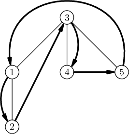

<h1 style='text-align: center;'> C. The Fox and the Complete Tree Traversal</h1>

<h5 style='text-align: center;'>time limit per test: 1 second</h5>
<h5 style='text-align: center;'>memory limit per test: 256 megabytes</h5>

The fox Yae climbed the tree of the Sacred Sakura. A tree is a connected undirected graph that does not contain cycles.

The fox uses her magical powers to move around the tree. Yae can jump from vertex $v$ to another vertex $u$ if and only if the distance between these vertices does not exceed $2$. In other words, in one jump Yae can jump from vertex $v$ to vertex $u$ if vertices $v$ and $u$ are connected by an edge, or if there exists such vertex $w$ that vertices $v$ and $w$ are connected by an edge, and also vertices $u$ and $w$ are connected by an edge.

After Yae was able to get the sakura petal, she wondered if there was a cyclic route in the tree $v_1, v_2, \ldots, v_n$ such that:

* the fox can jump from vertex $v_i$ to vertex $v_{i + 1}$,
* the fox can jump from vertex $v_n$ to vertex $v_1$,
* all $v_i$ are pairwise distinct.

Help the fox determine if the required traversal exists.

##### Input

The first line contains one integer $n$ ($2 \le n \le 2 \cdot 10^5$) —the number of vertices of the tree.

Each of the following $n - 1$ lines contains two integers $u$ and $v$ ($1 \le u, v \le n$, $u \ne v$) — vertices connected by an edge. It is guaranteed that these edges form a tree.

##### Output

On the first line, print "Yes" (without quotes) if the required route of the tree exists, or "No" (without quotes) otherwise.

If the required tree traversal exists, on the second line print $n$ integers of different integers $v_1, v_2, \ldots, v_n$ ($1 \le v_i \le n$) — the vertices of the tree in traversal order.

If there are several correct traversals, output any of them.

## Examples

##### Input


```text
5
1 2
1 3
3 4
3 5
```
##### Output


```text
Yes
4 5 1 2 3 
```
##### Input


```text
3
1 2
1 3
```
##### Output


```text
Yes
1 2 3
```
##### Input


```text
15
1 2
1 3
2 4
2 5
3 6
3 7
4 8
4 9
5 10
5 11
6 12
6 13
7 14
7 15
```
##### Output


```text
No
```
## Note

The tree from the first example is shown below. The bold arrows indicate the fox's route.

  In the second example, any sequence of three different vertices is a correct route, because the fox can jump from any vertex to any vertex.

The tree from the third example is shown below. It can be shown that there is no required route for it.

  

#### Tags 

#2400 #NOT OK #constructive_algorithms #dp #implementation #math #trees 

## Blogs
- [All Contest Problems](../Codeforces_Round_866_(Div._1).md)
- [Announcement (en)](../blogs/Announcement_(en).md)
- [Tutorial (en)](../blogs/Tutorial_(en).md)
